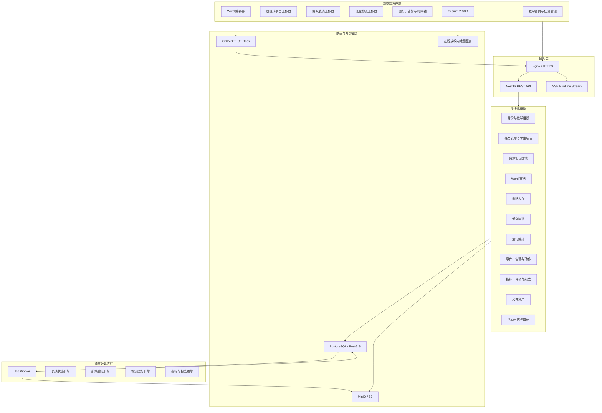
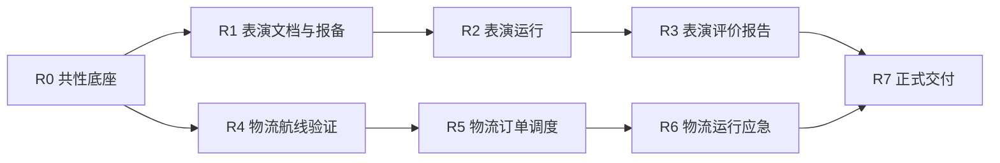
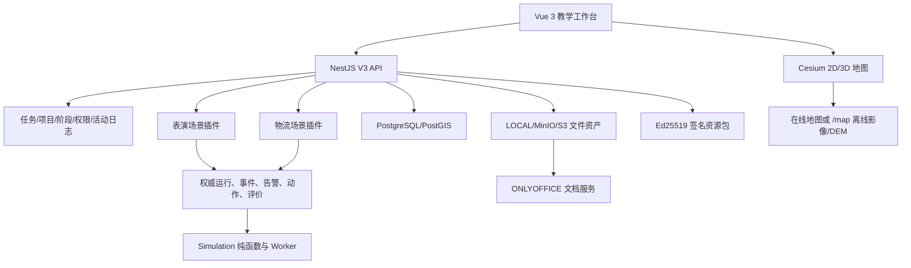

# 低空无人集群教学仿真软件最新功能需求系统完善实施方案

> 方案版本：2.3
> 编制日期：2026-08-14
> 需求基线：`E:\wx\xwechat_files\wxid_3lvvcd2mj2x122_abac\msg\file\2026-08\软件功能需求-markdown` 目录全部 Markdown 文件  
> 当前代码：`E:\project\wurenji`  
> 配套评估：`低空无人集群教学仿真软件-原始功能需求符合性与缺口分析.md`

## 1. 方案结论

本项目不需要推翻现有 V3，也不建议重新选择技术栈。应在当前 `Vue 3 + CesiumJS + NestJS + PostgreSQL/PostGIS` 基础上继续演进，保持模块化单体，增加独立 Worker、对象存储、Word 文档服务、运行事件底座和统一评价报告能力。最新需求不包含舞步编辑、NPC/多人角色扮演、真机/政府系统对接、物流货物业务、自动最优规划或竞赛模式，这些不进入本版开发范围。

总体实施策略为：

1. 先补齐任务生命周期、活动日志、文件、异步作业、运行事件和评价等跨场景底座。
2. 沿当前进度优先完成编队表演从三份 Word 到飞前、报备、运行、应急、复盘的完整闭环。
3. 再建设物流区域节点、学生自主航线、往返验证、订单调度、配送运行、应急处置、复盘评价和动态重调度。
4. 最后完成区域级 DEM/离线地图、正式业务资源包发布、备份恢复、性能、安全和交付验收。

目标不是继续增加可见页面，而是将既有 46 项聚合验收和原始说明书编号级条文分别推进到 `ACCEPTED`。每个能力必须同时具备数据、接口、界面、状态门禁、权限和测试证据，不能再用聚合统计替代训练/考核模式差异审计。

### 1.1 当前实施状态

截至 2026-08-13，本方案已经完成 R0 跨场景底座、R1 表演起飞前主链路、R2 表演运行闭环、R3 表演复盘评价报告、R4 物流区域/航线/往返验证、R5 物流订单/初始调度和 R6 物流运行/应急/复盘开发，当前进入 R7 正式交付验收。R0 当前状态如下：

| 工作项 | 状态 | 已落地内容 | 剩余门禁 |
|---|---|---|---|
| R0-01 任务生命周期 | 已完成 | 复制、删除草稿、撤回未开始任务、首次开始转进行中、结束、归档及原因审计 | 随后续场景补充更多对象级权限回归 |
| R0-02 发布与任务详情 | 已完成 | 班级/指定学生发布、学生选择器、完整表演项目条件、物流订单条件、任务详情；表演参数已贯通学生条件抽屉、申报参照、T-60 和运行高度门禁 | 后续场景字段继续按领域扩展 |
| R0-03 活动与真实进度 | 已完成 | 追加式活动日志、项目时间轴、真实告警和评价状态来源；表演闭环及物流区域、航线、订单、调度、运行、事件、应急和复盘均已接入 | 正式交付补充证据归档和审计检索 |
| R0-04 文件资产与 MinIO | 已完成当前范围 | 共享文件实体、LOCAL/MINIO/S3 适配、历史 provider 读取、Compose MinIO 配置、本地适配测试及真实 MinIO 写入/读取/删除冒烟；源数据修复、摘要审计和隔离恢复演练通过 | 正式环境补容量、权限、版本化和存储故障演练 |
| R0-05 作业与 Outbox | 已完成首个业务闭环 | PostgreSQL 作业表、事务 Outbox、`SKIP LOCKED`、按注册类型领取、租约心跳、指数退避、死信、独立 Worker profile 和健康探针；表演评价发布自动生成 PDF，真实容器幂等验收通过 | 后续按处理器就绪情况迁移资源预检、仿真和验证任务 |
| R0-06 运行公共契约 | 已完成 | 运行会话、事件、告警、学生动作和项目评价表及查询入口；表演和物流均已落地状态机、动作影响、动态调度、评价流程和 SSE revision 续传 | 正式交付补充真实班级并发和审计证据 |
| R0-07 真实资源包 | 本地生命周期验收通过 | 签名 ZIP 上传、归档安全限制、manifest/content schema、SHA-256、Ed25519、依赖/平台预检、拒绝留痕、原子激活、自动退役、显式回滚、归档下载和管理员工作台；5 个正式业务包已在隔离 PostgreSQL 完成激活和双场景任务冻结，密钥轮换、拒绝、回滚及历史快照稳定通过；REPORT 1.1.0 已在当前 Docker 数据库激活并提供双场景量表；教师可对已发布未开始任务选择继续原版本或原子切换新版本，资源修订历史和项目活动可追溯 | 取得授权 DEM/影像后制作 REGION/DEM 资源包；在目标环境复跑升级回滚及跨平台版本恢复演练 |

R1 当前状态如下：

| 工作项 | 状态 | 已落地内容 | 剩余门禁 |
|---|---|---|---|
| R1-01 ONLYOFFICE PoC | 本地验收通过 | ONLYOFFICE 8.3.3 三份母版逐份真实编辑、保存回调、下载、标记持久化、重开无错误；报告 DOCX/PDF 结构有效；下载网络/503 重试、404 和 25 MB 边界有自动化测试 | 目标环境确认授权字体并完成人工打印版式签字 |
| R1-02 三份申报材料 | 已完成 | 正式签名三模板资源包、每项目三份独立副本、版本、在线/上传保存、提交、教师查看、退回、重新提交、下载和活动留痕；教师只读取最近提交快照，未提交母版和退回后的新草稿不可见、不可下载 | 目标环境复跑验收脚本并归档证据 |
| R1-03 飞前检查 | 已完成 | 30 项检查、逐项结果与说明、四种起飞决策、决策依据、保存门禁和活动留痕 | 后续与 R2 运行启动门禁联调 |
| R1-04 T-60 报备 | 已完成 | 服务端权威加速时钟、T-60 开放门禁、报备快照、确认提交和表演运行阶段解锁 | 后续与 R2 实际起飞动态联调 |
| R1-05 区域规划增强 | 已完成 | 撤销/重做、距离与方位测量、起终点坐标、地形高度、持久化文字标注、规划图渲染；教师可审阅九区完整坐标、面积、周长、中心、36 组位置关系和正式 PNG，合理性仍由教师判断 | 正式离线 DEM 与地图版本证据纳入 R7 |

R2 当前状态如下：

| 工作项 | 状态 | 已落地内容 | 剩余门禁 |
|---|---|---|---|
| R2-01 固定程序运行 | 已完成 | 服务端权威运行时钟、五阶段状态机、分组模型、版本检查、检查点和确定性恢复 | 正式五档模板资源内容及性能结果纳入 R7 |
| R2-02 聚合状态展示 | 已完成 | 100 至 5000 架聚合投影、Cesium 2D/3D 运行图、关键节点和分组态势；5000 架服务端聚合投影基线通过 | 补目标浏览器 FPS、内存和持续推送证据 |
| R2-03 事件与告警 | 已完成开发 | 四类事件、发现/升级/控制/结束、四级告警、确认和教师训练提示；教师可配置随机/条件/前置触发、影响范围、可见性、等级、延迟、持续/条件/任务结束恢复、关联和处置时限，配置随任务快照冻结 | 正式签名事件资源包、动作矩阵和目标环境抽样验收 |
| R2-04 学生应急处置 | 已完成 | 暂停/恢复、返航、降落、移除任务、分组与全局处置，服务端校验动作对象和状态 | 正式事件动作矩阵随业务资源包发布 |
| R2-05 教师运行监控 | 已完成当前范围 | 运行态势、事件、告警、学生动作、教师提示和阶段进度均可实时查看；`TEA-019` 的暂停/继续、发送提示、手动触发事件和结束训练已闭环；R3 已提供班级任务分析 | 班级级实时多项目指挥仍不在本期核心验收范围 |
| R2-06 结束报备 | 已完成 | 实际起飞/降落时间、计划/实际/异常数量、异常说明、提交门禁和复盘阶段解锁；报备已进入评价与报告 | 正式五档资源与性能证据纳入 R7 |
| R2-07 重复训练与节点重训 | 已完成 | 已实现多 attempt、表演阶段节点重训、训练模式与次数门禁、历史尝试只读切换和最新尝试评价 | R8 PostgreSQL 黄金路径验证第二次运行、历史事件/动作保留、会话告警隔离和飞后报告提交后禁止重训 |

R3 当前状态如下：

| 工作项 | 状态 | 已落地内容 | 剩余门禁 |
|---|---|---|---|
| R3-01 统一回放时间轴 | 已完成 | 汇总阶段、运行状态、事件、告警、学生动作、动态报备及仿真/真实时间，支持分类筛选 | 正式五档表演任务的证据抽样纳入 R7 |
| R3-02 学生总结与教师评价 | 已完成 | 学生总结草稿/提交锁定、八项客观指标、六维教师量表、综合讲评、时间轴批注和发布锁定；REPORT 1.1.0 同时定义表演/物流量表、条款来源和 100 分约束，首次创建评价时冻结版本与评分项 | 在目标环境复跑 REPORT 升级和历史评价读取并归档审批证据 |
| R3-03 班级任务分析 | 已完成当前范围 | 表演与物流均按同一任务发布批次统计项目数、完成率、已发布平均分、平均响应、常见风险和事件类型；数据仅向教师返回 | 跨班级趋势与实时指挥不在本期核心范围 |
| R3-04 单文件项目报告 | 已完成 | 每项目仅保留一个当前报告，支持 Word/PDF 切换生成、下载、区域规划图和教学仿真声明 | 正式报告模板资源包及打印版式抽检纳入 R7 |
| R3-05 历史证据归档 | 已完成当前范围 | 任务快照、文档版本、运行证据、评价快照、报告内容哈希、修订号和文件资产可追溯 | 跨平台升级恢复演练纳入 R7 |

R4 当前状态如下：

| 工作项 | 状态 | 已落地内容 | 剩余门禁 |
|---|---|---|---|
| R4-01 物流区域节点 | 已完成 | 三套区域确定性提供中心机场、起飞点、降落点、停放点、12 个候选配送点、等待点、备降点和应急运行区域；旧包可兼容补齐 | 正式区域/DEM 资源包和历史版本恢复纳入 R7 |
| R4-02 航线领域与版本 | 已完成 | 关系化航线/航点、主/备用与去/返程、运行节点、乐观锁草稿、不可变版本、恢复和正式方案；R5 调度仅允许引用本人已提交航线 | 配送运行继续在 R6 复用同一正式航线门禁 |
| R4-03 Cesium 航线工作台 | 已完成 | 配送点确认、学生地图加点/拖动、去程复制返程、备用方案、批量高度、分组、保护范围、撤销/重做和自动保存 | 离线地图与正式 DEM 视觉证据纳入 R7 |
| R4-04 规则检查 | 已完成 | 空间、障碍、机型能力、通信覆盖、运行节点、多航线关系和效率三级检查，训练/考核反馈按模式裁剪 | 正式条款映射和规则资源包纳入 R7 |
| R4-05 往返验证与提交 | 已完成 | 服务端确定性完整机场起飞、去程、到达、返程、降落验证，记录距离/时间/电量/高度/覆盖/偏差指标、次数和版本，提交后解锁订单调度 | 五档目标环境性能抽样纳入 R7 |

R5 当前状态如下：

| 工作项 | 状态 | 已落地内容 | 剩余门禁 |
|---|---|---|---|
| R5-01 确定性订单 | 已完成 | 教师向导支持订单种子、数量范围、释放方式、优先级和 `NONE/RELAXED/NORMAL/TIGHT/MIXED` 五类时间窗口；可配置可用、待用、低电量、飞前异常、不可用五类初始机队状态，以及风向、风力、阵风、降雨、定位、通信初始条件；发布时确定性生成并冻结订单与初始条件 | 正式订单参数资源包和五档业务抽样纳入 R7 |
| R5-02 调度领域与版本 | 已完成 | 订单批次、订单、无人机实例、调度草稿、调度项、不可变版本及关系化订单/无人机/正式航线引用 | 历史版本跨平台恢复演练纳入 R7 |
| R5-03 四区联动工作台 | 已完成 | 订单池、Cesium 航线地图、无人机池、飞行任务表和无人机时刻表联动，支持桌面与移动布局 | 物流运行态势在 R6 建立独立工作台 |
| R5-04 调度编辑与门禁 | 已完成 | 单条/批量分配、排序、转移无人机、选择去返程航线、乐观锁保存、检查、快照、恢复和正式提交；提交后锁定并解锁运行准备 | 动态插单和运行中重分配归入 R6 |
| R5-05 调度规则检查 | 已完成 | 服务端输出硬冲突、时间窗风险和效率提示；硬冲突阻断，风险允许提交，考核模式隐藏问题位置和处理方向 | 正式条款映射和规则资源包纳入 R7 |
| R5-06 规模梯度 | 已完成 | 3/5/10/20/50 架模板权威限定配送点、订单量、释放方式、优先级、事件类型与数量、影响范围、并发和重调度能力；3/5 架不注入运行事件，10 架开放轻量订单变化，20 架开放单一技术或局部航线事件，50 架开放 2-4 个复合事件、最多并发 3 个及全局重调度；`TEA-021/022` 的设备和航线事件进一步细化为电池、动力、飞控、传感器、无法返航/降落、航段恶化、航线暂停、配送点/等待点/备降点状态变化，前后端共享策略且服务端不可绕过，50 架/100 单投影计算基线通过 | 在目标环境复跑长时持续推送和正式班级并发证据 |

本轮已完成 shared/simulation/web/server 类型检查和全量生产构建；Simulation 32 项、服务端 168 项和 Web 29 项测试通过，共 229 项，服务端另有 14 项数据库集成按环境开关跳过。R8 迁移、表演阶段节点重训和物流指定异常节点重训已分别在独立临时 PostgreSQL 数据库通过黄金路径并完成清理；验证覆盖第二次运行、历史尝试只读、事件/告警/动作/报告会话隔离、最新尝试评价以及下游提交后禁止重训。物流初始条件回归覆盖五类时间窗口、五类机队状态、规模开放门槛、冻结环境投影、待用无人机启用时刻和旧快照兼容；物流 `TEA-007/010/013/015/016/021/022/023` 回归进一步覆盖五档订单与事件梯度、设备/航线教学子类型、指定阶段释放、优先级、影响范围、升级、事件关联、部分可见性、并发上限和批量/全局重调度防绕过。表演回归覆盖 `TEA-007/009/010/011/012/013/014/015` 的五档模板、模板预览、初始条件、事件数量、并发上限、触发方式、影响范围、升级和事件链门禁。表演 `STU-025` 与物流应急过程记录已补齐结构化推理、服务端防绕过、复盘时间轴和单文件报告证据；表演 `TEA-025` 已独立补齐完成率、平均成绩、事件处置时效、常见漏项和错误类型班级分析；表演 `TEA-018` 与物流 `TEA-025` 已补齐由权威业务表聚合的教师进度里程碑。其余队列、资源包、MinIO、Worker、地图、文档、浏览器、安全、性能和恢复证据保持有效。该结果不代表授权 DEM、目标浏览器长时运行或生产环境验收已经完成。

### 1.2 下一步执行顺序

1. 训练模式多 attempt 与指定节点/异常节点重训已完成，后续在目标环境复跑 UI 和并发验收并归档证据。
2. 固化已通过的 R1-01 自动化证据，在目标环境确认授权字体并完成人工打印版式签字。
3. 取得授权 DEM/影像，制作并签名发布 REGION/DEM 包，完成表演与物流各一块区域的在线/离线切换、高程采样和版本冻结验收。
4. 保持 R4-R6 黄金链路回归，补做正式 5000 架与 50 架/100 单目标浏览器 FPS/内存、长时持续推送和班级并发验证；SSE 断线续传在目标环境复跑归档。
5. 在目标部署环境复跑安全、备份恢复和升级回滚，完成聚合矩阵及原始编号级验收证据与部署、恢复、用户手册归档。

### 1.3 需求输入就绪情况

本次需求包中的三份正式 Word 母版已经完成 R1 的 ONLYOFFICE 本地验收，无需等待文档补交：

| 输入 | 当前状态 | 处理结论 |
|---|---|---|
| 关于申请无人机临时飞行空域的函 | 原始 `.docx` 已存在 | 以原始文件为母版，Markdown 仅用于需求检索 |
| 安全应急预案 | 原始 `.docx` 已存在 | 以原始文件为母版，忽略目录中的 `.~` 临时文件 |
| 无人机临时飞行空域申请表 | 原始 `.docx` 已存在，包含表格 | 优先验证表格宽度、分页、打印和导出一致性 |
| 中文字体 | 母版引用方正小标宋简体、仿宋、仿宋_GB2312、黑体、楷体、宋体和微软雅黑等字体 | 部署 ONLYOFFICE 前确认字体授权并制作统一字体镜像 |
| 规范参考 | 三份原始 PDF 已存在 | 作为规则编制依据，不直接当作可执行规则 |
| 表演/物流业务参数 | 需求中给出分类和边界，部分精确阈值、时长和事件矩阵仍缺 | 分别在 R2、R4、R5、R6 开始前完成参数确认 |

三份正式母版已经打入签名文档资源包并完成项目副本生命周期。ONLYOFFICE 8.3.3 已逐份完成打开、编辑、保存回调、再打开和 DOCX 下载；下载文件均保留插入标记并产生新修订和 SHA-256，页面与控制台错误为 0。报告 DOCX/PDF 已通过文件结构检查。自动化证据为 `artifacts/document-acceptance/document-acceptance-20260812-final.json`；目标环境仍需确认字体授权并完成人工打印版式签字。

### 1.4 核心验收覆盖快照

按既有 46 个聚合验收项核对，当前状态为：

| 场景 | 满足 | 部分满足 | 未满足/不符合 | 主要剩余工作 |
|---|---:|---:|---:|---|
| 编队表演 20 项 | 18 | 2 | 0 | REGION/DEM、正式规模浏览器长时运行和历史版本恢复证据 |
| 城市物流 26 项 | 25 | 1 | 0 | REGION/DEM、正式规模浏览器运行和正式环境升级回滚证据 |
| 合计 46 项 | 43 | 3 | 0 | 聚合口径保持；R8 已补齐编号级重训差异，剩余为 R7 外部资源和目标环境交付证据 |

“满足”只表示当前功能和自动化证据达到聚合主链要求，不等于原始编号全部满足或最终项目验收签字。编号级审计确认的重复训练和指定节点重训已由 R8 补齐；正式 `ACCEPTED` 仍以目标环境业务资源、性能、安全、离线、恢复和 E2E 证据为准。

### 1.5 教师事件精细配置方案

本轮将原来仅保存事件代码的配置扩展为 `scenario.eventConfigs`，同时继续保留 `eventCodes` 作为旧草稿和旧快照的兼容字段。教师在任务向导中启用事件后，可配置：

| 配置项 | 取值 | 运行时行为 |
|---|---|---|
| 触发方式 | 自动排程、指定仿真时间、指定运行阶段、随机时间范围、条件触发、前一事件触发 | 表演和物流均支持确定性随机窗口；条件/前置事件在运行中满足后排程，旧三种方式保持兼容 |
| 触发阶段/时间 | 场景阶段或秒数 | 发布时校验并随任务快照冻结，学生不能修改 |
| 影响范围 | 默认、单架/单单、小批量、分组、多分组、局部区域、大部分、整体；物流增加单条/多条航线和全局 | 运行时映射到表演分组，或物流无人机、订单、航线目标；可指定目标 ID 和影响数量 |
| 初始告警等级 | 跟随目录默认、提示、警告、错误、严重 | 影响事件、告警和运行态势的初始等级 |
| 发现/升级延迟 | 秒数或目录默认值 | 分别决定告警出现和未控制时升级的仿真时间 |
| 信息可见性 | 直接告警、状态变化后告警、部分信息延迟 | 直接告警将发现时间置于事件发生时，其余模式按配置延迟并保留事件时间轴 |
| 持续时间 | 可选秒数 | 配合自动恢复策略计算恢复时刻 |
| 恢复方式 | 学生处置后、固定时长自动、满足条件后、持续至任务结束 | 条件恢复按事件/阶段/运行指标判断；持续至任务结束不提前自动恢复 |
| 升级与关联 | 是否升级、后续事件、前置事件、处置时限 | 发布时校验引用和循环关系；动作结果记录响应时长和是否在时限内 |

服务端在草稿创建、更新、预览和发布时统一规范化配置，发布快照、配置哈希和运行事件载荷保存同一份有效参数。旧任务只含 `eventCodes` 时按事件目录默认值运行；新任务优先读取冻结 EVENT 资源和 `eventConfigs`。随机窗口使用任务快照种子、事件代码和序号计算，重复运行不会因为 `Math.random` 产生漂移。

本轮的验收证据包括：事件目录覆盖默认值和覆盖值测试、正式 EVENT 内容 schema 测试、服务端/前端构建、旧字段兼容测试，以及表演和物流运行时对触发排程、等级、延迟、目标范围、条件恢复和处置时限的回归。正式交付前仍需制作签名事件资源包，并在目标环境抽样核对动作矩阵和评价条款。

## 2. 范围校准

### 2.1 本期必须建设

- 教师/学生、训练/考核、班级和指定学生发布、完整任务生命周期。
- 表演 100/500/1000/3000/5000 架固定模板。
- 表演九类区域规划及三份真实 `.docx` 申报材料。
- 表演飞前检查、T-60、确认起飞、固定程序、四类事件、应急处置和结束报备。
- 物流 3/5/10/20/50 架固定模板。
- 固定中心机场、候选配送点、等待点、备降点和环境图层。
- 学生自主规划去程、返程和必要备用航线，完成权威往返验证。
- 系统确定性生成并锁定订单，学生组织无人机、航线和时间。
- 物流六类事件、飞行处置、航线控制、任务转移和动态重调度。
- 全过程活动日志、时间轴回放、客观指标、教师评价和单个最终项目报告。
- 版本化规则、区域、规模、机型、事件、文档和报告资源包。
- Windows 机房/浏览器、局域网或离线部署、备份恢复和升级。

### 2.2 本期明确不建设

- 舞步制作、轨迹编排、图案和灯光编辑、舞步软件导入。
- NPC 角色和多人协作角色扮演；业务角色只保留教师和学生。
- 真机、飞控、数传或政府申报系统对接。
- 高精度空气动力学、5000 架逐机动力学和真实电磁传播。
- 物流货物重量、货物类型、仓储、装卸、签收和交易。
- 自动生成最优航线或最优调度。
- 传统理论题库和复杂 AI 语义评分。
- 竞赛模式。排行榜可作为非阻断扩展，但不计入本期验收主线。

现有“实训任务库”继续作为项目模板库。仿真数据自动采集与判定进入评价规则体系，不另建一套与项目流程割裂的题库引擎。

## 3. 现有系统复用与调整

| 现有能力 | 处理方式 | 说明 |
|---|---|---|
| 登录、教师/学生权限 | 直接复用 | 增加对象级授权和审计测试 |
| 课程、班级、学生导入 | 直接复用 | V3 指定学生发布补前端入口 |
| V3 任务快照和阶段状态机 | 扩展 | 增加任务复制、撤回、结束、归档及真实阶段门禁 |
| V3 资源元数据 | 扩展 | 升级为真实文件包、schema、哈希、签名、预检和回滚 |
| 三类表演/物流区域 | 扩展 | 物流区域补中心机场和候选节点；区域包关联真实 DEM/图层资产 |
| 表演九区规划 | 继续完善 | 增加撤销/重做、测量标注、活动日志和地形版本固化 |
| Cesium 2D/3D、DEM URL | 继续完善 | 增加区域级地图资源、离线服务、权威高程采样快照 |
| V1 仿真算法 | 选择性迁移 | 复用几何、轨迹和规则计算，不复用旧载荷/静态订单业务模型 |
| V1 物流面板和 PDF | 选择性迁移 | 复用视觉组件和文件生成基础，不计入 V3 业务完成度 |
| Docker Compose | 扩展 | 增加 gateway、worker、minio、onlyoffice、map-service、backup |

禁止将 V1/V2 与 V3 做业务双写。历史任务维持只读兼容，新需求只写入 V3 领域表。

## 4. 目标架构

### 4.1 架构形态



### 4.2 技术决策

| 决策 | 方案 | 原因 |
|---|---|---|
| 前端 | Vue 3、TypeScript、Pinia、Element Plus、CesiumJS | 复用当前代码和交互资产 |
| API | NestJS 模块化单体 | 领域事务和权限边界仍适合单体 |
| 计算 | 同仓库独立 Node Worker 进程 | 隔离 CPU 作业，避免阻塞 API |
| 作业队列 | PostgreSQL 作业表 + `SKIP LOCKED` | 私有化依赖少、可恢复；第一版不强制 Redis |
| 数据库 | PostgreSQL 17 + PostGIS 3.5 | 权威业务、空间数据和作业协调统一 |
| 文件 | MinIO/S3，开发环境保留本地适配器 | Word、报告、检查点和地图成果需要对象版本 |
| Word | 自托管 ONLYOFFICE，经适配器接入 | 满足原 `.docx` 版式、表格和导出要求 |
| 报告 | 模板化 DOCX + PDF 转换 | 同一逻辑报告支持用户选择 Word 或 PDF 导出 |
| 实时更新 | SSE 权威快照 + `Last-Event-ID` 续传 + HTTP 回退 | 浏览器原生重连，断线期间仍能轮询权威状态 |
| 地图 | 在线 Cesium 服务或校内影像/quantized-mesh/3D Tiles | 同时覆盖在线和离线教学 |

### 4.3 代码目标结构

保留当前工作区，不做一次性目录重构。新增模块按以下边界建设：

```text
apps/server/src/v3/
  assignments/         # 任务生命周期、快照、学生项目、阶段
  resources/           # 资源包、区域、升级与激活
  files/               # 文件资产和对象存储适配器
  documents/           # Word 实例、版本、编辑会话、回调
  activities/          # 项目活动日志和审计
  jobs/                # 作业、租约、重试和事务外盒
  runtime/             # 运行会话、检查点、时钟和 WS 投影
  events/              # 事件、告警、学生动作和影响结果
  evaluation/          # 指标、量表、教师评价和报告
  show-project/        # 表演专项领域
  logistics-project/   # 物流专项领域

apps/worker/src/
  handlers/show-runtime/
  handlers/route-validation/
  handlers/logistics-runtime/
  handlers/metrics/
  handlers/reports/

apps/web/src/v3/
  workspace-core/
  show/
  logistics/
  runtime/
  documents/
  evaluation/

packages/
  shared/src/v3/       # DTO、枚举、错误码和 WS 契约
  simulation/          # 可复用几何和固定步长能力
  rule-engine/         # 声明式规则执行
```

## 5. 共性领域设计

### 5.1 任务生命周期

任务状态统一为：

```text
DRAFT -> PUBLISHED -> IN_PROGRESS -> ENDED -> ARCHIVED
DRAFT -> DELETED
PUBLISHED -> DRAFT        # 仅未开始且撤回成功
PUBLISHED/IN_PROGRESS -> ENDED
```

规则：

- 复制任务只复制配置和资源引用，不复制学生成果、运行、成绩和日志。
- 发布生成不可变 `AssignmentSnapshot`，冻结模式、模板、区域、事件、量表和全部资源版本。
- 第一个学生启动后进入 `IN_PROGRESS`，考核关键变量不再变更。
- 已产生学生数据的任务只能结束或归档，不能物理删除。
- 教师提前结束或撤回必须填写原因并进入审计。

### 5.2 项目阶段

继续使用现有表演 7 阶段、物流 8 阶段定义，但阶段提交必须调用专项门禁：

```ts
interface StageGate {
  check(projectId: string, stageCode: V3StageCode): Promise<{
    passed: boolean
    blockers: GateEvidence[]
  }>
}
```

不能再通过通用接口将未实现阶段直接置为完成。每个阶段的 `START/SUBMIT/ACCEPT/RETURN` 都记录活动事件。

### 5.3 活动日志

新增只追加不修改的 `project_activity_events`：

| 字段 | 说明 |
|---|---|
| `projectId`、`stageCode` | 所属项目和阶段 |
| `actorId`、`actorRole` | 操作人和角色 |
| `eventType`、`objectType`、`objectId` | 动作和业务对象 |
| `realTime`、`simulationTimeMs` | 真实时间与仿真时间 |
| `beforeRevision`、`afterRevision` | 版本变化 |
| `payload`、`result` | 结构化输入摘要与结果 |
| `correlationId` | 关联 API、作业、运行和报告 |

该日志同时服务教师进度、学生复盘、评价证据和运维审计。敏感正文不重复写入日志，只记录文件 ID、版本和哈希。

### 5.4 文件与文档

统一 `file_assets` 保存对象键、类型、MIME、大小、SHA-256、来源、归属和状态。所有业务版本只引用文件资产，不保存外部可变 URL。

表演任务中按需创建三类 `application_documents`：

- `AIRSPACE_APPLICATION_FORM`
- `AIRSPACE_APPLICATION_LETTER`
- `SAFETY_EMERGENCY_PLAN`

文档状态：

```text
DRAFT -> SUBMITTED -> ACCEPTED
SUBMITTED -> RETURNED -> DRAFT
SUBMITTED -> LOCKED
```

ONLYOFFICE 的自动保存、手动 force-save、提交前保存、JWT 回调校验和幂等处理全部由 `DocumentEditorAdapter` 封装。系统只判断文件和提交状态，不自动审核文本正确性。

### 5.5 作业与运行

新增 `jobs`、`outbox_events`、`runtime_sessions`、`runtime_checkpoints`：

- API 事务创建作业和业务状态，Worker 通过租约领取。
- 长运行按固定仿真步长分段推进，每段提交检查点后释放 Worker。
- 等待学生操作时运行进入 `WAITING_ACTION`，不占用计算线程。
- 每次运行冻结输入快照、资源版本、引擎版本和随机种子。
- 断线由 EventSource 自动重连并携带 `Last-Event-ID`；异常期间每 5 秒通过 HTTP 获取权威工作区快照。

### 5.6 事件、告警和动作

共用基础状态机：

```text
Event: SCHEDULED -> ACTIVE -> ESCALATED | RECOVERING -> RESOLVED
Alert: OPEN -> ACKNOWLEDGED -> CONTROLLED -> CLOSED
Action: REQUESTED -> ACCEPTED | REJECTED -> APPLIED -> EFFECT_RECORDED
```

每个事件版本定义触发条件、影响范围、等级、持续、恢复、升级、关联事件和可用动作。学生动作必须由后端校验规模模板、对象状态和操作时机，再由运行引擎计算后果。

### 5.7 评价与最终报告

评价拆为三层：

1. 系统客观指标：流程完成、规则检查、时效、运行结果、告警响应和重调度数据。
2. 教师人工评分：规划思路、材料质量、决策合理性、复盘质量和综合意见。
3. 最终结果：分项、总分、通过状态、问题和改进建议。

评价量表由版本化 REPORT 资源包提供，并按以下规则执行：

1. 新任务发布时必须且只能引用一个 REPORT；预览和发布均校验该 REPORT 包含当前场景量表，教师向导只默认选择支持当前场景的最高语义版本。
2. REPORT 2.1.0 的 `rubrics[]` 同时定义 `CITY_SHOW` 和 `CITY_LOGISTICS`，每个量表包含独立语义版本、标题、条款来源和评分项；表演量表 1.1.0 明确覆盖区域规划、申报文件内容、飞前判断、运行处置和复盘质量，评分项代码唯一、分值为正且总分严格等于 100。
3. 项目首次创建评价记录时，将 `REPORT 名称@包版本#量表版本` 和完整评分项写入既有 `project_evaluations` JSONB；后续保存、发布和报告生成只读取这份冻结数据，资源升级不会改变历史成绩。
4. 历史 REPORT 如果没有 `rubrics`，继续使用现有内置场景量表，并以原 REPORT 名称和版本形成可追溯标识；兼容只用于读取旧任务，新任务仍执行严格发布门禁。

教师在冻结量表范围内评分，不修改法规阈值、事件底层逻辑或标准答案。

每次最终发布只生成一个逻辑项目报告。用户选择导出 `.docx` 或 `.pdf`，不默认同时生成两份。报告必须带教学仿真声明，并引用所用任务、资源、成果、运行和评价版本。

## 6. 编队表演子系统方案

### 6.1 阶段和门禁

| 阶段 | 学生主要操作 | 提交门禁 |
|---|---|---|
| 区域规划 | 九类区域绘制、检查、版本、提交 | 九类齐全，无阻断冲突，规划图生成成功 |
| 飞行申报 | 编辑并分别提交三份 Word | 三份文档均为已提交/锁定状态 |
| 飞前准备 | 逐项检查并选择起飞决策 | 必填检查完成，决策和依据已保存 |
| T-60 报备 | 到时提交起飞前一小时申请 | 区域、文档、飞前阶段完成且仿真时间到 T-60 |
| 表演运行 | 确认起飞、监控、处理事件 | 固定程序结束或已中止，状态结算完成 |
| 结束报备 | 清点降落和异常，提交说明 | 降落清点完整，异常时已填写说明 |
| 复盘评价 | 时间轴、总结、教师评价 | 学生总结已提交，教师完成量表并发布结果 |

### 6.2 新增数据模型

| 实体 | 关键内容 |
|---|---|
| `application_documents` | 文档类型、模板版本、状态、当前/提交版本 |
| `document_versions` | revision、文件资产、哈希、创建人、来源版本 |
| `preflight_checklists` | 模板版本、检查项结果、备注和完成时间 |
| `takeoff_decisions` | 允许/整改后/推迟/取消、依据和版本 |
| `show_operational_reports` | T-60、实际起飞、结束报备及状态 |
| `show_runtime_sessions` | 固定程序、规模模板、分组和运行阶段 |
| `show_group_snapshots` | 分组数量、正常/告警/异常/失联和位置范围 |
| `runtime_events/alerts/actions` | 事件、告警、学生操作和结果 |
| `show_reviews` | 学生总结、客观指标、教师评分和报告 |

### 6.3 固定表演运行

第一版不读取舞步轨迹。运行引擎只模拟：

```text
READY -> TAKEOFF -> FORMING -> PERFORMANCE -> RETURNING -> LANDING -> COMPLETED
                                                   -> ABORTED
```

- 100/500 架可展示简化单机点和总体状态。
- 1000 架起主要按分组展示。
- 3000/5000 架按分组/区域聚合，不生成逐架高频动力学轨迹。
- 每个阶段记录计划/实际时间、起飞/空中/降落数量和分组状态。
- 四类事件为气象、定位与电磁、通信与控制、无人机设备。
- 可用动作由规模模板决定，包括暂停后续起飞、暂停/恢复程序、单架/小批量/分组处置、整体返航、整体应急降落和中止。

### 6.4 表演工作台

- 左侧固定项目阶段导航。
- 中间 Cesium 场景显示功能区、分组范围、状态和影响区域。
- 右侧显示阶段任务、检查项、环境、分组和可用操作。
- 底部为仿真时间轴、四级告警和操作记录。
- Word 阶段切换为文档标签 + 原版式编辑页 + 任务参数参照栏。
- 教师查看与学生使用同一成果视图，但编辑和运行操作只按权限开放。

## 7. 城市低空物流子系统方案

### 7.1 阶段和门禁

| 阶段 | 学生主要操作 | 提交门禁 |
|---|---|---|
| 区域分析 | 查看机场、候选配送点和环境，确认启用点 | 配送点数量满足模板范围 |
| 航线规划 | 新建去程、返程、等待/备降和备用航线 | 每个启用点具备必要路线要素 |
| 航线验证 | 规则检查、往返仿真、修改和重验 | 正式航线无硬性冲突且验证通过 |
| 订单调度 | 分配订单、无人机、航线和起飞时间 | 全部必需订单已分配，无硬性调度冲突 |
| 运行准备 | 检查无人机、航线、环境和任务 | 完成决策并锁定初始调度版本 |
| 配送运行 | 监控订单、无人机、航线和环境 | 运行结束或按规则中止，状态结算完成 |
| 异常处置 | 在航处置、航线控制和动态重调度 | 所有开放事件进入受控/结束状态 |
| 复盘评价 | 回放、总结、教师评价和报告 | 学生总结和教师评价完成 |

### 7.2 区域和节点

每个物流区域包必须包含：

- 唯一 `CENTRAL_AIRPORT`。
- 8 至 12 个候选 `DELIVERY_POINT`，满足最高模板选择范围。
- 候选 `WAITING_POINT`、`ALTERNATE_LANDING` 和 `EMERGENCY_AREA`。
- 建筑高度、禁限区、气象、定位、通信和地形版本。

节点位置和基础属性来自冻结区域包；运行中不可用只形成事件覆盖，不修改节点原始数据。

### 7.3 航线规划与验证

新增：

- `route_plans`：配送点、方向、主/备用类型和当前状态。
- `route_plan_versions`：不可变版本、区域/机型/规则/DEM 引用。
- `route_waypoints`：序号、WGS84 坐标、高度基准、速度约束。
- `route_operational_nodes`：等待点、备降点、运行空间和应急区域引用。
- `route_validation_runs`：输入快照、问题证据、指标和结果。

权威验证必须模拟机场起飞、去程、到达确认、返程、机场降落，输出航程、时间、电量、余量、高度、覆盖、偏差和节点状态。浏览器只做即时预检，提交结果以服务端冻结资源重新计算为准。

检查结果分为：

- `HARD_CONFLICT`：阻止正式提交。
- `RISK`：允许提交，但进入评价和复盘。
- `EFFICIENCY`：不阻断，用于方案优化。

### 7.4 订单和调度

教师配置订单数量、配送点分布、优先级比例、释放方式，以及不设明确时限、宽松、一般、紧张、混合五类时间窗口。订单生成使用可复现随机种子，发布前可重新生成，发布后冻结订单原始属性、生成器版本、种子和时间窗口类型；历史任务仅有 `timeWindowMinutes` 时按分钟数确定性映射，继续兼容原有快照。

教师同时冻结五类机队初始数量和初始运行环境。待用无人机通过延迟 `availableAtMs` 实现，到时前在运行投影中显示 `STANDBY` 且不计入可用机数；飞前异常保留独立冻结数量并以不可用状态进入运行准备。风向、风力、阵风、降雨、定位和通信进入同一任务快照，旧 `windProfile` 按确定性规则映射，缺失字段回退正常条件。定位与通信开放范围由服务端按 3/5/10/20/50 架模板校验，不能通过绕过前端提交越级状态。

领域实体：

- `order_batches`、`orders`
- `aircraft_instances`
- `dispatch_plans`、`dispatch_plan_versions`
- `dispatch_items`

`orders` 不含重量和货物类型。`dispatch_item` 只保存订单、无人机、已验证航线、计划起飞时间和顺序。

调度检查至少覆盖：

- 使用未经验证或目的地错误的航线。
- 同一无人机任务时间重叠。
- 电量/航程不足。
- 航线交叉点和共用航段的不可接受时空冲突。
- 未分配订单、无返航安排和违反时间窗口。
- 3 架模板只能单机串行。

### 7.5 配送运行与动态重调度

无人机状态：

```text
STANDBY -> AVAILABLE
AVAILABLE -> ASSIGNED -> TAKEOFF -> OUTBOUND -> ARRIVED -> RETURNING -> LANDED -> AVAILABLE
                                     -> HOLDING | DIVERTING | EMERGENCY_LANDING | DISABLED
```

订单状态：

```text
UNRELEASED -> UNASSIGNED -> SCHEDULED -> DELIVERING -> COMPLETED
                                       -> DELAYED | FAILED | CANCELLED
```

航线状态：

```text
AVAILABLE -> RISK -> PAUSED -> RECOVERING -> AVAILABLE
                    -> CLOSED
```

六类事件为气象环境、定位导航、通信链路、无人机设备、航线运行条件和订单任务变化。运行中只能切换到本人已验证的航线版本，不允许临时绘制并投入运行。

运行准备和运行投影从冻结初始条件开始，再叠加运行事件影响。超限风力/降雨、持续阵风、定位/通信持续异常，以及已分配到不可用或飞前异常无人机的任务形成起飞阻断；活动事件只允许在该基线上进一步恶化或按配置恢复，不改写原始快照。

模板梯度：

- 3 架：单配送点、单组往返、单机串行，不设置飞行中复杂异常。
- 5 架：2 至 3 个配送点，基础并行和单个任务调整。
- 10 架：4 至 6 个配送点，动态订单和轻量重排。
- 20 架：6 至 8 个配送点，单一技术事件和批量订单调整。
- 50 架：8 至 12 个配送点，50 至 100 单、复合事件、航线切换和全局重调度。

### 7.6 物流调度工作台

工作台采用稳定四区联动：

- 地图：机场、配送点、主/备用航线、无人机位置和影响范围。
- 订单池：筛选、优先级、时间窗口、分配和状态。
- 无人机池：当前位置、电量、状态、任务队列、预计返回和下一任务。
- 时间轴：起飞、到达、返航、再次可用、冲突和拖拽调整。

20 架以上开放多选和批量调整；50 架开放按航线、配送点、分组和优先级的全局筛选与重排。

### 7.7 R6 物流运行领域落地设计

R6 不复制表演运行模块，也不在前端自行推进状态。它复用 `runtime_sessions`、`runtime_events`、`runtime_alerts` 和 `student_runtime_actions` 四类公共事实表，在独立的物流运行模块中实现确定性投影、运行准备、事件影响和动态调度。

#### 7.7.1 权威时钟与状态来源

- 正式提交的 `logistics_schedule_versions` 是初始运行输入，启动后不得原地修改。
- `runtime_sessions.checkpoint` 保存当前权威时钟、状态覆盖、当前动态调度版本、暂停原因和处理中的事件。
- 服务端以整数毫秒和固定步长，根据正式调度中的起飞、到达、返航、降落、再次可用时间投影运行状态、位置和电量。
- 前端只轮询或订阅投影结果，不使用本地定时器写回业务状态；断线重连后以服务端快照和序号恢复。
- 每次事件触发、动作生效、动态调度提交、阶段切换和运行结束均保存不可变快照，保证同一输入、种子和动作序列可以复放。

#### 7.7.2 新增数据实体

| 实体 | 用途 | 关键约束 |
|---|---|---|
| `logistics_runtime_readiness` | 保存无人机、正式航线、环境、订单、初始调度的检查项和起飞决定 | 每项目一条当前记录；确认后锁定；必须引用已提交调度版本 |
| `logistics_runtime_snapshots` | 保存关键节点的运行投影和证据 | 只追加；按会话和序号唯一；包含仿真时间、原因和内容哈希 |
| `logistics_dynamic_schedule_versions` | 保存运行中的插单、转移、推迟、取消和航线切换结果 | 不可变；父版本链；仅引用本人已验证航线；记录生效仿真时间 |

无人机、订单、航线的基础属性仍由 R4-R5 关系表提供。运行态不反写历史航线和正式初始调度，而是在 checkpoint、动态版本和快照中形成覆盖层。

#### 7.7.3 三类运行状态机

飞行任务严格投影原始需求的七段状态：

```text
WAITING_EXECUTION -> TAKEOFF -> OUTBOUND -> ARRIVAL_CONFIRMATION
                  -> RETURNING -> LANDING -> AVAILABLE_AGAIN
```

无人机状态：

```text
AVAILABLE -> ASSIGNED -> TAKING_OFF -> OUTBOUND -> ARRIVED
          -> RETURNING -> LANDING -> AVAILABLE
          -> HOLDING | DIVERTING | EMERGENCY_LANDING | DISABLED
```

订单状态：

```text
UNRELEASED -> UNASSIGNED -> SCHEDULED -> DELIVERING -> COMPLETED
                                       -> DELAYED | FAILED | CANCELLED
```

航线状态：

```text
AVAILABLE -> RISK -> PAUSED -> RECOVERING -> AVAILABLE
                    -> CLOSED
```

所有状态转换由服务端校验前置状态、目标对象、模板权限、事件影响和版本 revision。非法、重复或过期命令返回结构化错误，不产生部分写入。

#### 7.7.4 运行准备门禁

运行准备至少检查：

1. 已存在唯一正式初始调度版本，且调度项全部引用本人已提交的往返航线。
2. 订单、无人机、航线引用完整，无发布后漂移或资源版本缺失。
3. 无人机初始可用性和电量满足任务；训练模板允许的飞前不可用场景除外。
4. 区域、DEM、规则、事件、机型和订单资源版本可读取，哈希与任务快照一致。
5. 环境状态满足“允许运行、整改后运行、推迟运行或取消运行”的决定条件。
6. 3 架模板仍满足单机串行，运行开始前不得出现两架同时在航。

学生确认运行决定后锁定准备记录并创建 `READY` 会话；只有 `READY` 会话可以启动。启动命令需使用幂等键，防止双击创建多个运行会话。

#### 7.7.5 六类事件与生命周期

| 事件类别 | 典型事件 | 主要影响对象 |
|---|---|---|
| 气象环境 | 风速增大、降雨、能见度下降 | 区域、航线、在航无人机 |
| 定位与导航 | 定位降级、定位丢失、导航偏差 | 无人机、航段、到达判断 |
| 通信链路 | 链路降级、中断、恢复 | 无人机、分组、控制动作 |
| 无人机设备 | 低电量、动力或传感器故障 | 单机、关联订单和后续任务 |
| 航线运行条件 | 航线暂停、临时关闭、风险恢复 | 航线、等待执行和在航任务 |
| 订单任务变化 | 动态订单、取消、优先级或时间窗变化 | 订单池、任务表和动态调度 |

事件生命周期统一为，并与原始需求七个显示状态一一对应：

```text
SCHEDULED -> OCCURRED_UNDETECTED -> DISCOVERED -> HANDLING
                                      -> CONTROLLED -> ENDED
                                      -> ESCALATED -> HANDLING | ENDED
```

其中 `SCHEDULED` 在界面显示为“未发生”。教师发布端必须配置并冻结事件名称/类别、触发阶段、触发时间或条件、影响范围、严重程度、持续与恢复方式、事件关联；训练模式允许教师手动触发或发送提示，考核模式按冻结脚本自动触发且不暴露推荐答案。事件、告警、动作和动态调度使用同一 `correlationId` 串联。

#### 7.7.6 学生动作与硬门禁

动作分为四组：

- 飞行控制：继续监控、减速、保持当前航线、悬停、前往等待点、返航、备降、迫降、中止任务。
- 航线控制：暂停新任务进入航线、暂停航线、恢复航线、切换已验证备用方案。
- 资源调整：更换无人机、转移订单、重新分配后续任务。
- 计划调整：推迟、取消、插入动态订单、20 架以上批量调整、50 架全局重调度。

后端必须强制以下规则：运行中不能新建航线；不能引用未验证、非本人或已关闭航线；已起飞任务不能通过普通调度直接改写飞行事实；迫降和中止必须结算订单、无人机和后续队列；同一订单在任一生效版本中只能有一个有效执行计划。

#### 7.7.7 动态重调度

动态重调度从“当前权威快照 + 当前生效调度版本 + 未完成订单 + 可用无人机 + 可用正式航线 + 活动事件”生成草案。系统不自动替学生提交最优答案，只提供硬冲突、风险和效率检查。

每次提交生成不可变版本并记录：父版本、调整原因、事件关联、受影响订单/无人机/航线、生效时间、检查结果、提交人和内容哈希。版本只影响尚未开始或被事件明确中断的任务；已经发生的运行事实永久保留。

#### 7.7.8 专项工作台

- `V3LogisticsReadinessWorkspace`：运行前检查、问题定位、决定和正式调度摘要。
- `V3LogisticsRuntimeWorkspace`：Cesium 实时位置、航线状态、订单状态、无人机池、飞行任务表、时刻表和告警栏。
- 运行与异常处置共享一个权威会话；阶段 06 侧重态势监控，阶段 07 侧重告警、动作和动态调度，不复制运行状态。
- Cesium 图层显示实时无人机、当前/备用航线、等待点、备降点、事件范围和异常位置；2D/3D 只改变镜头和投影，不改变业务坐标或运行状态。
- 20 架以上提供多选和批量操作；50 架提供按航线、配送点、状态、优先级和事件影响范围的筛选与全局重排。

## 8. 地图、DEM 与离线资源

### 8.1 坐标和高度

- 数据库存储统一 WGS84。
- 区域、航线和事件几何使用 PostGIS SRID 4326。
- 距离、面积和缓冲在合适的局部投影或 ENU 中计算。
- 任务明确区分 AGL 和 AMSL，不以 Cesium 画面高度代替业务高度。
- 国内 GCJ-02 地图只能在显示适配层转换，不得写入业务数据。

### 8.2 DEM 方案

DEM 可以接入，但必须从当前“全局 URL”升级为区域级版本化资源：

1. 原始 GeoTIFF 经过离线处理生成 Cesium quantized-mesh。
2. 区域包记录 DEM 版本、范围、分辨率、垂直基准、哈希和服务路径。
3. 发布任务时冻结 DEM 资源引用。
4. 规划和验证前采样关键点/航段，生成不可变高程采样快照。
5. 权威检查和评分读取采样快照，不依赖后来变化的在线地形。
6. 前端地形不可用时显示降级状态；需要高程门禁的提交不得静默使用 0 米。

在线环境可使用 Cesium World Terrain 或自有服务；离线环境通过 `map-service` 提供本地影像、地形和可选 3D Tiles。

当前代码中的 `VITE_DEM_TERRAIN_URL` 保留为开发和应急回退入口，不作为正式任务证据。正式实现按以下契约演进：

```json
{
  "terrain": {
    "provider": "CESIUM_QUANTIZED_MESH",
    "url": "/map/terrain/city-logistics/2026.08/layer.json",
    "version": "2026.08",
    "sha256": "...",
    "verticalDatum": "AMSL",
    "extent": [113.8, 22.3, 114.3, 22.8]
  }
}
```

任务发布快照引用 `terrain.version` 和 `terrain.sha256`；前端按当前场景区域加载，失败时只允许显示明确的 DEM 降级状态。航线检查、往返验证和报告使用服务端冻结的高程采样快照，不能因为在线 DEM 后续更新而改变历史成绩。

## 9. API 与实时契约

### 9.1 通用接口

```text
POST   /api/v3/assignments/drafts/:id/copy
DELETE /api/v3/assignments/drafts/:id
POST   /api/v3/assignments/:id/withdraw
POST   /api/v3/assignments/:id/end
POST   /api/v3/assignments/:id/archive
GET    /api/v3/projects/:id/activities
GET    /api/v3/projects/:id/timeline
GET    /api/v3/projects/:id/evaluation
POST   /api/v3/projects/:id/evaluation/publish
POST   /api/v3/projects/:id/reports
GET    /api/v3/files/:id/download
```

### 9.2 表演接口组

```text
/api/v3/show-projects/:id/area-plan/*
/api/v3/show-projects/:id/documents/*
/api/v3/show-projects/:id/preflight/*
/api/v3/show-projects/:id/reports/t-minus-60
/api/v3/show-projects/:id/reports/takeoff
/api/v3/show-projects/:id/reports/flight-end
/api/v3/show-projects/:id/runtime/*
/api/v3/show-projects/:id/review/*
```

### 9.3 物流接口组

```text
/api/v3/logistics-projects/:id/nodes
/api/v3/logistics-projects/:id/routes/*
/api/v3/logistics-projects/:id/route-validations/*
/api/v3/logistics-projects/:id/orders
/api/v3/logistics-projects/:id/dispatch-plans/*
/api/v3/logistics-projects/:id/runtime-readiness
/api/v3/logistics-projects/:id/runtime-readiness/check
/api/v3/logistics-projects/:id/runtime-readiness/confirm
/api/v3/logistics-projects/:id/runtime/session
/api/v3/logistics-projects/:id/runtime/start
/api/v3/logistics-projects/:id/runtime/clock
/api/v3/logistics-projects/:id/runtime/events
/api/v3/logistics-projects/:id/runtime/events/:eventId/trigger
/api/v3/logistics-projects/:id/runtime/actions
/api/v3/logistics-projects/:id/runtime/dynamic-schedules
/api/v3/logistics-projects/:id/runtime/dynamic-schedules/:versionId/submit
/api/v3/logistics-projects/:id/runtime/complete
/api/v3/logistics-projects/:id/review/*
```

所有修改接口必须带 `expectedRevision` 或幂等键。状态冲突返回结构化错误码和当前 revision，前端不得靠覆盖重试解决并发冲突。

### 9.4 SSE 运行流

表演和物流各提供一个 `runtime/stream` 端点，响应 `text/event-stream`。当前协议只发送 `snapshot` 事件，使用运行会话 `revision` 作为 SSE `id`，载荷包含 `protocol`、`revision`、`resumedFromRevision` 和完整工作区。浏览器发现流错误时进入 5 秒 HTTP 回退刷新，EventSource 重连成功后停止回退；服务端按项目与用户共享刷新循环，避免同一页面多连接重复计算。

## 10. 资源包与规则方案

### 10.1 资源包格式

每个离线包为签名 ZIP，至少包含：

```text
manifest.json
schemas/manifest.schema.json
payload/*
checksums.json
signature.ed25519
```

`manifest.json` 包含包类型、名称、语义版本、schema 版本、最低平台版本、场景、依赖、文件清单和发布时间。资源包只允许声明式 JSON、GeoJSON、Word、图片、地图清单和数据文件，不允许携带可执行脚本。

### 10.2 生命周期

```text
UPLOADED -> VALIDATING -> STAGED -> ACTIVE -> RETIRED
                         -> REJECTED
```

流程为上传隔离、解压限制检查、schema 校验、哈希/签名、依赖/平台兼容检查、管理员预览、激活。旧版本只退役不删除，历史任务继续引用原 ID 和哈希。

当前实现进一步限制 ZIP 路径穿越、重复文件、加密条目、嵌套 ZIP、可执行文件、文件数量、解压总量和压缩比。签名覆盖规范化后的 `{ manifest, checksums }`，可信 Ed25519 公钥通过环境 JSON 或密钥文件配置。管理员工作台支持查看逐项预检结果、拒绝原因、生命周期、激活、退役、回滚和原归档下载。

### 10.3 规则实现

规则包保存参数、阈值、动作矩阵、消息和来源条款，不携带代码。规则执行器由平台版本提供，避免离线包任意代码执行。

每条规则必须记录：

- 规则代码、版本、适用场景和模板。
- 分类：硬冲突、风险、效率或评价指标。
- 参数、单位、阈值来源和标准条款。
- 输入字段、证据结构、提示文案和评分映射。

## 11. 部署方案

### 11.1 开发/演示配置

```text
app + postgres + local-file-storage
```

可选启动 ONLYOFFICE 和 Worker，地图可继续使用在线服务。该配置不用于正式离线验收。

### 11.2 标准私有化配置

```text
gateway
app
worker
postgres/postgis
minio
onlyoffice
map-service (离线时必需)
backup
```

公网或校园网只开放 gateway 的 80/443。数据库、MinIO、Worker 和 ONLYOFFICE 回调端口仅内部可达。

### 11.3 备份恢复

一次可恢复备份必须同时包含：

- PostgreSQL 数据和迁移版本。
- MinIO 对象与版本。
- 资源包原文件、签名公钥和激活记录。
- 网关、应用、ONLYOFFICE、字体和地图资源清单。
- 应用镜像版本和恢复说明。

每次正式交付至少完成一次隔离环境恢复演练和文件引用完整性检查。

## 12. 剩余开发工作包

### R0：跨场景基础闭环（当前阶段已完成）

**目标**：让后续专项模块共用可靠的任务、日志、文件、作业和评价底座。

**工作项**：

- R0-01：任务复制、删除草稿、撤回、结束、归档及原因审计。
- R0-02：指定学生发布前端、任务详情字段和场景化向导字段。
- R0-03：统一活动日志、时间轴查询和教师进度真实告警来源。
- R0-04：文件资产模块和 MinIO 适配器，迁移现有 V3 本地文件接口。
- R0-05：PostgreSQL 作业表、事务外盒、Worker 租约和重试。
- R0-06：运行、事件、告警、动作和评价公共契约及 migration。
- R0-07：资源包真实文件、schema、签名、预检、激活、退役和显式回滚。

**出口门禁**：任务生命周期可完整执行；关键命令均有活动日志；Worker 作业可中断恢复；历史快照仍能读取原资源。

### R1：表演 Word、飞前与报备（本地验收通过）

**目标**：打通区域规划之后至正式起飞之前的全部流程。

**工作项状态**：

- R1-01：三份母版已通过真实 ONLYOFFICE 打开、编辑、回调保存、下载、标记持久化和再打开；报告 DOCX/PDF 结构有效，下载重试和失败边界已有自动化测试。
- R1-02：已完成文档实例、版本、会话、回调、提交、退回、重新提交、锁定、下载和教师查看。
- R1-03：已完成 30 项飞前检查、检查记录、四种起飞决策和依据。
- R1-04：已完成服务端权威仿真时钟、T-60 门禁、确认提交、快照和阶段解锁。
- R1-05：已完成撤销/重做、距离和方位测量、坐标和高程显示、持久化文字标注及活动日志。

**对应验收**：表演 6、7、8、9、10。  
**出口门禁**：业务黄金链路和本地文档自动化验收已通过；目标环境只需复跑脚本、确认授权字体并完成人工打印版式签字。

### R2：表演运行、事件与结束报备

**目标**：形成可交互、可暂停、可复现的五档固定表演运行。

**工作项**：

- R2-01：固定程序状态机、分组模型、运行会话和检查点。
- R2-02：100 至 5000 架的聚合状态投影和 Cesium 展示。
- R2-03：四类事件、四级告警、触发/升级/恢复和影响计算。
- R2-04：规模化暂停、返航、降落、中止等学生动作。
- R2-05：教师训练干预、运行监控和实时进度。
- R2-06：降落清点、异常说明和结束报备。

**对应验收**：表演 11、12、13、14、15、16。  
**出口门禁**：至少五档各有黄金用例；相同输入、种子和动作序列的最终状态一致；5000 架运行不逐架高频计算。

### R3：表演复盘、评价与报告（已完成并通过主链路验收）

**目标**：完成表演项目教学闭环。

**工作项**：

- R3-01：已完成阶段、状态、事件、告警、处置和报备的统一回放时间轴。
- R3-02：已完成学生总结、八项客观指标、六维教师评分、综合讲评和时间轴批注。
- R3-03：已完成班级完成率、平均分、平均响应、常见风险和事件类型分析。
- R3-04：已完成单个表演项目 Word/PDF 切换生成、当前文件下载和教学仿真声明。
- R3-05：已完成评价快照、报告哈希、修订号和文件资产归档，跨平台升级恢复演练留至 R7。

**对应验收**：表演 17、18、20。  
**出口门禁**：已通过。教师可从学生列表打开全部成果、添加讲评、发布评价并导出带规划图和教学声明的最终报告；PostgreSQL R1-R3 黄金链路和浏览器学生/教师主链路均通过。

### R4：物流区域、航线与验证（已完成并通过主链路验收）

**目标**：完成从物流区域分析到正式航线方案提交。

**工作项**：

- R4-01：已完成三套物流区域的固定机场、起降/停放点、候选配送/等待/备降节点和应急运行区域。
- R4-02：已完成物流航线实体、关系化航点、运行空间、主/备用方案、草稿乐观锁和不可变版本。
- R4-03：已完成 Cesium 航线编辑、复制返程/备用方案、批量高度、分组、撤销/重做、自动保存和移动端标签收敛。
- R4-04：已完成空间/障碍/机型/覆盖/节点/多航线关系及效率三级规则检查。
- R4-05：已完成服务端确定性往返验证、问题定位、指标、次数限制、训练/考核信息裁剪和正式提交。

**对应验收**：物流 3、4、5、6、7、8、9。  
**出口门禁**：已通过。五档模板复用同一航线契约和门禁；3 架单配送点黄金链路已验证学生从固定端点骨架自主增加中间航点、形成去返程、通过检查和完整往返验证后提交正式方案，订单调度阶段仅在提交已验证版本后开放。

### R5：物流订单与初始调度（已完成并通过主链路验收）

**目标**：完成确定性订单生成和可编辑多机调度。

**工作项**：

- R5-01：已完成教师订单条件、随机种子、确定性生成和发布冻结。
- R5-02：已完成订单批次、订单、无人机实例、调度草稿、调度项和不可变版本。
- R5-03：已完成订单池、无人机池、Cesium 航线地图、飞行任务表和无人机时刻表四区联动。
- R5-04：已完成单条/批量分配、排序、任务转移、航线选择、乐观锁保存、版本恢复和正式提交。
- R5-05：已完成调度硬冲突、时间窗风险和效率检查，以及训练/考核反馈裁剪。
- R5-06：已完成 3 架严格单机串行及 5/10/20/50 架订单和初始机队条件梯度。

**对应验收**：物流 10、11、12、13、14。  
**出口门禁**：已通过。发布后订单属性不可变；3 架黄金链路已验证学生仅使用本人已提交去返程航线完成三单串行排班，检查结果为 `PASSED`，保存不可变 V1 后正式提交并解锁运行准备；提交后初始调度锁定。

### R6：物流运行、应急与重调度（已完成开发，待交付验收）

**目标**：完成物流运行、应急处置、动态重调度和单文件复盘报告教学闭环。

**工作项**：

| 工作项 | 主要产物 | 对应物流验收 | 完成门禁 |
|---|---|---:|---|
| R6-01 运行准备 | 已完成：准备记录、检查器、决定、确认接口和工作台 | 14 回归 | 只允许以已提交初始调度创建唯一 `READY` 会话 |
| R6-02 权威运行 | 已完成：七段任务状态、无人机/订单/航线状态、确定性投影和 Cesium 态势 | 10、15、16、17 | 代码级确定性和快照恢复已覆盖，目标环境断线抽样待 R7 |
| R6-03 事件告警 | 已完成：六类事件目录、七阶段生命周期、告警和教师触发 | 18、22 | 代码级时间关联已覆盖，正式事件参数资源包待 R7 |
| R6-04 应急动作 | 已完成：悬停/等待点、返航、备降、迫降、航线暂停/恢复和备用切换 | 19、20、22 | 未验证航线、非法目标和过期 revision 均由后端拒绝 |
| R6-05 动态重调度 | 已完成：不可变动态版本、订单转移、批量调整、复合事件和全局重排 | 20、21、22 | 20 架批量与 50 架全局开放矩阵已实现；目标环境性能待 R7 |
| R6-06 物流复盘 | 已完成：客观指标、统一时间轴、学生总结、教师量表和单文件 Word/PDF | 23、24、25 | 报告覆盖航线、订单、运行、事件、处置、重调度和教学声明；打印版式待 PoC |
| R6-07 物流重复训练 | 已完成：多 attempt 与指定异常节点重训 | 原始模式差异 | 新尝试从异常发现时刻恢复快照并复现源异常；历史运行、告警和动作只读保留，评价只取最新尝试 |

**实现顺序**：已完成 shared 契约和 simulation 纯函数、migration 与 server 事务主链、物流运行工作台和 Cesium 实时图层，并已将 R4-R5 数据库黄金链扩展为 R4-R6 全链路。

**对应验收**：物流 15 至 25。  
**开发出口门禁**：R6 物流 PostgreSQL 黄金链路、Simulation 投影和报告生成已通过；**交付出口门禁**：3/5/10/20/50 架目标环境抽样通过，50 架/100 单达到性能指标，全部处置和重调度可权威复放。

### R7：离线、性能、安全与交付

**目标**：将功能完成状态推进到可部署、可恢复和可验收。

**工作项**：

- R7-01：标准 Docker Compose profile 和 gateway/worker/minio/onlyoffice。
- R7-02：代码级已完成区域资源包中的版本化 terrain/imagery 引用、schema、边界覆盖校验、Cesium 工作台加载、`/map` 离线静态资源入口和在线回退；正式验收仍缺真实 DEM/影像文件和目标区域高程采样快照。
- R7-02a：用 GDAL/地形切片工具将授权 GeoTIFF 转为 WGS84 Cesium quantized-mesh，生成 `layer.json`、范围、分辨率、垂直基准和 SHA-256 清单；在局域网静态地图服务中提供 CORS、缓存和离线回退。
- R7-02b：为表演和物流各选一个区域完成真实 DEM 采样、航点高程快照、Cesium 视觉检查和报告证据；普通 GeoTIFF 不直接交给浏览器。
- R7-03：已完成 `backup:create`、`backup:verify`、`backup:restore` 恢复点工具，记录数据库 dump、LOCAL/MinIO 对象、运行数据、文件资产引用和 SHA-256，并通过篡改检测；真实 PostgreSQL/MinIO 隔离恢复演练仍待执行。
- R7-04：已完成正式资源包发布审批底座、可信密钥轮换，以及已发布未开始任务的资源更新预览/教师二选一/原子切换/修订历史；跨平台版本兼容和目标环境历史任务恢复验证仍待执行。
- R7-05：已增加多来源 `WEB_ORIGIN` 白名单和生产环境 Cookie 写入来源校验，ONLYOFFICE 回调保留独立令牌通道；完整权限、文件、文档回调、审计和密钥安全测试仍待目标环境执行。
- R7-06：5000 架表演、50 架/100 单物流、班级并发和故障恢复压测。
- R7-07：46 项核心验收证据、部署手册、用户手册和恢复手册归档。

**对应验收**：表演 19、20；物流 26；两场景非功能要求。  
**出口门禁**：离线环境完整运行，资源可升级回滚，备份经恢复演练，46 项聚合矩阵与原始编号级条文均有可追溯证据。

## 13. 开发依赖与并行策略



推荐实际执行时以表演主线优先：`R0 -> R1 -> R2 -> R3 -> R4 -> R5 -> R6 -> R7`。

只有在团队可以稳定分成两个领域小组时，R1 与 R4 才可在 R0 后并行。两个小组必须复用同一套文件、作业、运行、事件、活动日志和评价契约，禁止分别实现两套底座。

## 14. 每个工作项完成定义

单个工作项只有同时满足以下条件才能标记完成：

1. 需求：关联原始需求模块、编号或核心验收项。
2. 契约：DTO、枚举、状态、错误码和 SSE 快照协议已版本化。
3. 数据：有 TypeORM migration、索引、约束和升级策略。
4. 权限：教师、学生、管理员及对象归属正反用例通过。
5. 状态：正常、拒绝、重复请求、并发 revision 和依赖故障均有测试。
6. 审计：关键命令记录操作人、业务对象、真实/仿真时间、版本和结果。
7. 测试：单元、集成和适用的 E2E 测试通过。
8. 界面：加载、空数据、处理中、成功、失败、断线和只读状态完整。
9. 兼容：V2 历史读取和现有表演区域规划回归通过。
10. 证据：截图、文件、测试结果、性能或恢复记录可追溯到验收项。

页面可见、接口返回 200、资源 manifest 中出现字段或只有单元测试，不构成功能完成。

## 15. 验收测试方案

### 15.1 单元测试

- 状态机允许/拒绝转换。
- 几何、区域、航线和调度规则。
- 确定性订单生成和事件脚本。
- 指标、评分和报告数据映射。
- 资源包 schema、签名和平台兼容。

### 15.2 数据库集成测试

- 发布快照和资源冻结。
- 文档回调、版本、提交和退回幂等。
- 作业租约、重试、检查点和恢复。
- 运行事件、学生动作和活动日志事务一致性。
- 航线、订单、调度和运行中不可变约束。

### 15.3 E2E 黄金用例

- 表演：教师发布 100 架训练任务，学生完成九区、三份 Word、飞前、T-60、一次通信事件、返航处置、结束报备和复盘。
- 表演：5000 架考核任务，分组告警、整体中止、结果锁定和教师评价。
- 物流：3 架单配送点、单机串行、往返验证和订单闭环。
- 物流：20 架多航线、单一设备事件、批量订单调整和恢复。
- 物流：50 架/100 单、复合事件、备用航线和全局重调度。

### 15.4 非功能验收

- 目标 Chrome/Edge 和学校 Windows 终端。
- 在线/离线影像、DEM 和故障回退。
- 5000 架聚合状态和 50 架/100 单运行性能。
- 班级并发且学生数据无串扰。
- ONLYOFFICE 保存回调重试和服务故障降级。
- 数据库与 MinIO 备份恢复演练。
- 权限、考核锁定、文件下载和审计防篡改检查。

## 16. 业务输入清单

以下输入不到位时，对应工作包不能宣称验收完成：

| 输入 | 用途 | 最晚阶段 |
|---|---|---|
| 三份原始 `.docx` 母版及字体 | Word 原版式编辑和导出 | R1 开始前 |
| 五档表演程序阶段、分组和时长 | 固定程序状态机 | R2 开始前 |
| 四类表演事件、动作、升级和恢复矩阵 | 表演运行与评价 | R2 开始前 |
| 三套物流区域的机场和候选节点 | 物流区域包 | R4 开始前 |
| 统一物流机型参数和能力阈值 | 航线验证与运行 | R4 开始前 |
| 五档物流模板和订单参数范围 | 订单与调度梯度 | R5 开始前 |
| 六类物流事件、动作和后果矩阵 | 物流应急与评价 | R6 开始前 |
| 表演和物流评价量表 | 教师评分和报告 | R3/R6 开始前 |
| DEM、影像和建筑数据及授权 | 在线/离线地图 | R4/R7 |
| 班级规模、终端配置、RPO/RTO | 性能与交付验收 | R7 开始前 |

## 17. 主要风险与控制

| 风险 | 影响 | 控制措施 |
|---|---|---|
| 三份 Word 在在线编辑器中版式不一致 | 表演核心验收阻断 | R1 第一项先做真实母版 PoC，不先开发业务壳 |
| 同时开发两套运行引擎导致基础设施分叉 | 重复开发和数据不一致 | R0 先冻结统一运行、事件、动作和检查点契约 |
| 将旧物流载荷模型继续带入 V3 | 违反最新需求 | V3 DTO、表和界面禁止 `payloadKg` 等字段 |
| 5000 架按逐机动力学实现 | 性能不可控 | 固定采用分组聚合状态模型 |
| 在线 DEM 或地图变化导致评分不可复现 | 历史结果失真 | 发布冻结资源，验证保存高程采样快照 |
| 页面完成但没有状态门禁和日志 | 无法教学验收 | DoD 强制 migration、权限、状态、审计和 E2E 证据 |
| ONLYOFFICE/MinIO 增加部署资源 | 低配服务器无法运行 | 开发与标准 profile 分离，正式环境提前容量评估 |
| 资源包可携带执行代码 | 供应链风险 | 包只允许声明式数据，代码随平台版本发布 |

## 18. 最终交付形态

完成本方案后，系统应形成以下可演示且可验收的产品主线：

```text
教师创建并发布项目
  -> 学生按场景进入阶段式工作台
  -> 完成规划、文档/航线、验证和运行准备
  -> 执行固定程序或物流配送运行
  -> 识别告警并采取应急操作
  -> 系统记录全过程并计算客观指标
  -> 学生复盘、教师评价
  -> 导出一个带版本证据和教学声明的最终项目报告
```

表演场景验收重点是“区域、Word、报备、固定程序和技术异常”；物流场景验收重点是“学生自主航线、确定性订单、多机调度和动态重调度”。两个场景共享平台能力，但领域实体和规则保持隔离。

## 19. 2026-08-13 复核结论与执行基线

### 19.1 本轮复核结论

本轮以 `E:\wx\xwechat_files\wxid_3lvvcd2mj2x122_abac\msg\file\2026-08\软件功能需求-markdown` 目录内全部 Markdown 文件为唯一业务基线，确认系统的产品主线为：

```text
教师发布任务 -> 学生规划方案 -> 服务端仿真验证/运行
-> 学生识别告警并应急处置 -> 系统采集数据 -> 教师评价与单文件报告
```

当前方案不把下列内容误列为本期缺口：舞步制作和图案/灯光编辑、舞步软件导入、NPC 或多人角色扮演、真实飞控/物流运营/政府申报对接、货物重量与装卸签收、自动最优航线/调度、复杂 AI 语义评分和竞赛模式。它们属于后续产品规划或明确排除项。

当前功能完成度按 46 个聚合验收项保守折算仍为 96.7%：表演 20 项为 18 项满足、2 项部分满足；物流 26 项为 25 项满足、1 项部分满足。该数字不是整体需求完成率。原始编号级审计中的两场景“重复训练 + 指定节点/异常节点重新训练”已由 R8 补齐；剩余工作集中在授权 REGION/DEM、目标浏览器长时运行、真实班级并发、生产升级回滚和证据归档。

### 19.2 已完成的真实验证

- 三份正式 DOCX 母版均已在 ONLYOFFICE 8.3.3 中逐份打开、编辑、保存、下载和重新打开；修订号均由 4 增至 5，文件 SHA-256 改变且插入标记持久化，页面和控制台错误均为 0。
- 已验证在线保存回调：服务端将 ONLYOFFICE 公网回调地址重写为内部地址，生成 `ONLYOFFICE_CALLBACK` 版本并更新文件资产；网络和 503 临时错误最多重试 3 次，404 和超过 25 MB 文件立即失败。
- 报告 DOCX 具备有效 Word 结构并包含 1 张图片，PDF 具备 `%PDF-`、`%%EOF` 和 4 个页面对象；证据为 `artifacts/document-acceptance/document-acceptance-20260812-final.json`。
- 服务端测试套件当前为 169 项通过、14 项按数据库环境跳过；Simulation 32 项、Web 42 项通过，全工作区共 243 项通过，类型检查和生产构建均通过；应用、Worker、PostgreSQL、MinIO 和 ONLYOFFICE Compose 服务正常运行。
- 表演和物流黄金主链路已分别在隔离 PostgreSQL 通过并清理临时数据库；R8 同时验证双场景第二次运行、历史尝试只读、事件/告警/动作/报告隔离、最新尝试评价和下游提交后禁止重训。
- Docker 双场景运行工作台已复验：表演 5000 架/50 组和物流 50 架/100 单均正常渲染，attempt 选择器与重训入口可见，Cesium 画布非空且控制台无错误；本轮新建验收任务已结束并归档。
- 表演 `TEA-019` 已补齐教师暂停/继续，物流 `TEA-026` 已补齐教师提示；两者均使用 revision 校验、活动日志和运行流更新。
- `npm run security:smoke` 已完成 13 项安全正反用例，覆盖 Origin/CSRF、CORS 拒绝、未登录访问、Cookie、学生对象隔离、文件下载越权、管理员资源接口和 ONLYOFFICE 非法令牌，13/13 通过。
- `npm run performance:baseline` 已完成 5000 架表演聚合投影、50 架/100 单物流投影和 100 请求/20 并发 API 基线，P95 分别为 0.040 ms、0.307 ms 和 455.721 ms，错误率为 0。
- 当前备份源审计为 155 个有效文件、0 个问题；隔离恢复演练逐个校验 155/155 文件摘要，RPO 为 0 秒、RTO 为 9 秒，临时数据库和 MinIO 桶已清理。

### 19.3 最终系统设计

采用“统一教学平台 + 两个场景插件 + 一个权威运行内核 + 一个资源包发布体系”：



设计原则：

1. 前端只负责工作台交互和态势呈现，不能直接决定仿真状态、评分或阶段门禁。
2. 服务端以任务快照、资源版本和服务端仿真时钟为权威来源，所有关键命令带对象归属、阶段状态和 `revision` 校验。
3. 表演和物流共享活动日志、文件资产、事件生命周期、告警、学生动作、回放、教师量表和单文件报告；场景规则、实体和 UI 保持隔离。
4. 地图统一 WGS84；Cesium 地形按区域 DEM、离线 terrain、开发 DEM、椭球地形顺序回退；真实高程必须随资源版本和采样快照固化。
5. 资源包只允许声明式规则、事件、区域、模板、报告和参数，不携带可执行代码；发布任务冻结资源引用，历史项目继续使用原版本。

### 19.4 下一阶段执行清单

| 优先级 | 工作包 | 当前状态 | 下一通过标准 |
|---|---|---|---|
| P0 | 文档正式验收 | 三份母版编辑/保存/重开/下载、报告 DOCX/PDF 结构和回调下载重试均通过 | 目标环境确认授权字体，人工核对打印版式并签字归档 |
| 已完成 | 训练模式重训 | 多 attempt、表演阶段节点、物流异常节点、历史隔离、考核禁止和最新尝试评价均已实现 | 双场景 PostgreSQL 黄金路径通过；目标环境继续复跑 UI、并发和长时运行验收 |
| P0 | 正式业务资源包 | 5 个签名 ZIP 已完成离线校验及隔离环境上传、激活、双场景冻结、密钥轮换、回滚和历史快照读取验收；REPORT 1.1.0 已在当前 Docker 环境激活；已发布未开始任务支持继续原版本或原子切换，修订历史与开始后锁定通过 PostgreSQL 验证 | 取得授权数据后补 REGION/DEM；在目标环境复跑升级回滚并归档 |
| P1 | DEM/离线地图 | 契约、覆盖门禁、URL 优先级和 `/map` 入口已完成 | 授权 GeoTIFF 转 quantized-mesh，生成 `layer.json`、影像瓦片、高程快照；两场景在线/离线切换一致 |
| P1 | 运行性能 | 5000 架、50 架/100 单计算基线、20 并发 API 及双场景 SSE 断线续传通过 | 补正式规模目标浏览器 FPS/内存、长时持续推送和真实班级并发证据 |
| P1 | 备份恢复 | 源数据 0 缺失，隔离数据库/MinIO 恢复 155/155 摘要一致，RPO 0 秒、RTO 9 秒；PostgreSQL 17 备份 profile create/verify 通过 | 在正式目标环境按恢复手册复跑并归档签字 |
| P1 | 安全验收 | 安全烟测 13/13、部署烟测 5/5；生产门禁、HTTPS 网关、内部端口隔离、日志轮转、应用与 Worker 健康探针已完成 | 在正式证书/密钥环境补 Secure Cookie、网关和渗透抽检 |
| P2 | 交付资料 | 需求矩阵和 R7 实施细则持续维护 | 46 项验收均关联数据、接口、界面、测试和证据，部署/升级/恢复/用户手册齐全 |

### 19.5 本机运行基线

本机 Docker 默认使用 `49080` 提供 ONLYOFFICE，应用入口为 `http://localhost:3000`；`/api/healthz` 和 `/api/readyz` 用于存活和数据库就绪判断。生产环境使用 `deploy/docker-compose.production.yml`，仅开放 HTTPS 网关，必须配置随机 JWT、数据库、MinIO、ONLYOFFICE 密钥、HTTPS `WEB_ORIGIN`、Secure Cookie 和受信资源包公钥。

### 19.6 本轮实施结果与下一步门禁

#### 19.6.1 2026-08-13 继续开发结果

- 新增班级并发隔离烟测脚本 `scripts/class-concurrency-smoke.mjs`，覆盖教师班级范围、班级成员范围、学生项目集合、教师教学聚合、学生越权访问、跨项目访问和 8 轮并发读取。
- 班级并发证据 `artifacts/class-concurrency/class-concurrency-r7.json` 通过 `8/8`；两名学生项目集合互斥，学生访问他人项目和教师聚合接口均返回 `403`，并发读取无串数据。
- `scripts/acceptance-evidence.mjs` 已纳入 `wurenji-software-upgrade-drill` 和 `wurenji-class-concurrency-smoke` 两类证据；该阶段验收为 `15 PASS / 2 PENDING / 0 FAIL`，最新状态见 19.36。
- 软件升级回滚演练已纳入总验收，仍保留授权 DEM/离线地图和正式生产环境作为 `PENDING`，避免把本机环境结果误判为最终交付。

- 已新增 `GET/POST /v3/assignments/:id/resource-upgrade`。预览返回资格、候选引用、候选配置与 checksum；确认接口使用任务 revision 和快照 checksum 防止过期提交，并锁定任务、快照和学生项目。教师端显示逐项版本差异，可明确选择“切换新版本”或“继续原版本”。
- 新增 `assignment_snapshot_resource_revisions` 和快照 `resourceRevision`。初始发布写入 R1，后续切换追加修订并记录 `ASSIGNMENT_RESOURCES_UPDATED`；P0 隔离 PostgreSQL 验证 R1/R2 均保留，学生项目 ID、状态和阶段不变，开始后预览不可切换且写接口返回 409。测试临时库已删除。
- 已新增通用 `scripts/build-resource-package.mjs`、`npm run resource:build` 和 `npm run resource:lifecycle:acceptance`。RULE、两类 EVENT、REPORT、DOCUMENT_TEMPLATE 共 5 个正式归档已完成离线校验及隔离环境真实上传、激活和双场景发布；表演快照冻结 7 类资源，物流快照冻结 6 类资源，移除正式公钥后引用与 checksum 不漂移。临时密钥轮换、旧密钥拒绝、受信回滚和审计共 13 项检查通过，最新证据为 `artifacts/resource-lifecycle/resource-lifecycle-20260812t154820z.json`。
- `show-report-1.1.0.zip` 已以 `show-documents-local` 公钥校验后激活到当前 Docker 数据库，包 ID 为 `72cdd59f-0c59-486f-967a-c59d22ab4c38`，SHA-256 为 `fd0a77f4da61b328469d4a0fc22d52343caa674016f4ad48e2ab493e1d0a7433`，状态为 `ACTIVE`，同时提供 `CITY_SHOW` 与 `CITY_LOGISTICS` 量表；原可信公钥仍保留。
- 新任务发布必须且只能选择一个支持当前场景的 REPORT；旧 REPORT 无 `rubrics` 时保留内置量表兼容。评价首次创建后冻结量表版本和评分项，Docker 历史项目仍显示 `冻结评价版本 · V3 统一评价报告@1.0.0`，原六项分值未因 1.1.0 激活而变化。
- 已完成 `TEA-001 / STU-002 / STU-013` 表演任务参数工作包：新增结构化 `showParameters`，新任务严格校验，历史快照确定性兼容；教师发布预览显示时间、观众和高度，学生任务条件与申报参照展示冻结字段，规划高度超上限时阻断，T-60 和运行采用教师上限。P0 与 R1 独立 PostgreSQL 主线、全工作区类型检查和生产构建均通过。
- 已完成物流 `TEA-001 / TEA-009 / TEA-012 / TEA-017 / STU-002 / ORD-002 / ORD-003` 工作包：新增结构化 `logisticsParameters`，教师按模板冻结候选配送点并设置均匀、重点集中或多点高峰需求分布；服务端权威预览返回生成器版本、配送点/优先级/释放统计、预计高峰、样本和校验和，发布前可重新生成，发布后冻结。学生任务条件展示模式、机群、中心机场、候选点、订单、初始机队和环境，历史快照回退到全部启用配送点及原开放时段。
- 已完成物流 `TEA-014 / TEA-018 / TEA-019 / TEA-020`：五类时间窗口、五类初始机队状态、风向/风力/阵风/降雨和定位/通信状态均冻结到任务快照；定位与通信按 3/5/10/20/50 架规模逐级开放并由服务端校验。运行准备从初始超限条件和异常机队形成阻断，运行态势从冻结环境起算；待用无人机到启用时刻前显示 `STANDBY`，旧 `timeWindowMinutes`、`windProfile` 和缺失字段保持兼容。
- 已完成表演 `TEA-010 / TEA-011 / TEA-012 / TEA-013`：八方向风向、三档风力、三档阵风、三档降雨、五类定位/电磁、七类通信/控制、七类设备状态和四类影响范围冻结到 `scenario.showInitialConditions`；五档架数模板由前端联动且服务端不可绕过。冻结条件进入学生任务摘要、飞前检查、T-60 和运行环境，设备初态还会形成空中飞机与分组的告警/异常基线，旧 `windProfile`、`visibilityLevel`、定位和通信字段确定性兼容。
- 已完成表演 `TEA-007 / TEA-009 / TEA-014 / TEA-015`：共享权威策略固定 100/500/1000/3000/5000 架对应 1、1-2、2-3、3-4、4-6 个事件及 1/1/2/3/3 并发上限，并覆盖默认分组、触发方式、影响范围、升级、事件链深度和部分信息延迟；详细模板包中的旧梯度字段由权威策略覆盖。发布服务端强制最小/最大事件数、影响数量和链路无环/深度，后续事件规范化为目标事件的 `AFTER_EVENT` 触发；运行检查点冻结并发上限，旧检查点按架数推导，达到上限的到期事件排队，事件升级不释放槽位，恢复后才释放。
- 已完成物流 `TEA-007 / TEA-010 / TEA-013 / TEA-015 / TEA-016 / TEA-021 / TEA-022 / TEA-023`：共享权威策略固定 3/5/10/20/50 架的配送点与订单范围、释放方式、指定释放阶段、优先级结构、事件目录、事件数量、触发方式、影响范围、升级、关联、部分可见性、并发上限和重调度能力。设备事件细分为电池消耗异常、动力/飞控/传感器告警和无法正常返航或降落；航线运行事件细分为航段条件恶化、航线暂停及配送点、等待点、备降点状态变化。子类型冻结到任务快照并贯通运行事件、告警、活动记录、学生任务摘要和班级复盘；旧通用事件快照继续按原目录运行。详细资源清单不能覆盖权威梯度；服务端发布校验阻止越级配置，运行检查点冻结架数和最大并发，显式空事件数组保持无事件，事件恢复后才释放并发槽位，旧快照按规模确定性兼容。
- 物流候选点越界由服务端返回 `400`；R4 隔离 PostgreSQL 黄金链路通过。当前全量回归为 Simulation `32/32`、Server `168` 通过并跳过 14 项环境集成、Web `39/39`，共 239 项通过，类型检查和生产构建通过。Docker `app`、`worker` 使用新镜像重建后均为 healthy，`/api/readyz` 返回 `database=ok`；50 架发布预览显示“无法正常返航或降落、备降点状态变化”，未实际发布验收草稿。教师向导在桌面 1280×720 和 390×844 复验无横向溢出或控制台错误，移动端页面和对话框 `scrollWidth === clientWidth === 390`。
- Docker 浏览器逐档验证通过：100 架仅开放阶段/指定时间、恰好 1 个事件且无升级/关联；500 架增加随机触发和简单升级；1000 架开放事件关联且并发 2；5000 架开放 4-6 个事件、并发 3 和部分信息延迟。模板步骤显示规模分类、30 分钟计划、默认分组、事件范围、并发上限和处置层级。
- Docker 物流向导逐档验证通过：3 架为 3-6 单、单配送点、一次性释放且无运行事件；10 架开放动态/指定阶段释放与 0-1 个轻量订单事件；20 架开放完整优先级和 0-1 个技术/局部航线事件；50 架开放 50-100 单、2-4 个复合事件、部分可见性、最多并发 3 个和全局重调度。50 架发布预览显示 75 单、指定阶段释放、2 类事件和全局重调度，未实际发布验收草稿。
- Docker 页面复验通过：教师向导字段完整、缺失条件阻止下一步；学生任务条件抽屉在桌面保持 420 px，在 390×844 视口边界为 0–390 px、标题左边界 20 px，页面无横向溢出和控制台错误。
- 双场景复盘班级分析已补齐且仅教师可见。表演 `TEA-025` 按同一任务发布批次返回项目数、完成数、完成率、已发布平均分和平均事件响应时效；常见漏项仅来自任务未开始、区域方案未提交、三份申报材料缺失或被退回、飞前检查未完成、T-60 未提交、飞行结束报备未提交和学生总结未提交等权威状态。错误类型仅来自状态为 `RISK` 的客观指标和低于满分 60% 的已发布教师量表维度；申报材料内容质量只读取教师评分，不进行自动语义判断。事件注入类别继续单列为事件分布，不作为学生错误类型。物流沿用共享响应契约并保留既有客观风险和事件分布，新增漏项/错误字段当前返回空数组。Docker 教师 API 返回 `1/2` 完成、50%、平均分 93、平均响应 18.2 秒、任务未开始 1 人和事件升级数量 1 人；桌面 1280×720 与移动 390×844 均可见“常见漏项”“错误类型”，`scrollWidth === clientWidth` 且控制台错误为 0。
- 已新增 `npm run backup:audit`，逐条读取 `file_assets` 并校验 LOCAL/MinIO 实体的大小与 SHA-256。45 个缺失规划图已依据冻结区域、版本要素和提交时间重新渲染并写入 MinIO，6 条无业务引用且缺少实体的历史报告资产已标记删除；修复后审计为 59 条总记录、53 条有效、6 条已删除、0 个缺失。
- 已真实启动并验证 PostgreSQL、MinIO、ONLYOFFICE 和应用 Docker 服务；三份母版的完整编辑、保存、下载、重开及报告双格式结构证据已齐全。
- 已完成隔离恢复演练：155/155 个有效文件摘要一致，恢复数据库中关键表记录可读，RPO 为 0 秒、RTO 为 9 秒，演练后的临时数据库、MinIO 桶和文件目录均已清理。Docker `backup` profile 使用 PostgreSQL 17.10 工具，真实恢复点 create/verify 通过。
- 已完成软件离线升级包：`scripts/software-release.mjs` 提供 `build/verify/install/rollback`，发布清单固化语义版本、最低兼容版本、平台/备份镜像 ID、离线 tar、Compose/Nginx 配置、migration 摘要和文件 SHA-256；安装前自动创建恢复点，回滚保留旧镜像及候选备份工具。`scripts/software-upgrade-drill.mjs` 已在独立 Docker 项目完成 `0.1.0 -> 0.1.1-drill.20260813t002446z -> 0.1.0`，候选版本 readiness、候选数据写入、严格数据回滚和资源清理全部通过，证据为 `artifacts/software-upgrade-drill/20260813t002446z/drill-report.json`。
- 已完成生产部署底座：Nginx TLS/限流/安全头、独立只读 map-service、内部端口隔离、日志轮转、生产配置启动门禁和 app 存活/就绪探针；部署烟测 5/5，Nginx 配置语法通过。独立 Worker 只领取已注册类型，已接入 `SHOW_REPORT_GENERATE`，真实容器健康且 Outbox 转发、一次成功和报告资产幂等烟测通过；未注册作业不会被误消费。
- 已完成安全烟测 13/13 和后端性能基线；5000 架表演投影 P95 为 0.040 ms，50 架/100 单物流投影 P95 为 0.307 ms，100 请求/20 并发 API P95 为 455.721 ms、错误率为 0。
- 已完成表演 `STU-025` 和物流对应应急过程记录：学生动作统一提交“异常发现、判断依据、预期结果”三个字段，服务端逐项执行去空白和 4-1000 字符校验，动作代码、目标和权威执行结果继续由运行服务记录；缺失结构化推理的直接 API 请求会被拒绝，训练与考核使用相同记录规则，旧 `payload.rationale` 动作仍可读取。
- 表演和物流运行工作台均改为常驻三字段表单，未填写完整时提交按钮禁用，成功后清空；最近三条动作显示推理和服务端结果。统一复盘时间轴及单文件 Word/PDF 报告均包含异常发现、判断依据、预期结果和结果确认，形成“发现 -> 判断 -> 操作 -> 结果”的可审计证据链。
- Docker 浏览器验收覆盖表演与物流实际动作提交、成功清空、最近记录和物流复盘时间轴；桌面 1280×720 与移动 390×844 均无横向溢出，页面控制台错误为 0。正式规模夹具脚本已同步当前事件策略：表演 5000 架使用四类事件，物流 50 架使用通信丢失和航空器故障，并支持通过 `RUNTIME_FIXTURE_CLOCK_RATE` 生成 1 倍速交互夹具。
- 表演 `TEA-025` 班级分析采用纯函数聚合并由教师复盘接口返回；单元测试覆盖权威漏项、客观风险、教师低分维度、比例和文档内容不自动判定，物流契约兼容测试覆盖空数组。前端将常见漏项、错误类型和事件分布分区展示，避免把场景注入事件误记为学生错误。
- 已完成表演 `TEA-018` 和物流 `TEA-025` 教师进度工作包。`GET /api/v3/teaching/progress` 在保持教师/管理员权限门禁的同时，按项目返回场景专属 `milestones`：表演展示三份申报材料、T-60、最新运行 attempt 和与该 attempt 匹配的结束报备；物流展示正式航线提交、最新验证、正式调度计划、最新运行 attempt 和学生复盘提交。所有状态均来自关系化业务表，不从阶段名称或前端文本推断。
- 教师学生进度页已将通用提交/告警/评价列改为“当前阶段 + 业务里程碑 + 教学状态”。隔离 PostgreSQL 中表演、物流黄金链路分别验证完整里程碑及学生访问 `403`；纯函数测试覆盖退回材料、暂停运行、风险验证和复盘提交，Web 测试覆盖完成/进行/风险/异常样式映射。Docker `app`、`worker` 重建后均为 healthy；真实教师页在 1280×720 与 390×844 下展示 4/5 个业务状态块，无横向溢出且控制台错误为 0。
- 当前全量自动化基线更新为 Simulation `32/32`、Server `169` 通过并跳过 14 项环境集成、Web `42/42`，共 243 项；双场景进度及表演区域审核集成用例均按独立临时 PostgreSQL 数据库串行执行并通过，临时数据库已清理。
- 已独立关闭表演 `TEA-020` 过程日志。全部 78 类活动事件使用穷尽类型映射，补齐表演/物流重训与事件控制标题、摘要并提供确定性兜底；教师活动抽屉持续显示阶段、业务动作、结果摘要、操作人和秒级时间。表演隔离 PostgreSQL 黄金链路验证区域保存/检查/提交/通过、三份材料、运行按钮处置、异常事件和报告活动，且每条记录均有非空操作人及可解析时间。Docker 新镜像下桌面 1280×720 显示 33 条记录，移动 390×844 抽屉宽 340 px，页面与抽屉均无横向溢出且控制台错误为 0；验收任务已恢复归档。
- 已独立关闭表演 `TEA-021` 区域规划审核。服务端对九个区域生成 36 组两两空间关系，返回相离、重叠、包含或被包含及中心距离；教师界面默认选择已提交/已通过/已退回的权威不可变版本，展示全部区域面积、周长、中心、WGS84 顶点、位置关系和正式规划 PNG。历史版本缺少关系矩阵时只在序列化阶段计算展示数据，不修改原证据；系统只提供测量和空间提示，合理性由教师判断。正式 PNG 预览沿用项目对象级权限，其他学生访问返回 `403`。Docker 桌面 1280×720 和移动 390×844 均无页面或审阅面板横向溢出，图片为 1600×1200 且非空，已通过版本不显示审核控件；应用脚本异常为 0，外部 OSM 瓦片连接超时保留为在线地图环境风险，验收任务已恢复归档。
- 已独立关闭表演 `TEA-022` 申报材料查看。教师工作台对三份文件分别提供当前提交版本下载和 ONLYOFFICE 只读查看，并显示 `3/3` 提交汇总、提交时间和唯一提交版本记录；教师序列化只返回 `SUBMISSION` 版本，未提交母版、自动保存、手动保存和退回后的学生新草稿均不可见，通用文件下载接口也要求教师目标资产存在提交版本，其他学生项目继续返回 `403`。教师提示条明确“仅展示学生最近一次提交版本，系统只核验是否提交，不判断内容正确性或完整性”。R1 隔离 PostgreSQL 黄金链路覆盖提交前三份文件不可见、三份 DOCX 下载、三份只读编辑会话、退回后新草稿隔离、任意 DOCX 内容可提交及越权 `403`。当前全量基线保持 Simulation `32/32`、Server `169` 通过并跳过 14 项环境集成、Web `42/42`，共 243 项；全工作区类型检查和生产构建通过。Docker `app`、`worker` 重建后 healthy，`/api/readyz` 返回数据库正常；桌面 1280×720 和移动 390×844 无页面、工作区、主区或批注栏横向溢出，控制台错误为 0，验收任务已恢复 `ARCHIVED`。
- 已独立关闭表演 `TEA-023` 批注与退回。每份材料响应新增服务端权威 `canReturn/returnBlockedReason`，训练模式允许在飞前准备开始前多次退回，考核模式默认禁止补交并兼容显式开放补交的历史快照；任务结束、材料未提交或飞前已开始时，界面禁用退回且直接 API 请求同样返回冲突。退回原因必填，审核记录绑定被审版本，学生重提生成新的不可变 `SUBMISSION` 版本；教师和学生共用的时间线按顺序展示提交、查看、退回原因、审核人、时间和重新提交。R1 隔离 PostgreSQL 验证空原因 `400`、考核禁退、训练退回、V2 原因留痕、V4 重提和飞前启动后 `409`。当前全量基线更新为 Simulation `32/32`、Server `169`、Web `44/44`，共 245 项；类型检查、生产构建和 `git diff --check` 通过。Docker `app`、`worker` healthy，`/api/readyz` 为 200；1280×720 与 390×844 无横向溢出，移动端时间线与审核栏不重叠，控制台错误为 0，验收任务已恢复 `ARCHIVED`。
- 已独立关闭表演 `TEA-024` 人工评分。表演冻结量表 1.1.0 以六个分项覆盖原始五类要求：区域规划、申报文件内容、飞前判断与动态报备、运行风险识别与决策、运行处置流程与结果、飞后复盘质量；系统客观指标与教师评分分开保存，只作参考，最终成绩严格等于教师完整分项合计。服务端统一返回 `canPublish/publishBlockedReason`，仅教师可保存和发布，分项不完整、综合讲评少于 10 字、越过冻结分值上限、学生越权和发布后修改均被拒绝；发布同时锁定评价、项目阶段和单文件报告快照。前端显示系统参考声明、最终成绩依据、评分完成度、未保存修改和权威阻止原因，未保存的本地分值不能直接发布。R1 与物流 R4 独立 PostgreSQL 黄金链路通过，证明系统参考极值不改变教师 94 分且发布后不可修改；当前全量基线更新为 Simulation `32/32`、Server `171`、Web `47/47`，共 250 项，类型检查、生产构建和 `git diff --check` 通过。正式双场景 REPORT `2.1.0` 已以 `show-documents-local` 签名激活，包 ID `6d06c6c2-ca38-4717-a1ad-71aa001c2165`，SHA-256 `ceeaeabbc29ce21153239c646f8497e22cddc92263d6390054a9c424596aae9f`；原物流测试 REPORT `2.0.0` 自动退役。Docker `app`、`worker` healthy，`/api/readyz` 数据库正常；1280×720 与 390×844 的页面、评分侧栏和量表均零横向溢出，状态栏与操作栏不重叠，控制台警告/错误为 0，验收任务已恢复原 `ARCHIVED` 状态且临时评价已删除。
- 下一步在目标环境复跑训练模式 attempt 与指定节点重训 UI 验收，再在取得授权 DEM/影像后补 REGION/DEM 包，并完成正式规模浏览器 FPS/内存、长时持续推送、真实班级并发、正式环境安全与升级回滚及编号级证据归档。代码配置烟测 `3/3` 和当前重建版本化容器后的完整烟测 `5/5` 均已通过。没有授权 DEM 时不得虚构高程验收结果。

### 19.7 2026-08-14 学生任务接收与阶段导航验收

- 已独立关闭双场景 `STU-001～STU-004`。学生任务中心将服务端 `StudentProjectStatus` 权威状态投影为未开始、进行中、已提交和已完成四类，并提供场景内计数、筛选和空状态；`BLOCKED` 保留在进行中并明确显示“待修改”，`EVALUATING` 归入已提交并显示“待教师查看”，`GRADED` 显示“已完成”。
- `STU-002` 继续使用冻结任务快照：表演条件抽屉覆盖项目背景、预设区域、架数、日期时间、最大高度、观众和完成要求；物流覆盖模式、机群、中心机场、候选配送点、订单条件、初始环境和完成要求，未新增可漂移的列表字段。
- 阶段导航按共享权威定义展示表演 7 阶段和物流 8 阶段。阶段状态统一为“未开始 · 未开放”“未开始 · 可开始”“进行中”“已提交 · 待教师查看”“已完成”“待修改”，不改变后端生命周期枚举。
- 新增 `student-task-presentation.ts` 及测试，覆盖六种项目状态分组、六种阶段状态文案和四类筛选。全量回归为 Simulation `32/32`、Server `171` 通过并跳过 14 项环境集成、Web `56/56`，共 259 项；全工作区类型检查和生产构建通过。
- Docker `app`、`worker` 使用新镜像重建后均为 healthy，`/api/readyz` 返回 `database=ok`。浏览器在 1280×720 和 390×844 验证任务筛选、移动端状态可见、表演 7 阶段、物流 8 阶段及“已提交 · 待教师查看”；页面无整页横向溢出，应用控制台警告/错误为 0。

### 19.8 2026-08-14 双场景环境图层验收

- 已独立关闭双场景 `STU-005`。新增共享环境覆盖投影和浮动图层面板，表演区域规划、物流区域分析及物流航线规划均可切换现有五类主图层，并逐项查看原始需求要求的 10 类环境信息。
- 表演侧覆盖建筑与高度、道路、水域、绿地、不可用区域、空域边界、定位质量、电磁环境、风向与气象及观众条件；物流侧覆盖中心机场、候选配送点、建筑与高度、障碍、禁限区域、气象、定位、通信、候选等待区域及候选备降区域。
- 数据来源按“区域要素、底图参考、区域边界、区域节点、任务条件、项目规划”明确标识。道路、水域和绿地在没有独立授权矢量图层时仅标记为底图参考；冻结天气、定位、电磁和通信显示为任务条件，不伪装为区域包数据。
- 新增 `region-environment-coverage.ts` 及测试，覆盖双场景完整细项、来源投影和资源缺失状态。全量回归为 Simulation `32/32`、Server `171` 通过并跳过 14 项环境集成、Web `59/59`，共 262 项；全工作区类型检查和生产构建通过。
- Docker `app`、`worker` 使用最终镜像重建后均为 healthy，`/api/readyz` 返回 `database=ok`。浏览器验证五类图层切换、物流两个工作台复用、表演观众区规划识别；1280×720 和 390×844 下环境面板均位于视口内，页面 `scrollWidth === clientWidth`。
- DEM 接口、版本、校验和、垂直基准和 Cesium terrain provider 链路已经具备，但当前 Docker 区域仍回退椭球地形。取得授权 DEM 并完成导入、预检、激活和高程采样验收前，不标记正式 DEM 数据通过。

### 19.9 2026-08-14 双场景区域操作验收

- 已独立关闭双场景 `STU-006`。表演区域规划使用共享九类区域目录，完整覆盖起降区、飞行区、表演区、缓冲区、地面隔离区、观众区、操作区、应急降落区和电子围栏；学生可在同一 Cesium 画布选择矩形或多边形建面。
- 九类区域草稿继续由服务端规范化 WGS84 坐标并检查必需类型、自相交、区域边界、业务属性和教师最大高度；缺少任一类型或存在阻断冲突时，直接 API 提交同样被拒绝。
- 物流区域分析只返回教师发布快照冻结的候选配送点，学生正式启用数量受 3/5/10/20/50 架模板对应 `1–1 / 2–3 / 4–6 / 6–8 / 8–12` 约束；重复 ID、候选范围外 ID、数量不足或超限均由服务端拒绝。
- 新增 `area-drawing.ts`、`area-drawing.test.ts` 和 `logistics-region-selection.test.ts`，覆盖九类目录、矩形双向对角坐标、五档配送点数量及重复/空/超量选择。现有物流 PostgreSQL 黄金链路继续覆盖教师候选范围外返回 `400`。
- 全量自动化更新为 Simulation `32/32`、Server `174` 通过并跳过 14 项环境集成、Web `61/61`，共 267 项；全工作区类型检查、生产构建和 `git diff --check` 通过。
- 浏览器 1280×720 验证表演编辑态九类按钮及矩形/多边形工具均可用；390×844 验证物流确认结果只显示 12 个教师候选点、正式启用 1 个并锁定为 `1–1`，页面和专项工作区均无横向溢出。

### 19.10 2026-08-14 双场景测量标注与航线新建验收

- 表演 `STU-007` 已将距离和方位计算提取为 `apps/web/src/area-measurement.ts`，使用大圆距离和归一化 `0–360°` 方位；测量结果保留起终点 WGS84 坐标及地形高程。区域工作台继续显示面积、周长、中心、区域高度属性，并支持文字标注新增、编辑、删除及草稿/版本持久化。
- 物流 `STU-007` 新增 `apps/web/src/logistics-route-creation.ts`，可对每个启用配送点独立新建正式去程和正式返程。去程端点固定为“机场起飞点 -> 配送点”，返程端点固定为“配送点 -> 机场降落点”，两者共享 `destinationNodeId` 和分组编码。
- 配送点矩阵每行提供“新建去程”和“新建返程”两个图标按钮；已有同方向正式航线时按钮禁用。地图点击已有去程只选中航线，复制去程快捷操作在正式返程存在时禁用，避免先制造重复方案再等待仿真检查报错。
- 新增 `area-measurement.test.ts`、`logistics-route-creation.test.ts` 和可重复的 `scripts/prepare-stu007-browser-fixture.mjs`。全量回归为 Simulation 32、Server 174、Web 66，共 272 项；全工作区类型检查和生产构建通过。Docker `app`、`worker` 均 healthy，`/api/readyz` 返回 `database=ok`。
- 浏览器 1280×720 实测表演 `6.68 ha / 1036.9 m / 中心坐标`、`1.35 km / 132.9° / 起终点高程` 及文字标注坐标；物流先独立新建返程、再新建去程后显示 `去 1 · 返 1`，权威草稿端点顺序正确且重复按钮禁用。两场景在 390×844 下均无横向溢出。下一编号级代码工作包审计双场景 `STU-008`。

### 19.11 2026-08-14 双场景规划保存与航点高度验收

- 表演 `STU-008` 原有 900 ms 自动保存、手动保存、50 步撤销/重做和不可变版本快照均保留；补齐组件卸载时立即刷新未落盘草稿，解决学生在自动保存窗口内快速返回首页可能丢失最后一次编辑的问题。
- 物流 `STU-008` 新增 `apps/web/src/logistics-waypoint-editing.ts`，统一实现中间航点插入、移动、删除和后续航段判断。系统固定起降端点不可移动或删除；新航点默认 40 m 航点/航段高度，界面上限读取冻结机型能力。
- 最后到达端点没有后续航段，因此“下一航段高度”改为禁用；其他航点可独立设置航点高度和下一航段高度。服务端继续限制每条航线 2–50 个航点、WGS84 坐标和数值范围，仿真继续检查至少一个中间航点、20–机型上限高度、航段高度与建筑净空。
- 新增 `logistics-waypoint-editing.test.ts`，覆盖插入顺序、固定端点保护、移动、删除和航段高度可编辑判断。全量回归为 Simulation 32、Server 174、Web 69，共 275 项；全工作区类型检查、生产构建和 `git diff --check` 通过。Docker `app`、`worker` healthy，readiness 数据库正常。
- 浏览器真实验证表演“修改后立即返回再进入”仍从服务端加载新名称，撤销、重做、手动保存和候选快照有效；当前草稿已恢复，验收快照作为不可变证据保留。物流完成航点新增、坐标移动、55 m 航点高度、60 m 航段高度、端点保护和删除，权威草稿最终恢复为两条各 2 个固定端点。390×844 无横向溢出，控制台警告/错误为 0。下一编号级代码工作包审计双场景 `STU-009`。

### 19.12 2026-08-14 双场景规划提交与物流运行节点验收

- 表演 `STU-009` 在“提交规划”前新增明确确认框，说明系统将生成不可变区域规划图、进入教师审核且退回前不可继续编辑；“继续修改”不会改变阶段状态。服务端提交仍重新执行九类区域门禁，创建 `GENERATING` 不可变版本，渲染 PNG 文件资产并在成功后转为 `SUBMITTED`；教师通过后区域阶段转为 `ACCEPTED` 并开放飞行申报。
- 物流 `STU-009` 已提供等待点、备降点、应急运行区域、航线保护范围、离场方向和进场方向编辑。仿真门禁除检查节点存在且启用外，新增等待点必须为 `WAITING_POINT`、备降点必须为 `ALTERNATE_LANDING_POINT`、应急区域必须为 `EMERGENCY_AREA` 的类型复核及三类独立证据码。
- 浏览器验收发现并修复物流表单快速连续编辑与手动保存交叠时的草稿竞态：所有实际模型变化通过 `update:model-value` 标记脏状态，保存请求按编辑代次串行续存，旧响应不再覆盖其后产生的本地修改；成功保存后以服务端草稿重新同步表单。页面和 API 均回读 `48 m / 72° / 252°` 及运行节点引用，验收后权威夹具恢复为 `30 m / 0° / 0°`、空引用和两条各 2 个固定端点。
- 全量回归为 Simulation 33、Server 174、Web 69，共 276 项通过，另有 14 项环境集成测试按配置跳过；全工作区类型检查和生产构建通过。Docker `app`、`worker` 均 healthy，`/api/readyz` 返回 `database=ok`。
- 1280×720 与 390×844 下表演和物流工作台均无横向溢出，Cesium Canvas 非空，页面控制台警告/错误为 0。表演实际提交未污染仅完成 1/9 区域的演示草稿，PNG 和阶段推进由既有 PostgreSQL 集成测试提供黄金链路证据。下一编号级代码工作包审计表演 `STU-010` 三份固定申报模板与物流 `STU-010` 多航线管理。

### 19.13 2026-08-14 双场景申报模板与多航线管理验收

- 表演 `STU-010` 将三份正式标题提升为共享固定契约：`无人机临时飞行空域申请表`、`关于申请无人机临时飞行空域的函`、`安全应急预案`。正式 `DOCUMENT_TEMPLATE` 资源包必须且只能按代码和标题提供三份母版；资源包正式代码配错标题时，服务端在校验阶段拒绝激活，不能通过后台上传绕过。
- 学生进入飞行申报阶段后，工作台实际显示且仅显示上述三份项目独立副本；现有版本、ONLYOFFICE 编辑、保存、提交、退回、重提和导出链路保持不变。
- 物流 `STU-010` 新增复制为备用方案、分组管理和批量高度工具。批量高度上限读取冻结机型 `maximumHeightMeters`，只修改非固定航点高度但覆盖全部有效航段，固定起降端点位置与高度保持受保护。
- 新增“空间关系”专用检查入口，只展示 `ROUTE_RELATION` 权威证据；交叉、重叠和安全间距三项计数不混入净空、机型或运行节点等其他硬冲突。候选版本保存为不可变快照，浏览器验收保留 V1 证据后将当前草稿恢复为两条正式航线、每条两个固定端点和默认运行参数。
- 新增 `logistics-multi-route-management.ts` 及测试，并更新文档资源包 schema 与 P0 夹具。全量回归为 Simulation 33、Server 175、Web 71，共 279 项通过，另有 14 项环境集成测试按配置跳过；类型检查、生产构建和 `git diff --check` 通过。最终 Docker 镜像中 `app`、`worker` 均 healthy，`/api/readyz` 返回 `database=ok`。
- Docker 浏览器在 1280×720 与 390×844 验证物流复制、`G-ALT` 分组、65 m 批量高度、空间关系专用视图和候选 V1；页面无横向溢出，Cesium Canvas 非空，控制台警告/错误为 0。下一编号级代码工作包审计表演 `STU-011` 原模板版式编辑与物流 `STU-011` 当前航线综合检查。

### 19.14 2026-08-14 双场景原模板编辑与航线提交检查验收

- 表演 `STU-011` 继续以项目独立 DOCX 副本为唯一填写载体，学生主操作改为“编辑原模板”，弹窗状态显示“原模板编辑”。编辑会话由服务端固定返回 `documentType=word`、`fileType=docx`、`permissions.edit=true`、`editorConfig.mode=edit` 及自动保存/强制保存配置；主工作区不新增结构化字段录入页。
- 物流 `STU-011` 在 `LogisticsRouteCheckResult` 增加可选分类摘要，并由仿真权威引擎对空间与障碍、机型能力、定位通信、运行节点、多航线关系和效率提示六类逐次生成 `checked/passed` 及冲突、风险、提示、证据计数。旧版本没有摘要时，前端从已有证据兼容回算，不改写历史快照。
- 检查面板固定展示原始需求要求的五类：空间与障碍、设备能力、定位通信、运行节点和多航线关系。即使某类没有问题，也明确显示“已检查”，不再依赖问题列表反推是否执行；问题证据仍可定位航线、航点、航段和地图位置。
- Docker API 对当前两条航线返回六类完整摘要：空间 2 项阻断、运行节点 5 项阻断，设备能力、定位通信、多航线关系和效率均已检查且零问题；这证明检查针对当前草稿执行，而非读取候选 V1 或旧结果。
- 新增 `logistics-route-check-summary.ts` 与专项测试，并扩展仿真和 R1 文档编辑会话断言。全量回归为 Simulation 34、Server 175、Web 73，共 282 项通过，另有 14 项环境集成测试按配置跳过；全工作区类型检查、生产构建和 `git diff --check` 通过。Docker `app`、`worker` healthy，`/api/readyz` 返回 `database=ok`。
- 1280×720 与 390×844 浏览器验收确认：物流五类检查完整、Canvas 分别非空且页面 `scrollWidth === clientWidth`；表演三份 DOCX 主操作为“编辑原模板”，主区结构化输入控件为 0。双场景浏览器警告/错误均为 0。下一编号级代码工作包审计双场景 `STU-012`。

### 19.15 2026-08-14 双场景文档工具与完整往返仿真验收

- 表演 `STU-012` 已在真实 ONLYOFFICE 原模板编辑器中完成文字录入、表格单元格编辑、复制粘贴、撤销重做、加粗、自动保存和手动保存七项工具验收。三份项目 DOCX 均完成打开、修改、保存、下载和重新打开，下载文件通过 DOCX XML 结构、独立 revision 与 SHA-256 变化校验；验收后原始三份文件已恢复到原 SHA-256，浏览器错误为 0。完整证据为 `artifacts/stu012/document-acceptance/document-acceptance-stu012.json`。
- 物流 `STU-012` 已使用冻结统一机型 `TEACHING-UAV-01` 和规则版本 `LOGISTICS-ROUTE-1.0.0` 完成权威往返仿真，固定输出机场起飞、去程飞行、到达确认、返航飞行、机场降落五个顺序节点。每个节点均记录模拟时刻、所属航线、WGS84 位置和剩余电量；本次结果为 `PASSED`、完成 `1/1` 个往返，时间从 `T+00:00` 到 `T+03:05`，电量从 `100%` 到 `87%`。完整证据为 `artifacts/stu012/logistics-fixture.json`。
- 物流工作台新增五节点时间轴，展示统一机型、冻结规则、航线方向、节点位置、模拟时间和剩余电量。桌面证据为 `artifacts/stu012/browser/logistics-desktop-five-milestones.jpg`，移动端证据为 `artifacts/stu012/browser/logistics-mobile-five-milestones-final.jpg`；Cesium Canvas 像素方差证明画面非空。
- 全量基线保持 Simulation 34、Server 175、Web 73，共 282 项通过，另有 14 项环境集成测试按配置跳过；全工作区类型检查、生产构建和 `git diff --check` 通过。Docker `app`、`worker` healthy，`/api/readyz` 返回 `database=ok`。
- 1280×720 与 390×844 验收确认页面和航线检查区无非预期横向溢出，五个往返节点不被底部操作栏遮挡；阶段导航为满足完整阶段访问而保留的预期横向滚动。授权 DEM 尚未提供，地图仍使用椭球地形回退，不能标记正式高程精度或 DEM 接入完成。下一编号级代码工作包为表演 `STU-013` 任务信息参照侧边栏，以及物流 `STU-013` 问题类型、航段、时间和运行数据定位。

### 19.16 2026-08-14 双场景任务参照与问题定位验收

- 表演 `STU-013` 新增服务端权威任务参照契约，统一返回项目名称、计划起止时间、无人机架数、机型、区域名称、最大高度、WGS84 起降点和空域边界，以及学生已确认的区域规划图。主文档工作台和真实 ONLYOFFICE 弹窗均使用同一参照面板，规划图通过对象级授权预览接口读取，系统不把参照值自动写入学生文件。
- ONLYOFFICE 弹窗在桌面采用编辑器与 320 px 参照栏并排布局，移动端改为编辑器在上、参照栏在下。实际项目显示 100 架、机型 `R1-BROWSER`、区域“滨水活动空间”、规划 V1、最大高度 120 m 和 5 个 WGS84 坐标；规划图自然尺寸为 1600×1200。
- 物流 `STU-013` 扩展权威验证证据，记录问题类型、航线与方向、发生航段、模拟发生时间、WGS84 位置，以及航程、航线时间、速度、航段序号、起终点高度、航段高度、机型上限和高度余量。新增非阻断规则 `SEGMENT_HEIGHT_MARGIN_LOW`，用于定位合法但距机型高度上限不足 10 m 的航段，不生成新航点或最优路线。
- 验收夹具 `artifacts/stu013/logistics-problem-fixture.json` 返回 `WITH_RISK`、完成 `1/1` 个往返；风险定位到去程第 2 航段、`T+01:20`、`114.071862, 22.689140`，航段高度 115 m、机型上限 120 m、高度余量 5 m、速度 12 m/s。界面明确说明系统只定位问题，不生成新航点或最优路线。
- 已归档 `artifacts/stu013/logistics-problem-desktop.png`、`artifacts/stu013/show-document-editor-reference-mobile.png` 和 `artifacts/stu013/logistics-problem-mobile.png`；表演桌面端同步完成浏览器实测。1280×900 与 390×844 下页面、弹窗和问题详情均无非预期横向溢出；移动端详情不被粘性操作栏遮挡，阶段导航保留预期横向滚动，Cesium 画面非空，浏览器警告/错误为 0。
- 全量基线更新为 Simulation 35、Server 175、Web 77，共 287 项通过，另有 14 项环境集成测试按配置跳过；全工作区类型检查、生产构建和 `git diff --check` 通过。Docker `app`、`worker` healthy，`/api/readyz` 返回 `database=ok`。授权 DEM 仍未到位，当前继续使用椭球地形回退；下一工作包为表演 `STU-014` 三份文件逐份提交及阶段完成门禁，以及物流 `STU-014` 按验证结果修改航线并保留复验和版本历史。

### 19.17 2026-08-14 双场景文件提交与方案修改复验验收

- 表演 `STU-014` 保持三份 DOCX 独立提交事务，每次提交形成该文件的不可变 `SUBMISSION` 版本。R1 隔离 PostgreSQL 黄金链路新增逐次断言：提交第 1、2 份后飞行申报仍为 `IN_PROGRESS`、飞前准备仍为 `LOCKED`；第 3 份提交后 `allRequiredSubmitted=true`，飞行申报转为 `ACCEPTED`，飞前准备转为 `AVAILABLE`。
- 学生工作台新增业务完成状态条，未齐时显示“已提交 n/3”和剩余份数，三份齐备后明确显示“申报材料已提交”；阶段导航对 `SHOW_FLIGHT_APPLICATION + ACCEPTED` 使用同一专属文案。系统仍只核验是否提交，不检查内容正确性、跨文件一致性、规划合理性或预案质量。
- 物流 `STU-014 / ROU-013` 沿用不可变方案版本和验证运行实体。学生在航线验证阶段可调整航点、高度、等待点、备降点、去返程关系和备用方案；任何草稿修改或历史恢复都会增加草稿 revision、清空当前检查结果，并使旧验证版本不能直接提交，必须重新验证。
- 版本页升级为“方案与验证历史”，每个版本显示草稿 revision、航线/航点数量、验证次数、往返完成数、硬冲突和风险；学生可选择不同基线和目标，比较新增/移除/修改航线，以及冲突、风险、航程、时长、最低余电和完成往返变化。每个历史版本保留恢复入口，恢复后旧方案和旧结果不删除。
- R4 隔离 PostgreSQL 黄金链路真实执行首次验证、修改航点速度、拒绝旧验证提交、第二次验证、恢复首版、确认 `canSubmit=false`、第三次验证及正式提交；三次验证 attempt 和三个不可变验证版本全部保留。前端纯函数测试覆盖版本汇总、航线变更识别、验证指标差异和未验证快照兼容。
- Docker 浏览器确认表演 `3/3`、三份独立提交版本和“申报材料已提交”阶段文案；物流版本页显示 V1-V3、验证次数、结果、基线/目标和恢复入口。1280×900 与 390×844 无非预期横向溢出，移动端比较区不被粘性操作栏遮挡，Cesium 非空，控制台警告/错误为 0；证据为 `artifacts/stu014/logistics-version-comparison-desktop.png` 和 `artifacts/stu014/logistics-version-comparison-mobile.png`。
- 全量基线更新为 Simulation 35、Server 175、Web 81，共 291 项通过，另有 14 项环境集成测试按配置跳过；类型检查、生产构建、R1/R4 独立 PostgreSQL 黄金链路和 Docker health/readiness 通过。授权 DEM 仍未提供；下一工作包为表演 `STU-015` 教师退回后的修改、重提与历史版本复核，以及物流 `STU-015` 全部正式航线硬性检查通过后的方案包提交。

### 19.18 2026-08-14 双场景历史提交复核与正式方案包验收

- 表演 `STU-015` 已提供教师侧历史提交版本对照。教师可选择同一项目文档的两个 `SUBMISSION` 版本，查看版本号、提交序次、作者与时间、文件大小、SHA-256，以及关联查看/退回记录，并可分别下载原文件。
- 两个提交版本可在独立的 ONLYOFFICE 只读会话中并排打开，便于教师人工复核修改内容。版本级接口只接受提交版本；其他学生访问返回 `403`，非提交草稿返回 `404`。系统不把文件元数据差异包装为 DOCX 语义自动判题。
- 物流 `STU-015 / ROU-014` 将提交物明确命名为“固定物流航线方案包”，摘要包含版本、配送点数量、正式航线数量、完成往返数和非阻断风险。服务端提交时重新核验每个已选配送点各有一条正式去程和返程、覆盖全部目标、完成全部要求往返且不存在阻断证据。
- 任一正式航线硬冲突都会由服务端拒绝并返回 `409`；非阻断风险允许提交并随方案包保留。活动记录写入方案包名称及组成，避免把界面摘要当作权威门禁。
- 新增表演版本对照纯函数测试、服务端访问控制和 R1 集成断言，并扩展物流 R4 PostgreSQL 正式提交断言。全量回归为 Simulation 35、Server 175、Web 83，共 293 项通过，另有 14 项环境集成测试按配置跳过；类型检查、生产构建、R1/R4 隔离 PostgreSQL 和 Docker health/readiness 通过。
- 1280×900 下两个 ONLYOFFICE 只读编辑器独立加载，390×844 下版本对照和物流提交区无非预期横向溢出；物流移动提交栏稳定为两列，Cesium Canvas 非空，浏览器警告/错误为 0。授权 DEM 仍未提供，当前椭球地形回退不计为正式 DEM 验收。下一编号级工作包为双场景 `STU-016`：表演飞前检查与物流订单池。

### 19.19 2026-08-14 双场景飞前检查与订单池验收

- 表演 `STU-016` 将既有 30 项飞前检查按原始需求固定投影为无人机、地面站、定位、通信、气象、区域、人员和申报保障八类，并按该顺序返回和展示。定位与通信不再合并，安保、消防和医疗事项归入人员，三份申报材料和应急预案归入申报保障。
- 历史飞前记录不迁移、不覆盖学生答案。服务端只在响应时根据检查项代码把旧 `POSITIONING_COMMUNICATION` 分类拆分，并把旧保障项中的安保、消防、医疗投影到人员类；确认、处置、说明、决策和完成状态保持不变。新记录直接使用八类契约。
- 物流 `STU-016` 订单池在每张订单卡中完整显示订单编号、配送点、优先级、释放时间、最早执行时间、最晚到达时间和权威状态。状态使用服务端 `UNRELEASED / UNASSIGNED / SCHEDULED`，不再以界面派生的“已排/待排”替代订单状态。
- 新增订单池纯函数与测试，服务端 R1/R4 黄金链路分别断言八类顺序和订单七字段。R1/R4 在两个独立临时 PostgreSQL 数据库中完成迁移和全流程验证，随后临时数据库已删除。
- 全量回归更新为 Simulation 35、Server 176、Web 85，共 296 项通过，另有 14 项环境集成测试按配置跳过；全工作区类型检查、生产构建和 `git diff --check` 通过。Docker 应用与 Worker 使用同一最终镜像后保持 healthy，`/api/readyz` 返回 `database=ok`。
- 1280×900 和 390×844 实测确认：八类飞前目录顺序正确；修复后移动端飞前列表与行的 `scrollWidth === clientWidth`；订单卡七字段完整，桌面与移动端订单池、订单行和页面均无横向溢出，Cesium Canvas 尺寸非零。页面无业务错误，保留两条既有 Cesium 高度引用/地形轮廓警告。授权 DEM 仍未提供，当前椭球地形回退不计为正式 DEM 验收。下一编号级工作包为双场景 `STU-017`：表演起飞决策与物流无人机池。

### 19.20 2026-08-14 双场景起飞决策与无人机池验收

- 表演 `STU-017` 提供允许起飞、整改后允许起飞、推迟起飞和取消任务四类决策；四类决策均必须填写理由，不能以“允许起飞”为例外绕过教学记录要求。30 项飞前检查未全部确认前决策控件保持禁用。
- 表演完成门禁同时要求全部检查已确认、已选择决策且理由非空；存在未处置异常时，不允许选择“允许起飞”或“整改后允许起飞”。前端负责即时反馈，服务端在完成事务中独立复核理由与状态，不能通过直接调用接口绕过。
- 物流 `STU-017` 无人机池完整显示飞机编号、当前位置、电量、状态、已安排任务、预计返场时间和下一可用时间。服务端从当前排程草稿及既有权威调度引擎派生每架飞机的有序任务队列、返场和可用时间，不新增重复数据库字段；当前排程阶段位置统一为“中心机场”。
- 学生尚未保存的本地排程变化由前端使用同一投影规则即时重算，使无人机卡片随任务调整同步更新；最终提交和后续运行仍以服务端权威结果为准。专项测试覆盖起飞决策理由门禁、异常决策限制、任务排序、返场时间和下一可用时间。
- 全量回归更新为 Simulation 35、Server 176、Web 89，共 300 项通过，另有 14 项环境集成测试按配置跳过；全工作区类型检查、生产构建、`git diff --check`、R1/R4 隔离 PostgreSQL 黄金链路均通过，临时数据库已删除。Docker 应用与 Worker 使用最终镜像且保持 healthy，`/api/readyz` 返回 `database=ok`。
- 1280×900 与 390×844 浏览器实测确认：表演四类决策、必填理由和已保存结果完整；物流真实 `LOGISTICS_50` 项目显示 50 架飞机和 100 张订单，无人机池七组信息完整。页面、工作区、列表和卡片均无非预期横向溢出，Cesium Canvas 尺寸非零，浏览器警告/错误为 0。授权 DEM 仍未提供，当前椭球地形回退不计为正式 DEM 验收。下一编号级工作包为双场景 `STU-018`：表演 T-60 申请与物流任务分配。

### 19.21 2026-08-14 双场景 T-60 申请与物流任务分配验收

- 表演 `STU-018` 的 T-60 提交生成不可变 V1 报备快照，固定记录编号、提交人、提交时间、提交时仿真时刻，以及项目、区域、机群、联系人和环境确认。提交后的读取不再根据当前任务或时钟重新计算；历史仅保存确认项的旧快照继续兼容，并如实显示缺失元数据。
- T-60 提交能力只采用服务端权威 `canSubmit`。前端不再以本地时钟推断开放状态，并在到达 T-60 后自动刷新权威报告，避免本地时间与服务端门禁不一致。
- 物流 `STU-018` 支持单笔及同一配送点批量任务分配，显式绑定订单、无人机、已提交正式去程/返程航线和计划起飞时间；批量按订单释放时间、编号排序，并保证每张订单不早于自身最早执行时间。已有订单改派保留原任务 ID，不生成重复任务；不可用飞机在选择器和飞机池中均不可选。
- 未保存任务改派会立即更新飞行任务表、无人机任务队列、预计返场和下一可用时间。浏览器验收发现并修复了旧核定结果覆盖本地改派的问题：只有飞机、航线和起飞时间均与当前输入一致时才复用核定投影，否则按当前草稿即时重算。
- 全量回归更新为 Simulation 35、Server 178、Web 93，共 306 项通过，另有 14 项环境集成测试按配置跳过；全工作区类型检查、生产构建、`git diff --check`、R1/R4 隔离 PostgreSQL 黄金链路均通过，临时数据库已删除。Docker 应用、Worker、PostgreSQL、MinIO 和 ONLYOFFICE healthy，`/api/readyz` 返回 `database=ok`。
- 1280×900 与 390×844 浏览器实测确认：T-60 记录编号、操作人、提交时间、仿真时刻和冻结快照完整；物流真实 `LOGISTICS_50` 项目可把 `ORD-001` 未保存改派到 `UAV-002`，任务表和飞机队列即时一致，临时 `UAV-050` 不可用状态保持禁用。页面无非预期横向溢出，Cesium Canvas 非空，浏览器警告/错误为 0；验收后任务归档状态、飞机状态、T-60 历史快照和 100 条调度草稿均已精确恢复。
- 授权 DEM 仍未提供，当前只能证明区域地形加载、降级显示和版本契约可用，不能宣称正式 DEM 数据或高程精度验收完成。下一编号级工作包必须先对照原始需求继续审计，不预先假定为 `STU-019`。

### 19.22 2026-08-14 双场景确认起飞与物流七阶段时刻线验收

- 表演 `STU-019` 在学生确认启动固定表演程序时同步生成实际起飞记录，冻结确认人、真实确认时间、确认仿真时刻、实际起飞数量、任务机型和当时运行环境。机型改为读取冻结任务参数，环境改为读取仿真引擎的权威运行投影，不再把初始条件配置误当作运行环境。
- 运行工作区新增 `takeoffRecord` 共享契约和“实际起飞动态”区，学生和教师读取同一记录。历史记录不迁移、不补造字段；旧环境结构无法满足新契约时明确显示历史记录未提供，新启动记录完整保存九项环境状态。
- 物流 `STU-019` 时刻表按订单展示等待执行、起飞、去程飞行、到达确认、返程飞行、降落和再次可用七个业务节点；任务条拆分为去程、到达服务、返程和恢复四个连续色段，时间仍来自当前草稿或服务端核定投影。
- 飞行任务表按计划起飞时刻展示。上移/下移改为与同一架无人机的相邻任务交换起飞时段，保留任务 ID，并在任一目标时段早于对应订单最早执行时间时拒绝调整；跨飞机任务不参与相邻队列交换，服务端仍负责重叠、航线冲突和最终提交核定。
- 新增七阶段投影及同机排序纯函数测试，并扩展 R1 起飞记录集成断言。全量回归为 Simulation 35、Server 178、Web 97，共 310 项通过，另有 14 项环境集成测试按配置跳过；全工作区类型检查、生产 Docker 构建、R1/R4 隔离 PostgreSQL 黄金链路均通过。
- Docker 应用与 Worker 使用最终镜像且保持 healthy，`/api/readyz` 返回 `status=ready`、`database=ok`。1280×900 与 390×844 实测显示 100 个任务条、400 个阶段色段和完整七节点详情；移动端表头、泳道和节点条统一在 660 px 轨道内横向滚动，无文字重叠。物流 Cesium 地图区像素熵为 5.86，画面非空；表演实际起飞动态完整显示，临时旧记录投影已恢复。
- 授权 DEM 仍未提供，当前椭球地形及软件接入链路不能替代正式 DEM 文件、垂直基准核定和高程精度验收。下一编号级工作包继续对照原始 Markdown 审计后确定。

### 19.23 2026-08-14 双场景结束报备与物流批量调度验收

- 表演 `STU-020` 在固定程序结束后提供飞行结束报备。学生确认是否按计划完成、正常降落数量、异常数量和异常说明；服务端要求正常与异常数量之和等于实际起飞数量，正常完成时异常数必须为 0，异常或中止时说明不少于 5 字。
- 报备支持草稿保存与正式提交。正式提交后冻结提交人、提交时间、降落完成时间、完成状态和数量结果，页面转为只读“报备已提交”，结束报备阶段完成并开放复盘评价；教师读取同一权威记录。
- 物流 `STU-020` 按规模模板开放批量能力：`LOGISTICS_3/5` 不开放，`LOGISTICS_10` 只支持手动多选或同配送点有限调整，`LOGISTICS_20/50` 支持按配送点、优先级、去程航线和无人机分组。学生可批量改派可用无人机、切换同配送点已验证去返程航线和整体平移起飞时刻。
- 新增 `POST /v3/logistics-projects/:id/schedule-plan/batch-adjust` 权威接口。服务端复核模板能力、草稿 revision、2–100 个唯一订单、分组一致性、订单已分配、航线配送点、飞机可用性和最早执行时间；调整保留任务 ID、清空旧核定结果并要求重新检查。
- 全量回归更新为 Simulation 35、Server 188、Web 102，共 325 项通过，另有 14 项环境集成测试按配置跳过；全工作区类型检查、Web 生产构建、Docker 全仓生产构建和 `git diff --check` 通过。R1/R4 隔离 PostgreSQL 黄金链路已通过，临时数据库已删除。
- Docker 应用、Worker、PostgreSQL、MinIO 和 ONLYOFFICE 均 healthy，`/api/readyz` 返回 `status=ready`、`database=ok`。桌面端真实提交 5000 架表演结束报备，提交人“张同学”和提交时间正确，阶段开放复盘；390×844 下物流弹窗宽 366 px、页面/工作区/弹窗横向溢出均为 0，底部操作完整，活动记录显示“13 条任务 · +5 分钟 时刻偏移”。两组临时任务已结束并归档。
- 授权 DEM 仍未提供，不能宣称正式 DEM 或高程精度验收完成。对照原始 Markdown 后，下一工作包确认是表演 `STU-021` 运行监控与物流 `STU-021` 初始调度提交，仍需分别按原文门禁逐项审计。

### 19.24 2026-08-14 双场景运行监控与初始调度提交验收

- 表演 `STU-021` 运行监控已按原始指标完整呈现当前阶段、总架数、已起飞、空中、已降落、正常、告警、异常和失联。`正常`、`异常`、`失联` 保持独立统计，不再省略正常数量或合并异常与失联。
- 运行指标由统一 `ShowRuntimeProjection` 投影生成，前端通过 `show-runtime-monitor.ts` 只做稳定格式化和展示，不自行推断仿真状态。真实 `SHOW_5000` 项目显示“表演完成”、总架数 5000、已起飞 5000、已降落 5000、正常 5000，其余状态为 0。
- 物流 `STU-021` 初始调度提交继续使用服务端权威门禁：全部订单必须已分配，完整检查结果必须存在且没有硬冲突，`submittable` 为真时才允许提交。提交后冻结不可变调度快照、锁定当前阶段并开放运行准备，前端不能绕过未分配订单或硬冲突校验。
- R4 黄金链路已在独立临时 PostgreSQL 数据库完成迁移后全程通过，覆盖调度检查、提交、不可变快照和阶段推进；临时数据库 `wurenji_stu021_r4` 已删除并确认不存在。
- 全量回归更新为 Simulation 35、Server 188、Web 104，共 327 项通过，另有 14 项环境集成测试按配置跳过；全工作区类型检查、Docker 生产构建和 `git diff --check` 通过。Docker 应用、Worker、PostgreSQL、MinIO 和 ONLYOFFICE healthy，`/api/readyz` 返回 `status=ready`、`database=ok`。
- 1280×900 下运行指标面板约 430 px 宽；390×844 下宽 366 px，页面、工作区和指标面板横向溢出均为 0，Cesium Canvas 为 390×520 且非空。授权 DEM 仍未提供，不能验收正式 DEM、垂直基准或高程精度。下一工作包为表演 `STU-022` 环境监控与物流 `STU-022` 运行前检查。

### 19.25 2026-08-14 双场景环境监控与运行前检查验收

- 表演 `STU-022` 将风向、风力状态、阵风、降雨、定位质量、电磁状态和通信质量固定为七项独立环境指标，由 `show-runtime-environment.ts` 统一转换为中文教学状态和正常/关注/危险色调；设备与电子围栏继续作为附加状态显示，不混入原始七项验收口径。
- 环境数据继续来自服务端 `ShowRuntimeEnvironmentView` 权威投影，前端只做本地化呈现。真实 5000 架项目显示东南风、风力正常、无阵风、无降雨、定位良好、电磁正常、通信良好，设备与电子围栏均正常。
- 物流 `STU-022` 已具备调度与任务、无人机、正式航线、订单、运行节点、运行环境六类八项权威检查，覆盖正式初始调度、调度冲突、无人机可用性与电量、航线验证、订单分配、机场/配送点和气象/定位/通信环境。运行决定固定为允许执行、调整后执行、延迟执行和取消任务四类。
- 服务端确认时重新计算全部检查，只有允许执行或调整后执行、判断依据完整且无阻断项时才可锁定记录并开放配送运行。R4 集成断言已固定八项检查代码、所属类别和阻断属性；独立 PostgreSQL 黄金链路迁移后通过，临时数据库 `wurenji_stu022_r4` 已删除。
- 浏览器验收发现并修复“确认后 `canConfirm=false` 导致只读页面误显示尚不能进入运行”的问题。确认态现在明确显示“运行准备已确认”“配送运行阶段已开放”，并由 `logistics-readiness-presentation.ts` 纯函数测试锁定。
- 全量回归为 Simulation 35、Server 188、Web 110，共 333 项通过，另有 14 项环境集成测试按配置跳过；全工作区类型检查、Docker 生产构建和 `git diff --check` 通过。应用、Worker、PostgreSQL、MinIO、ONLYOFFICE healthy，readiness 数据库正常。
- 1280×900 与 390×844 下表演和物流页面、工作区、检查区及决策区横向溢出均为 0；表演 Cesium Canvas 桌面为 760×549、移动为 390×520 且非空。两项 `STU-022-BROWSER` 临时任务已结束并归档。授权 DEM 与高程精度标准仍未提供；下一工作包为表演 `STU-023` 告警识别和物流 `STU-023` 运行监控。

### 19.26 2026-08-14 双场景告警识别与物流运行监控验收

- 表演 `STU-023` 将 `INFO / WARNING / ERROR / CRITICAL` 固定映射为提示、一般、重要、紧急四级告警。新增 `show-runtime-alert.ts` 统一生成等级和影响范围展示，避免模板自行解析事件载荷。
- 每条表演活动告警现在明确显示受影响架次和编队范围；关联 `ShowRuntimeEventView` 的 `affectedCount` 与 `affectedGroupIds` 直接来自服务端权威事件投影。真实 5000 架项目在事件升级后显示 800 架/G02、1200 架/G01、600 架/G03/G04 三条影响范围。
- 物流 `STU-023` 新增所选无人机态势面板，固定输出无人机位置、航线、任务阶段、电量、定位、通信、设备、订单和环境状态九项信息。航线在任务尚未起飞时读取正式调度的去程/返程关系，运行后优先使用活动航线；位置与高度、电量、任务和环境均读取运行快照。
- 新增 `logistics-runtime-monitor.ts` 及测试，锁定九项代码、中文标签、状态本地化和空状态。浏览器切换 `UAV-001` 到 `UAV-002` 后，位置、正式去程航线、待执行阶段、100% 电量、订单 `ORD-002` 和环境状态同步更新。
- R1/R4 黄金链路增加告警等级、受影响架次/分组，以及物流位置、任务、电量、调度航线、订单和八项环境字段断言；两个完成全部 17 项迁移的独立 PostgreSQL 临时库均通过，随后已删除并确认不存在。
- 全量回归更新为 Simulation 35、Server 188、Web 115，共 338 项通过，另有 14 项环境集成测试按配置跳过；全工作区类型检查、Docker 全仓生产构建和 health/readiness 通过。应用、Worker、PostgreSQL、MinIO、ONLYOFFICE healthy，`/api/readyz` 返回 `status=ready`、`database=ok`。
- 1280×900 与 390×844 下双场景页面、工作区、地图和新增监控区横向溢出均为 0；表演 Canvas 分别为 760×549、390×520，物流 Canvas 分别为 530×407、380×480。物流九项面板与环境条间距为 181 px/250 px，无重叠；浏览器应用错误为 0。两项 `STU-023-BROWSER` 临时任务已结束归档。
- 授权 DEM、垂直基准和高程精度标准仍未提供，当前结果不能作为正式 DEM 验收。下一工作包为双场景 `STU-024` 飞行处置：表演需按模板规模核对单架/小批量/分组/整体处置能力，物流需核对继续监控、减速、悬停、返航、备降、迫降和中止任务。

### 19.27 2026-08-14 双场景飞行处置验收

- 表演 `STU-024` 已按规模模板固定动作能力：单架降落必须选择单机目标，小批量降落必须选择批次目标；500 架开放有限分组返航/降落，整体返航和整体应急降落对全部规模开放，其余动作继续按模板能力门禁。
- 表演运行投影新增分组回收数量、分组状态覆盖和已回收单机 ID。分组返航显示 `RETURNING`，分组降落只修改目标分组及对应架次，不再以全局降落计数模拟局部处置。5000 架场景提供 500 个可搜索单机目标，并支持批次及多分组目标目录。
- 物流七类飞行处置继续保留在完整动作矩阵中。服务端按权威运行状态返回 `eligibleTargetIds`；继续监控不要求目标，减速、悬停、返航、备降和迫降只允许在航对象，中止任务只允许仍可处置的任务。无合法目标的动作保留并显示具体禁用原因。
- 新增共享动作目标契约和前端 `runtime-action-targets.ts` 投影，双场景前端不再自行放宽目标范围。专项测试覆盖规模能力、单机/批次/分组目标、局部分组状态与物流对象状态门禁。
- 全量回归更新为 Simulation 37、Server 188、Web 117，共 342 项通过，另有 14 项环境集成测试按配置跳过；全工作区类型检查、Docker 全仓生产构建、R1/R4 隔离 PostgreSQL 黄金链路均通过，临时数据库已删除。应用、Worker、PostgreSQL、MinIO 和 ONLYOFFICE 均 healthy，`/api/readyz` 返回数据库就绪。
- 浏览器在真实 `SHOW_5000`、`LOGISTICS_50` 项目完成验收。表演显示 50 个分组、完整动作矩阵和 500 个合法单机目标；物流首架进入去程后，七类动作均可见，减速、悬停、返航、备降和迫降目标仅包含在航 `UAV-001`，恢复航线显示“当前没有可恢复航线”。1280×900 与 390×844 页面横向溢出均为 0，物流 Cesium Canvas 分别为 530×407 和 380×480 且非空；两项临时任务已结束并归档。
- 授权 DEM、垂直基准和正式高程精度标准仍未提供，当前只能证明地形接入契约和椭球降级链路可用。下一工作包为表演 `STU-025` 过程记录衔接复核与物流 `STU-025` 航线处置，重点验证暂停/恢复航线以及仅允许启用本人已规划并验证的备用方案。

### 19.29 2026-08-14 双场景 `STU-025` 航线处置与过程记录

- 表演过程记录完成衔接复核：动作提交继续强制填写异常发现、判断依据和预期结果，最近动作记录新增处置对象，服务端保存动作代码、目标、结构化推理和权威结果，复盘时间轴及单文件报告继续可追溯。
- 物流运行态新增 `eligibleRouteIdsByTargetId` 权威候选映射。切换备用方案必须同时满足当前提交版本、`ALTERNATE` 角色、目的地一致、方向一致、验证状态为 `PASSED/WITH_RISK` 且当前可用；主航线、其他版本、未验证或异常航线均不能作为备用方案。
- 物流暂停动作核对关联事件影响范围；恢复动作只对没有活动影响事件的 `PAUSED/RECOVERING` 航线开放，并删除人工暂停覆盖，让事件投影重新成为权威状态。动作结果新增前后状态、原航线、替代航线、备用角色、来源版本和事件是否已控制等证据。
- 运行任务补齐正式去程/返程航线 ID。待执行或到达确认阶段即使没有活动航线，也能基于当前正式去程计算合法备用方案和事件关联范围。
- R4 隔离 PostgreSQL 黄金链路通过，覆盖四条主/备用航线、无关航线拒绝、活动事件期间恢复拒绝、事件解除后恢复、主航线误切换拒绝、合法备用切换和过程记录；临时库已删除。
- 全量回归更新为 Simulation 38、Server 188、Web 118，共 344 项通过，另有 14 项环境集成测试按配置跳过；全工作区类型检查、生产构建和 Docker 重建通过。应用、Worker、PostgreSQL、MinIO、ONLYOFFICE healthy，`/api/readyz` 返回 `status=ready`、`database=ok`。
- 浏览器验收：物流运行工作区在 `1280×720` 下页面横向滚动宽度为 1280、Cesium Canvas 为 `530×380`；`390×844` 下页面宽度为 390、Canvas 为 `380×480`，浏览器应用错误为 0。航线列表已显示主航线/备用方案、V3 来源版本和验证状态。
- 授权 DEM、垂直基准和正式高程精度标准仍未提供；本轮不宣称正式 DEM 验收完成。下一工作包为表演 `STU-026` 降落确认与物流 `STU-026` 动态重调度。

### 19.30 2026-08-14 双场景 `STU-026` 降落判题与动态重调度审计

- 表演结束报备增加服务端权威降落清点：根据最终运行投影固化正常降落数、异常数量，并与学生填报逐项比对生成 `answerCorrect`。结束报备工作台同时展示学生答案、系统清点和判定状态，复盘评价新增 `LANDING_ACCURACY` 客观指标。
- 物流动态重调度按模板分级开放 `SINGLE/BATCH/GLOBAL`，服务端根据实际差异强制单任务、批量和全局范围；关联事件必须属于当前运行批次且保持 `ACTIVE`，非法 UUID 在数据库查询前返回 400。
- 每个动态版本固化关联事件、受影响订单、无人机、航线、提交人和 canonical SHA-256 内容摘要。提交时重新计算摘要、复核父版本、历史任务、模板权限、检查结果及事件状态；摘要被篡改或事件已结束时拒绝提交。
- R9 迁移 `R9Stu026DynamicScheduleAudit1787529600000` 已在本地 PostgreSQL 执行。演示 Seed 同时补齐同名旧内置资源的幂等升级和活动版本归一化，R4 测试升级资源使用唯一版本并在结束后恢复基准资源，避免共享数据库污染。
- 全量基线为 Simulation 38、Server 192、Web 118，共 348 项通过，Server 另有 14 项环境集成按配置跳过；R4、R1、P0 三条 PostgreSQL 集成链路已串行通过。全仓类型检查、生产镜像构建、Docker health/readiness 均通过。
- 浏览器验收覆盖 `1280×720` 项目工作区和 `390×844` 学生首页，移动端 `scrollWidth=390`、无横向溢出，浏览器 error 日志为 0。授权 DEM、垂直基准和正式高程精度标准仍未提供，本轮不宣称 DEM 正式验收完成。

### 19.31 2026-08-14 双场景 `STU-027` 事件复盘与运行限制验收

- 表演复盘服务重建统一时间轴：运行事件按触发、升级、控制/解除生成事件节点；告警按发现、升级、学生确认、解除生成独立告警节点；学生处置和状态快照继续保留。告警发现活动新增标题、详情、影响架数和分组快照，避免升级后的可变告警记录覆盖历史证据。
- 复盘时间轴只接纳当前最新运行会话的事件、告警、动作对象或 correlationId，重复训练产生的旧活动不再进入当前回放。前端状态徽标统一显示“已触发、已升级、已确认、已控制、已解除”等中文状态。
- 物流航线服务继续以阶段状态作为服务端编辑门禁。运行开始后，直接调用航线草稿保存、检查、快照、验证或恢复均拒绝；R4 集成测试新增“运行中新建航线”反向请求并断言 `409`。
- 动态调度提交不再信任创建阶段保存的 `checkResult`：提交事务重新读取当前正式航线、订单和无人机并执行权威调度检查，同时刷新受影响对象和检查结果。伪造缓存为 `submittable=true` 时，未知航线仍被拒绝。
- 回归结果为 Simulation 38、Server 192、Web 118，共 348 项通过，Server 另有 14 项环境集成按配置跳过；服务端类型检查、全量生产构建、R4 隔离 PostgreSQL、Docker app/worker 重建和 `/api/readyz` 均通过。
- 浏览器回归在 `1280×720` 和 `390×844` 完成当前学生工作台检查，桌面/移动无横向溢出，移动端 `scrollWidth=390`，应用 error 为 0。授权 DEM、垂直基准和正式高程精度标准仍为外部阻断项。下一工作包为表演 `STU-028` 总结填写和物流 `STU-028` 时间轴回放。

### 19.32 2026-08-14 双场景 `STU-028` 总结与复盘回放验收

- 表演飞后总结改为四项结构化内容：任务完成情况、主要问题、处置得失、改进措施。保存和提交均由服务端统一校验；结构化内容以版本化 JSON 兼容存入原 `studentSummary` 字段，历史自由文本仍可读取和展示。
- 物流复盘新增基于权威运行快照的时间轴回放。回放帧按模拟时刻重建无人机、航线、订单、事件和汇总状态，并补充订单释放、任务分配、起飞、到达、返航、降落等关键节点，避免以前端即时状态代替复盘证据。
- 物流复盘工作台接入 Cesium 地图、时间滑杆、播放/暂停和 2D/3D 视角同步；时间轴、地图和统计摘要共用同一回放时刻，教师可在单个复盘工作区定位运行过程。
- 保留原学生总结接口、旧字符串数据和教师评价/单文件报告契约，新增结构化字段只作为兼容投影，不改变已发布评价的冻结规则。
- 全量回归更新为 Simulation 38、Server 193、Web 118，共 349 项通过，Server 另有 14 项环境集成测试按配置跳过；类型检查、生产构建、R1/R4 集成、Docker app/worker health/readiness 均通过。
- 已使用临时正式规模 fixture 完成复盘 API 链路：表演 5000 架项目完成结束报备并提交四项结构化总结，物流 50 架/100 单项目生成 622 个时间轴节点、其中 600 个释放/分配/起飞/到达/返航/降落里程碑，以及 4 个权威回放帧；4 个临时任务、4 个快照和 8 个学生项目已事务清理。浏览器复盘地图、时间滑杆和结构化填写的真实页面视觉验收仍需补做。授权 DEM、垂直基准、正式高程精度标准、目标环境验收、正式规模长时运行和真实班级并发仍为外部交付缺口。

### 19.33 2026-08-14 双场景 `STU-029` 结果查看与物流结果分析验收

- 表演 `STU-029` 继续使用统一评价可见性策略：训练模式和教师端返回完整评价；考核模式学生只有在评价发布后，才按教师设置获得总分、分项得分或完整复盘。`TOTAL_ONLY / DIMENSIONS / FULL_REVIEW` 的正反用例已由评价可见性单测和 R1 集成链路锁定。
- 物流 `STU-029` 新增六域结构化结果分析契约，固定覆盖航线验证、按时完成率、运行冲突、无人机利用、异常响应和重调度结果。统计只读取正式航线验证、正式调度、当前运行尝试快照、事件、学生处置和已提交动态调度版本，前端不自行推算权威结论。
- 物流复盘工作台新增数据密集型“物流结果分析”区，每个结果域显示达标状态、结论、说明和四项可核验指标。50 架/100 单真实任务显示 8/8 组往返验证、100 单完成、50/50 架投入、2 个事件闭环和未提交动态重调度等结果。
- 修复考核限显泄露：物流 `replay` 和 `logisticsAnalysis` 与完整复盘使用同一可见性边界。考核未发布、仅总分或仅分项时，两者均返回 `null`；教师、训练模式以及已发布的 `FULL_REVIEW` 才返回完整数据。R4 集成测试已增加学生反向断言和教师正向断言。
- 全量自动化更新为 Simulation 38、Server 195、Web 118，共 351 项通过，Server 另有 14 项环境集成按配置跳过；新增物流结果分析纯函数 2 项测试，R4 PostgreSQL 黄金链路、全仓类型检查、生产构建和 `git diff --check` 均通过。
- Docker 应用与 Worker 使用最新镜像且均为 healthy，`/api/readyz` 返回 `status=ready`、`database=ok`。浏览器在 `1280×720` 和 `390×844` 验证结果分析、621 个时间轴节点和 4 帧 Cesium 回放；页面 `scrollWidth` 分别为 1280/390，无横向溢出，回放 Canvas CSS 尺寸分别为 682×380 和 358×380，应用错误为 0，仅保留一条既有 Cesium 高度引用警告。
- 考核 `TOTAL_ONLY` 真实页面确认结果分析、物流回放和回放滑杆数量均为 0，空时间轴提示正常。两项 `STU-029-BROWSER` 临时正式规模任务已结束并归档，活动任务残留为 0。授权 DEM、垂直基准和正式高程精度标准仍为外部阻断项；下一编号工作包为物流 `STU-030` 结构化总结填写，随后复核物流 `STU-031` 的结果查看边界。

### 19.34 2026-08-14 物流 `STU-030` 结构化总结填写验收

- 物流复盘总结由单个自由文本框改为五项结构化内容：原方案问题、处置得失、航线调整建议、调度优化和改进措施。共享契约新增 `V3LogisticsStudentReviewSummaryView`，评价视图通过 `logisticsStudentSummaryStructured` 返回结构化投影。
- 服务端新增独立规范化与兼容解析模块。五项内容以 `schemaVersion: 1`、`sceneType: CITY_LOGISTICS` 的版本化 JSON 兼容存入既有 `studentSummary` 字段；历史自由文本继续原样读取，单文件报告生成时将结构化内容恢复为五项中文文本，不改变既有数据库和报告快照契约。
- 草稿允许分步填写；正式提交时五项均要求至少 2 个字符，每项最多 1600 个字符，总兼容文本最多 8000 个字符。保存、提交、活动审计、回读和报告快照均使用同一服务端规范化结果，避免前端绕过校验。
- 物流复盘工作台新增五个带字数统计和场景化提示的输入区，支持保存草稿、刷新回显和正式提交。提交成功后五项字段全部只读，保存与提交操作移除，继续遵守评价发布和阶段锁定规则。
- 新增 3 项结构化总结单元测试，覆盖版本化存储/解析、历史自由文本兼容和提交必填校验；全量自动化更新为 Simulation 38、Server 198、Web 118，共 354 项通过，Server 另有 14 项环境集成按配置跳过。R4 PostgreSQL 黄金链路、全仓类型检查、生产构建和 Docker 重建均通过，应用与 Worker healthy，`/api/readyz` 返回 `status=ready`、`database=ok`。
- 50 架/100 单正式规模任务完成桌面 `1280×720` 与移动 `390×844` 浏览器验收。保存后重新进入页面，五项内容全部回显；移动端输入区宽 320 px、操作按钮完整可达，页面 `scrollWidth === clientWidth`；正式提交返回“飞后总结已提交”，五项全部锁定。复盘在提交前后保留 621/623 个证据节点和 4 帧回放，Cesium Canvas CSS 尺寸为 682×380 和 358×380，桌面与移动截图像素通道均非空。
- 浏览器无应用错误，仅保留既有 Cesium 高度引用警告。两项 `STU-030-BROWSER` 临时任务均已结束归档。授权 DEM、垂直基准和正式高程精度标准仍为外部阻断项；下一编号工作包为物流 `STU-031` 结果查看边界的最终闭环复核。

### 19.35 2026-08-14 物流 `STU-031` 结果查看边界闭环验收

- 学生结果区补齐三档展示：`TOTAL_ONLY` 只显示最终总分；`DIMENSIONS` 显示总分和六项分项得分但不显示分项意见；`FULL_REVIEW` 显示总分、分项得分、分项意见和综合讲评，并开放物流结果分析、回放、时间轴、讲评及已生成报告下载。
- 训练模式保持即时反馈：教师保存评价后，学生无需等待发布即可查看服务端返回的完整反馈；考核模式继续要求评价发布后再按教师配置展示。前端不自行推断权限，只消费服务端脱敏后的评价、回放、分析和报告投影。
- 报告操作按角色收口：教师在完整复盘权限下可以生成 Word/PDF；学生不能生成报告，只能下载教师已经生成的单文件报告。`TOTAL_ONLY` 报告下载返回 403，`DIMENSIONS` 不返回报告，`FULL_REVIEW` 学生下载 PDF 返回 200。
- 新增 `student-review-result.ts` 及 6 项前端单元测试，覆盖总分、分项、完整讲评、训练即时反馈、未发布考核隐藏和报告角色权限；R4 PostgreSQL 黄金链路扩展三档正反断言。全量自动化为 Simulation 38、Server 198、Web 124，共 360 项通过，Server 另有 14 项环境集成按配置跳过；全仓类型检查、生产构建和 Docker 重建通过。
- 50 架/100 单正式规模项目在 `1280×720` 与 `390×844` 完成三档真实页面验收。两种尺寸均无页面横向溢出；`FULL_REVIEW` 显示六项分数、意见、综合讲评、六域分析、回放滑杆和单文件报告，学生端生成 Word/PDF 按钮数量为 0。PDF 下载状态为 200，文件大小 258398 字节。
- 应用、Worker、PostgreSQL、MinIO 和 ONLYOFFICE 均 healthy，`/api/readyz` 返回 `status=ready`、`database=ok`。浏览器应用 error 为 0，仅记录既有 Cesium 高度引用 warning 和在线影像瓦片失败日志。验收后项目恢复为 `TRAINING/FULL_REVIEW/PENDING`，临时报告、文件资产、报告活动、对象存储文件和备份表均已清理。
- 物流 `STU-031` 已闭环。授权 REGION/DEM、垂直基准、正式高程精度、目标环境恢复、正式规模长时运行和真实班级并发仍需外部数据或交付环境证据，不因本轮结果权限验收而关闭。

### 19.36 2026-08-14 `R7-06` 长时运行与班级并发交付门禁

- 班级并发脚本由固定两个演示学生改为凭据文件驱动，可在目标环境载入任意数量测试学生；自动选择教师和全部学生共同教学班，逐人核对班级范围、项目集合、本人项目访问、跨学生项目 403、教师聚合权限和学生聚合接口 403。
- 每轮并发请求按教师四类读取和每名学生四类读取动态扩展，报告总请求数、平均值、P50/P95/P99/最大延迟、轮次通过率、项目集合碰撞及匿名学生项目摘要。正式门禁默认要求至少 20 名学生、20 轮并发读取、P95 不高于 2000 ms；未达到人数时只记功能预检通过，不提升为正式班级证据。
- 浏览器正式规模脚本新增周期心跳和内存采样。采样期间持续核对 SSE 状态为 `live`，通过 CDP 记录 JS 堆当前值、峰值和增长量，并保留平均 FPS、P95/P99 帧时间、长任务、页面错误、控制台错误、初末运行 revision 和截图。
- 浏览器长时门禁默认要求每个场景至少 30 分钟、正式规模达标、SSE 全程在线、堆增长不超过阈值；目标环境可同时要求开始时会话处于 `RUNNING`。短时本机样本即使规模和帧率通过，也只作为预检证据。
- 新增 4 项交付资格纯函数测试并通过。两学生本机并发预检重新完成 20 轮、240 个请求，8/8 检查通过，P95 251.994 ms；因人数为 2/20，正式班级状态保持 `PENDING`。
- 双场景本机浏览器预检使用 5000 架表演和 50 架/100 单物流，各持续 15 秒并取得 8 个心跳样本；平均 FPS 分别为 55.927 和 55.912，P95 帧时间均为 18.1 ms，SSE 全程在线，峰值堆增长分别为 26.89 MB 和 5.14 MB。因时长为 15 秒/30 分钟，两项长时状态保持 `PENDING`。
- 验收汇总不再使用过期的 139 项测试描述，更新为 Simulation 38、Server 198、Web 124，共 360 项。新汇总为 20 项：15 `PASS`、5 `PENDING`、0 `FAIL`；待办精确拆分为授权 REGION/DEM、真实班级规模、表演 30 分钟、物流 30 分钟和生产环境复跑。
- 新增 `scripts/target-environment-acceptance.mjs` 和 `npm run target-environment:acceptance`，把 HTTPS、health/readiness、真实班级、双场景长时、安全、部署、备份恢复、软件升级回滚和人工签字汇总为 11 项目标环境门禁。证据缺失或目标标签不一致时保持 `PENDING`，真实失败才记为 `FAIL`。
- 安全、部署、备份恢复、软件升级回滚、班级并发和浏览器长时脚本统一写入 `ACCEPTANCE_TARGET_LABEL`；聚合时优先选择同标签证据，防止较新的本机或其他机房产物覆盖当前目标。新增 2 项聚合器回归，验证缺失证据不误判失败及同标签优先选择。
- 本机 `local-docker-preflight` 报告为 3 `PASS`、8 `PENDING`、0 `FAIL`：health、readiness 和部署通过；HTTP、2/20 人、双场景 15 秒、安全生产模式复跑、恢复/升级同标签证据和五项人工签字继续待补。总验收仍为 15 `PASS`、5 `PENDING`、0 `FAIL`，`PRODUCTION` 已引用该目标环境报告而非写死状态。
- 本轮完成的是交付工具和判定门禁，不宣称目标环境验收完成。正式关闭仍需在目标机房以真实测试账号、正式运行会话、授权地图数据和生产配置重新执行并归档签字证据。

### 19.37 2026-08-14 物流 `SCN-003～SCN-005` 地图交互闭环验收

- `SCN-003` 图层控制已补齐等待点和备降区域两个独立开关，并与建筑、禁限区域、定位、通信和气象图层共用环境图层面板；物流区域分析与航线规划两个工作台均可独立控制节点显隐。
- `SCN-004` 测量标注已补齐距离、`0～360°` 方位、起终点 WGS84 坐标、地形高程和持久化文字标注。文字标注支持新增、选中、修改、删除、草稿保存、候选版本快照和版本恢复；服务端统一校验数量、标签、经纬度、高程和重复 ID。
- `SCN-005` 视图联动不再按固定远景重置相机。航线规划在 2D/3D 切换后优先定位当前航点或航线；运行监控在切换后优先定位当前事件、无人机或航线，实现左右工作区选择与 Cesium 视图同步。
- 共享契约和物流草稿/版本实体新增 `annotations`，R10 迁移已在本机 PostgreSQL 执行；草稿保存、快照、验证、正式序列化和版本恢复均保留标注。旧调用未提交 `annotations` 时保持现有标注，不发生隐式清空。
- 新增地图工具纯函数测试并扩展 R4 PostgreSQL 黄金链路。全量自动化为 Simulation 38、Server 200、Web 127，共 365 项通过，Server 另有 14 项环境集成按配置跳过；全仓类型检查、生产构建、`git diff --check` 和 R4 显式数据库集成均通过。
- Docker 应用与 Worker 已使用最新镜像且均为 healthy，`/api/readyz` 返回 `status=ready`、`database=ok`。桌面 `1280×720` 和移动 `390×844` 均无横向溢出，Cesium Canvas 分别为 720×633 和 390×439；浏览器应用错误为 0。
- 真实页面验证中，等待点开关可独立关闭，量测显示 `82.0 m / 130.0°` 并返回 WGS84 与高程，文字标注保存后跨阶段仍可见。临时标注随后删除并恢复“已保存”，数据库全部 19 个物流草稿的 `annotations` 均为空数组，未留下验收数据。
- 本轮只证明 Cesium 现有地形链路能够返回和展示高程，不替代正式 DEM 验收。授权 REGION/DEM、垂直基准和高程精度标准仍未提供；真实班级、双场景 30 分钟长时运行和生产目标环境复跑也继续保持外部交付待办。

### 19.38 2026-08-14 物流 `SCN-001～SCN-002` 二维规划与三维空间关系验收

- `SCN-001` 二维地图将每条航段按自身 `segmentAltitudeMeters` 和航线保护半径绘制中心线与保护走廊，航点仍保留自身高度；二维视图可直接判断中心线、保护范围、建筑、独立障碍和禁限区域的平面关系。
- `SCN-002` 三维辅助视图增加建筑相对地形拉伸、点状障碍圆柱、建筑/障碍实际高度标签、航段高度标签和航点到航段的垂直过渡。障碍标签拆分为独立实体并锚定到障碍顶高上方，不再用圆柱中心的像素偏移模拟高度。
- 新增共享空间关系模型 `logistics-spatial-relations.ts`。服务端检查与前端展示复用同一结果，区分中心线穿越和保护区重叠，并使用实际航段高度计算建筑/障碍垂直净空；禁限区域仍为硬冲突，建筑/障碍按净空输出冲突、风险或净空充足。
- 内置物流 REGION 现在强制同时包含有有效高度的建筑和独立障碍。演示限制区移至机场西北侧并保留安全间隔，避免固定起飞点天然落入 30 m 航线保护范围；三套物流区域均保持建筑、障碍和禁限资源完整且至少存在可通过的正式往返航线。
- 航线工作台新增“空间与高度关系”面板，按当前航线显示冲突、风险、净空充足计数，以及航段序号、要素类型、中心线/保护区关系、航段高度和垂直净空。真实风险样例显示两条建筑中心线穿越，航段 90 m、建筑 74 m、垂直净空 16.0 m，权威检查为 0 冲突、2 风险并允许继续训练。
- 全量自动化为 Simulation 39、Server 201、Web 130，共 370 项通过，Server 另有 14 项环境集成按配置跳过；全仓类型检查和生产构建通过。R4 黄金链路在完成全部迁移的独立 PostgreSQL 临时库通过并完成删库，Docker app/worker 使用最新镜像且 healthy，`/api/readyz` 返回 `status=ready`、`database=ok`。
- 浏览器在 `1280×720` 和 `390×844` 完成 2D/3D 切换、保护走廊、建筑/障碍高度、航段 90 m 标签、垂直过渡和净空风险面板验收。页面 `scrollWidth` 分别为 1280/390，无页面横向溢出；Cesium Canvas 分别为 720×633 和 390×439 且非空。应用脚本 error 为 0，只有外部 OSM 瓦片获取失败日志。
- 临时浏览器任务、两个学生项目、任务快照和任务草稿均已清理，残留计数为 0。本轮验证使用椭球地形回退，只能证明相对地形高度契约和展示链路；授权 REGION/DEM、垂直基准、正式高程精度、真实班级、双场景 30 分钟和生产环境复跑仍保持外部交付待办。

### 19.39 2026-08-14 原始需求编号最终审计

- 新增 `低空无人集群教学仿真软件-R7原始需求编号最终审计清单.md`，按原始说明书逐项核对全部 118 个功能编号。准确构成为表演 54 项（25 个教师编号、29 个学生编号）和物流 64 项（28 个教师编号、31 个学生编号、5 个场景编号）；表演说明书没有单独 `SCN` 编号。
- 118/118 项均已具备可执行接口、前端工作台和自动化或真实页面证据，当前没有新的编号级代码缺口。补充抽查确认了表演处置时限、区域规划 900 ms 自动保存/撤销/重做、物流事件完整字段与模板门禁、地图加载状态、批量处理反馈和报告教学仿真声明。
- 修正 R7 追踪矩阵中物流 `STU-028` 的陈旧结论：复盘 Cesium 页面已在后续 `STU-029/030/031` 验收中完成 1280×720 和 390×844 真实浏览器验证，不再标记“视觉验收待补”。
- 编号级功能闭环不改变 46 项聚合交付口径。聚合状态仍为表演 18 满足、2 部分满足，物流 25 满足、1 部分满足，合计 43 满足、3 部分满足，保守折算 96.7%。
- 下一开发工作包不再新增业务代码。正式关闭项目只剩五项外部证据：授权 REGION/DEM（含垂直基准和高程精度）、20 人真实班级并发、5000 架表演 30 分钟、50 架/100 单物流 30 分钟、生产目标环境复跑与人工签字。

### 19.40 2026-08-14 场景加载进度反馈精确闭环

- 非功能复核发现，原实现只有“加载中/正常/失败”状态，不能完整满足需求规格中“场景加载过程显示进度”的要求。本轮新增统一 `map-loading-state.ts`，明确 `INITIALIZING / LOADING / READY` 三阶段、待加载瓦片数和单轮单调百分比。
- Cesium 相机移动、2D/3D 切换或其他新瓦片请求会自动开始新的加载轮次；同一轮百分比不倒退，待加载数归零后显示完成。影像与地形状态独立更新，地形回调不再覆盖影像失败或降级结果。
- `V3RegionMap.vue`、`V3AreaPlanningMap.vue`、`V3LogisticsRouteMap.vue`、`V3LogisticsRuntimeMap.vue`、`V3ShowRuntimeMap.vue` 五个地图统一接入 `tileLoadProgressEvent`。项目状态栏和区域资源库统一显示“场景初始化”“场景 42% · 9 瓦片”或“场景已加载 · 影像正常/降级”。
- 新增 4 项加载状态机测试。最新全量自动化为 Simulation 39、Server 201、Web 134，共 374 项通过；Server 另有 14 项环境集成按配置跳过。全仓类型检查、生产构建和 Docker 重建均已通过，镜像 `5228981d049e`，app/worker/db/minio/onlyoffice 均 healthy，`/api/readyz` 返回 `status=ready`、`database=ok`。
- 真实项目在桌面 `1280×720` 捕获“场景 69% · 13 瓦片”，移动 `390×844` 捕获“场景已加载 · 影像正常”；2D/3D 切换分别捕获新的 `72% · 5 瓦片` 和 `62% · 16 瓦片` 加载轮次。两种尺寸均无页面横向溢出或状态文字重叠，浏览器应用 error 为 0。
- 本轮关闭的是加载过程反馈缺口，不替代地图数据交付。在线瓦片请求进行中显示持续加载，异步请求失败后收敛为影像降级；授权 REGION/DEM、垂直基准和正式高程精度仍需外部数据与目标环境验收，其他四项正式交付待办也保持不变。

### 19.41 2026-08-14 在线影像失败降级收敛

- 继续复核发现，五个 Cesium 地图此前只用同步 `try/catch` 捕获 `OpenStreetMapImageryProvider` 构造异常，无法捕获真实瓦片请求的异步失败；在当前网络条件下，页面会长期停留在百分比状态，不能充分证明“可接受时间内完成或降级可用”。
- 新增共享 `map-imagery.ts`，统一创建基础网格与在线影像，监听 Cesium `ImageryProvider.errorEvent`，并在组件卸载时移除监听。区域预览、表演区域规划、物流航线规划、表演运行和物流运行五个地图均改为使用该入口。
- 加载状态机在影像错误发生时立即把当前轮次收敛为 `READY / FAILED / 100%`，显示“场景已加载 · 影像降级”；仍在重试的旧瓦片队列被忽略至首次归零，后续相机或 2D/3D 新请求仍可开始新的进度轮次，重复错误可再次稳定收敛。
- 新增异步错误监听和失败轮次收敛 2 项测试。最新全量自动化为 Simulation 39、Server 201、Web 136，共 376 项通过；Server 另有 14 项环境集成按配置跳过，全仓生产构建通过。
- Docker 镜像更新为 `sha256:9b83c017414bcd00204af386e31e9c52fe6c607a206d2b02bf004dce05ee0d04`，app/worker/db/minio/onlyoffice 均 healthy，`/api/readyz` 返回 `status=ready`、`database=ok`。
- 当前 OSM 不可达条件下，真实项目依次捕获 `0% · 2 瓦片`、`0% · 5 瓦片`、`0% · 11 瓦片`、`50% · 24 瓦片`，并在 21.932 秒内收敛到“影像降级”。降级后 2D 切换可重新显示 `63% · 27 瓦片`，切回 3D 后再次收敛，不再永久停留。
- `1280×720` 与 `390×844` 均无页面横向溢出或状态文字重叠，应用 error 为 0。Cesium Canvas 分别为 750×633 和 390×520；截图三通道标准差分别不低于 42.37 和 45.63，确认降级基础地图非空且规划对象可见。
- 该结果证明失败回退和交互可用性，不证明授权在线地图 SLA 或 DEM 精度。正式“可接受时间”阈值仍应在目标校园网络与授权地图服务上签字确认，授权 REGION/DEM 等五项外部交付证据保持 `PENDING`。

### 19.42 2026-08-14 物流批处理进度与结果反馈

- 继续按原始物流需求 `14.1` 复核发现，批量操作此前主要依赖按钮忙碌态和零散消息，不能一致表达“正在处理哪一步、总共几步、成功处理多少、失败原因是什么”。本轮新增 `operation-progress.ts` 与通用 `V3OperationProgress.vue`，统一空闲、处理中、成功和失败状态，并显示真实前端阶段、当前步/总步及结构化结果。
- 订单生成向导按“保存生成条件、生成任务预览、汇总生成结果”三阶段反馈，完成后显示订单预览数量和覆盖学生数；新增独立 `wizard-content` 容器，状态条不再挤压或破坏原向导网格。
- 多航线往返验证按“整理待验证航线、提交权威验证、汇总冲突结果”三阶段反馈，完成后显示往返完成数和硬冲突数。筛选继续即时显示真实订单池数量，不虚构异步进度。
- 批量调度调整按“收集选中任务、应用批量规则、保存调度草稿”三阶段反馈，成功后保留对话框并显示实际调整数量和新草稿版本；动态重调度的“核定”和“生效”分别显示三阶段反馈，服务端版本冲突、运行事实锁定等失败原因原样保留。
- 进度不伪造服务端不可观测的百分比，只使用确实发生的前端阶段；异步调用统一以结构化成功/错误结果驱动最终状态，避免失败被完成提示覆盖。新增 4 项进度状态模型测试，Web 自动化更新为 140 项。
- 全量自动化为 Simulation 39、Server 201、Web 140，共 380 项通过，Server 另有 14 项环境集成按配置跳过；Web 类型检查、生产构建和 Docker 重建通过。镜像为 `sha256:548adb488ef8dd21489a2f55369444728a66b597381098c620bcf2313ee9f3c5`，app/worker/db/minio/onlyoffice 均 healthy，`/api/readyz` 返回 `status=ready`、`database=ok`。
- 真实页面验证覆盖订单生成、多航线验证、100 单批量调度和动态重调度。桌面 `1280×720` 状态条为 745×79，移动 `390×844` 为 306×130，两种尺寸均无横向溢出、文字裁剪或应用错误；成功结果分别核对 3 条订单/2 名学生、1/1 组往返/0 硬冲突、13 条任务/R3 草稿，以及动态重调度 V1/影响 1 单/0 硬冲突。
- 本轮关闭的是批量操作的过程与结果反馈缺口，不改变 118/118 原始编号闭环和 46 项聚合 96.7% 口径。授权 REGION/DEM、20 人真实班级、双场景各 30 分钟和生产目标环境复跑与签字仍是五项外部交付待办。

### 19.43 2026-08-14 物流初始调度草稿自动保存与恢复

- 非编号数据留痕复核发现，区域规划和航线规划已分别具备 900 ms/1200 ms 自动保存，但初始调度中的任务分配、排序、航线切换和起飞时刻修改仍依赖学生手动点击“保存”；直接离开工作台会丢失尚未手动保存的最近修改。
- `V3LogisticsSchedulingWorkspace.vue` 新增 1200 ms 防抖自动保存。调度项发生真实变化后立即显示“自动保存中”，保存完成显示“已自动保存”，失败显示“自动保存失败”；手动保存入口继续保留，检查、保存版本、批量调整和正式提交仍会先强制冲刷最新草稿。
- 保存逻辑捕获请求对应的草稿 revision 和不可变浅拷贝负载，并以单一 `savePromise` 串行化并发请求。请求进行中继续编辑时，不用旧响应覆盖本地新内容，而是在上一轮落库后继续保存最新修改；组件卸载时清理定时器并尝试冲刷待保存草稿。
- Web 140 项测试、Web 类型检查、生产构建和 `git diff --check` 通过；全仓最近一次回归仍为 Simulation 39、Server 201、Web 140，共 380 项通过，Server 另有 14 项环境集成按配置跳过。
- Docker 镜像更新为 `sha256:8f38a6b6356e4f652b9aa440b7a17df33bed92f17672bb63612f3f02e52eaf41`，app/worker/db/minio/onlyoffice 均 healthy，`/api/readyz` 返回 `status=ready`、`database=ok`。
- 100 单/50 架真实项目从草稿 R3 将首班起飞时刻由 6 分钟改为 7 分钟，未点击保存即自动形成 R4；返回首页后重新进入，页面仍恢复为 7 分钟。验收后改回 6 分钟并自动形成 R5，PostgreSQL 中首项 `plannedTakeoffTimeMs` 为 360000，未留下业务内容变更。
- 桌面 `1280×720` 与移动 `390×844` 均无页面横向溢出或错误消息；移动端“100 班任务 · 已自动保存”标签为 98×12 且无横向/纵向裁剪。本轮关闭调度最近草稿恢复的开发侧缺口，不改变五项外部交付门禁。
