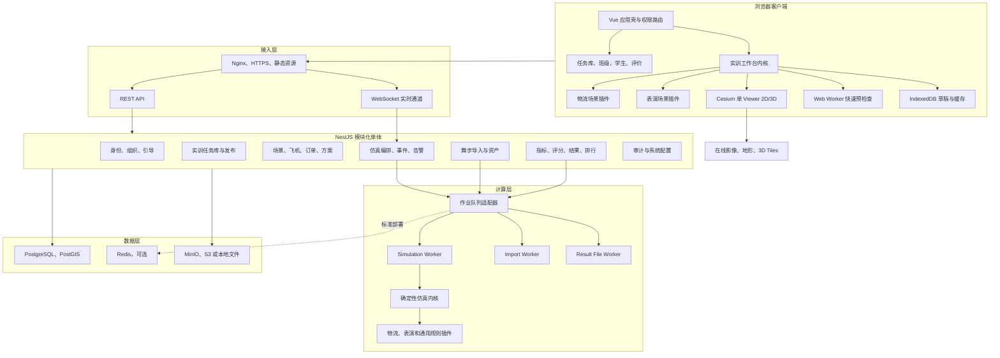
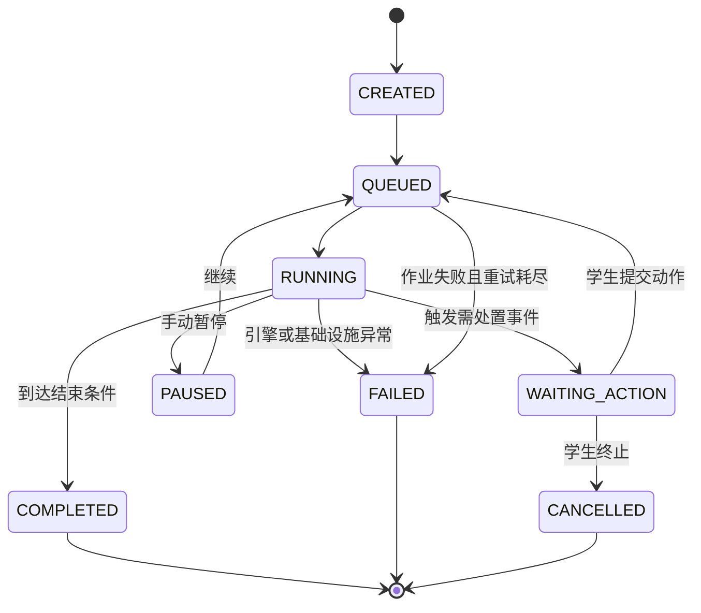
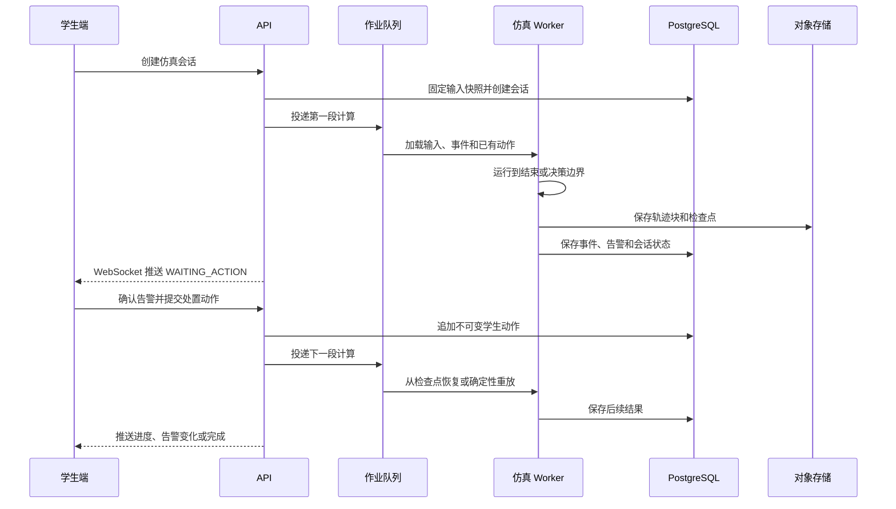
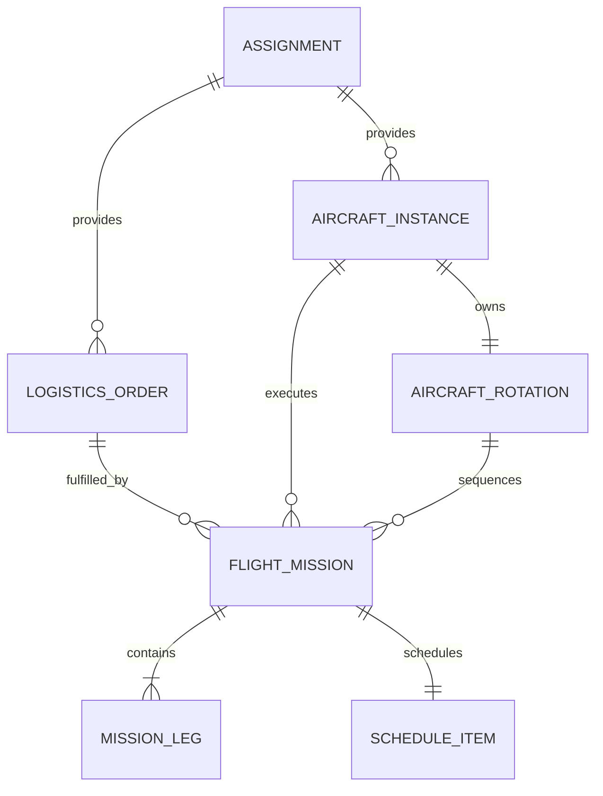
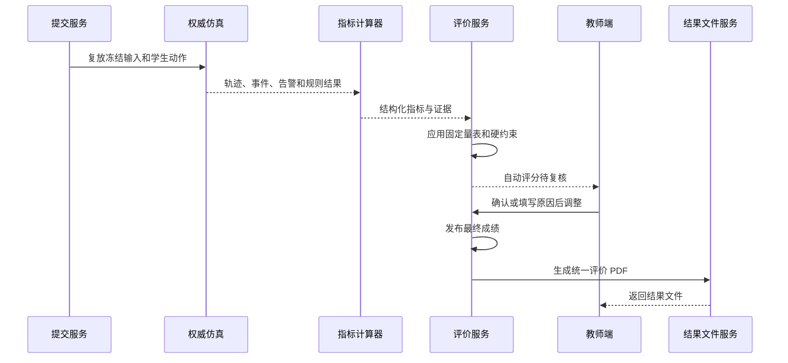
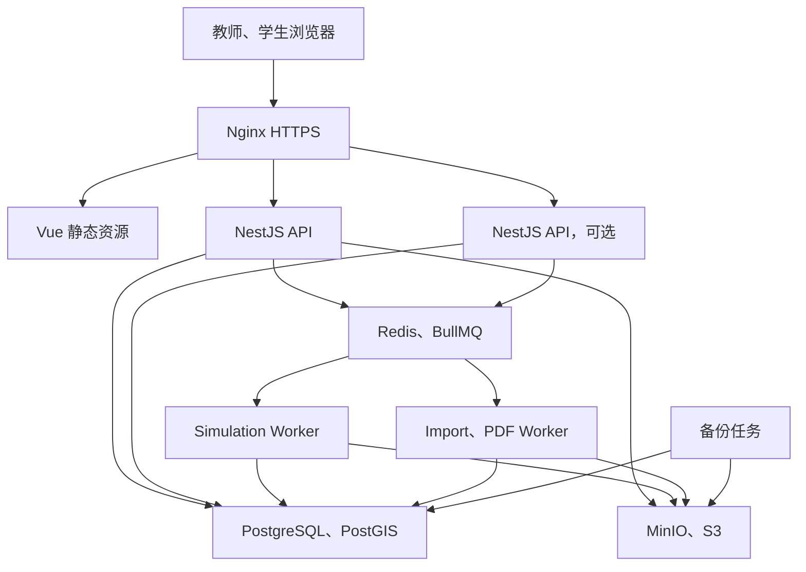

# 低空无人集群教学仿真软件系统设计说明书 V2

## 1. 文档说明

### 1.1 设计依据

本文档以《低空无人集群教学仿真软件需求规格说明书 V2》为业务基线，并结合当前仓库已经实现的 B/S MVP 制定目标系统设计。

当前实现基线：

- 前端：Vue 3.5、TypeScript 5.9、Vite 7、Pinia、Element Plus、CesiumJS 1.143。
- 后端：Node.js 24、NestJS 11、TypeORM 0.3。
- 仿真：TypeScript 固定步长计算、Node.js Worker Thread。
- 数据库：PostgreSQL 17、PostGIS 3.5。
- 文件存储：本地文件系统保存仿真结果。
- 部署：Docker Compose，NestJS 同时提供 API 和前端静态文件。

本设计不切换到 Spring Boot、C++ 或其他主技术栈。现有技术栈可以继续承载下一阶段建设，重点是拆分模块边界、补齐业务数据和建立可复现的交互式仿真机制。

### 1.2 设计目标

- 在不推翻现有 MVP 的前提下增加实训任务库、学生管理、NPC 事件、告警处置、评价和舞步导入。
- 保持模块化单体，避免在业务边界尚未稳定时拆分大量微服务。
- 将 CPU 密集的仿真计算与 API 进程隔离，并允许从 Worker Thread 平滑升级为独立 Worker 进程。
- 使用统一场景插件接口承载城市物流配送和城市集群表演的差异。
- 保证任务、方案、规则、事件、动作和评价结果可版本化、可复现、可追溯。
- 保持 Cesium 单 Viewer 的 2D/3D 工作台，不重新建设地图能力。

### 1.3 设计优先级

| 优先级 | 设计目标 |
|---|---|
| P0 | 数据版本、权限、结果可信性和仿真确定性 |
| P1 | 完整教学闭环和教师、学生核心工作流 |
| P2 | 场景插件扩展性、运行控制效率和告警处置体验 |
| P3 | 大规模部署、横向扩容和更多厂商格式适配 |

### 1.4 非目标

- 不建设微服务集群作为首版前置条件。
- 不在浏览器中执行最终权威评分。
- 不允许教师上传任意脚本作为规则或评分公式。
- 不把舞步软件的灯效、音乐和图案编辑能力复制到平台。
- 不建设多人实时协同和竞赛对战。
- 不把浏览器临时获取的在线地形高度直接作为不可追溯的评分依据。

### 1.5 需求设计追踪

| V2 需求领域 | 系统设计章节 |
|---|---|
| 实训任务库和参考答案 | 第 6、10、12、13 章 |
| 仿真数据自动采集判题 | 第 8、10、12 章 |
| 首次登录引导 | 第 5.7、6.1、12、13 章 |
| 单人操作和系统 NPC | 第 6、8、9 章 |
| 城市表演与物流差异 | 第 7、9 章 |
| 舞步软件导入 | 第 9.3 至 9.5、14 章 |
| 城市场景安全和距离 | 第 9.6、11 章 |
| 民航式任务和时刻表 | 第 5.5、5.6、9.1 章 |
| 飞机属性和下一任务 | 第 5、9.1、12 章 |
| 告警栏和应急处置 | 第 5.5、8 章 |
| 学生和班级管理 | 第 5、6、12、13 章 |
| 教师评价体系 | 第 10 章 |
| 单一评价结果文件 | 第 10.6、14.3 章 |
| 班级排行榜 | 第 10.7、12、13 章 |
| Cesium 2D、3D 和 DEM | 第 5、11 章 |

## 2. 当前系统评估

### 2.1 已有能力

当前系统已经具备：

- 教师、学生和管理员基础角色与 Cookie 登录。
- 教师创建城市表演或城市物流实训、配置场景并发布。
- 学生编辑无人机任务分配、航点、速度和起飞延迟。
- Cesium 地图、2D/3D 切换、地形和建筑加载能力。
- 固定步长多机仿真、轨迹回放和基础规则检查。
- 方案版本、最终提交和教师查看学生提交进度。
- Docker 单机部署和 PostGIS 持久化。

### 2.2 主要差距

| 领域 | 当前状态 | V2 目标差距 |
|---|---|---|
| 前端工作台 | 业务集中在单个大型工作台组件 | 拆分工作台内核、通用面板和场景插件 |
| 场景模型 | 两个场景共用 `TaskPoint` 和 `AircraftSpec` | 增加订单、飞机实例、任务链、表演阶段和轨迹映射 |
| 教学组织 | 用户只有平台角色 | 增加课程、班级、成员和任务发布范围 |
| 任务内容 | 教师直接创建实训 | 增加模板、答案、规则、事件和量表版本 |
| 仿真执行 | 一次运行到结束 | 增加运行会话、事件注入、等待处置和续跑 |
| 告警 | 只有运行后规则问题 | 增加运行告警、确认、处置和解除状态 |
| 评价 | 只检查完成率和严重问题 | 增加指标、权重、硬约束、自动评分和教师复核 |
| 文件 | 本地 JSON 结果 | 增加对象存储适配和统一 PDF 结果文件 |
| 数据变更 | TypeORM 自动同步 | 正式环境改为数据库迁移 |
| 开发启动 | `tsx watch` 可能缺失装饰器元数据 | 使用支持 NestJS 装饰器元数据的编译监听流程 |

### 2.3 演进原则

- 保留现有 `practices`、`solutions`、`solution_versions`、`simulation_runs` 和 `submissions`，通过迁移增加字段和关系。
- 新模块先在同一 NestJS 应用内实现，仿真 Worker 使用明确接口隔离。
- 共享 TypeScript 类型逐步升级为运行时可验证的 Schema，不一次性重写所有 DTO。
- 本地开发继续支持文件存储和内联 Worker；生产部署可切换到 Redis 队列和 S3 兼容存储。

## 3. 架构原则

### 3.1 模块化单体

业务 API 采用 NestJS 模块化单体。每个模块拥有自己的实体、应用服务、接口和权限检查，不允许任意跨模块直接访问 Repository。

模块之间通过以下方式协作：

- 同进程应用接口：适合同步查询和事务内操作。
- 领域事件：适合发布、提交、评价完成和结果文件生成等后续动作。
- 作业队列：适合仿真、舞步解析、批量地形采样和 PDF 生成。

### 3.2 不可变版本

以下对象一旦发布或用于权威仿真，不再原地修改：

- 实训任务版本。
- 场景版本。
- 参考答案版本。
- 规则集版本。
- 事件脚本版本。
- 评价量表版本。
- 学生方案版本。
- 舞步导入结果版本。

修改时创建新版本，历史提交继续引用原版本。

### 3.3 快速反馈与权威结果分层

| 能力 | 浏览器快速反馈 | 服务端权威处理 |
|---|---|---|
| Schema 和必填字段 | 是 | 是 |
| 任务覆盖、重复分配 | 是 | 是 |
| 航程和时刻估算 | 是 | 是 |
| 简单空间相交 | 是 | 是 |
| 连续多机碰撞 | 可做粗略提示 | 是 |
| NPC 事件与告警状态 | 展示和提交动作 | 是 |
| 最终指标与分数 | 否 | 是 |
| 统一评价 PDF | 否 | 是 |

### 3.4 适配器隔离外部依赖

地图、地形、对象存储、队列、舞步格式和 PDF 生成都通过接口隔离。开发环境和生产环境可以使用不同实现，业务模块不直接依赖具体供应商。

## 4. 总体架构

### 4.1 逻辑架构



### 4.2 物理形态

系统提供两种运行形态：

| 形态 | 组件 | 适用场景 |
|---|---|---|
| 轻量单机 | API、内联 Worker、PostGIS、本地文件 | 开发、演示、小规模试点 |
| 校园标准部署 | Nginx、API、独立 Worker、PostGIS、Redis、MinIO | 正式教学、并发班级和持久化运行 |

两种形态通过 `SimulationExecutor`、`JobQueue` 和 `ObjectStore` 接口切换，不维护两套业务代码。

### 4.3 技术栈

| 层次 | 选型 | 说明 |
|---|---|---|
| 前端 | Vue 3、TypeScript、Vite、Pinia | 保持现有技术栈 |
| UI | Element Plus + 项目工作台样式 | 管理页面复用组件，地图工作台使用定制布局 |
| 地图 | CesiumJS | 单 Viewer，支持在线影像、地形和 3D Tiles |
| API | NestJS、Express Adapter | 模块化单体，REST 与 WebSocket |
| 数据访问 | TypeORM、数据库迁移 | 正式环境关闭 `synchronize` |
| Schema | Zod 或等价共享 Schema | 前后端共享运行时校验和类型推导 |
| 数据库 | PostgreSQL、PostGIS | 业务、版本、空间索引和结果摘要 |
| 队列 | 内联适配器或 BullMQ、Redis | 按部署规模启用 |
| 对象存储 | 本地文件或 S3 兼容接口 | 舞步源文件、轨迹块、结果和 PDF |
| PDF | 服务端 PDF 生成器和内置中文字体 | 不依赖用户浏览器打印 |
| 测试 | Vitest、Playwright | 单元、接口、仿真黄金数据和视觉冒烟 |

## 5. 前端系统设计

### 5.1 信息架构

教师端：

- 教学首页。
- 实训任务库。
- 实训编辑与发布。
- 课程、班级和学生。
- 学生进度与评价。
- 结果文件和排行榜。

学生端：

- 我的实训。
- 实训任务详情。
- 场景工作台。
- 仿真复盘和应急处置。
- 我的评价和班级排行榜。

管理端：

- 组织、学期、课程和用户。
- 地图、地形和对象存储配置。
- 任务内容、规则和指标字典。
- 审计和运行监控。

### 5.2 目标目录

```text
apps/web/src/
  app/
    router/
    layouts/
    bootstrap/
  modules/
    auth/
    onboarding/
    exercise-library/
    organization/
    assignment/
    evaluation/
    leaderboard/
  workspace/
    core/
      WorkspaceShell.vue
      workspace-store.ts
      command-stack.ts
      selection.ts
    panels/
      ObjectTreePanel.vue
      PropertyPanel.vue
      TimelinePanel.vue
      FlightStripPanel.vue
      SchedulePanel.vue
      AircraftPanel.vue
      AlertPanel.vue
    plugins/
      city-logistics/
      city-show/
    playback/
    precheck/
  map/
    CesiumViewer.vue
    map-controller.ts
    entity-renderers/
    terrain/
  shared/
    api/
    components/
    stores/
    formatters/
  workers/
```

现有 `WorkspaceView.vue` 应逐步拆成工作台壳、面板和场景插件，不在一次提交中整体重写。现有 `CesiumMap.vue` 演进为地图适配层，只接收标准化的地图对象和交互命令，不包含订单、评分或 NPC 业务判断。

### 5.3 前端场景插件

前端插件注册界面能力，不负责最终判题。

```ts
interface WorkspaceScenarioPlugin {
  type: "CITY_LOGISTICS" | "CITY_SHOW"
  routes: RouteRecordRaw[]
  objectTreeSections: WorkspaceSectionFactory[]
  propertyEditors: PropertyEditorRegistry
  toolbarActions: WorkspaceAction[]
  panels: WorkspacePanelDefinition[]
  mapRenderers: MapRendererRegistry
  precheck: (context: PrecheckContext) => Promise<PrecheckIssue[]>
}
```

物流插件提供订单、站点、飞机任务、时刻表和任务链；表演插件提供导入轨迹、表演阶段、编号映射和场地适配。

### 5.4 状态分层

| 状态 | 存放位置 | 示例 |
|---|---|---|
| 会话状态 | Pinia | 当前用户、权限、引导状态 |
| 服务端列表状态 | 页面 Store | 任务列表、学生列表、评价列表 |
| 工作台文档状态 | Workspace Store | 场景、方案、订单、时刻表 |
| 地图瞬时状态 | Map Store | 相机、选择、拾取工具、图层开关 |
| 仿真运行状态 | Runtime Store | 会话状态、当前时间、告警和进度 |
| 本地恢复状态 | IndexedDB | 未同步草稿、命令快照和轨迹缓存 |

服务端对象使用 `revision` 做乐观锁。保存冲突时不得静默覆盖，应允许比较本地和服务端版本。

### 5.5 工作台布局

工作台继续采用固定工具布局：

- 顶部：实训名称、版本、保存状态、运行、提交和视图控制。
- 左侧：资源、飞机、任务、订单或表演阶段对象树。
- 中间：Cesium 2D/3D 地图。
- 右侧：选中对象属性、飞机详情、下一任务或问题详情。
- 底部：时间轴、飞行任务条、时刻表和运行控制。
- 告警栏：可停靠在右侧或底部，紧急告警使用固定顶部提示但不遮挡主要操作。

管理页面与地图工作台分开，不把班级、学生和任务库表格叠加到 Cesium 页面。

### 5.6 运行控制面板联动

选择任一对象时执行统一联动：

1. 对象树选中对应对象。
2. Cesium 高亮飞机、航线、任务点或告警位置。
3. 属性面板显示对象详情和允许操作。
4. 时间轴跳转到相关时间。
5. 飞行任务条和时刻表定位对应记录。

每次联动只更新选择状态，不复制业务对象，避免多个面板出现不同数据副本。

### 5.7 首次登录引导

- 后端返回用户、角色和各引导版本的完成状态。
- 前端根据路由加载角色引导定义。
- 引导步骤通过稳定元素标识定位，不能依赖易变化的 CSS 层级选择器。
- 完成、跳过和重新播放都记录行为，但跳过不影响正常使用。
- 示例操作使用演示任务或临时草稿，不修改正式学生成绩。

## 6. 后端领域设计

### 6.1 模块划分

```text
apps/server/src/
  identity/             登录、用户、角色、Cookie 和会话
  organization/         学校、课程、班级、成员
  onboarding/           引导定义和用户完成状态
  exercise-library/     任务模板、版本、答案和内容审核
  assignment/           任务发布、班级范围、截止时间和进度
  scenario/             场景版本、空间对象和地形快照
  fleet/                飞机型号、飞机实例和状态
  logistics/            订单、站点、飞行任务、时刻和任务链
  city-show/            舞步包、阶段、轨迹和编号映射
  solution/             学生草稿、版本、同步和差异
  simulation/           会话、作业、Worker 编排和轨迹结果
  runtime-event/        NPC 事件、消息和学生动作
  alert/                告警状态机和处置记录
  evaluation/           指标、量表、自动评分和教师复核
  result-file/          统一评价 PDF 和下载权限
  leaderboard/          班级排名和快照
  asset/                文件、地图、地形和对象存储元数据
  audit/                关键操作审计
  system/               健康检查、配置和版本信息
```

### 6.2 模块依赖规则

- `identity` 和 `organization` 不依赖教学业务模块。
- `exercise-library` 可以引用规则、量表和事件脚本版本，不引用学生方案。
- `assignment` 将任务版本发布到班级，是学生方案的业务入口。
- `solution` 引用发布实例和场景快照，不直接修改任务模板。
- `simulation` 只读取冻结输入快照，不直接读取可变草稿。
- `evaluation` 只读取权威仿真结果、动作记录和固定量表版本。
- `leaderboard` 只读取已发布成绩，不直接重新计算分数。
- `result-file` 根据已发布评价生成唯一当前文件。

### 6.3 应用服务与领域服务

应用服务负责权限、事务和流程编排；纯领域服务负责确定性计算。

示例：

| 应用服务 | 责任 |
|---|---|
| `PublishAssignmentService` | 固定版本、检查班级权限并发布 |
| `CreateSimulationSessionService` | 创建方案版本、输入快照和运行会话 |
| `ApplyStudentActionService` | 校验告警状态、记录动作并触发续跑 |
| `FinalizeSubmissionService` | 权威复放、评价、提交和结果文件编排 |
| `PublishGradeService` | 教师复核、发布成绩和更新排行榜 |
| `ImportShowTrackService` | 创建导入作业并提交解析队列 |

纯领域服务不得依赖 NestJS、TypeORM、HTTP 或文件系统。

### 6.4 领域事件

首版领域事件在同一进程内可靠落库后异步消费。关键事件包括：

- `ExerciseVersionPublished`
- `AssignmentPublished`
- `SolutionVersionCreated`
- `SimulationSessionStarted`
- `RuntimeEventTriggered`
- `AlertCreated`
- `StudentActionApplied`
- `SimulationSessionCompleted`
- `SubmissionCreated`
- `AutoGradeCompleted`
- `GradePublished`
- `ResultFileGenerated`

关键异步动作采用 Outbox 表，业务事务与事件写入同一数据库事务，后台分发器再投递队列，避免数据库提交成功但任务丢失。

## 7. 共享契约与场景插件

### 7.1 契约包

现有 `@wurenji/shared` 逐步承担以下内容：

- 枚举、ID、时间、坐标和版本类型。
- API 请求与响应 Schema。
- 场景、方案、仿真输入和结果 Schema。
- 规则、指标、事件、告警和动作元数据。
- 场景插件公共接口。

仅有 TypeScript `interface` 不能校验 HTTP、数据库 JSONB 和导入文件。目标设计使用运行时 Schema，并由 Schema 推导 TypeScript 类型。

### 7.2 场景插件接口

```ts
interface ScenarioLogicPlugin<Scene, Plan, Metrics> {
  type: ScenarioType
  version: string
  sceneSchema: RuntimeSchema<Scene>
  planSchema: RuntimeSchema<Plan>
  validateScene(scene: Scene): ValidationIssue[]
  validatePlan(scene: Scene, plan: Plan): ValidationIssue[]
  compileWorld(input: ScenarioSimulationInput<Scene, Plan>): SimulationWorld
  registerRules(registry: RuleRegistry): void
  calculateMetrics(context: MetricContext): Metrics
  supportedActions(event: RuntimeEvent, state: SimulationState): ActionDefinition[]
}
```

插件必须满足：

- 同一输入和版本产生相同输出。
- 不访问数据库、网络、系统时间和随机全局状态。
- 随机行为只使用输入中的固定种子。
- 规则输出统一证据结构。
- 插件升级不改变历史版本的计算结果。

### 7.3 包结构演进

```text
packages/
  shared/                   现有共享类型，逐步迁移为运行时契约
  simulation/               现有仿真内核，继续保持纯计算
  scenario-sdk/             插件接口、规则和指标注册表
  scenario-common/          通用安全与性能规则
  scenario-logistics/       物流世界构建、规则和指标
  scenario-city-show/       表演世界构建、规则和指标
  import-sdk/               舞步导入适配器接口
```

前端 Vue 组件不放入纯逻辑包，防止仿真 Worker 引入 DOM 和 Cesium 依赖。

## 8. 仿真、事件与告警设计

### 8.1 运行对象

区分三个对象：

| 对象 | 含义 |
|---|---|
| 仿真会话 `simulation_session` | 一次学生交互式仿真尝试，包含多个计算阶段和动作 |
| 仿真作业 `simulation_job` | Worker 执行的一段计算任务 |
| 权威运行 `authoritative_run` | 提交时对完整输入和动作序列执行的不可变复放 |

### 8.2 会话状态机



引擎异常和基础设施异常不能转换为学生失败成绩。

### 8.3 仿真输入快照

```ts
interface SimulationSessionInput {
  protocolVersion: string
  engineVersion: string
  scenarioPlugin: { type: ScenarioType; version: string }
  exerciseVersionId: string
  assignmentId: string
  sceneSnapshot: unknown
  solutionSnapshot: unknown
  aircraftSnapshot: unknown
  importedTrackSnapshot?: unknown
  ruleSetSnapshot: unknown
  eventScriptSnapshot: unknown
  rubricSnapshot: unknown
  terrainSnapshot: unknown
  stepSeconds: number
  seed: number
}
```

输入写入后计算 `inputHash`。学生动作采用追加写入，不修改原始输入。

### 8.4 事件驱动续跑



Worker 不长期占用内存等待学生。到达决策边界后保存检查点并退出作业，学生动作到达后再创建新作业。

### 8.5 检查点策略

- 检查点包含仿真时刻、飞机状态、任务状态、事件游标、指标累积器和随机数生成器状态。
- 检查点序列化格式包含引擎和插件版本。
- 同版本优先从检查点恢复。
- 检查点不兼容或损坏时，从原始输入和动作序列确定性重放。
- 最终提交始终执行完整权威复放，不直接信任浏览器或临时检查点。

### 8.6 规则分类

| 类型 | 触发时机 | 示例 |
|---|---|---|
| Schema 规则 | 保存、发布、导入 | 缺少字段、单位非法、对象引用不存在 |
| 静态规划规则 | 运行前 | 订单遗漏、任务冲突、载重超限 |
| 连续运行规则 | 每个时间步或空间候选变化 | 碰撞、间距、越界、障碍物 |
| 事件响应规则 | NPC 事件和学生动作后 | 未确认、处置超时、动作不允许 |
| 完成规则 | 会话结束 | 任务完成、返航、剩余电量和结束状态 |
| 评价规则 | 权威结果生成后 | 指标换算、硬约束和分数封顶 |

### 8.7 告警与规则结果分离

`Alert` 表示运行中需要学生处理的状态，`RuleResult` 表示系统评价证据。两者可以关联，但生命周期不同。

告警核心字段：

- `id`、`sessionId`、`sourceEventId`、`code`。
- `severity`、`status`、`title`、`message`。
- `objectIds`、`position`、`triggeredAtSeconds`、`deadlineAtSeconds`。
- `acknowledgedAt`、`resolvedAt`、`resolutionCode`。
- `allowedActionCodes`、`evidence`。

告警状态转换：

```text
NEW -> ACKNOWLEDGED -> HANDLING -> RESOLVED
NEW -> EXPIRED
ACKNOWLEDGED -> EXPIRED
HANDLING -> FAILED
```

所有状态转换由服务端验证，客户端不能直接把告警改为已解除。

### 8.8 学生动作

学生动作采用白名单命令：

```ts
interface StudentRuntimeAction {
  id: string
  sessionId: string
  alertId?: string
  actionCode: string
  targetIds: string[]
  parameters: Record<string, unknown>
  submittedAt: string
  simulationTimeSeconds: number
  clientRequestId: string
}
```

服务端检查动作是否适用于当前事件、对象状态、角色和时间窗口。`clientRequestId` 用于幂等，防止网络重试重复执行改派或返航。

## 9. 场景专项设计

### 9.1 物流领域模型

物流插件使用以下核心对象：

- `Station`：仓库、配送点、起降场和备降点。
- `LogisticsOrder`：货物、优先级、取送地址和时间窗。
- `AircraftInstance`：具体飞机、当前状态和能力。
- `FlightMission`：一次可调度飞行任务。
- `MissionLeg`：任务中的具体航段。
- `ScheduleItem`：计划、预计和实际时刻。
- `AircraftRotation`：一架飞机按顺序执行的任务链。

物流对象关系：



时刻字段统一区分：

- `plannedTime`：学生方案中的计划时间。
- `estimatedTime`：根据当前运行状态动态计算的预计时间。
- `actualTime`：事件实际发生时间。

预计时间变化不得覆盖计划时间。

### 9.2 物流指标

- 订单完成率和准时率。
- 加权延误时间和加急订单完成情况。
- 总航程、空驶航程和任务航程比例。
- 电量或航程消耗和返航余量。
- 飞机利用率、任务链空闲时间和站点等待时间。
- 严重安全问题、告警响应和次生风险。

指标计算器输出原始值、单位、证据和版本，不直接写死最终分数。

### 9.3 表演领域模型

表演插件使用：

- `ImportedTrackPackage`：原始舞步文件和解析元数据。
- `ImportedTrack`：单架无人机的归一化轨迹。
- `VenueConfig`：场地原点、朝向、比例、观众区和安全区。
- `TrackTransform`：平移、旋转、缩放和高度偏置。
- `TrackMapping`：舞步编号与飞机实例的映射。
- `ShowPhase`：起飞、集合、表演段、退出、返航和降落。

### 9.4 舞步导入管线


导入状态：`UPLOADED`、`PARSING`、`NEEDS_MAPPING`、`VALIDATING`、`READY`、`COMMITTED`、`FAILED`。

### 9.5 舞步适配器接口

```ts
interface TrackImportAdapter {
  adapterCode: string
  version: string
  supports(file: ImportFileMetadata): boolean
  parse(stream: ReadableStream): Promise<RawTrackPackage>
  normalize(raw: RawTrackPackage, profile: ImportProfile): NormalizedTrackPackage
  validate(data: NormalizedTrackPackage): ImportIssue[]
}
```

原始文件永久保留校验值，归一化结果记录适配器版本。导入失败不得产生部分可用的正式轨迹版本。

### 9.6 表演指标

- 文件和编号映射完整率。
- 轨迹连续性、速度、爬升率和下降率超限次数。
- 无人机间最小距离和冲突时长。
- 表演阶段到达误差和时间同步误差。
- 场地边界、观众安全区、障碍物和禁飞区问题。
- 起降时隙冲突、返航完成率和异常处置表现。

灯光和颜色可以保存在轨迹元数据中，但不进入首版仿真世界和评分。

## 10. 教学、答案与评价设计

### 10.1 实训任务聚合

任务模板版本聚合包含：

- 基础信息和能力指标。
- 场景类型和场景初始快照。
- 资源、订单或舞步源数据。
- 参考答案包。
- 规则集版本。
- 事件脚本版本。
- 评价量表版本。
- 学生可见提示策略。

任务发布实例只引用一个固定任务版本，并增加班级、开放时间、截止时间、尝试次数和排行榜策略。

### 10.2 参考答案安全

- 参考答案单独存储，与学生可读的任务描述分离。
- 所有读取接口执行教师或内容设计者权限检查。
- 学生 API DTO 不包含参考答案字段，不能只依靠前端隐藏。
- 参考答案导出、复制和修改进入审计日志。
- 自动评分使用参考基准时只向学生返回允许公开的阈值和反馈。

### 10.3 评价模型

```text
EvaluationSchemeVersion
  RubricDimension[]
    RubricItem[]
      metricCode
      direction
      passValue
      excellentValue
      maxScore
      hardConstraintPolicy
      visibilityPolicy
```

指标方向包括：

- `HIGHER_IS_BETTER`：完成率、准时率和利用率。
- `LOWER_IS_BETTER`：延误、航程、能耗和响应时间。
- `ZERO_REQUIRED`：碰撞、严重禁飞区侵入和未处置紧急告警。
- `BOOLEAN`：安全返航、文件完整和是否完成指定动作。

分值换算采用注册的评分函数，配置只保存参数。禁止在数据库中保存并执行 JavaScript 表达式。

### 10.4 硬约束策略

| 策略 | 行为 |
|---|---|
| `FAIL` | 结果直接不通过 |
| `CAP_SCORE` | 总分最高不超过配置值 |
| `DEDUCT` | 按次数或持续时间扣分 |
| `REVIEW_REQUIRED` | 必须由教师复核后发布 |

多项硬约束命中时，先执行 `FAIL`，再使用最低封顶值，最后计算普通扣分。

### 10.5 自动评价流程



### 10.6 评价状态

`PENDING_SIMULATION` -> `AUTO_GRADED` -> `REVIEWED` -> `PUBLISHED`。

- 自动评分失败进入 `GRADING_FAILED`，不影响学生原提交。
- 教师调分保存调整前后值和原因。
- 发布后修改评价生成新修订，并使旧 PDF 失效但保留审计记录。
- 对学生始终只暴露当前有效的一个评价结果文件。

### 10.7 排行榜计算

- 排行榜只读取 `PUBLISHED` 成绩。
- 范围固定为发布实例和班级。
- 排序键依次为总分、严重问题数、应急得分、任务完成时间和提交时间。
- 每次成绩发布后异步刷新排行榜快照。
- 教师关闭排行榜后，学生接口不返回其他学生数据。

## 11. Cesium、坐标与 DEM 设计

### 11.1 地图层次

| 层次 | 内容 |
|---|---|
| 影像层 | Cesium World Imagery、XYZ、WMTS 或校园影像 |
| 地形层 | Cesium World Terrain 或自建 quantized-mesh |
| 城市场景层 | OSM Buildings、3D Tiles 或简化障碍物 |
| 教学约束层 | 边界、禁飞区、限高区、安全区和站点 |
| 任务规划层 | 航点、航线、订单、任务和表演阶段 |
| 运行层 | 飞机、已飞轨迹、计划轨迹、事件和告警 |

### 11.2 坐标标准

- 经度、纬度使用 WGS84，单位为度。
- 业务距离和局部仿真使用以场景原点建立的 ENU，单位为米。
- 仿真时间使用从 0 开始的秒；业务时间使用 UTC ISO 8601。
- 舞步文件先转换到统一右手 ENU，再锚定到 WGS84。
- GCJ-02 或厂商偏移坐标只在地图适配器中转换，不写入业务数据库。

### 11.3 高度基准

每个空间点明确保存：

- `altitudeAglMeters`：相对地面高度，作为教学和运行主要高度。
- `groundHeightMeters`：发布场景时冻结的地形高度。
- `ellipsoidHeightMeters`：用于 Cesium 渲染的椭球高度，可由前两项计算。
- `heightSource`：地形服务、手工、导入或默认值。
- `verticalDatum`：椭球高、正常高或厂商自定义基准。

来源不明确的高度数据不得直接参与权威净空评分。

### 11.4 DEM 接入

浏览器继续使用 Cesium `TerrainProvider` 加载在线或自建 quantized-mesh。普通 GeoTIFF 不能直接作为 Cesium 地形 URL，需先切片发布。

权威评分不在每个仿真时间步调用在线地形服务，采用以下流程：

1. 教师发布场景或学生提交舞步适配结果前，批量采样任务点、航点和轨迹关键点地形。
2. 将地形值、来源、服务版本和采样时间写入不可变场景或方案快照。
3. 对长轨迹按距离和坡度阈值增加采样点。
4. 服务端规则使用冻结的地形快照计算 AGL 和净空。
5. 地形服务后续变化不影响历史成绩。

如果服务端无法访问同一地形源，发布前应阻止使用该地形进行权威评分，或由教师明确选择手工高度基准。

### 11.5 2D/3D 一致性

- 一个工作台只创建一个 Cesium Viewer。
- 2D/3D 切换只改变场景模式，不重建业务对象。
- 切换后保持选择对象、当前仿真时刻、图层、告警和相机关注区域。
- 业务视角切换使用相对于当前目标的左视、右视、俯视和跟随视角，不重新飞往全局默认位置。
- 地图拾取、航点高度和地形采样在场景模式变化期间临时锁定。

## 12. 数据架构

### 12.1 存储职责

| 存储 | 内容 |
|---|---|
| PostgreSQL | 用户、课程、班级、任务、版本、方案、会话、告警、指标、成绩和审计 |
| PostGIS | 场景边界、禁飞区、站点、航线索引和告警空间位置 |
| 对象存储 | 舞步原文件、归一化轨迹、仿真轨迹块、检查点和评价 PDF |
| Redis | 作业队列、短期进度和分布式锁，不作为权威业务数据 |
| IndexedDB | 浏览器本地草稿和可丢弃缓存，不作为最终提交依据 |

### 12.2 核心实体关系

```mermaid
erDiagram
    USER ||--o{ CLASS_MEMBER : joins
    CLASS ||--o{ CLASS_MEMBER : contains
    COURSE ||--o{ CLASS : offers
    EXERCISE_TEMPLATE ||--|{ EXERCISE_VERSION : versions
    EXERCISE_VERSION ||--|| REFERENCE_ANSWER_VERSION : uses
    EXERCISE_VERSION ||--|| RUBRIC_VERSION : uses
    EXERCISE_VERSION ||--|| EVENT_SCRIPT_VERSION : uses
    EXERCISE_VERSION ||--o{ ASSIGNMENT : publishes
    CLASS ||--o{ ASSIGNMENT : receives
    ASSIGNMENT ||--o{ SOLUTION : owns
    USER ||--o{ SOLUTION : creates
    SOLUTION ||--|{ SOLUTION_VERSION : versions
    SOLUTION_VERSION ||--o{ SIMULATION_SESSION : runs
    SIMULATION_SESSION ||--o{ RUNTIME_EVENT : emits
    SIMULATION_SESSION ||--o{ ALERT : raises
    SIMULATION_SESSION ||--o{ STUDENT_ACTION : records
    SOLUTION_VERSION ||--o| SUBMISSION : submits
    SUBMISSION ||--|| AUTHORITATIVE_RUN : verifies
    AUTHORITATIVE_RUN ||--o{ METRIC_RESULT : calculates
    SUBMISSION ||--|| GRADE : receives
    GRADE ||--|{ GRADE_ITEM : contains
    GRADE ||--o| RESULT_FILE : generates
```

### 12.3 主要表

| 领域 | 表 |
|---|---|
| 身份组织 | `users`、`courses`、`classes`、`class_members` |
| 引导 | `onboarding_definitions`、`user_onboarding_states` |
| 任务库 | `exercise_templates`、`exercise_versions`、`reference_answer_versions` |
| 发布 | `assignments`、`assignment_students`、`assignment_progress` |
| 场景资源 | `scenario_versions`、`aircraft_types`、`aircraft_instances`、`stations` |
| 物流 | `logistics_orders`、`flight_missions`、`mission_legs`、`schedule_items`、`aircraft_rotations` |
| 表演 | `track_packages`、`track_imports`、`show_phases`、`track_mappings` |
| 方案 | `solutions`、`solution_versions`、`solution_diffs` |
| 运行 | `simulation_sessions`、`simulation_jobs`、`authoritative_runs`、`simulation_events` |
| 告警动作 | `alerts`、`student_actions`、`alert_transitions` |
| 评价 | `rubrics`、`rubric_versions`、`metric_definitions`、`metric_results`、`grades`、`grade_items` |
| 文件排行 | `assets`、`result_files`、`leaderboard_snapshots`、`leaderboard_entries` |
| 系统 | `outbox_events`、`audit_logs`、`schema_migrations` |

### 12.4 JSONB 与关系字段边界

使用关系字段保存需要授权、筛选、排序、关联和唯一约束的数据；使用 JSONB 保存不可变快照和插件专用配置。

适合关系字段：

- 用户、班级、任务、状态、版本号和时间。
- 飞机号、任务号、订单号和对象关系。
- 告警级别、状态、指标代码、分数和排行榜排序字段。

适合 JSONB：

- 固定场景快照和方案快照。
- 规则参数、事件参数和动作参数。
- 导入器元数据、规则证据和指标证据。

不能只把所有 V2 数据塞入 `PracticeScene` 单个 JSONB 字段，否则学生管理、时刻查询、告警状态和排行榜无法可靠实现。

### 12.5 索引与约束

- `exercise_versions(template_id, version)` 唯一。
- `solutions(assignment_id, student_id)` 唯一。
- `solution_versions(solution_id, version)` 唯一。
- `class_members(class_id, user_id)` 唯一。
- `student_actions(session_id, client_request_id)` 唯一。
- `alerts(session_id, status, severity)` 普通索引。
- `simulation_events(session_id, simulation_time_seconds)` 普通索引。
- `metric_results(authoritative_run_id, metric_code)` 唯一。
- 空间对象使用 PostGIS GiST 索引。
- 对象存储路径、校验值和大小保存在 `assets`，内容使用 SHA-256 去重和校验。

### 12.6 数据迁移

- 正式环境设置 `TYPEORM_SYNCHRONIZE=false`。
- 所有表结构变化通过可回滚的 TypeORM Migration 执行。
- 大字段迁移采用新增字段、后台回填、双读验证、切换和删除旧字段的分阶段流程。
- V2 上线前备份数据库和仿真文件，迁移脚本输出记录数量和校验结果。

## 13. API 与实时通信

### 13.1 API 约定

- 新接口统一使用 `/api/v1`。
- 当前 `/api` 接口在迁移期保留，前端完成切换后再停用。
- 请求和响应使用共享 Schema 校验。
- 列表接口统一支持分页、排序和白名单筛选。
- 修改接口支持 `revision` 或 `If-Match` 乐观锁。
- 创建运行、提交动作和最终提交支持幂等键。

错误响应：

```json
{
  "code": "SOLUTION_REVISION_CONFLICT",
  "message": "方案已被其他会话更新",
  "requestId": "req_...",
  "details": {
    "expectedRevision": 7,
    "actualRevision": 8
  }
}
```

### 13.2 主要 REST API

| 方法与路径 | 说明 |
|---|---|
| `GET /api/v1/me` | 当前用户、角色、权限和引导状态 |
| `GET /api/v1/exercise-templates` | 查询实训任务库 |
| `POST /api/v1/exercise-templates` | 创建任务模板 |
| `POST /api/v1/exercise-templates/{id}/versions` | 创建任务版本 |
| `POST /api/v1/exercise-versions/{id}/publish` | 发布任务版本 |
| `GET /api/v1/classes` | 查询教师可管理班级 |
| `POST /api/v1/classes/{id}/students:import` | 批量导入学生 |
| `POST /api/v1/assignments` | 向班级发布实训 |
| `GET /api/v1/assignments/{id}/progress` | 查询学生进度 |
| `GET /api/v1/assignments/{id}/solution` | 获取当前学生方案 |
| `PUT /api/v1/solutions/{id}` | 保存草稿和乐观锁 revision |
| `POST /api/v1/solutions/{id}/versions` | 创建不可变方案版本 |
| `POST /api/v1/show-track-imports` | 创建舞步导入作业 |
| `GET /api/v1/show-track-imports/{id}` | 查询导入状态和问题 |
| `POST /api/v1/show-track-imports/{id}/commit` | 固定导入版本 |
| `POST /api/v1/simulation-sessions` | 创建交互式仿真会话 |
| `GET /api/v1/simulation-sessions/{id}` | 查询会话、进度和当前时间 |
| `POST /api/v1/simulation-sessions/{id}/pause` | 暂停运行 |
| `POST /api/v1/simulation-sessions/{id}/actions` | 提交学生处置动作 |
| `GET /api/v1/simulation-sessions/{id}/alerts` | 查询告警 |
| `POST /api/v1/alerts/{id}/acknowledge` | 确认告警 |
| `GET /api/v1/simulation-sessions/{id}/tracks` | 按时间窗口读取轨迹块 |
| `POST /api/v1/assignments/{id}/submissions` | 创建最终提交 |
| `GET /api/v1/submissions/{id}/grade` | 获取自动或最终评价 |
| `PUT /api/v1/grades/{id}/review` | 教师复核和调整 |
| `POST /api/v1/grades/{id}/publish` | 发布成绩并生成结果文件 |
| `GET /api/v1/result-files/{id}/download` | 下载统一评价 PDF |
| `GET /api/v1/assignments/{id}/leaderboard` | 获取允许查看的班级排行 |

### 13.3 WebSocket 设计

客户端建立 `/api/v1/realtime` 连接，认证沿用 HttpOnly Cookie。订阅按用户和会话授权。

主要事件：

- `simulation.session.updated`
- `simulation.progress`
- `runtime.event.created`
- `alert.created`
- `alert.updated`
- `simulation.waiting_action`
- `simulation.completed`
- `simulation.failed`
- `grade.updated`
- `result_file.ready`

每条消息包含 `messageId`、`sequence`、`occurredAt`、`type` 和 `payload`。客户端发现序号缺口时通过 REST 获取会话当前快照，不依赖 WebSocket 消息永久保存状态。

### 13.4 轨迹读取

- 轨迹按会话、飞机和时间窗口分块。
- 数据块包含开始时间、结束时间、采样间隔、对象数量和校验值。
- 前端按当前时间窗口预取前后相邻块。
- 大规模表演场景使用压缩二进制或紧凑数组格式，不返回重复字段的巨大 JSON。
- 结果列表和告警位置保存在数据库，详细轨迹保存在对象存储。

## 14. 文件与结果设计

### 14.1 对象存储接口

```ts
interface ObjectStore {
  put(key: string, data: ReadableStream, metadata: ObjectMetadata): Promise<StoredObject>
  get(key: string): Promise<ReadableStream>
  head(key: string): Promise<StoredObjectMetadata>
  delete(key: string): Promise<void>
  createDownloadUrl(key: string, expiresInSeconds: number): Promise<string>
}
```

开发环境使用本地目录实现，生产环境使用 MinIO 或 S3 实现。

### 14.2 文件分类

| 分类 | 保留策略 |
|---|---|
| 舞步原始文件 | 长期保留，关联导入记录和 SHA-256 |
| 归一化轨迹 | 与任务版本和提交生命周期一致 |
| 临时预览文件 | 导入失败或放弃后按策略清理 |
| 仿真轨迹与检查点 | 按课程或学校保留策略归档 |
| 权威结果 | 与提交和成绩长期保留 |
| 评价 PDF | 始终保留历史修订，学生只看到当前有效文件 |

### 14.3 统一评价 PDF

PDF 由服务端根据固定模板生成，包含：

- 学生、班级、任务和版本信息。
- 最终总分、通过状态、班级排名和教师评语。
- 各维度分数、关键指标、阈值和证据摘要。
- 关键告警、学生动作、响应时间和处置结果。
- 安全结论、任务完成情况和主要运行指标。
- 规则、量表、插件和仿真引擎版本。
- 文件编号、生成时间和校验值。

PDF 使用服务器内置并获得许可的中文字体，避免不同服务器缺少字体导致乱码。

## 15. 安全与权限

### 15.1 认证

- 保留 HttpOnly Cookie 中的短期 JWT。
- 生产环境必须启用 HTTPS 和 `Secure` Cookie。
- Cookie 使用 `SameSite=Lax`，所有修改请求增加 CSRF Token 校验。
- 登录、导入、仿真创建和文件下载执行速率限制。
- 学校已有统一身份系统时通过 OIDC 适配，不在业务模块中绑定具体厂商。

### 15.2 授权

采用角色、组织范围和对象归属三层检查：

1. 角色是否允许执行该类操作。
2. 用户是否属于对应学校、课程或班级。
3. 用户是否拥有具体任务、方案、会话、成绩或文件。

教师查看学生答案、调整成绩和下载结果必须验证班级关系；学生不能通过猜测 ID 读取其他学生内容。

### 15.3 内容安全

- 舞步导入限制文件类型、大小、压缩层级和记录数量。
- 不执行上传文件中的宏、脚本和可执行内容。
- 文件名只作为展示元数据，对象存储 Key 由系统生成。
- JSON、CSV 和压缩包解析设置内存、时间和行数限制。
- 参考答案和教师讲解使用独立 DTO 和接口，避免字段误返回。

### 15.4 评分可信性

- 权威仿真只读取服务端冻结快照。
- 输入、动作序列、结果和 PDF 保存校验值。
- 仿真引擎、插件、规则和量表均记录版本。
- 引擎异常不产生学生扣分。
- 教师人工调整成绩必须填写原因并记录审计。
- 排行榜只使用已发布成绩。

### 15.5 密钥与地图服务

- JWT 密钥、数据库密码和对象存储密钥通过环境变量或 Secret 管理。
- Cesium ion 浏览器 Token 使用最小权限、域名限制和配额。
- 高权限地图资产操作由后端执行。
- 自建地图和 DEM 可通过校园网关访问，不把内部地址硬编码在前端源码。

## 16. 部署设计

### 16.1 校园标准部署



### 16.2 Docker 服务

目标 `docker-compose` 包含：

- `edge`：Nginx、TLS 和静态资源。
- `api`：NestJS API 和 WebSocket。
- `simulation-worker`：仿真计算。
- `job-worker`：导入、地形采样和 PDF。
- `db`：PostgreSQL、PostGIS。
- `redis`：队列和短期协调。
- `minio`：对象存储，可替换为外部 S3。
- `backup`：数据库和对象存储备份任务。

轻量部署可以省略 `edge`、`redis` 和 `minio`，使用当前单应用、本地 Worker 和文件目录。

### 16.3 健康检查

| 检查 | 内容 |
|---|---|
| Liveness | Node.js 事件循环和进程存活 |
| Readiness | 数据库连接、迁移版本和必要配置 |
| Worker | 队列连接、最近心跳、版本和并发槽位 |
| Object Store | 读写测试或供应商健康状态 |
| Map Config | 配置存在性，不在健康检查中请求公网地图 |

API 未完成数据库迁移或缺少 JWT 密钥时不得进入 Ready。

### 16.4 备份与恢复

- PostgreSQL 每日全量备份并保留增量或 WAL 策略。
- MinIO 开启版本或定期同步，结果 PDF 和舞步原文件纳入备份。
- 配置、数据库、对象存储和应用版本必须能够共同恢复。
- 每学期至少执行一次恢复演练。
- 发布前创建数据库备份和应用回滚点。

### 16.5 开发启动

NestJS 依赖装饰器元数据，开发模式不得使用会丢失 `emitDecoratorMetadata` 的直接转译配置。建议选择：

- `tsc --watch` 编译到 `dist`，配合进程监听器启动 Node.js；或
- 使用明确启用装饰器元数据的 SWC/Nest CLI 配置。

生产环境继续使用 `tsc` 编译后的 `node dist/main.js`。

## 17. 性能与容量

### 17.1 当前基线

当前自动化测试包含 20 架无人机、600 秒以内固定步长仿真，MVP 代码限制为最多 50 架。V2 表演场景目标机群数量尚未冻结，因此不得在设计阶段承诺千机实时仿真。

### 17.2 建议指标

| 指标 | 建议目标 |
|---|---|
| 普通 API P95 | 小于 500 ms，不含异步作业 |
| 保存草稿 | 小于 1 s |
| 告警推送 | 服务端产生后 1 s 内到达客户端 |
| 50 架、600 秒基础权威仿真 | 目标 10 s 内，按规则复杂度校准 |
| 工作台交互帧率 | 典型教学电脑不少于 30 FPS |
| 自动保存恢复 | 最近一次成功草稿不丢失 |
| 同输入确定性 | 摘要、事件、规则和指标完全一致 |

以上指标需要使用学校目标电脑、真实地图资源和真实舞步样例重新验证。

### 17.3 前端优化

- Cesium 使用显式渲染和按需刷新。
- 大量飞机优先使用 Primitive、PointPrimitiveCollection 或实例化模型。
- 标签按缩放级别聚合或隐藏。
- 轨迹按当前时间窗口加载、抽稀和分块。
- 表格和对象树使用虚拟滚动。
- 舞步解析、快速规则和轨迹解码放入 Web Worker。

### 17.4 仿真优化

- 多机间距使用空间网格或 R 树粗筛，避免每个时间步全量 O(n²)。
- 规则按场景和任务启用，不执行未配置规则。
- 轨迹分块写入，避免完整结果常驻内存。
- Worker 设置单作业内存、运行时间和对象数量限制。
- 导入和 PDF 作业与仿真使用不同并发队列。

## 18. 可观测性与审计

### 18.1 关联标识

日志和指标至少包含：

- `requestId`
- `userId`
- `assignmentId`
- `solutionVersionId`
- `simulationSessionId`
- `simulationJobId`
- `engineVersion`
- `pluginType` 和 `pluginVersion`
- `inputHash`

### 18.2 关键指标

- API 请求量、延迟和错误率。
- WebSocket 连接数、推送延迟和重连次数。
- 仿真队列长度、等待时间、运行时间、失败率和重试次数。
- Worker CPU、内存和并发槽位。
- 舞步导入成功率、解析耗时和失败代码。
- 告警数量、确认时间、处置时间和过期率。
- 自动评分耗时、失败率和教师调分比例。
- PDF 生成耗时和失败率。
- 地图和地形配置失败率。

### 18.3 审计操作

必须审计：

- 登录失败和管理员账号操作。
- 学生批量导入、转班、停用和密码重置。
- 任务版本、答案、规则、事件和量表发布。
- 任务向班级发布、撤回和截止时间修改。
- 学生最终提交和重开。
- 教师查看参考答案、人工调分和成绩发布。
- 结果文件生成、下载和失效。
- 系统配置、地图 Token 和对象存储配置修改。

## 19. 测试设计

### 19.1 测试层次

| 层次 | 内容 |
|---|---|
| Schema 测试 | DTO、快照、导入文件和版本兼容 |
| 领域单元测试 | 任务链、时刻、规则、指标和评分函数 |
| 插件契约测试 | 每个插件实现相同接口和确定性要求 |
| 仿真黄金数据 | 轨迹、事件、告警、规则和指标的固定结果 |
| API 集成测试 | 权限、事务、幂等、乐观锁和状态机 |
| Worker 测试 | 重试、检查点恢复、超时和异常隔离 |
| 前端组件测试 | 工作台面板、引导、告警和评价页面 |
| Playwright 测试 | 教师发布、学生运行、处置、提交和评价闭环 |
| 视觉与地图测试 | Cesium 非空、2D/3D、视角、地形和对象联动 |
| 性能测试 | 仿真规模、轨迹分块、并发班级和导入文件 |

### 19.2 黄金用例

物流用例：

- 教师发布包含订单、机队、时刻、临时禁飞和飞机故障事件的任务。
- 学生完成初始规划，运行后收到故障告警。
- 学生在规定时间内改派订单并调整后续任务链。
- 最终完成率、准时率、安全规则和应急得分与黄金结果一致。

表演用例：

- 导入真实舞步样例并完成场地旋转、缩放和编号映射。
- 运行中触发单机异常和临时天气事件。
- 学生执行中止单机或整体返航动作。
- 系统正确计算轨迹安全、时序、运行组织和应急得分。

### 19.3 确定性测试

- 同输入、同动作、同版本重复运行 100 次，结果 Hash 一致。
- Worker Thread 和独立 Worker 进程输出一致。
- 从检查点恢复与从头重放的最终结果一致。
- 前端快速提示允许与权威结果精度不同，但不能把严重错误提示为通过。

### 19.4 权限测试

- 学生无法读取其他学生方案、告警、成绩和文件。
- 学生无法读取参考答案和教师讲解。
- 教师无法管理不属于其课程或班级的学生。
- 已停用用户无法继续使用旧 Cookie 执行操作。
- WebSocket 订阅执行与 REST 相同的对象级授权。

## 20. 迁移与实施方案

### 20.1 阶段一：工程和教学基础

目标：建立可持续扩展的模块和数据基础。

- 增加数据库迁移机制并关闭生产自动同步。
- 拆分前端工作台壳、地图适配器和面板。
- 建立运行时 Schema 和 API v1。
- 增加课程、班级、成员和首次登录引导。
- 增加任务模板、版本、答案和发布实例。
- 增加评价量表、指标字典和统一结果文件框架。

退出条件：教师能从任务库向班级发布任务，学生能完成原有规划仿真，历史数据可正常读取。

### 20.2 阶段二：物流运行控制

- 增加飞机实例、订单、站点、飞行任务、航段、时刻和任务链。
- 实现飞行任务条、时刻表、飞机详情和下一任务表。
- 建立物流静态规则、仿真规则和指标。
- 将当前通用物流任务点迁移为物流插件输入。

退出条件：完成一次包含订单分配、时刻规划、仿真、修改和自动评分的物流实训。

### 20.3 阶段三：NPC、告警和应急处置

- 增加仿真会话、分段作业和检查点。
- 增加事件脚本、NPC 消息和运行告警。
- 增加学生动作白名单、状态机和确定性续跑。
- 将应急指标接入评价和统一 PDF。
- 增加 WebSocket 实时推送。

退出条件：学生处置动作真实改变后续仿真，提交时完整复放并稳定得分。

### 20.4 阶段四：舞步导入和表演插件

- 获取并固化真实舞步格式样例。
- 实现第一种导入适配器和导入作业。
- 增加场地变换、编号映射、地形采样和轨迹规则。
- 增加表演阶段、起降组织、事件和评价模板。

退出条件：真实样例可以导入、适配、仿真、处置异常并形成评价文件。

### 20.5 阶段五：标准部署和运营

- 启用 Redis 队列、独立 Worker 和 MinIO。
- 增加 Outbox、监控、审计、备份和恢复演练。
- 完成并发班级、规模和长时间稳定性测试。
- 扩充任务库、告警事件库和评价模板。

## 21. 关键风险与控制

| 风险 | 影响 | 控制措施 |
|---|---|---|
| 所有新功能继续堆入单个工作台 | 维护成本和回归风险失控 | 先拆工作台内核和场景插件边界 |
| 规划题按唯一答案判断 | 合理方案被误判 | 使用硬约束、指标范围和参考基准 |
| NPC 使用自由文本决定评分 | 结果不可复现 | 使用结构化事件、动作和固定版本 |
| 告警只是 UI 消息 | 无法训练应急处置 | 动作必须改变仿真状态并纳入权威复放 |
| 舞步格式未获取就开发 | 适配器反复返工 | 先冻结真实样例、单位和坐标定义 |
| DEM 只在浏览器临时采样 | 历史评分不可重现 | 发布和提交时冻结地形快照 |
| TypeORM 自动同步用于生产 | 数据结构不可审计和回滚 | 使用数据库迁移并在启动时校验版本 |
| API 与 Worker 共用资源 | 仿真阻塞登录和保存 | 独立执行器、并发配额和资源限制 |
| 直接引入全部中间件 | 部署复杂度过高 | 通过适配器按轻量和标准模式分阶段启用 |
| 参考答案接口误暴露 | 影响教学公平 | 独立模块、独立 DTO、对象权限和审计 |

## 22. 待确认技术输入

以下信息会影响详细设计和工期，进入对应阶段前必须冻结：

1. 舞步软件名称、版本、导出格式、坐标系、时间单位和真实样例。
2. 城市集群表演与物流首版的最大无人机数量和轨迹时长。
3. 物流是否包含仓库取货、配送、返程和中转站完整链路。
4. 电量模型采用航程折算还是电池容量、功率和载荷曲线。
5. 首批 NPC 事件、告警时限、允许动作和标准处置。
6. 教学安全距离模板、参数来源和负责确认的领域专家。
7. 学校统一身份、班级数据和学生 CSV 模板。
8. 评价 PDF 的学校模板、签章要求和保留年限。
9. 校园部署是否具备 Redis、MinIO 和离线地图服务条件。
10. 排行榜实名、学号脱敏或昵称显示策略。

## 23. 设计结论

V2 不需要更换现有 Vue、Cesium 和 NestJS 技术栈。合理的演进方式是保留模块化单体，将仿真计算隔离为可独立部署的 Worker，并以不可变快照、场景插件、事件动作日志和结构化评价建立系统主干。

实施时应先完成任务库、组织、评价和工作台拆分，再纵向打通物流运行控制与应急处置，最后接入真实舞步格式。这样可以在每个阶段形成可验收的教学闭环，同时避免一次性引入微服务、复杂队列和未验证的外部格式。
