# 低空无人集群教学仿真软件系统设计说明书 V3

## 1. 文档说明

### 1.1 设计依据

本文档以以下两份文档为业务基线：

- 《低空无人集群教学仿真软件需求规格说明书 V3》；
- 《低空无人集群教学仿真软件 V3 需求差异与开发清单》。

设计同时考虑当前仓库已经实现的 Vue 3、CesiumJS、NestJS、TypeORM、PostgreSQL/PostGIS、Worker Thread、教学管理和统一评价 PDF，采用演进式改造，不切换到 Spring Boot、C++ 或 Qt 技术栈。

旧版《系统设计说明书 V2》与本文冲突时，以本文为准。V2 中舞步导入、独立 NPC、物流载荷和通用任务点扩展设计不再适用。

### 1.2 设计目标

- 将通用教学能力与表演、物流两个场景领域明确分离；
- 支持训练模式、考核模式和阶段状态机；
- 支持 5000 架表演的状态与分组模型；
- 支持物流固定航线、订单生成、调度和动态重调度；
- 支持事件触发、告警处置、检查点续跑和权威复放；
- 支持三份申报 Word 在线编辑和一个最终评价 PDF；
- 支持规则、场景、模板、机型、事件和文档资源包离线升级；
- 保证任务、成果、运行、动作、评价和资源版本可追溯、可复现；
- 支持校园局域网私有化部署和数据备份恢复。

### 1.3 设计优先级

| 优先级 | 目标 |
|---|---|
| P0 | 数据迁移、发布快照、模式与阶段、资源版本、权限和确定性 |
| P1 | 双场景入口、区域库和通用工作台内核 |
| P2 | 编队表演规划、Word、动态报备和状态运行闭环 |
| P3 | 物流航线、订单、调度和动态重调度闭环 |
| P4 | 离线升级、性能、安全、备份恢复和交付验收 |

### 1.4 非目标

- 不建设微服务集群作为第一版前置条件；
- 不建设舞步导入、图案、灯光、音乐和逐机轨迹编辑；
- 不建设独立 NPC 角色和自由对话；
- 不建设物流载荷、货物类型、装卸、签收和仓储；
- 不连接真机、飞控、政府审批或真实物流运营系统；
- 不在浏览器中执行最终权威评分；
- 不允许教师上传并执行任意脚本；
- 不对 5000 架无人机执行逐架高精度动力学；
- 不将不可追溯的在线地图或地形变化直接用于历史评分。

### 1.5 需求设计追踪

| V3 需求领域 | 系统设计章节 |
|---|---|
| MODE-001 至 MODE-005 | 第 7、8、17 章 |
| COM-001 至 COM-004 | 第 5、7 章 |
| EDU-001 至 EDU-005 | 第 6、7、16 章 |
| SHOW-001 至 SHOW-012 | 第 10、11、16 章 |
| DOC-001 至 DOC-008 | 第 11、15、16 章 |
| ROUTE-001 至 ROUTE-006 | 第 12、13、16 章 |
| ORDER-001 至 ORDER-006 | 第 12、16 章 |
| SCHED-001 至 SCHED-006 | 第 5、12、16 章 |
| EVT-001 至 EVT-005 | 第 8、9、14、16 章 |
| Cesium、DEM 和区域包 | 第 5、9、13 章 |
| 评价、复盘和统一 PDF | 第 14、15 章 |
| 数据、资源包和升级 | 第 9、15、17、20 章 |
| 部署、备份和离线教学 | 第 18、19 章 |

## 2. 当前系统评估

### 2.1 可复用能力

当前系统已经具备：

- Vue 3、TypeScript、Vite、Pinia、Element Plus 和 CesiumJS 前端；
- NestJS、TypeORM、PostgreSQL/PostGIS 后端；
- 教师、学生和内部管理员基础认证；
- 课程、班级、学生导入、任务库、首次引导和排行榜；
- 场景发布版本、学生方案版本、仿真运行、提交和进度查看；
- Cesium 单 Viewer、2D/3D、在线影像、地形、建筑和本地草稿；
- Worker Thread 固定步长仿真和基础空间规则；
- 自动评分、教师复核、统一评价 PDF 和 Docker 部署。

### 2.2 主要结构问题

| 问题 | 影响 |
|---|---|
| `PracticeScene` 同时承载场景资源、教师配置和业务对象 | 无法独立版本化区域包、规则包和两个场景领域数据 |
| `TaskPoint` 同时表示表演目标和物流订单 | 不能表达功能区、去返程航线、订单批次和运行节点 |
| `MissionPlan` 以逐架航点为中心 | 不适合 5000 架分组模型，也不适合物流固定航线加调度两层方案 |
| 仿真一次运行到结束 | 无法在事件边界等待学生动作和确定性续跑 |
| 物流控制面板由仿真结果投影生成 | 不能保存订单、调度版本和动态重调度 |
| 应急评分固定为满分 | 没有事件、告警、动作和处置证据 |
| TypeORM 自动同步 | 无法安全升级远端和学校正式数据库 |
| 文件仅覆盖仿真结果和 PDF | 无法支持 Word 在线编辑、版本、锁定和回调 |

### 2.3 演进原则

- 保留现有技术栈和模块化单体；
- 新 V3 功能使用明确的领域模块和数据库表，不继续扩展旧通用 JSON；
- V2 历史任务只读保留，不强制转换为 V3 任务；
- 发布和提交对象使用不可变快照；
- 浏览器负责编辑、可视化和快速预检，服务端负责权威检查、运行和评分；
- 运行 Worker 不长期占用内存等待学生，使用检查点和分段作业；
- 外部依赖均使用适配器隔离，允许校园离线替换。

## 3. 架构原则

### 3.1 模块化单体与独立计算进程

业务 API 保持 NestJS 模块化单体，统一处理认证、事务、授权和数据一致性。CPU 密集的航线验证、运行推进、指标计算和文件生成由同一代码库中的独立 Worker 进程执行。

第一版不要求拆分独立微服务数据库。API 和 Worker 共用 PostgreSQL，但通过模块应用接口、作业表和事务外盒通信，不跨模块任意访问 Repository。

### 3.2 PostgreSQL 作为权威协调层

第一版不将 Redis 设为必需依赖。作业队列、运行状态、幂等键和事件外盒以 PostgreSQL 为权威数据源：

- Worker 使用 `FOR UPDATE SKIP LOCKED` 领取作业；
- `LISTEN/NOTIFY` 只用于唤醒和低延迟通知，丢失后可从表中恢复；
- 作业结果、事件和检查点先提交数据库，再向 WebSocket 推送；
- 未来需要横向扩容时，可在队列适配器下切换 Redis 或专用消息系统。

### 3.3 不可变版本

以下对象一旦发布、提交或用于权威运行，不原地修改：

- 实训模板版本和任务发布快照；
- 规则、场景、规模模板、机型、事件、文档和报告资源包版本；
- 学生区域规划、申报 Word、航线、调度和复盘版本；
- 运行输入、随机种子、事件脚本、学生动作和检查点；
- 自动统计、教师评价和结果文件修订。

### 3.4 状态机驱动

任务、学生阶段、文档、航线验证、运行会话、事件、告警和评价均使用显式状态机。前端不根据按钮点击自行推断业务完成，所有状态转换由后端校验并返回允许动作。

### 3.5 确定性与可复现

同一引擎版本、输入快照、资源包、随机种子和学生动作序列必须得到一致结果。时间推进使用整数毫秒或固定步长，禁止以服务器墙钟直接驱动评分逻辑。

### 3.6 插件化场景领域

表演和物流共享教学、地图、文件、运行和评价基础设施，但不共享完整领域模型。两个场景通过稳定接口接入工作台、检查器、运行引擎和指标计算器。

### 3.7 外部依赖适配

以下能力通过接口隔离：

- 影像、地形、3D Tiles 和离线地图；
- 对象存储；
- Word 在线编辑器；
- 作业队列；
- PDF 生成；
- 病毒扫描；
- 资源包签名验证。

## 4. 总体架构

### 4.1 逻辑架构

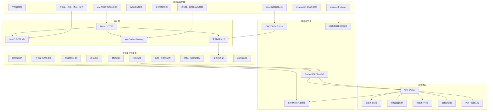

### 4.2 运行时组件

| 组件 | 职责 | 第一版形态 |
|---|---|---|
| Web 前端 | 教学管理、规划编辑、运行监控和复盘 | Vue 单页应用 |
| API 服务 | 认证、业务状态机、事务和 REST/WS | NestJS 单实例或多实例 |
| Worker | 验证、仿真、指标和文件作业 | 同镜像独立进程 |
| PostgreSQL/PostGIS | 权威业务数据、空间索引、作业和外盒 | 单主库 |
| 对象存储 | Word、图片、检查点、轨迹块和 PDF | MinIO 或本地适配器 |
| 文档服务 | 高保真 `.docx` 在线编辑 | ONLYOFFICE Docs |
| 地图服务 | 影像、地形、建筑和场景包资产 | 在线服务或校园离线服务 |

### 4.3 技术栈

| 层次 | 技术 |
|---|---|
| 前端 | Vue 3、TypeScript、Vite、Pinia、Element Plus、CesiumJS |
| API | Node.js、NestJS、TypeORM、Zod |
| 外部包校验 | JSON Schema、Ajv、SHA-256、Ed25519 签名 |
| 数据库 | PostgreSQL 17、PostGIS 3.5 |
| 计算 | TypeScript、Node Worker Thread 或独立 Node 进程 |
| Word | ONLYOFFICE Docs API，适配器支持替换 Collabora |
| PDF | 现有 PDFKit 继续用于结构化评价 PDF |
| 文件 | S3 兼容存储，开发环境可使用本地文件适配器 |
| 部署 | Docker Compose、Nginx、Linux |

### 4.4 代码仓库目标结构

```text
apps/
  web/
    src/
      app/
      modules/education/
      modules/resource-pack/
      modules/workspace-core/
      modules/show/
      modules/logistics/
      modules/runtime/
      modules/evaluation/
      modules/documents/
  server/
    src/
      identity/
      education/
      resources/
      regions/
      show-project/
      logistics-project/
      runtime/
      events/
      evaluation/
      files/
      audit/
  worker/
    src/
      job-runner/
      handlers/
packages/
  contracts/
  geometry/
  rule-engine/
  runtime-core/
  show-engine/
  logistics-engine/
  resource-pack-sdk/
  report-engine/
```

现有 `packages/shared` 和 `packages/simulation` 分阶段迁移，不要求一次性改名。新 V3 契约优先放入独立命名空间，避免与 V2 类型混用。

## 5. 前端系统设计

### 5.1 信息架构

教师端：

```text
教学首页
├── 实训任务库
├── 任务创建向导
├── 班级与学生
├── 学生进度
├── 评价与排行榜
├── 资源包状态
└── 实训工作台
```

学生端：

```text
双场景首页
├── 我的任务
│   ├── 城市编队表演
│   └── 城市低空物流
├── 消息公告
├── 排行榜
├── 帮助与引导
└── 场景项目工作台
```

平台名称默认显示“高巨低空集群虚拟仿真实训平台”，由部署配置提供学校定制名称、标识和关于信息，不允许学生或普通教师修改。

### 5.2 工作台壳

工作台壳只负责：

- 当前任务、学生项目和阶段导航；
- Cesium Viewer 生命周期；
- 左右面板、底部运行面板和移动端抽屉；
- 对象选中、地图定位和 2D/3D 视角；
- 自动保存、本地恢复和乐观锁；
- 时间轴、告警栏和 WebSocket 连接；
- 场景插件挂载和卸载。

工作台壳不得直接读取表演功能区或物流订单字段。

### 5.3 场景插件接口

```ts
interface ScenarioWorkspacePlugin<TConfig, TDraft, TRuntime> {
  code: "CITY_SHOW" | "CITY_LOGISTICS"
  stageDefinitions: StageDefinition[]
  createDraft(config: TConfig): TDraft
  validateDraft(draft: TDraft, context: ValidationContext): ValidationIssue[]
  mapLayers(context: WorkspaceContext<TDraft, TRuntime>): MapLayerDefinition[]
  tools(context: WorkspaceContext<TDraft, TRuntime>): WorkspaceTool[]
  panels(context: WorkspaceContext<TDraft, TRuntime>): PanelDefinition[]
  serializeDraft(draft: TDraft): unknown
  applyServerSnapshot(snapshot: unknown): TDraft
}
```

插件只调用工作台公开能力，不直接持有 Cesium Viewer 全局变量。

### 5.4 前端状态分层

| 状态 | 存储 | 说明 |
|---|---|---|
| 会话、角色、权限 | Pinia | 服务端为权威 |
| 任务和发布快照 | Pinia 查询缓存 | 不在客户端修改 |
| 当前草稿 | 场景 Store + IndexedDB | 带 revision 和 schemaVersion |
| 地图相机和图层 | 工作台 Store | 不进入业务提交 |
| 运行会话 | Runtime Store | 服务端快照加有序增量 |
| 告警和动作 | Runtime Store | 只通过命令 API 修改 |
| Word 编辑状态 | Document Store | 内容由文档服务管理，平台保存版本元数据 |

### 5.5 草稿和并发

- 每次保存携带 `revision`；
- 服务端返回 409 时前端加载服务端版本和本地版本进行明确选择；
- IndexedDB 按 `userId + projectId + stageCode + schemaVersion` 分区；
- 自动保存采用防抖，阶段提交前强制服务端保存；
- 考核阶段提交后删除可编辑本地草稿，仅保留只读快照；
- 多标签页使用 `BroadcastChannel` 提示冲突，不静默覆盖。

### 5.6 Cesium 交互

- 单工作台只创建一个 Viewer；
- 2D/3D 切换保持选中对象、图层、时间轴和当前关注区域；
- 左视、右视、俯视和正北视角围绕当前作业区域中心旋转；
- 绘制和移动统一使用命令对象，支持撤销和重做；
- 地图实体使用场景插件命名空间，避免 ID 冲突；
- 5000 架表演不创建 5000 个完整模型，使用分组点阵、聚合符号和范围图形；
- 物流最多 50 架可创建轻量图标，模型只对选中或跟随对象启用。

### 5.7 调度工作台

物流工作台采用四个联动区域：

- 订单池：筛选、排序、多选和状态；
- 无人机池：位置、电量、状态、任务队列和再次可用时间；
- 航线地图：主/备用航线、冲突、在航对象和事件；
- 任务时间轴：拖拽分配、起飞时刻、任务链和冲突提示。

时间轴拖拽只修改草稿，服务端检查完成后才能提交。批量调整使用显式确认并显示受影响订单、无人机和航线。

### 5.8 告警与运行面板

告警栏按级别、状态和时间排序，显示影响对象、剩余处置时间和允许动作。学生动作通过场景插件提供的白名单表单执行，不允许前端拼装任意命令参数。

WebSocket 断线时进入只读状态；重连后以 `lastSequence` 请求缺失增量，缺口过大时重新加载权威快照。

### 5.9 首次引导

引导定义由服务端按角色、场景和版本返回，每个角色保留 4 至 6 个关键步骤。前端步骤定位使用稳定 `data-guide-id`，不依赖 CSS 层级。用户可跳过并直接进入任务；升级后只触发新增或版本提升的引导。

## 6. 后端模块设计

### 6.1 模块划分

| 模块 | 核心职责 | 主要拥有数据 |
|---|---|---|
| `identity` | 登录、用户、内部管理员和权限 | users、sessions |
| `education` | 课程、班级、任务库、发布、进度、引导、排行 | courses、classes、assignments |
| `resources` | 资源包导入、校验、启用和版本兼容 | resource_packages |
| `regions` | 预设区域、专题图层和空间资源 | region_versions、region_layers |
| `show-project` | 区域规划、Word、飞前、报备和表演成果 | show_* |
| `logistics-project` | 配送点、航线、验证、订单、调度和重调度 | logistics_* |
| `runtime` | 会话、作业、检查点、推进和权威复放 | runtime_sessions、jobs |
| `events` | 事件脚本、实例、告警、动作和结果 | event_*、alerts |
| `evaluation` | 指标、量表、教师评分、PDF 和排行 | rubrics、grades |
| `files` | 文件元数据、对象存储、签名 URL 和文档回调 | assets、document_versions |
| `audit` | 操作审计、升级、备份和系统状态 | audit_logs、outbox_events |

### 6.2 模块依赖

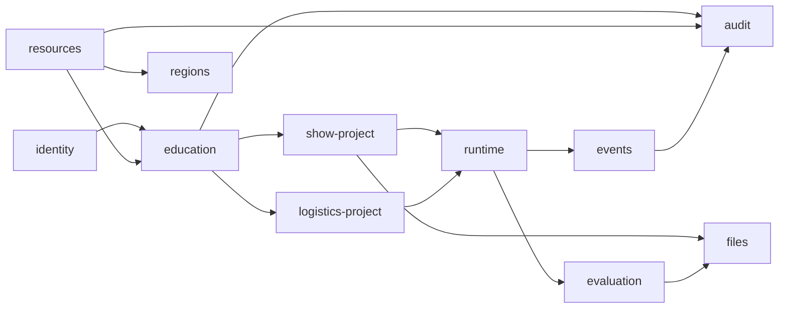

模块只能通过应用服务接口或领域事件调用下游能力。`evaluation` 不直接修改学生成果，`files` 不判断业务状态，`runtime` 不拥有教学发布权限。

### 6.3 应用服务

应用服务负责事务边界、授权、幂等、乐观锁和领域对象编排。典型服务包括：

- `PublishAssignmentService`；
- `SubmitStageService`；
- `ReturnStageSubmissionService`；
- `CreateShowRuntimeService`；
- `ValidateRoutePlanService`；
- `GenerateOrderBatchService`；
- `SubmitDispatchPlanService`；
- `SubmitRuntimeActionService`；
- `FinalizeStudentProjectService`；
- `PublishGradeService`；
- `ActivateResourcePackageService`。

### 6.4 领域事件和事务外盒

关键领域事件：

- `AssignmentPublished`；
- `StudentProjectStarted`；
- `StageSubmitted`；
- `StageReturned`；
- `RouteValidationRequested`；
- `RuntimeSegmentRequested`；
- `RuntimeWaitingAction`；
- `RuntimeCompleted`；
- `StudentProjectSubmitted`；
- `GradePublished`；
- `ResourcePackageActivated`。

事件与业务事务同时写入 `outbox_events`。后台发布器读取未处理事件，创建作业、生成文件或刷新排行。消费端使用事件 ID 幂等。

### 6.5 契约校验

- 内部 TypeScript 类型放入 `packages/contracts`；
- REST 输入输出使用 Zod 运行时校验；
- 资源包使用版本化 JSON Schema 和 Ajv 校验；
- 数据库 JSONB 快照保存 `schemaVersion`；
- Worker 在开始作业前再次校验输入，不信任 API 进程传入的任意 JSON。

## 7. 教学发布与阶段状态机

### 7.1 任务模板和发布快照

`ExerciseVersion` 只描述可复用模板。教师创建任务时形成 `AssignmentDraft`，选择模式、固定规模、区域、环境、事件、时间、发布范围和反馈策略。

模板的参考答案不是唯一航线或唯一调度结果，而是版本化保存硬约束、指标目标、参考流程和教师讲解。学生成果允许存在多种有效方案，参考内容仅对授权教师开放，不能随任务数据下发到学生端。

发布时创建 `AssignmentSnapshot`，完整冻结：

- 模板版本；
- 场景类型和阶段定义；
- 规则、区域、规模模板、机型、事件、文档和报告资源包版本；
- 教师可配置变量；
- 订单生成条件或表演运行条件；
- 评价量表；
- 训练/考核控制策略；
- 学生可见提示和结果展示策略。

### 7.2 任务状态

```text
DRAFT -> PUBLISHED -> ACTIVE -> ENDED -> ARCHIVED
DRAFT -> DELETED
PUBLISHED -> WITHDRAWN
```

- 未开始的已发布任务可撤回；
- 已有学生项目后不能删除，只能提前结束或归档；
- 考核任务开始后不可修改发布快照；
- 训练任务的教师手动干预进入审计日志，不改变发布快照。

### 7.3 学生项目状态

```text
NOT_STARTED -> IN_PROGRESS -> SUBMITTED -> EVALUATING -> GRADED
IN_PROGRESS -> BLOCKED
SUBMITTED -> RETURNED -> IN_PROGRESS
```

考核模式默认不允许 `SUBMITTED -> RETURNED`，除非发布快照预设补交策略。

### 7.4 阶段状态

```text
LOCKED -> AVAILABLE -> IN_PROGRESS -> SUBMITTED -> ACCEPTED
SUBMITTED -> RETURNED -> IN_PROGRESS
```

阶段定义包含：

- `stageCode`、顺序和场景；
- 前置阶段和开放条件；
- 允许动作；
- 是否支持版本和退回；
- 训练/考核差异；
- 提交检查器；
- 完成后触发的领域事件。

### 7.5 模式策略

模式差异封装为 `LearningModePolicy`，禁止散落在控制器和 Vue 模板中：

```ts
interface LearningModePolicy {
  canRetryValidation(context: StageContext): boolean
  canPauseRuntime(context: RuntimeContext): boolean
  canRestoreCheckpoint(context: RuntimeContext): boolean
  canReturnSubmission(context: ReviewContext): boolean
  feedbackVisibility(context: ResultContext): FeedbackVisibility
  allowedAttempts(context: AssignmentContext): number
}
```

### 7.6 课程、班级与学生管理

课程、班级和成员关系继续复用现有 `education` 模块。教师只能管理本人课程或被授权课程，任务发布支持班级和指定学生两种目标，发布时解析成不可变 `assignment_targets`。

CSV 导入采用“上传、解析预览、确认写入”三步：

1. 服务端校验编码、表头、行数、账号唯一性和必填字段；
2. 返回成功行、失败行、错误代码和可下载的失败明细，不因部分错误静默丢行；
3. 教师确认后以事务或可恢复批次创建账号和班级成员，重复账号按明确策略关联或拒绝。

教师进度投影按学生、阶段、最后活动、提交状态、当前告警、评价状态和成绩建立筛选字段。投影可异步刷新，但打开学生详情时重新读取权威项目状态。

## 8. 运行编排与确定性设计

### 8.1 运行类型

| 运行类型 | 用途 | 是否交互 |
|---|---|---|
| `ROUTE_VALIDATION` | 物流单条或多条往返航线验证 | 否 |
| `SHOW_TRAINING` | 表演固定程序与事件处置 | 是 |
| `LOGISTICS_TRAINING` | 物流配送、事件和重调度 | 是 |
| `AUTHORITATIVE_REPLAY` | 最终提交后的权威复放 | 否，复用动作序列 |
| `REPORT_RENDER` | 规划图、摘要图和 PDF 生成 | 否 |

### 8.2 会话状态

```text
CREATED -> QUEUED -> RUNNING -> WAITING_ACTION -> QUEUED
RUNNING -> PAUSED -> QUEUED
RUNNING -> COMPLETED
CREATED/QUEUED/RUNNING -> FAILED
WAITING_ACTION -> EXPIRED -> QUEUED
```

### 8.3 分段运行

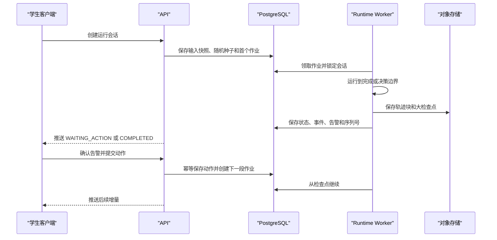

Worker 到达决策边界后退出作业，不占用线程等待学生。下一段运行从检查点恢复；检查点不可用时从初始输入和动作序列确定性重放。

### 8.4 作业表

`simulation_jobs` 关键字段：

- `id`、`jobType`、`sessionId`、`status`；
- `priority`、`availableAt`、`attempts`、`maxAttempts`；
- `lockedBy`、`lockedAt`、`heartbeatAt`；
- `inputAssetId`、`resultAssetId`、`errorCode`；
- `createdAt`、`startedAt`、`finishedAt`。

Worker 心跳超时后作业可被重新领取。作业处理必须幂等，结果提交使用会话 revision 防止双写。

### 8.5 检查点

检查点包含：

- 仿真时间和固定步长；
- 引擎、插件和 schema 版本；
- 随机数生成器状态；
- 表演分组或物流无人机状态；
- 航线、订单、任务和事件状态；
- 告警状态和指标累积器；
- 已消费动作序列号。

小检查点可压缩保存为 JSONB，大检查点使用压缩二进制保存到对象存储，数据库保存 SHA-256 和资产引用。

### 8.6 WebSocket 增量

每个运行增量包含 `sessionId`、`sequence`、`simulationTimeMs`、`type` 和 `payload`。客户端按 sequence 应用，不允许乱序覆盖。

事件类型：

- `session.state`；
- `runtime.snapshot`；
- `runtime.delta`；
- `event.triggered`；
- `event.updated`；
- `alert.created`；
- `alert.updated`；
- `action.accepted`；
- `job.progress`；
- `runtime.completed`；
- `runtime.failed`。

### 8.7 权威复放

最终提交不直接使用训练会话的临时结果。服务端冻结学生最终成果和动作序列，创建 `AUTHORITATIVE_REPLAY`，重新执行全部规则和指标。评价只引用权威复放输出。

## 9. 资源包与区域设计

### 9.1 资源包格式

资源包使用 ZIP，根目录必须包含 `manifest.json`：

```json
{
  "packageId": "show-rules-cn-v1",
  "packageType": "RULE",
  "version": "1.0.0",
  "schemaVersion": 1,
  "minimumPlatformVersion": "0.3.0",
  "files": [
    {
      "path": "rules/show-rules.json",
      "sha256": "0123456789abcdef0123456789abcdef0123456789abcdef0123456789abcdef",
      "size": 8192
    }
  ],
  "signatureAlgorithm": "Ed25519",
  "signatureKeyId": "vendor-release-2026"
}
```

生产包必须验证清单、路径安全、文件大小、SHA-256、签名、平台兼容和依赖版本。包内禁止可执行脚本和路径穿越。

### 9.2 资源包状态

```text
UPLOADED -> VALIDATING -> STAGED -> ACTIVE
VALIDATING -> REJECTED
ACTIVE -> RETIRED
```

同一资源类型可存在多个版本，但新任务只引用当前启用版本。历史任务继续引用原版本，退役不删除资产。

### 9.3 规则执行边界

资源包只保存声明式规则参数、阈值、映射和参考处置。可执行规则函数必须由代码注册：

```ts
interface RuleDefinition {
  code: string
  version: string
  supportedScenarios: ScenarioCode[]
  validateConfig(config: unknown): ValidationIssue[]
  evaluate(context: RuleContext, config: unknown): RuleEvidence[]
}
```

数据库和资源包不得保存并执行 JavaScript 表达式。

### 9.4 区域包

区域包包含：

- WGS84 区域边界；
- 建筑和障碍物轮廓、高度与来源；
- 道路、水域、绿地和公共空间；
- 禁用区、限制区、最大高度和风险区；
- 定位、通信和电磁覆盖栅格或矢量；
- 表演观众条件、应急通道和起降候选位置；
- 物流中心机场、候选配送点、等待区和备降区；
- 影像、地形和 3D Tiles 引用及版权归属。

### 9.5 空间存储

- 区域边界和专题图层使用 PostGIS SRID 4326；
- 高度属性独立保存 `heightDatum`、`groundHeightMeters` 和来源；
- 大体量矢量和瓦片放入对象存储或地图服务，数据库保存范围和资产引用；
- 空间对象建立 GiST 索引；
- 发布快照记录区域包版本和用于评分的高度采样版本。

### 9.6 资源包激活

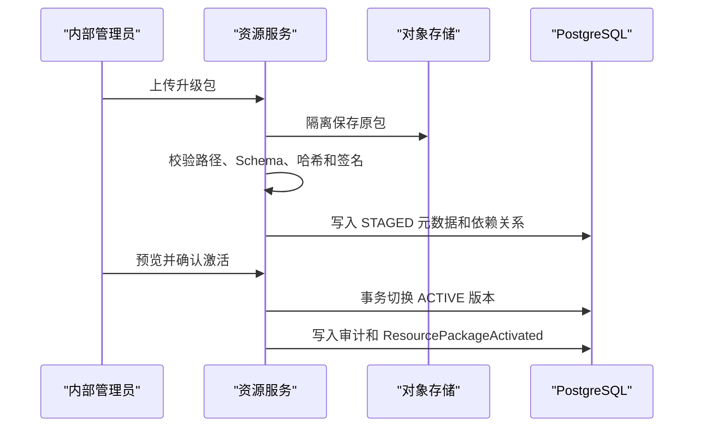

激活不修改已发布任务。已发布未开始任务可由教师显式复制为新版本，不能静默切换。

## 10. 城市编队表演子系统设计

### 10.1 领域边界

表演子系统负责区域规划、申报文件、飞前检查、动态报备、固定程序运行和技术事件处置。它不保存舞步文件，不生成图案、灯光或音乐，不向学生暴露逐机轨迹编辑能力。

表演任务发布快照至少冻结：

- 预设区域版本；
- 100/500/1000/3000/5000 架固定规模模板版本；
- 统一机型参数版本；
- 四类技术事件脚本版本；
- 三份 Word 模板版本；
- 规则包和评价量表版本；
- 模式、时间、允许重试和补交策略。

### 10.2 九类功能区模型

`ShowAreaPlanVersion` 使用一个版本头和多条 `ShowAreaFeature` 保存规划成果。功能区类型固定为：

| 类型代码 | 名称 | 几何类型 | 关键属性 |
|---|---|---|---|
| `TAKEOFF_LANDING` | 起降区 | 面 | 容量、朝向、地面高程 |
| `FLIGHT` | 飞行区 | 面/立体范围 | 最低和最高 AGL |
| `PERFORMANCE` | 表演区 | 面/立体范围 | 表演朝向、参考中心 |
| `BUFFER` | 缓冲区 | 面 | 参考宽度、关联区域 |
| `GROUND_ISOLATION` | 地面隔离区 | 面 | 隔离用途 |
| `AUDIENCE` | 观众区 | 面 | 朝向、参考人数等级 |
| `OPERATION` | 操作区 | 面 | 地面站用途 |
| `EMERGENCY_LANDING` | 应急降落区 | 面 | 可用条件、容量等级 |
| `GEOFENCE` | 电子围栏 | 面/立体范围 | 下限、上限、围栏策略 |

所有几何均保存 WGS84 源数据。高度单独保存基准和值，不在 GeoJSON 第三维中隐式混用。每条要素包含 `id`、`type`、`geometry`、`properties`、`label`、`sourceRevision` 和 `updatedBy`。

编辑命令以 `ADD_FEATURE`、`UPDATE_GEOMETRY`、`UPDATE_PROPERTIES`、`DELETE_FEATURE` 为最小单位进入撤销栈。自动保存写入当前草稿；手动保存、提交和教师退回后的再次提交生成不可变版本。

绘制工具提供矩形和多边形两种建面方式，并提供顶点编辑、整体移动、距离、面积、高度、方向、坐标查看和文字标注。测量结果可作为要素属性或教师批注保存，但临时量尺不自动进入正式成果。

### 10.3 区域检查与提交

区域检查分为三层：

1. 几何有效性：自相交、空几何、顶点数量、重复点和区域边界；
2. 空间关系提示：功能区重叠、参考缓冲不足、观众区与飞行区关系、应急区可达性；
3. 成果完整性：九类区域是否齐全、必要属性是否填写、规划图是否生成。

系统对参考缓冲和位置关系仅输出 `CONFLICT`、`RISK` 或 `INFO` 证据，不自动给出行政合规结论。提交门禁只阻止几何无效、超出任务区域、必需区域缺失等明确硬性问题。

教师审核页同时加载提交版本的源几何、规划图、面积统计和位置关系证据。教师可在地图或成果图上批注、退回并按量表评分，但不能直接拖动或改写学生区域。

### 10.4 规划图生成

规划图由服务端文件作业生成，输入为已提交区域版本和冻结的区域包。输出 PNG 和可嵌入 PDF 的高分辨率图片，包含：

- 任务名称、学生、区域和版本；
- 九类功能区图例；
- 指北针、比例尺、坐标格网或关键坐标；
- 区域边界、限制区和必要底图；
- 生成时间、数据版本和教学仿真声明。

生成作业不依赖浏览器当前视口截图。底图不可用时必须失败或使用任务快照中声明的离线底图，不得静默换源。`planningMapAssetId` 与区域版本绑定，几何修改后原图保留但标记为旧版本。

### 10.5 固定规模与分组模型

固定规模由 `ShowScaleTemplate` 定义，教师只能选择模板，不得输入任意架数。模板配置包括总架数、默认分组、事件数量范围、最大并发事件、开放动作和聚合显示层级。

```ts
interface ShowGroupState {
  groupId: string
  parentGroupId?: string
  plannedCount: number
  airborneCount: number
  landedCount: number
  normalCount: number
  warningCount: number
  abnormalCount: number
  lostCount: number
  phase: ShowProgramPhase
  representativePosition: GeoPoint3D
  extentMeters: { east: number; north: number; up: number }
}
```

运行引擎按组和计数推进状态。仅当事件影响单架或小批量且模板允许时，创建有限数量的 `ShowUnitExceptionState` 作为异常明细；其余无人机不创建逐架动力学实体。

### 10.6 飞前检查和起飞决策

`PreflightChecklistVersion` 包含无人机、地面系统、定位通信、气象、场地区域、申报保障六组检查项。每项记录状态、说明、证据附件、检查人、真实时间和仿真时间。

检查状态为：

```text
NOT_CHECKED -> PASS | ISSUE_FOUND | NOT_APPLICABLE
ISSUE_FOUND -> RECTIFIED -> PASS
```

全部必检项有结论后，学生选择 `ALLOW`、`ALLOW_AFTER_RECTIFICATION`、`DELAY` 或 `CANCEL`，并填写依据。系统只校验流程完整性和明确硬约束，不替学生作出起飞决策。

### 10.7 动态报备状态

动态报备使用 `DynamicReport` 保存类型、项目快照、环境快照、数量、学生确认、真实时间和仿真时间：

| 报备类型 | 开放条件 | 提交效果 |
|---|---|---|
| `T_MINUS_60` | 区域、三份申报文件和飞前阶段完成，仿真到达 T-60 | 锁定 T-60 项目和环境快照 |
| `ACTUAL_TAKEOFF` | T-60 已提交且起飞决策允许 | 启动固定程序并记录实际起飞动态 |
| `FLIGHT_END` | 程序完成且学生确认降落数量 | 完成运行报备并开放复盘 |

报备不调用真实审批或报备接口。重复请求使用 `idempotencyKey` 返回同一结果；考核模式提交后不可修改，训练模式只能通过退回产生新修订。

### 10.8 固定程序状态机

```text
WAITING_TAKEOFF
  -> TAKEOFF_PREPARATION
  -> BATCH_TAKEOFF
  -> TRANSIT_TO_SHOW_AREA
  -> PERFORMANCE_RUNNING
  -> RETURN_TO_TAKEOFF_AREA
  -> BATCH_LANDING
  -> SHOW_COMPLETED
```

暂停不改变程序主阶段，而是设置运行会话 `PAUSED` 并记录暂停原因。中止后根据动作进入返航、分区降落或整体应急降落子状态，完成后进入 `SHOW_ABORTED`，不得伪装为正常完成。

### 10.9 表演事件和动作

事件类别固定为 `WEATHER`、`POSITIONING_EM`、`COMMUNICATION_CONTROL` 和 `AIRCRAFT_DEVICE`。事件定义通过规模模板限制影响范围、可见信息、升级路径和可用动作。

可用动作包括：

- 暂停后续起飞；
- 暂停表演；
- 中止表演；
- 单架或小批量降落；
- 分组返航；
- 分区降落；
- 整体返航；
- 整体应急降落。

动作校验器根据程序阶段、影响对象、模板能力和当前状态返回允许性。消防、医疗、人员伤害、安保和行政指令不注册到 V3 第一版事件目录。

### 10.10 5000 架显示与性能

前端使用聚合图形表达机群范围、分组中心、数量和状态，不创建 5000 个持续更新的 Cesium `Entity`：

- 总览层显示机群包络、程序航向和分组数量；
- 中等缩放显示有限分组标记；
- 选中异常分组时才显示有限异常明细；
- 位置缓冲区使用 TypedArray，按固定频率批量更新；
- 运行状态与地图绘制解耦，地图降帧不影响仿真时间；
- 非关键统计以 2 至 5 Hz 推送，事件和告警立即推送。

性能验收以 5000 架模板的完整事件链为准，监控主线程长任务、Cesium 帧率、内存峰值、WebSocket 带宽和 Worker 单步耗时。

## 11. Word 文档子系统设计

### 11.1 技术选型

V3 默认使用自托管 ONLYOFFICE Docs 保持 `.docx` 原模板版式，并通过 `DocumentEditorAdapter` 隔离厂商接口。若学校采用 Collabora，可实现同一适配器，不影响领域状态和文件版本模型。

```ts
interface DocumentEditorAdapter {
  createSession(input: EditorSessionInput): Promise<EditorSessionConfig>
  verifyCallback(input: EditorCallback): VerifiedEditorCallback
  requestForceSave(documentKey: string): Promise<void>
  convertToPdf(assetId: string): Promise<FileAssetRef>
  closeSession(documentKey: string): Promise<void>
}
```

浏览器只加载编辑器 SDK 和短期会话配置，不能直接访问对象存储凭证。

### 11.2 文档实例和版本

任务发布时不为全班立即复制二进制文件。学生首次进入表演项目时，系统从任务冻结的三份母版按需创建三个 `ApplicationDocument`，每个学生、任务和文档类型唯一。

`ApplicationDocument` 保存：

- 文档类型和模板包版本；
- 当前草稿资产、最新提交资产和当前 revision；
- 编辑、提交、退回和锁定状态；
- 当前 `documentKey`、打开会话和最后回调时间；
- 教师批注摘要和关联评分项。

文档状态为：

```text
DRAFT -> SUBMITTED -> ACCEPTED
SUBMITTED -> RETURNED -> DRAFT
SUBMITTED -> LOCKED
DRAFT -> LOCKED
```

`ACCEPTED` 表示教师流程确认，不表示真实行政审批。考核模式提交后进入 `LOCKED`；训练模式按退回策略流转。

### 11.3 编辑会话流程

Word 工作区由文档标签、原版式编辑器和只读参数侧栏组成。侧栏显示任务说明、项目参数、区域规划图、关键坐标、高度基准、固定模板架数和当前版本；点击坐标或区域可联动查看，但侧栏数据不能直接覆盖 Word 内容。文字、表格单元格、复制粘贴、撤销重做、加粗、对齐和基础段落能力由编辑器原生工具栏提供。

打印预览调用文档服务生成的预览或 PDF 转换结果，`.docx` 导出始终下载当前已确认的服务端 revision，不能导出仍停留在浏览器缓冲区的未保存内容。

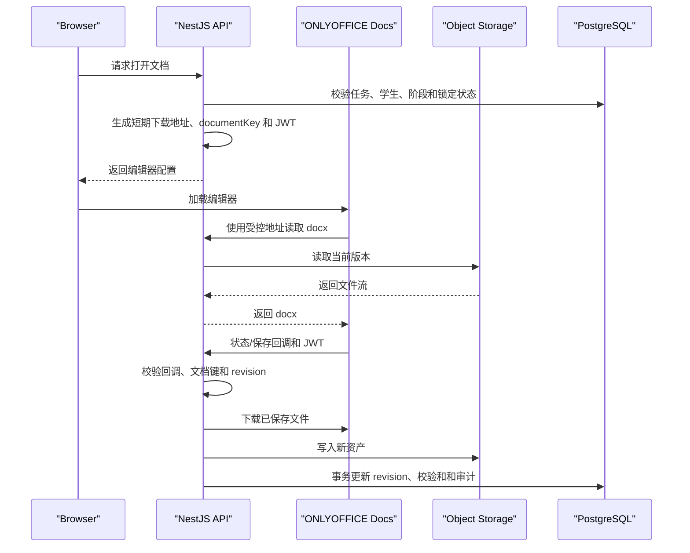

ONLYOFFICE 回调地址只暴露给文档服务网络，必须验证 JWT、文档键、预期状态和下载来源。回调处理采用 `(documentId, documentKey, callbackStatus, sourceUrlHash)` 幂等键。

### 11.4 文档键与保存策略

`documentKey` 由文档 ID、基础 revision 和随机 nonce 组成，长度满足编辑器限制。新提交、教师退回或显式恢复旧版本后必须生成新键，禁止旧编辑会话覆盖新版本。

- 编辑器自动保存负责协作缓冲；
- 服务端每 60 至 120 秒请求一次 force-save，具体间隔可配置；
- 手动保存立即 force-save，并在回调成功后向用户确认；
- 阶段提交前先 force-save，等待资产落库后再原子提交；
- 编辑器异常关闭时保留最后已确认 revision，并提示未确认内容风险。

页面上的“已保存”仅在服务端资产和数据库 revision 均提交成功后显示。

### 11.5 提交、退回和版本对比

三份文档独立提交。飞行申报阶段只有在三份文档均为 `SUBMITTED`、`ACCEPTED` 或 `LOCKED` 时完成。

教师退回必须填写原因并引用被退回 revision。学生修改形成新 revision，不覆盖原提交。版本对比优先调用编辑器原生比较能力；不可用时至少提供两个版本下载、修改人、时间、大小和校验和，不承诺服务端语义差异判断。

系统仅自动判断文件存在、可打开、模板类型匹配和是否提交，不自动审批文字正确性、完整性或行政合规性。

### 11.6 存储与访问控制

每个文件版本作为不可变 `FileAsset` 保存到 MinIO/S3 兼容对象存储：

```text
tenant/{tenantId}/assignments/{assignmentId}/students/{studentId}/documents/{documentId}/{revision}.docx
```

对象默认私有，API 使用短期签名 URL 或受控流式代理。学生只能访问本人当前任务文档；教师只能访问所授课程和任务文档；内部管理员访问内容必须有运维原因并进入审计。

文件记录包含 MIME、扩展名、大小、SHA-256、对象版本、创建者、来源模板、病毒扫描状态和保留策略。模板上传必须验证 OOXML 容器、限制解压大小和嵌入对象，不允许宏文件作为三份正式母版。

### 11.7 可用性和降级

文档服务不可用时：

- 已保存文件仍允许在有权限时下载；
- 新编辑会话显示明确故障状态，不降级成破坏版式的 HTML 表单；
- 保存回调进入重试队列并告警；
- 考核任务不因系统故障扣分，故障区间进入审计和教师处置记录；
- 文档阶段是否延期由教师显式处理。

### 11.8 过程文件与最终文件边界

三份 Word 是表演项目过程成果，各自保留版本和审核记录。最终评价只生成一个 PDF，PDF 可引用三份 Word 的文件名、提交版本和教师评价摘要，但不替代或合并原 `.docx` 文件。

## 12. 城市低空物流子系统设计

### 12.1 领域边界

物流子系统采用固定机场、候选配送点、统一机型、学生规划固定航线、系统批量生成订单和学生调度运行的模型。第一版实体和 API 不含货物重量、货物类型、载荷匹配、装卸、签收、仓储或机场容量字段。

任务发布快照冻结机群规模模板、区域、统一机型、候选节点、订单生成条件、事件脚本、规则包和评价量表。订单批次在发布前预生成并预览，发布后锁定。

### 12.2 固定规模模板

`LogisticsScaleTemplate` 仅允许 3/5/10/20/50 架，配置配送点范围、订单范围、并发能力、备用方案要求、事件数量和批量操作能力。模板校验器拒绝模板外架数和超出候选数量的配送点选择。

### 12.3 物流节点

`LogisticsNode` 类型包括：

| 类型 | 来源 | 是否学生可选 |
|---|---|---|
| `CENTRAL_AIRPORT` | 区域包固定 | 否，任务唯一 |
| `DELIVERY_POINT` | 教师从区域包候选集中开放 | 学生确认启用 |
| `WAITING_POINT` | 区域包候选或学生方案 | 是 |
| `ALTERNATE_LANDING` | 区域包候选或学生方案 | 是 |
| `EMERGENCY_AREA` | 区域包或学生规划 | 是 |

节点保存位置、高度基准、可用条件、覆盖引用和区域版本。运行中配送点不可用通过事件状态覆盖，不修改节点基础版本。

### 12.4 航线版本模型

每个启用配送点必须至少有一条正式去程和一条正式返程航线。`RoutePlanVersion` 包含：

- `deliveryPointId`、`direction` 和 `variantType`；
- 有序航点和航段高度/速度约束；
- 进离场方向、等待点和备降点引用；
- 航线保护范围和应急运行区域；
- 来源版本、草稿 revision 和提交状态；
- 适用区域、机型、规则和地形采样版本。

`variantType` 为 `PRIMARY` 或 `ALTERNATE`。去程复制为返程只创建新的草稿基础方案，必须反转并重新检查高度、方向、节点关系和覆盖，不能直接视为已验证返程。

航线编辑器支持航点增删移动、单点/航段高度修改、批量高度调整、航线复制、按配送点或方向分组，以及等待点和备降点复用。每个编辑命令进入撤销栈，自动保存、手动保存和版本快照沿用工作台统一草稿机制。

运行只允许引用状态为 `VALIDATED` 且属于本学生当前任务快照的航线版本。航线修改后产生新版本，旧调度仍引用旧版本但不得用于新运行。

### 12.5 航线检查

检查器返回统一证据结构：

```ts
interface ValidationEvidence {
  code: string
  classification: 'HARD_CONFLICT' | 'RISK' | 'EFFICIENCY'
  objectRefs: string[]
  geometry?: GeoJSON.Geometry
  measuredValue?: number
  thresholdRef?: string
  messageKey: string
}
```

硬性冲突包括超界、进入禁用区、穿越建筑、超出机型能力、关键覆盖缺失、必要备降缺失和不可接受的多航线冲突。风险和效率问题允许提交，但必须进入版本摘要、复盘和评价证据。

浏览器预检用于即时反馈，服务端以冻结规则、地形和区域版本重新执行权威检查。两者结果不一致时以服务端为准并显示版本信息。

### 12.6 往返验证

`RouteValidationRun` 输入为去程版本、返程版本、机型版本、环境快照和随机种子，状态为：

```text
QUEUED -> RUNNING -> PASSED | PASSED_WITH_RISKS | FAILED | SYSTEM_ERROR
```

验证模拟机场起飞、去程、到达确认、返程和机场降落，输出航程、时间、电量、最低余量、高度、覆盖、偏差、等待/备降可达性和节点状态。`SYSTEM_ERROR` 与业务失败分开，不得形成学生扣分证据。

### 12.7 订单批次

教师配置订单数量、配送点分布、普通/优先/加急比例、时间窗口和释放方式。订单生成器使用确定性伪随机数：

```text
seed = HMAC(platformSecretVersion, assignmentDraftId + generationRevision)
```

发布前每次重新生成增加 `generationRevision` 并产生新预览批次。发布时冻结最终 `OrderBatch`、种子、生成器版本、条件和订单列表。学生不得修改配送点、优先级、释放时间、最早执行和最晚到达等原始属性。

运行中新增、取消、优先级变化和配送点不可用由 `OrderEventEffect` 产生运行态覆盖，保留原始订单值和变更来源。

### 12.8 初始调度方案

`DispatchPlanVersion` 保存订单、无人机、已验证航线和计划起飞时间之间的分配关系。无人机实例由模板在学生项目创建时生成，仅保存编号、机型引用和初始状态，不含载荷属性。

提交前执行：

- 订单是否完整分配；
- 航线是否属于当前任务且已验证；
- 同一无人机时间占用是否重叠；
- 电量和再次可用时间是否满足；
- 航线间时空冲突是否可接受；
- 时间窗口和任务状态是否有效。

提交形成不可变版本。考核模式不得回退；训练模式只能以新版本修改，已运行版本始终保留。

### 12.9 调度时间轴

时间轴以服务端计算的任务段为权威来源，显示 `WAITING`、`TAKEOFF`、`OUTBOUND`、`ARRIVAL`、`RETURN`、`LANDING` 和 `AVAILABLE_AGAIN`。拖拽、订单转移和批量调整先生成前端命令，再由服务端返回新的预测段和冲突证据。

订单池支持按释放时间、优先级、最晚到达和状态排序。运行中动态插单先进入未分配队列，学生可将订单转移给其他可用无人机；任何排序只改变视图，只有显式分配或重调度命令才改变方案。

20 架及以上开放按航线、配送点、优先级或无人机分组批量调整；50 架开放全局重排辅助操作，但系统不自动生成所谓最优方案。批量命令必须展示影响订单数和冲突预览后再确认。

### 12.10 配送运行状态机

无人机状态：

```text
STANDBY -> ASSIGNED -> TAKEOFF -> OUTBOUND -> ARRIVED
ARRIVED -> RETURNING -> LANDING -> AVAILABLE_AGAIN -> STANDBY
任一运行态 -> ABNORMAL | DISABLED
```

订单状态：

```text
UNRELEASED -> PENDING_ASSIGNMENT -> ASSIGNED -> WAITING_TAKEOFF
-> OUTBOUND -> ARRIVED -> RETURNING -> COMPLETED
任一未完成态 -> EXPECTED_DELAY | DELAYED | FAILED | CANCELLED
```

机场和配送点持续可见，但不计算停机位、装卸、签收、地面周转或机场容量。到达确认仅表示教学仿真中的飞行任务到达节点。

### 12.11 动态重调度

运行事件可以影响气象环境、定位导航、通信链路、设备、航线条件和订单。学生提交 `RescheduleCommand` 执行继续监控、减速、悬停、等待、返航、备降、迫降、中止任务、暂停/恢复航线、切换已验证备用方案、更换无人机、转移订单、调整运行优先级或批量重调度。

服务端以当前检查点 revision 校验命令；若状态已推进，返回 `409 REVISION_CONFLICT` 和最新影响摘要。接受的命令形成不可变 `RescheduleRevision`，记录变更前后任务、预计延迟、冲突、学生依据和动作时机，并触发下一运行分段。

### 12.12 物流运行指标

客观指标至少包括：准时完成率、平均/最大延迟、订单失败数、无人机利用率、空驶时间、航程和电量余量、硬性冲突残留、风险暴露时长、告警发现时间、首次动作时间、恢复时间和连锁延迟。指标只描述结果，不直接替代教师对方案思路和处置合理性的评价。

## 13. 几何、Cesium 与 DEM 设计

### 13.1 坐标与高度约定

- 持久化经纬度统一使用 WGS84，经度在前、纬度在后；
- PostGIS 空间列使用 SRID 4326；
- 局部距离、缓冲、碰撞和时空隔离计算使用任务区域原点建立的 ENU；
- 跨区域或长距离转换使用 ECEF，禁止直接将经纬度差当米；
- 每个高度值必须携带 `heightReference`：`AGL`、`ELLIPSOID` 或经资源包定义的 `MSL`；
- Cesium 内部椭球高不得直接当作学生设置的相对地面高度。

### 13.2 DEM 接入

DEM 可以接入，且现有 Cesium 能力可复用，但评分场景必须版本化。`TerrainProviderAdapter` 支持在线 Cesium Terrain、校园离线量化网格和服务端 DEM 栅格三种来源。

```ts
interface TerrainSnapshot {
  terrainResourceId: string
  version: string
  verticalDatum: string
  sampledAt: string
  sampleAlgorithmVersion: string
  samplesAssetId: string
  sha256: string
}
```

学生提交区域或航线时，服务端按顶点、航段间隔点和关键障碍周边采样高程，形成不可变 `TerrainSnapshot`。后续权威检查和复放读取该快照，不再次依赖在线地形。在线地形仅用于实时视觉辅助时，界面必须标记资源状态。

### 13.3 静态空间检查

PostGIS 负责区域包含、面相交、缓冲关系、建筑和限制区粗筛：

- `ST_IsValid` 校验几何；
- `ST_Covers` 校验任务边界；
- `ST_Intersects` 和 GiST 索引筛选候选冲突；
- 对距离敏感的小范围对象转换到区域适用的投影坐标系或 ENU 后计算；
- 复杂三维关系由服务端几何内核在 ENU 中使用建筑高度和航段高度精算。

数据库检查不得混用 4326 角度距离和米制阈值。

### 13.4 航段三维检查

航段按规则定义的最大采样间隔离散，并在 ENU 中计算：

- 航迹 AGL 与地面/建筑净空；
- 航段是否穿越立体限制区；
- 去返程航线之间的水平、垂直和时间隔离；
- 等待点、备降点和应急区的可达性；
- 航程、速度、电量和覆盖连续性。

采样间隔、插值方法、建筑高度来源和容差均来自冻结规则版本。检查结果保存测量值、阈值引用和证据几何。

### 13.5 2D/3D 一致性

应用始终复用同一个 Cesium Viewer 和同一份领域选择状态。2D/3D 切换只改变 SceneMode、相机姿态和可见图层，不复制业务对象。

切换前保存：

- 当前选中对象；
- 视口中心的地表交点；
- 可视范围或相机到中心距离；
- 左右观察方位、倾角和缩放层级。

切换后围绕同一地表中心恢复相近范围。左右视角是围绕当前中心按固定方位角旋转，不把经纬度误传为笛卡尔坐标，也不调用无关区域的 `flyTo`。相机目标无法与地表求交时，退回任务区域中心并显示提示。

### 13.6 地图资源故障策略

每种影像、地形和 3D Tiles 资源都有 `LOADING`、`READY`、`DEGRADED` 和 `UNAVAILABLE` 状态。故障回退顺序由区域包明确配置，并在任务快照中记录。任何影响评分依据的回退都要求重新生成检查版本或由教师确认，不允许静默切换。

### 13.7 前端绘制稳定性

Cesium 绘制命令与 Vue 响应式对象隔离。提交 API 前使用 DTO 显式序列化，不对包含 Proxy、Cesium 类实例或函数的对象直接调用 `structuredClone`。草稿保存只包含纯 JSON 几何、样式键和业务属性，避免再次出现不可克隆对象导致发布或绘制失败。

## 14. 事件、告警、规则与评价设计

### 14.1 事件实例状态机

```text
SCHEDULED -> OCCURRED_UNDETECTED -> DETECTED -> HANDLING
HANDLING -> CONTROLLED -> ENDED
OCCURRED_UNDETECTED | DETECTED | HANDLING -> ESCALATED
ESCALATED -> HANDLING | CONTROLLED | ENDED
```

事件触发由仿真时间、程序阶段、状态条件或关联事件决定。信息可见性控制学生何时能观察到征兆、告警和完整影响，系统内部始终保存真实事件状态。

### 14.2 告警状态机

告警级别为 `INFO`、`NORMAL`、`IMPORTANT` 和 `EMERGENCY`，状态为：

```text
UNACKNOWLEDGED -> ACKNOWLEDGED -> HANDLING -> CLEARED
HANDLING -> HANDLING_FAILED
UNACKNOWLEDGED | ACKNOWLEDGED -> EXPIRED
```

一个事件可产生多个对象级或聚合告警。确认告警不等于成功处置；解除必须由事件恢复条件或规则证据触发。系统运行故障使用独立 `SystemIncident`，绝不映射为学生业务告警。

### 14.3 学生动作和结果

每次动作包含 `actionId`、会话、序列号、操作者、仿真时间、告警、作用对象、动作类型、参数、依据和客户端幂等键。动作处理分三步：

1. 按场景、模板、阶段和对象状态校验合法性；
2. 计算立即状态变化并写入 `ActionOutcome`；
3. 创建下一运行分段，由 Worker 计算后续影响、恢复或升级。

拒绝动作也保留审计，但不进入权威动作序列；因网络重试产生的同一幂等键只接受一次。

### 14.4 规则结果分类

规则引擎强制区分：

| 分类 | 对流程影响 | 对评价影响 |
|---|---|---|
| `HARD_CONFLICT` | 阻止提交、验证或启动 | 记录未解决和修改次数 |
| `RISK` | 允许继续并要求确认 | 统计暴露、处置和后果 |
| `EFFICIENCY` | 不阻止 | 用于方案比较和教师判断 |
| `RUNTIME_ALERT` | 运行中要求识别和动作 | 评价发现、响应、动作和恢复 |
| `SYSTEM_INCIDENT` | 按故障策略暂停或重试 | 不扣学生分 |

规划阶段规则问题不得直接冒充运行告警。所有证据引用规则代码、规则包版本、对象、测量值、阈值和仿真时间。

### 14.5 评价模型

`RubricVersion` 定义维度、权重、指标映射、教师评分范围和必要硬约束。建议维度为规划与完整性、检查与验证、运行组织、安全与风险、应急处置、效率、复盘和文档质量，具体权重由供应方量表包和教师任务选择冻结。

自动统计只处理可计算证据：

- 阶段和成果完整性；
- 航线检查、往返验证和调度冲突；
- 时间窗、完成率、延迟、电量和利用率；
- 事件发现时间、动作延迟、合法动作、恢复和次生后果；
- 提交、修改、重试和考核操作次数。

教师评价区域规划、申报内容、方案思路、决策合理性和复盘质量。最终成绩必须由教师确认后才能发布。

### 14.6 应急处置评分

应急分不得再固定满分。每个事件生成证据向量：

```text
detection + acknowledgement + response latency + action legality
+ action suitability + escalation avoided + recovery quality + collateral impact
```

量表可将客观指标映射为建议分，但教师可在允许范围内复核并填写理由。事件未触发、系统故障或学生不可见时，不按未处置扣分。过度处置和处置不足分别记录，不能只按“是否点击按钮”评分。

### 14.7 评价修订

评价状态为：

```text
AUTO_STATISTICS_READY -> TEACHER_REVIEWED -> PUBLISHED
PUBLISHED -> SUPERSEDED_BY_NEW_REVISION
```

发布后修改成绩必须创建新的 `GradeRevision`，记录变更原因、旧值、新值和操作者。每个修订可生成一份 PDF，但同一时刻只有一个 active 最终评价文件，历史 PDF 只读保留。

### 14.8 复盘时间轴

复盘从权威运行事件流构建，统一展示任务阶段、程序/任务状态、事件、告警、动作、系统响应和指标节点。二维/三维地图与时间轴使用同一 `simulationTimeMs` 定位。

关键标记包括事件发生、学生可见、首次确认、首次动作、关键决策、控制、升级、恢复和结束。教师批注绑定会话、序列号、对象引用和地图视角，可用于课堂讲评但不修改原始运行记录。

### 14.9 排行榜

排行榜只读取教师已发布且 active 的最终成绩。范围固定为单任务、单班级，教师可关闭、设置展示人数和脱敏规则。

排序依次为：

1. 最终总分降序；
2. 严重安全问题数升序；
3. 应急处置分降序；
4. 任务完成用时升序；
5. 最终提交时间升序；
6. 学生 ID 稳定排序。

排行榜是教学展示，不引入竞赛房间、实时对战或额外竞赛模式。

## 15. 文件与成果设计

### 15.1 统一文件资产

所有 Word、规划图、航线图、检查点、仿真结果和 PDF 均通过 `FileAsset` 引用，不在业务表中保存大二进制。核心字段为：

| 字段 | 说明 |
|---|---|
| `id` | UUID 文件资产标识 |
| `category` | `DOCUMENT`、`PLANNING_MAP`、`ROUTE_MAP`、`CHECKPOINT`、`RUNTIME_RESULT`、`FINAL_PDF` 等 |
| `storageProvider` | `LOCAL`、`MINIO` 或 `S3` |
| `objectKey` | 不可猜测的对象键 |
| `originalName` | 显示文件名，不能用于对象路径拼接 |
| `mimeType`、`sizeBytes` | 服务端检测值 |
| `sha256` | 内容完整性校验 |
| `status` | 上传、扫描、可用、隔离或删除状态 |
| `ownerType`、`ownerId` | 业务归属 |
| `createdBy`、`createdAt` | 创建审计 |
| `retentionPolicy` | 保留和归档策略 |

业务对象只允许引用状态为 `AVAILABLE` 的资产。替换文件实际创建新资产和新业务 revision，不覆盖旧对象。

### 15.2 上传状态

```text
INITIATED -> UPLOADED -> VALIDATING -> AVAILABLE
VALIDATING -> QUARANTINED | REJECTED
AVAILABLE -> ARCHIVED -> DELETED
```

前端上传前申请会话，服务端限制扩展名、MIME、大小和用途。生产环境可接入 ClamAV；未部署病毒扫描时仍执行容器结构、魔数、压缩炸弹和宏文件检查，并在交付配置中明确能力状态。

### 15.3 规划图和航线图

规划图和航线图由服务端基于提交版本生成，不能将用户浏览器截图作为唯一正式成果。渲染输入包含几何、图层样式、任务区域、底图版本、输出尺寸和教学仿真声明。

航线图应区分去程、返程、主用、备用、等待点、备降点、应急区和硬性冲突证据；图中不展示学生无权查看的参考答案或其他学生方案。

### 15.4 统一评价 PDF

`FinalReportGenerationJob` 以 `GradeRevision` 为唯一入口，冻结以下输入：

- 任务、场景、模板、规则、机型、事件和量表版本；
- 学生信息、阶段成果和提交版本；
- 区域规划图或航线图；
- 权威运行摘要、关键事件、告警、动作和指标；
- 教师分项评分、批注和综合意见；
- 文件清单、校验和和评价修订号。

报告生成成功后将同一评价修订下旧 active PDF 标为 `SUPERSEDED`，再将新文件标为 `ACTIVE`。事务失败时不得出现多个 active 文件。报告中不附带多份独立评价报告，结构化明细保留在系统内部。

### 15.5 教学仿真声明

每份导出 Word、规划图、航线图和最终 PDF 都必须显示统一声明：内容仅用于教学仿真，不构成真实行政申报、审批、报备、航线划设、运行批准、安全评估、物流运营或无人机控制依据。声明文本由报告包版本管理，不能由学生删除。

### 15.6 文件下载授权

下载接口先验证业务对象权限，再签发 1 至 10 分钟有效的下载地址。对象存储桶不公开，Nginx 不直接暴露对象目录。下载审计至少覆盖申报 Word、考核成果、最终 PDF、资源升级包和批量导出。

## 16. 数据架构与表设计

### 16.1 数据设计约定

- 主键统一使用 UUID；
- 业务时间使用 `timestamptz`，仿真时间使用整数毫秒；
- 状态字段使用受控字符串枚举并由数据库约束校验；
- 空间列使用 PostGIS `geometry(..., 4326)`；
- 金额不在 V3 领域中出现，距离、高度、速度和电量使用明确单位后缀；
- 每个可变聚合包含 `revision` 作为乐观锁；
- 发布、提交和权威运行使用不可变版本行，不更新原版本内容；
- 外键默认限制删除，历史任务通过归档状态保留。

模块可以共用一个 PostgreSQL 实例，但表 Repository 归所属 NestJS 模块管理。跨模块读取通过应用服务或只读投影，不直接在任意服务中修改他模块表。

### 16.2 通用教学与资源关系

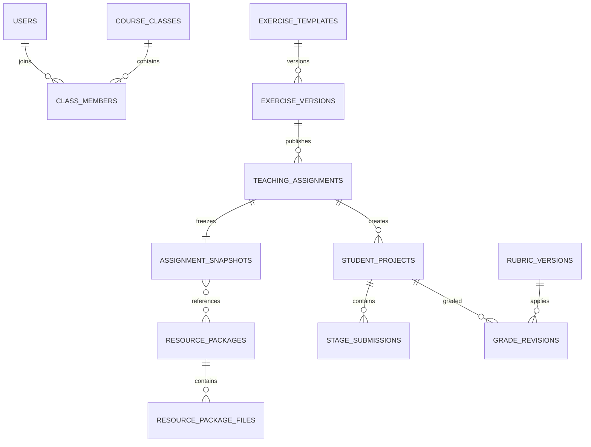

核心表：

| 表 | 关键字段和约束 |
|---|---|
| `exercise_versions` | 场景、模式默认值、规模模板引用、成果要求、`versionNo`，模板内唯一 |
| `teaching_assignments` | 教师、发布范围、模式、时间、状态、补交/重试策略 |
| `assignment_snapshots` | 一对一任务、schema 版本、所有资源引用和 SHA-256 |
| `assignment_targets` | 任务与班级或指定学生，唯一约束防止重复发布 |
| `student_projects` | 任务、学生、场景、当前阶段、状态、最后活动时间，任务学生唯一 |
| `stage_submissions` | 项目、阶段、revision、成果引用、状态、提交/退回信息 |
| `resource_packages` | 类型、语义版本、兼容范围、签名、状态，类型和版本唯一 |
| `rubric_versions` | 量表定义、权重校验和、资源包引用、发布状态 |
| `onboarding_states` | 用户、角色、引导版本、完成/跳过状态，三者唯一 |

### 16.3 表演数据关系

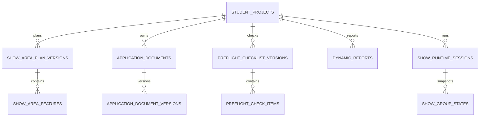

表演关键表：

| 表 | 关键字段和约束 |
|---|---|
| `show_project_configs` | 项目一对一、规模模板、区域、环境和事件脚本快照 |
| `show_area_plan_versions` | 项目、revision、状态、地形快照、规划图资产，项目 revision 唯一 |
| `show_area_features` | 规划版本、类型、geometry、AGL 上下限、属性；每版本每必需类型至少一条由提交服务校验 |
| `application_documents` | 项目、文档类型、当前 revision、状态；项目和三种类型唯一 |
| `application_document_versions` | 文档、revision、资产、documentKey、来源和提交状态 |
| `preflight_checklist_versions` | 项目、revision、起飞决策、依据和状态 |
| `preflight_check_items` | 检查版本、分类、条目代码、状态、说明和证据资产 |
| `dynamic_reports` | 项目、类型、仿真时间、项目/环境快照；项目和类型及 revision 唯一 |
| `show_runtime_sessions` | 通用运行会话一对一扩展、程序阶段、规模和计数摘要 |
| `show_group_state_snapshots` | 会话、sequence、groupId、阶段和数量状态 |

### 16.4 物流数据关系

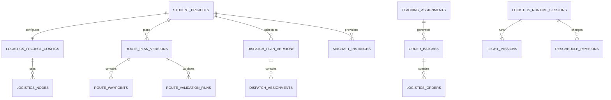

物流关键表：

| 表 | 关键字段和约束 |
|---|---|
| `logistics_project_configs` | 项目、机群模板、机场、候选/启用配送点快照 |
| `logistics_nodes` | 区域版本、类型、geometry、高度和基础可用状态；一个区域版本仅一个中心机场 |
| `route_plan_versions` | 项目、配送点、方向、主/备用、revision、状态、规则/地形版本 |
| `route_waypoints` | 航线版本、顺序、geometry、高度基准、速度和节点引用，顺序唯一 |
| `route_validation_runs` | 输入校验和、随机种子、状态、指标和证据资产；相同输入可复用成功结果 |
| `order_batches` | 任务、generationRevision、条件、种子、生成器版本、锁定状态 |
| `logistics_orders` | 批次、编号、配送点、优先级、释放/时间窗和原始状态，不含载荷字段 |
| `aircraft_instances` | 项目、编号、机型、运行状态和再次可用时间；项目编号唯一 |
| `dispatch_plan_versions` | 项目、revision、状态、指标摘要和冲突摘要 |
| `dispatch_assignments` | 调度版本、订单、无人机、去返程航线和计划起飞时间；每版本订单唯一 |
| `flight_missions` | 会话、订单、无人机、航线版本、状态、实际时间和结果 |
| `reschedule_revisions` | 会话、sequence、基础 revision、命令、影响摘要和学生依据 |

### 16.5 运行、事件和评价关系

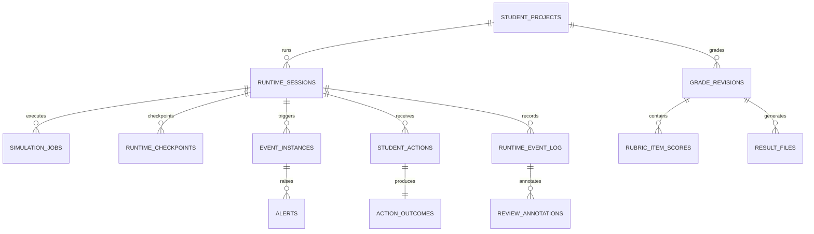

运行关键表：

| 表 | 关键字段和约束 |
|---|---|
| `runtime_sessions` | 项目、类型、状态、引擎版本、输入哈希、种子、当前 sequence/revision |
| `simulation_jobs` | 会话、作业类型、状态、锁、心跳、重试和错误代码 |
| `runtime_checkpoints` | 会话、sequence、仿真时间、资产、schema、SHA-256 |
| `runtime_event_log` | 会话、sequence、仿真时间、类型、对象和 payload；会话 sequence 唯一 |
| `event_instances` | 会话、脚本项、状态、触发/发现/恢复时间和影响摘要 |
| `alerts` | 事件、级别、状态、对象和各状态时间 |
| `student_actions` | 会话、sequence、幂等键、告警、对象、动作、参数和依据 |
| `action_outcomes` | 动作一对一、接受状态、系统响应、后果和下一作业引用 |
| `grade_revisions` | 项目、revision、自动统计、教师分、总分、状态和 active 标记 |
| `rubric_item_scores` | 评价修订、量表项、自动值、教师值、证据和理由 |
| `review_annotations` | 会话、sequence、地图对象/视角、教师和批注 |
| `result_files` | 评价修订、文件资产、类型、active 状态 |

### 16.6 关系列与 JSONB 边界

必须使用关系列保存并建立约束的内容包括：身份、权限、任务归属、状态、版本号、外键、时间、空间几何、订单、航线顺序、动作序列、评分和文件引用。

JSONB 仅用于以下可演进内容：

- 发布时的不可变资源引用集合；
- 资源包中经 JSON Schema 校验的配置；
- 规则证据和指标详情；
- 事件影响参数、动作参数和状态增量；
- 小型检查点和报告渲染输入。

不得用单个 JSONB 继续承载完整表演或物流项目，也不得在 JSONB 中保存无法建立归属约束的订单、航线和评分主数据。

### 16.7 索引与约束

- 所有空间对象建立 GiST 索引；
- `student_projects(assignment_id, student_id)` 唯一；
- 版本表对 `(owner_id, revision)` 唯一；
- `runtime_event_log(session_id, sequence)` 唯一并按会话、时间查询；
- `student_actions(session_id, idempotency_key)` 唯一；
- 待处理作业建立 `(status, available_at, priority)` 部分索引；
- 教师进度页建立任务、阶段、提交、告警和评价状态组合索引；
- 最终评价使用部分唯一索引保证每个项目仅一个 active `GradeRevision`；
- 每个 active 评价修订仅一个 active `FINAL_PDF`；
- 订单编号在批次内唯一，调度版本中订单仅能分配一次；
- CHECK 约束禁止负距离、负时长、无效百分比和模板外规模。

### 16.8 V2 数据兼容

`practices`、`solutions`、`solution_versions`、`simulation_runs` 和 `submissions` 保留为 V2 历史兼容表。V2 页面通过只读适配器展示，不自动转换为 V3 项目，不使用 V3 规则重算旧成绩。

V3 新任务写入新领域表。旧 `PracticeScene` 仅可作为空间场景导入来源，旧 `TaskPoint` 和 `MissionPlan` 不得成为新表演/物流 API 的持久化模型。

物流载荷删除分两步：先让新代码停止写入并兼容读取旧列，再在确认无 V3 依赖后通过迁移物理删除。旧历史数据保留在归档表或迁移快照中。

## 17. API 与 WebSocket 设计

### 17.1 API 约定

V3 业务接口统一位于 `/api/v3`。请求和响应使用 DTO 进行运行时校验，禁止直接序列化 TypeORM 实体。主要约定：

- Cookie 会话认证和 CSRF 防护；
- 资源创建使用 UUID；
- 修改草稿携带 `If-Match` 或 `revision`；
- 提交、发布、动作和报备携带 `Idempotency-Key`；
- 列表使用游标或页码分页，并限制最大页大小；
- 时间使用 ISO 8601，仿真时间使用 `simulationTimeMs`；
- 错误响应包含 `code`、`message`、`requestId` 和可选字段级详情；
- 长作业返回 `202` 和 `jobId`，前端通过查询或 WebSocket 获取进度。

### 17.2 通用教学与资源接口

| 方法与路径 | 用途 |
|---|---|
| `GET /exercise-templates` | 按场景、阶段和规模查询任务库 |
| `POST /courses` | 教师创建本人课程 |
| `POST /courses/:id/classes` | 创建课程班级 |
| `POST /classes/:id/students/import/preview` | 解析 CSV 并返回逐行结果 |
| `POST /classes/:id/students/import/confirm` | 确认导入有效学生和成员关系 |
| `POST /assignments/drafts` | 创建任务草稿并选择训练/考核模式 |
| `PUT /assignments/:id/config` | 更新未发布任务变量 |
| `POST /assignments/:id/preview` | 生成发布预览和冻结项摘要 |
| `POST /assignments/:id/publish` | 原子创建发布快照和学生项目 |
| `GET /assignments/:id/progress` | 教师按阶段、告警和评价筛选进度 |
| `GET /my-projects` | 学生查看双场景任务 |
| `GET /projects/:id/stages` | 获取阶段状态和允许动作 |
| `GET /regions` | 查询当前场景可用预设区域 |
| `GET /regions/:id/layers` | 获取图层、资源和可用状态 |
| `POST /resource-packages/import` | 内部管理员导入升级包 |
| `POST /resource-packages/:id/activate` | 校验后激活资源版本 |
| `GET /leaderboards/:assignmentId` | 获取允许公开的任务排行榜 |

### 17.3 表演接口

| 方法与路径 | 用途 |
|---|---|
| `GET /show-projects/:id` | 获取表演项目和阶段摘要 |
| `PUT /show-projects/:id/area-plan/draft` | 保存纯 JSON 区域草稿 |
| `POST /show-projects/:id/area-plan/check` | 执行权威区域检查 |
| `POST /show-projects/:id/area-plan/snapshot` | 创建手动版本快照 |
| `POST /show-projects/:id/area-plan/submit` | 提交版本并生成规划图 |
| `GET /show-projects/:id/documents` | 获取三份申报文件状态 |
| `POST /documents/:id/editor-session` | 创建在线编辑会话 |
| `POST /documents/:id/save` | 请求强制保存 |
| `POST /documents/:id/submit` | 提交当前已落库版本 |
| `POST /documents/:id/return` | 教师退回并填写原因 |
| `POST /document-editor/callback` | ONLYOFFICE 私有回调 |
| `PUT /show-projects/:id/preflight` | 保存飞前检查草稿 |
| `POST /show-projects/:id/preflight/decide` | 提交起飞决策 |
| `POST /show-projects/:id/reports/t-minus-60` | 提交 T-60 报备 |
| `POST /show-projects/:id/start` | 确认起飞并创建运行会话 |
| `POST /show-projects/:id/reports/flight-end` | 提交结束报备 |

### 17.4 物流接口

| 方法与路径 | 用途 |
|---|---|
| `GET /logistics-projects/:id` | 获取物流项目和节点摘要 |
| `PUT /logistics-projects/:id/delivery-points` | 确认启用配送点 |
| `POST /logistics-projects/:id/routes` | 创建去程、返程或备用草稿 |
| `PUT /routes/:id/draft` | 保存航线、节点和保护范围 |
| `POST /routes/:id/check` | 执行静态权威检查 |
| `POST /route-pairs/validate` | 创建往返验证作业 |
| `GET /route-validations/:id` | 查询验证指标和证据 |
| `POST /assignments/:id/order-batches/regenerate` | 教师发布前重新生成订单预览 |
| `GET /logistics-projects/:id/orders` | 获取学生可见订单池 |
| `PUT /logistics-projects/:id/dispatch/draft` | 保存初始调度草稿 |
| `POST /logistics-projects/:id/dispatch/check` | 检查调度冲突和预测时间轴 |
| `POST /logistics-projects/:id/dispatch/submit` | 提交不可变调度版本 |
| `POST /logistics-projects/:id/start` | 启动配送运行 |
| `POST /runtime-sessions/:id/reschedule` | 提交动态重调度命令 |

### 17.5 运行、评价与文件接口

| 方法与路径 | 用途 |
|---|---|
| `GET /runtime-sessions/:id` | 获取状态、sequence 和检查点摘要 |
| `POST /runtime-sessions/:id/actions` | 确认告警或提交学生动作 |
| `POST /runtime-sessions/:id/pause` | 训练模式按策略暂停 |
| `POST /runtime-sessions/:id/retry-checkpoint` | 训练模式从检查点重试 |
| `GET /runtime-sessions/:id/timeline` | 分页获取权威事件流 |
| `POST /runtime-sessions/:id/replay` | 创建最终权威复放 |
| `GET /projects/:id/evaluation` | 获取自动统计和当前评价修订 |
| `PUT /grade-revisions/:id/items` | 教师保存分项评价 |
| `POST /grade-revisions/:id/publish` | 发布成绩并生成统一 PDF |
| `POST /runtime-events/:id/annotations` | 教师添加讲评批注 |
| `GET /files/:id/download` | 按业务权限签发下载 |

### 17.6 WebSocket 连接

客户端连接 `/ws/v3/runtime` 后发送：

```json
{
  "type": "subscribe",
  "sessionId": "uuid",
  "afterSequence": 128
}
```

服务端验证用户对会话的访问权限，先补发可保留的增量；缺口超过保留范围时返回 `resyncRequired`，客户端通过 REST 获取最新快照后继续订阅。

### 17.7 WebSocket 消息格式

```ts
interface RuntimeMessage<T = unknown> {
  sessionId: string
  sequence: number
  simulationTimeMs: number
  serverTime: string
  type: RuntimeMessageType
  payload: T
  traceId?: string
}
```

所有权威消息先落库后推送。客户端按 `sequence` 去重并顺序应用；发现跳号时停止应用后续状态，执行缺口拉取。可丢弃的进度消息使用独立 `ephemeral` 类型，不参与权威序列。

### 17.8 并发和幂等

- 草稿保存 revision 冲突返回 `409 REVISION_CONFLICT`，并附服务端 revision；
- 发布、阶段提交和动作使用数据库唯一幂等键；
- 学生动作同时校验会话状态和基础 sequence；
- Worker 结果以 `(sessionId, jobId, baseRevision)` 条件更新；
- 文件回调只在文档键和基础 revision 匹配时推进；
- 网络重连不会重复起飞、报备、订单变更或评价发布。

### 17.9 API 契约版本

共享 DTO 和事件契约放在 `packages/shared`，使用显式 schema 版本并生成 OpenAPI。破坏性变化新增 `/api/v4` 或事件 schema 版本；资源包兼容范围不等同于 API 版本。V2 兼容接口维持只读和必要维护，不向其增加 V3 领域字段。

## 18. 安全、审计与可观测性

### 18.1 身份认证

Web 端使用服务端签发的 `HttpOnly`、`Secure`、`SameSite` Cookie，不把长期令牌存入 `localStorage`。生产环境强制 HTTPS，登录、改密和会话刷新设置速率限制。

密码采用当前框架支持的强密码哈希算法和独立盐；密钥、数据库口令、对象存储凭证、资源包验签私钥不得进入镜像或仓库，使用部署环境密钥或 Docker Secret 管理。

### 18.2 RBAC 与对象级授权

业务角色为教师和学生，内部管理员仅用于平台运维。权限判断同时包含角色和对象归属：

| 操作 | 授权条件 |
|---|---|
| 教师查看学生成果 | 教师属于课程/班级或是任务发布者 |
| 学生查看项目 | 项目学生 ID 与当前用户一致 |
| 学生修改成果 | 属于本人、阶段开放、状态未锁定且模式允许 |
| 教师退回/评分 | 任务属于本人可管理范围且评价状态允许 |
| 内部资源升级 | 具有内部管理员权限并通过二次确认 |
| 文件下载 | 同时满足文件类别和所属业务对象权限 |

前端路由和按钮控制只改善体验，后端每个应用服务必须重新鉴权。教师不可直接修改学生数据行，只能通过退回、批注和评分命令产生新记录。

### 18.3 CSRF、CORS 与内容安全

- 所有改变状态的 Cookie 认证请求校验 CSRF token 或同源自定义头；
- CORS 仅允许部署配置中的平台域名；
- 配置 CSP，限定脚本、Worker、地图、对象下载和文档编辑器来源；
- ONLYOFFICE 通过统一网关路径访问，`frame-src` 和 `connect-src` 只开放必要地址；
- API 响应设置 `X-Content-Type-Options`、`Referrer-Policy` 和合理的 frame 策略；
- 用户输入通过文本渲染或白名单清洗，禁止直接渲染任意 HTML。

### 18.4 文档服务安全

ONLYOFFICE 编辑配置和回调双向使用独立 JWT 密钥。下载 URL 短期有效，并绑定文档、revision 和用途。文档容器只允许访问 API 网关的受控下载/回调地址，不能访问数据库或任意内网地址。

服务端拒绝私网探测、非白名单主机回调和重定向下载，防止 SSRF。文档服务网络故障与业务提交失败分别记录。

### 18.5 文件与资源包安全

- 上传文件名只作显示，不参与服务器路径；
- 限制请求体、解压后总大小、文件数量、压缩比和嵌套层级；
- Word 校验 OOXML 容器和主要部件，不接受宏模板作为正式母版；
- ZIP 资源包拒绝绝对路径、`..`、符号链接、设备文件和可执行脚本；
- 资源包先进入隔离区，完成 Schema、SHA-256、Ed25519、兼容范围和依赖校验后才能预览；
- 上传、下载、激活、退役和删除均记录审计。

### 18.6 考核完整性

考核模式发布后，任务快照、事件脚本、量表、订单批次和结果可见策略锁定。服务端记录保存、检查、仿真、动作、提交和补交次数。客户端时间不用于决定截止和评分；墙钟时间由服务端记录，仿真评分使用会话仿真时间。

教师查看考核进度采用只读查询，不向学生 WebSocket 发送“教师正在查看”等可见事件。手动事件触发接口在考核模式下硬性禁用。

### 18.7 审计事件

`audit_events` 至少记录：

- 登录成功、失败、退出和权限拒绝；
- 课程、班级、学生导入和任务发布；
- 阶段提交、退回、锁定和补交；
- 文档编辑会话、保存回调、下载和导出；
- 运行开始、暂停、检查点重试、手动训练事件和系统故障；
- 教师评价、成绩发布和修订；
- 资源包导入、激活、退役和验签失败；
- 备份、恢复、迁移和内部管理员操作。

每条审计包含用户、角色、对象、动作、结果、真实时间、客户端标识、请求 ID、任务/会话 ID、变更前后摘要和原因。敏感内容只存摘要，不在日志中记录密码、Cookie、签名 URL 或完整 Word 内容。

### 18.8 日志和追踪

使用结构化 JSON 日志，贯穿：

- `requestId`：一次 HTTP 请求；
- `traceId`：跨 API、作业和文件服务链路；
- `assignmentId`、`projectId`、`sessionId`：业务上下文；
- `jobId`：异步作业；
- `documentId`、`documentKeyHash`：文档回调，日志不记录完整 key。

错误日志区分业务拒绝、学生方案问题、外部依赖故障和系统缺陷。可选接入 OpenTelemetry；第一版至少保证 API、Worker、数据库慢查询和文档回调可按标识关联。

### 18.9 指标和告警

平台运行指标包括：

- API 延迟、错误率、活跃会话和 WebSocket 连接；
- 作业排队时间、执行时间、重试、失败和心跳超时；
- Worker CPU、内存、事件步耗时和确定性校验失败；
- PostgreSQL 连接、锁等待、慢查询、容量和复制/备份状态；
- 对象存储容量、错误、校验和失败；
- ONLYOFFICE 会话、force-save 延迟、回调失败和不可用时间；
- 地图、地形和 3D Tiles 资源可用率；
- PDF 生成耗时和失败率。

生产告警不能进入学生业务告警栏。运维告警由独立监控渠道发送。

## 19. 部署、容量与备份设计

### 19.1 标准私有化部署

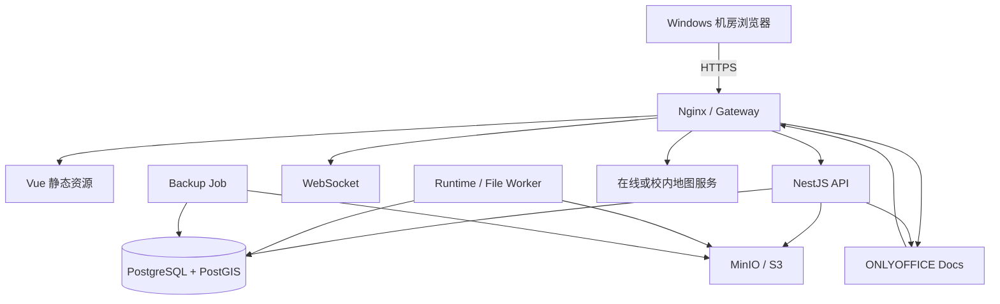

公网或校园网只开放网关的 80/443，生产环境将 80 重定向到 443。PostgreSQL、MinIO 和 Worker 不对终端网络暴露。ONLYOFFICE 浏览器资源通过网关代理，回调走受控内部路径。

### 19.2 容器职责

| 服务 | 职责 | 持久化 |
|---|---|---|
| `gateway` | TLS、静态文件、反向代理、限流和安全头 | 证书和配置 |
| `app` | NestJS API、认证、领域事务和 WebSocket | 无状态 |
| `worker` | 航线验证、分段运行、指标、图片和 PDF 作业 | 临时目录 |
| `postgres` | 业务、PostGIS、作业表、事件和审计 | 数据卷 |
| `minio` | Word、图片、检查点、运行结果和 PDF | 对象数据卷 |
| `onlyoffice` | `.docx` 编辑和转换 | 配置、字体和必要缓存 |
| `map-service` | 可选离线影像、地形和 3D Tiles | 地图资源卷 |
| `backup` | 数据库、对象和配置备份 | 独立备份目标 |

镜像使用固定版本或 digest，不在生产启动时动态安装依赖。数据库迁移作为显式发布步骤执行，迁移成功后再滚动启动 API 和 Worker。

### 19.3 部署规格分级

下表是初始容量建议，不是最终验收承诺；学校并发指标须通过真实黄金用例压测确认。

| 级别 | 建议资源 | 能力边界 |
|---|---|---|
| 开发环境 | 4 核、8 GB，可按需启动 ONLYOFFICE | 单开发者、少量演示数据 |
| 试点环境 | 8 核、16 GB、SSD 200 GB 起 | 单班教学试点、有限并发作业 |
| 标准环境 | 16 核、32 GB、独立 SSD 数据盘 | 多班并发，按压测配置 Worker 槽位 |
| 扩展环境 | API/Worker 分机，数据库和对象存储独立 | 更高并发、备份窗口和资源隔离 |

ONLYOFFICE、PostGIS、对象存储和运行 Worker 同机时内存竞争明显。当前约 2 GB 内存的远端服务器只适合保留 V2/轻量演示或静态前端，不适合作为完整 V3 环境，也不能承载可靠的 ONLYOFFICE 在线编辑。完整 V3 上线前必须扩容或拆分文档服务。

### 19.4 Worker 容量控制

Worker 槽位按作业类型分别配置，防止大规模运行阻塞文档保存和报告生成：

- `route-validation`：CPU 密集；
- `runtime-segment`：低延迟优先；
- `authoritative-replay`：CPU 密集、低优先级；
- `planning-map/report`：CPU 和内存密集；
- `document-callback`：I/O 优先且不可长时间排队。

每类作业设置并发、超时、内存、最大重试和优先级。5000 架仍按分组模型处理；50 架/100 单物流以增量状态运行，禁止将整个班级全部轨迹常驻一个进程。

### 19.5 离线教学

离线部署包含：

- 本地前端和 API 镜像；
- 校内影像、量化地形和可选 3D Tiles；
- 本地 MinIO 和 ONLYOFFICE；
- 已签名的资源升级包；
- 离线许可证或字体等合法资源；
- 导出备份和离线恢复工具。

地图服务不可用时，任务只能按区域包定义降级。离线升级先导入隔离区、校验、预览，再由内部管理员激活，不依赖外网时间或远程脚本。

### 19.6 网络与代理

WebSocket 代理关闭响应缓冲并设置合理空闲超时；大文件上传和 ONLYOFFICE 回调设置独立大小/超时限制。对象下载可由 Nginx 内部重定向加速，但授权始终由 API 完成。

若学校通过代理访问在线 Cesium 资源，代理地址、访问令牌和版权归属通过环境配置和区域包管理，令牌不写入前端仓库。

### 19.7 备份范围

备份必须形成同一恢复点的逻辑集合：

- PostgreSQL 全量备份和增量/WAL；
- MinIO/S3 对象版本或快照；
- 资源包原文件和签名公钥；
- 网关、应用和 ONLYOFFICE 配置；
- 报告字体、文档模板和地图资源清单；
- 应用镜像版本、数据库迁移版本和恢复说明。

仅备份数据库会丢失 Word、检查点和 PDF；仅备份对象存储则无法恢复归属和版本关系。

### 19.8 备份策略

建议每日数据库全量、持续 WAL 或更短周期增量、每日对象存储增量、每周离线或异地副本。具体 RPO/RTO 由学校确认并在部署验收中记录。

备份任务写入 `backup_runs`，记录范围、开始结束时间、大小、校验和、目标和结果。备份文件加密，密钥与备份介质分开保存。

### 19.9 恢复流程

1. 在隔离环境准备与备份兼容的镜像和配置；
2. 恢复 PostgreSQL 到指定恢复点；
3. 恢复对象存储并校验抽样 SHA-256；
4. 检查数据库迁移版本和资源包签名；
5. 执行引用完整性检查，确认无缺失文件；
6. 启动 API 和 Worker，完成登录、任务、Word、运行和 PDF 冒烟测试；
7. 经负责人确认后切换网关。

每次正式交付至少完成一次恢复演练，不能只以“备份任务成功”代替可恢复性验证。

### 19.10 发布与回滚

应用发布采用向前兼容迁移：先增加表/列和兼容代码，再切换写路径，最后在后续版本清理旧结构。若迁移包含不可逆数据变换，执行前必须有恢复点并提供回滚说明。

资源包版本可退役但不删除。应用回滚时必须校验其最低资源包和 schema 兼容范围；不能仅回滚镜像而忽略数据库和资源包状态。

## 20. 数据迁移与实施阶段

### 20.1 TypeORM 迁移基线

开发、测试和生产均以 TypeORM migration 作为 schema 权威来源，生产配置固定 `synchronize=false`。CI 在空数据库执行全量 `migration:run`，并从上一正式版本数据库执行升级测试。

迁移文件按时间和领域命名，包含 `up` 和可行的 `down`。数据回填与结构变更分开，批量回填采用可恢复分片，避免长事务锁住教学系统。

### 20.2 迁移前检查

- 数据库版本和扩展满足要求，PostGIS 可用；
- 当前迁移版本与发布清单一致；
- 数据库和对象存储备份完成且可读取；
- 无长时间运行作业、文档保存回调或成绩发布作业；
- 磁盘空间足够容纳新索引和临时数据；
- 回滚负责人、维护窗口和验收步骤已确认。

### 20.3 V2 兼容策略

迁移只为现有用户、课程、班级、成员、引导、任务库和评价基础表补充必要版本字段。V2 `practices`、`solutions`、`simulation_runs` 和提交文件继续按原 ID 读取。

V3 项目通过 `schemaVersion=3` 和专项表识别。历史 V2 任务不自动补造区域规划、订单或事件数据，不使用新量表重算成绩。V2 演示数据可重新生成，但不能当作生产迁移规则。

### 20.4 P0：工程基线

对应开发清单 P0-001 至 P0-006：

- 建立 migration、发布快照和资源包元数据；
- 增加训练/考核模式和阶段状态机；
- 建立场景插件契约；
- 新 API 停止物流载荷读写；
- 增加状态机、资源兼容和发布锁定测试。

出口：新旧数据库均可迁移启动，发布任务可查询完整冻结快照，V3 新代码不再依赖 `TaskPoint` 和载荷字段。

### 20.5 P1：区域与教学入口

对应 P1-001 至 P1-006：完成双场景首页、教师任务向导、各场景至少三类区域、专题图层、阶段导航和教师进度筛选。

出口：教师可发布冻结资源版本的任务，学生可按场景和阶段进入本人项目，地图资源状态和高度基准可见。

### 20.6 P2：表演规划与申报

对应 P2-001 至 P2-006：完成五档表演模板、九类区域规划、规划图、三份真实 Word 模板技术验证、保存/版本/提交/退回和教师审核。

ONLYOFFICE 技术验证是阶段门：必须用真实母版确认主要版式、表格、字体、导出和回调保存后，才能承诺该阶段验收。

### 20.7 P3：表演运行闭环

对应 P3-001 至 P3-006：完成飞前检查、T-60/起飞/结束报备、5000 架分组状态、四类技术事件、处置动作、复盘和统一评价 PDF。

出口：表演黄金用例可确定性重放，运行等待学生动作不长期占用 Worker，评价引用权威复放。

### 20.8 P4：物流航线与订单

对应 P4-001 至 P4-006：完成五档物流模板、节点、去返程/备用航线、规则检查、往返验证、确定性订单批次和可编辑调度工作台。

出口：学生只能使用本人已验证航线调度，发布后订单原始属性和随机种子锁定，领域和界面无载荷字段。

### 20.9 P5：物流运行与应急

对应 P5-001 至 P5-006：完成调度提交检查、配送状态机、六类事件、飞行/航线处置、批量重调度、复盘和评价。

出口：20 架/30 单黄金用例完整通过，50 架/100 单达到约定性能，处置评分来源于动作和后果证据。

### 20.10 P6：升级、离线和交付

对应 P6-001 至 P6-006：完成签名升级包、历史版本查看、文件存储、备份恢复、性能、安全和审计验收。

出口：离线环境可导入和激活兼容资源包，已完成任务仍引用原版本，恢复演练和交付清单完整。

### 20.11 开发依赖顺序

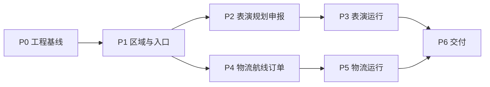

表演和物流在 P1 后可由不同小组并行，但必须共享 P0 的发布快照、运行事件、文件和评价契约，避免形成两套基础设施。

## 21. 测试设计

### 21.1 单元测试

- 五档表演和五档物流模板开放能力；
- 训练/考核阶段状态机和允许动作；
- 区域几何有效性、空间关系分类和提交门禁；
- 航线硬性冲突、风险、效率分类及单位转换；
- DEM 高度基准和 ENU/ECEF 转换；
- 订单生成随机种子确定性；
- 调度占用、电量、时空冲突和时间窗；
- 事件触发、发现、升级、恢复和动作合法性；
- 应急证据、评分计算、评价修订和同分排序；
- 资源包路径、Schema、校验和、签名和兼容范围。

### 21.2 集成测试

- 发布任务原子冻结资源、订单、事件和量表版本；
- PostgreSQL 作业领取、心跳超时、重试和幂等提交；
- 事件边界保存检查点，学生动作后确定性续跑；
- 权威复放与训练会话输出一致；
- ONLYOFFICE 打开、自动保存、强制保存、提交、退回、锁定和导出；
- 文档回调重复、乱序、旧 documentKey 和故障重试；
- 对象存储权限、校验和、隔离和短期下载；
- 统一 PDF 的 active 唯一性和历史修订；
- V2 数据只读、V3 migration、备份和恢复。

### 21.3 API 契约测试

OpenAPI 与运行时 DTO 校验保持一致。对关键命令测试未登录、越权、模式不允许、阶段未开放、revision 冲突、重复幂等键、资源版本不兼容和系统依赖故障。

WebSocket 测试覆盖断线重连、sequence 去重、缺口补发、超出保留范围重同步、慢客户端和权限撤销。

### 21.4 前端端到端测试

- 教师创建训练/考核任务并发布到班级或指定学生；
- 学生首次引导可完成、跳过和按版本再次触发；
- 九类区域绘制、撤销重做、刷新恢复、检查和提交；
- 2D/3D 及左右视角保持同一观察中心；
- 三份 Word 独立保存、提交和教师退回；
- 订单池、无人机池、地图和时间轴联动编辑；
- 告警确认、处置、检查点继续和复盘定位；
- 教师评分、发布一份最终 PDF 和排行榜权限。

### 21.5 表演黄金用例

教师创建 1000 架训练任务并选择城市广场区域。学生完成九类区域规划和三份申报文件，执行飞前检查和 T-60 申请。固定程序触发分组通信异常，学生识别告警、暂停后续起飞并执行分组返航，最后提交结束报备和复盘。教师退回一份申报文件，学生修订后重新提交，教师完成评分并发布统一评价 PDF。

验收点包括：版本未被覆盖、程序在决策边界等待、动作后可确定性续跑、旧文档版本可查看、最终仅一个 active PDF。

### 21.6 物流黄金用例

教师创建 20 架训练任务，选择 6 个候选配送点并生成 30 个订单。学生确认配送点、规划全部往返航线、设置等待和备降点、处理硬性冲突并提交。学生完成初始调度后启动运行，系统触发局部航线暂停和加急订单，学生处置在航无人机并批量重调度，最终完成复盘和评价。

验收点包括：订单批次可按种子复现、未验证航线不可使用、原始订单不可修改、动作记录含依据、连锁延迟可追踪、应急分不固定满分。

### 21.7 确定性测试

为每个引擎版本维护固定输入夹具。相同任务快照、资源哈希、随机种子和动作序列运行至少两次，比较：

- 事件顺序和仿真时间；
- 检查点状态哈希；
- 最终对象状态和指标；
- 规则证据和评分输入；
- 报告摘要数据。

浮点结果使用规则定义容差或定点/整数化表示，不能用不稳定对象序列化直接计算哈希。

### 21.8 性能测试

在目标部署规格上验证：

- 5000 架表演完整固定程序和 4 至 6 个事件；
- 50 架、12 条以上航线和 100 个订单的物流运行及全局重排；
- 一个班级同时打开工作台和告警连接；
- 批量航线检查、订单生成、权威复放和 PDF 生成；
- 多个 Word 会话的保存回调和对象存储吞吐。

指标至少包含 P50/P95 API 延迟、作业排队和执行时间、前端帧率、主线程长任务、内存峰值、数据库锁等待、WebSocket 带宽和错误率。最终班级并发承诺以压测报告为准。

### 21.9 安全测试

- 教师/学生横向越权和 ID 枚举；
- Cookie、CSRF、CORS、CSP 和会话固定；
- 文件类型伪造、宏、压缩炸弹和路径穿越；
- ONLYOFFICE 回调伪造、旧 key 覆盖、SSRF 和下载越权；
- 资源包签名篡改和降级攻击；
- WebSocket 未授权订阅和断开后权限变更；
- 考核提交锁绕过和客户端时间篡改；
- 日志敏感信息泄漏。

### 21.10 视觉与兼容测试

使用 Windows 机房目标浏览器，在 1366x768、1920x1080 和常见高 DPI 环境检查首页、工作台、Word、时间轴、告警栏和教师评价。重点验证：

- 文本和按钮不溢出、不遮挡 Cesium 控件；
- 左右面板开合不改变固定地图中心；
- 2D/3D 切换后规划对象位置一致；
- 地形、影像或 3D Tiles 不可用时状态明确；
- 5000 架聚合图形非空、可选中且不会生成过量 DOM/Entity；
- 长订单编号、学生姓名脱敏和告警内容可读。

## 22. 风险与设计结论

### 22.1 主要风险

| 风险 | 影响 | 设计控制 |
|---|---|---|
| ONLYOFFICE 对真实母版版式兼容不足 | 表演申报核心验收延期 | P2 前置真实模板 PoC，适配器隔离，保留原文件下载和版本 |
| 文档服务资源占用高 | 低配远端不可用 | 文档服务独立容量评估，2 GB 环境不承载完整 V3 |
| 继续扩展旧通用模型 | 两场景数据和状态互相污染 | 新专项表、插件契约、P0 后禁止 V3 依赖 `TaskPoint` |
| 分段运行不确定 | 评分不可复现 | 固定步长、种子、动作序列、检查点和权威复放 |
| 5000 架逐架渲染或计算 | 浏览器和 Worker 卡顿 | 分组状态、聚合图形、有限异常明细和分层频率 |
| 在线 DEM 或地图变化 | 历史检查和评分漂移 | 区域/地形版本和提交时采样快照 |
| 教师配置项过多 | 任务创建复杂且易错 | 固定规模模板、分步向导、当前模板能力过滤和发布预览 |
| 新旧数据混用 | 历史结果被错误重算 | schema 版本、V2 只读适配和独立 V3 领域表 |
| 规则包可执行内容 | 供应链和任意代码风险 | 仅声明式配置、Ed25519 验签、代码注册规则 |
| 运行故障被当作学生错误 | 评价不公平 | `SystemIncident` 与业务告警完全分离 |
| 备份只有数据库或文件一侧 | 成果无法恢复 | 数据库、对象、配置和版本清单组成一致恢复集 |

### 22.2 关键技术结论

1. V3 继续采用 Vue 3、TypeScript、CesiumJS、NestJS、TypeORM 和 PostgreSQL/PostGIS，不进行技术栈重写。
2. 后端采用模块化单体加独立 Worker，第一版用 PostgreSQL 作业表和事务外盒，不强制引入 Redis。
3. 表演和物流必须是两个明确场景插件及领域模型，不能继续扩展 `PracticeScene + TaskPoint + MissionPlan`。
4. 交互式运行使用分段作业和检查点，最终评价基于完整权威复放。
5. 5000 架表演使用状态、计数和分组模型；50 架物流使用明确无人机、订单、航线和任务状态机。
6. 三份申报文件默认通过 ONLYOFFICE 原版式编辑，所有版本保存到私有对象存储；每次最终评价仅有一个 active PDF。
7. DEM 可以接入，但权威检查必须冻结地形资源和高程采样快照，不能直接依赖变化的在线地形。
8. 资源包为无可执行脚本的签名 ZIP，已发布任务始终引用原版本。
9. V2 历史任务只读保留，V3 采用正式 TypeORM migration，生产关闭 `synchronize`。
10. 当前 2 GB 远端环境只能承担旧版或轻量演示，完整 V3 需扩容并完成真实班级压测。

### 22.3 开发启动条件

正式进入 V3 功能开发前，应准备：

- 两个场景各至少三套可授权使用的区域数据；
- 三份真实 `.docx` 母版及其字体清单；
- 五档表演、五档物流模板的首版配置；
- 四类表演事件、六类物流事件和参考动作清单；
- 统一机型参数、规则阈值来源和评价量表；
- ONLYOFFICE 真实模板 PoC 环境；
- 数据库迁移、对象存储和备份恢复基线；
- 目标学校的浏览器、终端配置、班级并发和离线地图条件。

### 22.4 最终设计结论

V3 的核心不是增加更多动画或通用字段，而是把教学任务固化为可版本化的阶段成果、可复现的运行决策和可解释的评价证据。采用现有 B/S 技术栈演进，可以复用已完成的 Cesium、教学管理和评价能力，同时通过专项领域模型、Word 文件服务、确定性 Worker 和资源包机制控制新增复杂度。

实施时必须先完成 P0 数据与状态基线，再并行推进表演和物流。任何新功能若重新引入舞步导入、独立 NPC、物流载荷、任意机群规模或不可追溯在线评分，都应视为超出 V3 第一版范围并重新进行需求评审。
