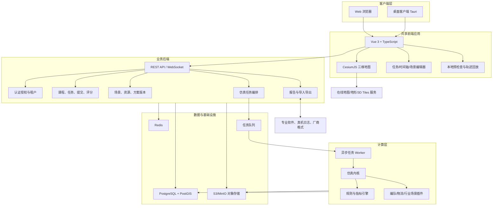
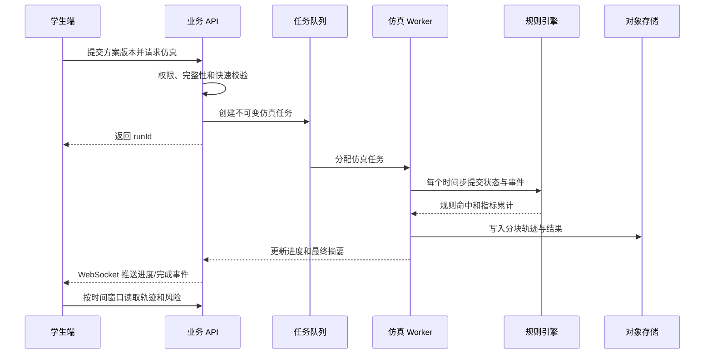

# 低空无人集群教学仿真软件需求与架构设计

## 1. 项目评估

### 1.1 项目定位

本项目不是单纯的无人机飞行演示软件，而是一个面向教学过程的低空无人集群任务训练平台。平台以六阶段培养体系为内容骨架，将每项能力转化为可操作、可仿真、可纠错、可评价的训练任务。

核心价值链为：

> 教师定义任务与评价标准 -> 学生设计方案 -> 系统仿真与规则校验 -> 学生修正方案 -> 系统记录能力证据 -> 教师评价与归档

平台与现有舞步设计、执飞、物流调度和行业应用软件的关系应定义为：

- 本平台负责教学组织、通用任务设计、可视化仿真、规则校验、过程记录和评价。
- 专业软件负责高精度编队设计、真机控制或特定行业生产作业。
- 两者通过标准任务包、轨迹文件和飞行日志进行导入导出，不在首版中重做所有专业软件。

### 1.2 可行性判断

项目总体可行，但范围较大。六阶段实际包含三类不同问题：

1. 航迹与编队：多机时空轨迹、队形变换、碰撞检测。
2. 调度优化：订单、机型、站点、时效与动态重规划。
3. 行业任务：巡检、测绘、搜索覆盖、载荷与链路约束。

三类问题可以共享地图、无人机模型、时间轴、任务版本、运行记录、报告和教学管理，但不能强行使用同一种任务编辑器和规则集合。建议建立“通用仿真底座 + 场景插件”的产品结构。

### 1.3 主要风险

| 风险 | 影响 | 建议 |
|---|---|---|
| 首版同时实现六阶段 | 周期和质量不可控 | MVP 只完整实现第一阶段，第二阶段做一个编队样例 |
| 浏览器承担全部高精度仿真 | 大机群或长时任务时性能不稳定 | 前端负责交互与可视化，后端负责权威校验和批量仿真 |
| 只做动画、不建立仿真语义 | 无法形成可信评价 | 统一时间、坐标、飞行器状态、事件和规则模型 |
| 地图服务许可和网络依赖 | 离线教学、部署和商用受限 | 地图提供商适配层，同时规划在线与离线瓦片能力 |
| 不同厂商格式差异 | 后期难接真机和专业软件 | 设计内部标准任务包，厂商格式通过适配器转换 |
| 评价只看最终结果 | 无法证明学生是否真正掌握 | 保存每次设计版本、仿真结果、修正行为和最终提交 |

## 2. 需求梳理

### 2.1 用户与权限

| 角色 | 核心权限 |
|---|---|
| 学生 | 查看已发布任务、编辑个人方案、运行仿真、查看反馈、提交报告 |
| 教师 | 管理课程班级、维护任务模板、发布作业、查看过程、评分和导出 |
| 内容设计者 | 配置场景、任务模板、约束、规则组合、评分量表和报告模板 |
| 学校管理员 | 组织、用户、班级、学期、配额、审计和基础资源管理 |
| 平台管理员 | 租户、系统字典、地图与存储配置、系统监控和全局审计 |

建议增加“内容设计者”。任务模板和校验规则具有专业性，不宜默认由普通任课教师直接维护底层配置。

### 2.2 核心业务对象

- 组织、用户、角色、班级、课程、学期。
- 培养阶段、能力指标、任务模板、任务发布实例。
- 场景、地形、障碍物、禁飞区、安全边界、起降区和兴趣点。
- 无人机型号、无人机实例、载荷、性能参数和初始状态。
- 学生方案、方案版本、航点、轨迹、队形、时间轴、任务分配和参数。
- 仿真运行、状态帧、事件、规则命中、风险项和指标结果。
- 提交记录、报告、评分量表、教师评分和能力达成记录。
- 导入导出任务、外部系统、格式映射和飞行日志。

### 2.3 功能域

#### 教学管理

- 课程、班级、学生和教师管理。
- 六阶段目录与能力指标维护。
- 从模板创建任务，设置截止时间、尝试次数、可见反馈和评分方式。
- 查看学生进度、版本演变、风险修正情况和成绩。

#### 场景与资源管理

- 在 Cesium 地图中创建和保存训练场景。
- 绘制多边形区域、禁飞区、限高区、航线、起降点和障碍物。
- 配置无人机型号、数量、速度、续航、载重、安全间距等参数。
- 管理 3D Tiles、地形、影像、无人机模型和教学素材。

#### 学生任务设计

- 地图选点、航线编辑、批量生成航点、属性编辑和撤销重做。
- 多机任务分配、编号映射、起降顺序和时间轴编辑。
- 队形创建、队形间点位匹配和转场时间设置。
- 物流订单分配、站点与配送路径设计。
- 巡检、测绘、搜索区域和载荷参数设计。
- 自动保存草稿、创建版本、比较版本和恢复历史版本。

#### 仿真与回放

- 启动、暂停、继续、停止、倍速、拖动时间轴和单步执行。
- 展示飞行器位置、姿态、轨迹、剩余电量、链路和任务状态。
- 实时展示事件和规则命中，在地图和时间轴上定位问题。
- 支持确定性重放，同一输入和引擎版本应得到相同结果。

#### 规则校验与评价

- 设计时快速校验：字段完整性、区域包含、参数上下限、明显航线相交。
- 运行时校验：三维碰撞、间距、越界、限高、超速、航程、电量和超时。
- 场景规则：订单遗漏、覆盖遗漏、载重超限、通信盲区、备降缺失等。
- 每条风险包含级别、时间、对象、位置、证据、规则说明和修改提示。
- 支持硬约束、软约束和评分指标，避免将所有问题简单处理为“通过/失败”。

#### 报告与能力档案

- 自动汇总任务目标、方案摘要、仿真指标、风险、修改历史和最终结果。
- 学生补充分析、结论和反思，教师评分并填写反馈。
- 按学生、班级、任务和能力指标统计达成度。
- 导出 PDF、表格和标准任务包。

### 2.4 非功能需求

| 类别 | 建议指标 |
|---|---|
| 性能 | 普通教学机支持 50 架实时 3D 回放；设计目标为 100 架，更多数量采用轨迹抽稀或服务端计算 |
| 响应 | 常规 API P95 小于 500 ms；设计时快速校验小于 1 s；批量仿真异步执行 |
| 一致性 | 仿真输入、随机种子、引擎版本和规则版本均可追溯 |
| 安全 | 租户隔离、RBAC、对象级授权、操作审计、文件类型与大小校验 |
| 可用性 | 自动保存草稿；异步任务可重试；仿真失败不丢失方案 |
| 兼容性 | 首选 Chromium 内核；WebGL2；桌面客户端与 Web 共享前端代码 |
| 部署 | 支持学校内网单机/小集群部署，并保留云端多租户能力 |
| 可观测性 | 记录 API、任务队列、仿真耗时、规则耗时、WebSocket 连接和异常 |

## 3. MVP 范围

### 3.1 首版必须完成

1. 登录、角色、课程、班级和任务发布。
2. 第一阶段 5 个任务所需的通用地图编辑器。
3. Cesium 在线影像与地形、场景保存、航点航线、区域和禁飞区编辑。
4. 5 至 20 架无人机的基础运动仿真和时间轴回放。
5. 碰撞、间距、越界、禁飞区、限高、速度和任务完整性校验。
6. 方案版本、风险反馈、重新设计和再次仿真闭环。
7. 训练报告生成、提交、教师评分和班级成绩导出。
8. 一个标准 JSON 任务包的导入导出。

### 3.2 首版暂不实现

- 真实飞控指令下发和真机实时控制。
- 高保真空气动力学、气象流场、无线电传播和传感器物理仿真。
- 完整舞步设计器和灯效编辑器。
- 自动求解所有物流调度和测绘规划问题。
- 六阶段全部任务的生产级实现。
- 大规模千机实时浏览器仿真。

### 3.3 验收主线

以“基础多机航线规划任务”为端到端验收用例：教师发布带场地和规则的任务，学生为 10 架无人机设计航线，第一次运行触发至少两类风险，学生定位并修正后再次运行通过，系统生成包含两次方案及修正证据的报告，教师完成评分和导出。

## 4. 总体架构

### 4.1 架构原则

- 前后端分离，前端不直接访问数据库和对象存储。
- Web 与桌面客户端共用同一套前端业务代码。
- 先采用模块化单体后端，仿真工作进程独立部署；达到明确容量瓶颈后再拆微服务。
- 任务、规则和场景插件化，六阶段共享底座但允许不同编辑器面板和计算器。
- 快速反馈与权威结果分层：浏览器做低延迟预检查，服务端做最终校验和评分。

### 4.2 逻辑架构图



### 4.3 推荐技术栈

| 层次 | 推荐方案 | 说明 |
|---|---|---|
| 前端 | Vue 3、TypeScript、Vite、Pinia、Vue Router | 国内团队易招聘，生态成熟 |
| UI | Element Plus + 自定义仿真工作台组件 | 教学管理与复杂表单并存 |
| 三维地图 | CesiumJS | 支持全球坐标、地形、影像、3D Tiles、时间动态对象 |
| 图表 | ECharts | 指标、状态曲线、班级统计 |
| 桌面端 | Tauri 2 | 复用 Web 前端，安装包和资源占用通常低于 Electron |
| 后端 | Java 21 + Spring Boot 3 | 适合教学管理、权限、事务、报表和长期维护 |
| 空间数据 | PostgreSQL + PostGIS | 场景几何、空间查询和地理规则 |
| 缓存/状态 | Redis | 会话、短期状态、进度和分布式协调 |
| 对象存储 | MinIO 或兼容 S3 服务 | 模型、任务包、日志、报告和仿真结果 |
| 异步任务 | RabbitMQ | 仿真、报告和格式转换任务解耦；MVP 可先用 Redis 队列简化 |
| 仿真内核 | Java 独立模块起步，性能热点再以 Rust/C++ 实现 | 避免首版过早引入多语言复杂度 |
| 实时通道 | WebSocket | 仿真进度、事件、状态帧和协作状态推送 |
| 部署 | Docker Compose 起步，后续 Kubernetes | 兼顾校内私有化和云部署 |

如果团队更熟悉 Python，可将计算层场景算法使用 Python Worker 实现，但教学业务后端仍建议保持强类型、事务清晰的单一主技术栈。不要把 Python Web 后端、Java 管理后端和 C++ 仿真内核在 MVP 阶段同时引入。

## 5. Web 与客户端方案

建议采用“一套前端、两个交付形态”：

| 形态 | 适用场景 | 能力 |
|---|---|---|
| Web | 日常教学、教师管理、学生轻量训练 | 无安装、易更新、通过 HTTPS 访问在线地图与后端 |
| Tauri 桌面端 | 实训室、弱网、较大本地文件、后续设备接口 | 内嵌同一前端，可访问受控本地文件和本地计算服务 |

边界建议：

- 教学数据、权威仿真、评分和报告统一经过服务端。
- 桌面端不能形成独立数据体系，只扩展本地文件、离线资源和设备适配能力。
- 前端通过 `PlatformAdapter` 封装文件选择、下载、更新和本地服务调用，业务组件不直接依赖 Tauri API。
- MVP 先发布 Web；当确有离线地图、本地大文件或设备连接需求时，再打包 Tauri。

## 6. Cesium 在线地图设计

### 6.1 地图能力分层

1. 底图层：在线影像、矢量或学校自建瓦片。
2. 地形层：Cesium World Terrain 或自建量化网格地形。
3. 场景层：3D Tiles 建筑、倾斜摄影、训练场地和障碍物。
4. 任务层：边界、禁飞区、限高区、航线、航点、起降区和覆盖区域。
5. 仿真层：无人机模型、实时轨迹、风险标记、通信范围和状态标签。

### 6.2 地图服务适配

前端定义统一的地图配置，不把密钥和具体供应商写死在组件中：

```json
{
  "imageryProvider": "cesium-ion",
  "terrainProvider": "cesium-world-terrain",
  "assetIds": [],
  "proxyMode": "backend",
  "initialView": {
    "longitude": 113.0,
    "latitude": 23.0,
    "height": 3000
  }
}
```

- Cesium ion 令牌由后端下发短期配置或通过服务端代理管理，不将高权限令牌硬编码进仓库。
- 国内在线地图可能使用 GCJ-02，而 Cesium 和 GPS 通常采用 WGS84。必须在接入前确认坐标系和许可；混用会产生明显偏移。
- 所有业务几何在后端统一保存为 WGS84，经纬度采用度，高度采用米，并显式记录高度基准。
- 校内离线部署预留 URL 模板、地形服务和 3D Tiles 根地址配置，不修改业务代码即可切换。

### 6.3 Cesium 前端实现要点

- 编辑态使用 Entity API，便于拾取、拖拽和属性联动。
- 大量静态轨迹和仿真对象使用 Primitive/GeometryInstance，避免大量 Entity 带来的更新开销。
- 回放数据使用 `SampledPositionProperty` 或自定义分块轨迹缓冲，不通过每帧 WebSocket 推送所有飞机完整状态。
- 服务端按时间窗口返回轨迹块，前端基于统一仿真时钟插值。
- 远距离显示简化图标，近距离加载 glTF/GLB 模型；轨迹按视距和时间窗口抽稀。
- 风险点同时绑定空间位置和仿真时间，点击风险列表可定位地图并跳转时间轴。

### 6.4 坐标与时间标准

- 地理坐标：WGS84，经度、纬度、高度。
- 局部编队：以场景原点建立 ENU（东、北、天）坐标系。
- 室内场景：本地 ENU/笛卡尔坐标，通过锚点映射到 Cesium 场景。
- 服务端计算：局部距离和碰撞检测先转换到 ENU/ECEF，不能直接对经纬度做欧氏距离计算。
- 时间：后端使用 UTC ISO 8601；仿真内部使用从 0 开始的单调时间，单位秒。

## 7. 仿真与规则引擎

### 7.1 仿真输入输出

输入快照必须冻结以下内容：

- 任务模板版本、场景版本、学生方案版本。
- 无人机型号与性能参数。
- 规则集版本和评分量表版本。
- 仿真步长、随机种子、引擎版本和插件版本。

输出包括：

- 运行摘要、开始结束时间、运行状态和错误信息。
- 分块轨迹、关键状态和任务状态变化。
- 仿真事件、规则命中、指标、风险和评分建议。
- 可复现运行所需的输入快照引用。

### 7.2 运行流程



### 7.3 规则模型

规则不建议允许普通用户直接执行任意脚本。首版采用后端注册的强类型规则插件，任务模板只配置参数：

```json
{
  "ruleCode": "MIN_SEPARATION_3D",
  "version": "1.0.0",
  "severity": "ERROR",
  "parameters": {
    "horizontalMeters": 5,
    "verticalMeters": 2,
    "durationToleranceSeconds": 0.2
  },
  "scoreImpact": 10
}
```

规则统一输出：规则代码、级别、开始/结束时间、对象 ID、空间位置、实测值、阈值、证据和教学提示。规则运行失败要与学生方案不通过区分，不能错误扣分。

## 8. 数据架构

### 8.1 PostgreSQL/PostGIS 核心表

| 领域 | 核心表 |
|---|---|
| 身份组织 | tenant、user、role、user_role、class、class_member |
| 教学 | course、competency、task_template、task_assignment、rubric |
| 场景资源 | scenario、scenario_version、aircraft_type、asset |
| 学生方案 | solution、solution_version、solution_object、submission |
| 仿真 | simulation_run、simulation_event、rule_result、metric_result |
| 评价 | report、grade、rubric_score、competency_evidence |
| 集成审计 | import_job、export_job、external_mapping、audit_log |

关键设计：

- 模板、场景、方案、规则和评分量表全部版本化。
- 发布任务时固定模板和场景版本，避免教师后续编辑影响已开始作业。
- `solution_version` 保存不可变 JSON 快照；可检索的关键几何同步保存为 PostGIS geometry。
- 大体积轨迹不直接存 PostgreSQL，采用对象存储分块文件，数据库保存索引、摘要和校验值。
- 所有业务表包含 `tenant_id`，授权查询默认带租户条件。

### 8.2 标准任务包

建议定义版本化 ZIP 包：

```text
mission-package.zip
  manifest.json
  scenario.geojson
  mission.json
  aircraft.json
  rules.json
  assets/...
```

内部格式优先使用 JSON/GeoJSON，轨迹量大时可增加 CZML 或二进制轨迹文件。厂商格式由导入导出适配器转换，内部领域模型不直接依赖某个厂商字段。

## 9. API 与实时通信

### 9.1 REST API 示例

| 方法与路径 | 用途 |
|---|---|
| `POST /api/v1/auth/login` | 登录 |
| `GET /api/v1/courses/{id}/assignments` | 获取课程任务 |
| `POST /api/v1/task-templates` | 创建任务模板 |
| `POST /api/v1/assignments` | 发布任务 |
| `GET /api/v1/scenarios/{id}/versions/{version}` | 获取固定场景版本 |
| `POST /api/v1/solutions` | 创建学生方案 |
| `POST /api/v1/solutions/{id}/versions` | 保存新版本 |
| `POST /api/v1/solution-versions/{id}/validate` | 设计时快速校验 |
| `POST /api/v1/solution-versions/{id}/simulation-runs` | 创建权威仿真 |
| `GET /api/v1/simulation-runs/{id}` | 查询进度和摘要 |
| `GET /api/v1/simulation-runs/{id}/trajectory-chunks` | 获取轨迹分块索引 |
| `GET /api/v1/simulation-runs/{id}/risks` | 获取风险列表 |
| `POST /api/v1/assignments/{id}/submissions` | 提交作业 |
| `POST /api/v1/submissions/{id}/grades` | 教师评分 |

### 9.2 WebSocket 事件

- `simulation.progress`
- `simulation.event`
- `simulation.completed`
- `simulation.failed`
- `solution.autosave.conflict`
- `assignment.updated`

WebSocket 仅传事件、进度和少量实时状态；大轨迹、报告和模型通过 HTTP/对象存储读取。

## 10. 前端工作台设计

建议采用稳定的专业工具布局：

```text
+------------------------------------------------------------------+
| 课程 / 任务名 | 保存状态 | 版本 | 校验 | 运行 | 提交             |
+-------------+--------------------------------------+-------------+
| 对象树       |                                      | 属性/规则    |
| - 场景       |             Cesium 3D 地图           | 航点参数     |
| - 无人机     |                                      | 飞行参数     |
| - 航线       |                                      | 风险详情     |
| - 区域       |                                      |             |
+-------------+--------------------------------------+-------------+
| 播放/暂停 | 时间轴 | 事件标记 | 状态曲线 | 仿真速度             |
+------------------------------------------------------------------+
```

- 左侧是场景对象树和选择集，中间是 Cesium 主视图，右侧是上下文属性与风险，底部是时间轴。
- 设计模式和仿真模式使用分段切换，避免编辑控件与回放控件同时争夺交互。
- 教师管理界面与仿真工作台分开，采用常规信息架构，不把后台表格叠加到 3D 页面。
- 重要操作具备撤销/重做、自动保存、未保存提示和版本说明。

## 11. 安全与部署

### 11.1 安全基线

- 使用 OIDC/OAuth 2.1 或后端安全会话；密码采用 Argon2id/bcrypt。
- 接口执行租户、角色和对象三级授权，不能只依赖前端隐藏按钮。
- 上传文件检查扩展名、MIME、大小、压缩包展开大小和路径穿越。
- 地图令牌、对象存储签名地址和外部系统凭据由服务端管理。
- 导入的 glTF/3D Tiles/JSON 不允许执行任意脚本。
- 记录登录、任务发布、提交、评分、导出和管理员操作审计。

### 11.2 部署拓扑

MVP 私有化部署可使用 Docker Compose：

- Nginx：HTTPS、静态前端和反向代理。
- Backend：Spring Boot API。
- Worker：仿真与报告任务。
- PostgreSQL/PostGIS、Redis、RabbitMQ、MinIO。
- 可选地图代理/校内瓦片服务。

后期按学校或云平台规模，将 API 和 Worker 水平扩展。仿真 Worker 根据 CPU/内存配额独立伸缩，不应与普通 API 进程争抢资源。

## 12. 分阶段实施建议

### 阶段 A：技术验证（2 至 4 周）

- Cesium 在线影像、地形和无人机 glTF 模型加载。
- 地图绘制航点、航线、区域和禁飞区。
- 10 架无人机按时间轨迹回放。
- 完成越界和最小间距两条规则的端到端验证。
- 验证 WGS84、ENU、高度基准和浏览器性能。

### 阶段 B：MVP（约 3 至 4 个月，取决于团队规模）

- 完成教学管理和第一阶段 5 个任务。
- 完成任务设计、版本、权威仿真、风险、再设计和报告闭环。
- 完成教师评分和成绩导出。
- 建立标准任务包和基础运维监控。

### 阶段 C：编队扩展

- 第二阶段队形、点位匹配、转场和时间轴。
- 导入舞步成果与飞后日志对比。
- 桌面客户端和本地文件能力。

### 阶段 D：户外与项目训练

- 第三、第四阶段的部署、通信风险、观众视角、项目安全与交付报告。
- 接入倾斜摄影、场地模型和更多厂商适配器。

### 阶段 E：行业场景

- 第五阶段物流调度插件。
- 第六阶段巡检、测绘、搜索、载荷和备降插件。
- 引入专业优化算法，并分别建立对应评价指标。

## 13. 团队与关键决策

MVP 建议最小团队：产品/教学专家 1 人、交互设计 1 人、前端 2 人、后端 2 人、仿真算法 1 至 2 人、测试 1 人，并由无人机领域专家持续参与规则验收。

正式开发前应冻结以下决策：

1. MVP 是否严格限定为第一阶段，第二阶段只做展示样例。
2. 目标机群规模和可接受的仿真精度。
3. 是否需要首版支持校内离线地图。
4. 要接入的第一个外部软件及其真实文件样例。
5. 采用的地图/地形/三维数据来源、坐标系、授权和商用许可。
6. 学校私有化单租户还是云端多租户为首要部署形态。
7. 规则由谁定义、谁验收，以及评分争议如何追溯。

## 14. 结论

推荐从“第一阶段完整教学闭环”出发建设，而不是从“六阶段功能总集”出发。技术上采用 Vue 3 + CesiumJS 的共享前端，Web 优先、Tauri 按需封装；后端采用 Spring Boot 模块化单体，PostgreSQL/PostGIS 管理业务与空间数据，独立 Worker 承担仿真和规则计算。这样既能较快交付可用教学产品，也为后续编队、物流和行业任务保留清晰扩展边界。
