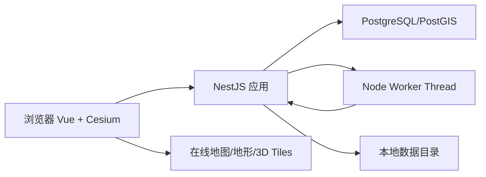

# 无人集群虚拟仿真实训软件 B/S MVP 简化方案

## 1. 目标

本方案只解决第一版“能开发、能部署、能完成教学闭环”的问题，不提前建设复杂的分布式架构。

MVP 完成以下流程：

> 教师配置场景 → 发布实训 → 学生编组和规划航线 → 运行仿真 → 查看问题 → 修改并再次运行 → 提交和导出

第一版包含：

- 城市集群表演场景。
- 城市物流配送场景。
- Cesium 在线地图。
- 2D/3D 模式切换。
- 20 架无人机稳定仿真，最多支持 50 架。
- 碰撞、间距、禁飞区、障碍物、超时、航程和任务完成检查。

第一版不包含：

- 真机和飞控接入。
- 固定任务库。
- 高精度动力学和复杂气象场。
- 自动最优规划和自动物流调度。
- Redis、RabbitMQ、MinIO、微服务和 Kubernetes。
- 千机或高并发云仿真。

## 2. 最小技术栈

统一使用 TypeScript，降低人员和工具链成本。

| 部分 | 技术 |
|---|---|
| 前端 | Vue 3 + TypeScript + Vite |
| 地图 | CesiumJS |
| UI | Element Plus + 少量自定义工作台组件 |
| 状态 | Pinia |
| 后端 | Node.js 24 + NestJS 11 |
| 仿真 | TypeScript + Node `worker_threads` |
| 数据库 | PostgreSQL + PostGIS |
| ORM | TypeORM |
| 本地草稿 | 浏览器 IndexedDB |
| 认证 | JWT，放在 HttpOnly Cookie |
| 部署 | Docker Compose |
| 测试 | Vitest + Playwright + NestJS/Jest |

建议锁定当前经过验证的稳定版本，不在开发过程中频繁升级 Cesium、Vue、Vite 和 TypeScript。

## 3. 为什么改成全 TypeScript

相较上一版 Vue + Java + 多个中间件的方案，本方案只需要一类开发语言和一个包管理器：

- 前后端和仿真模型均使用 TypeScript。
- 场景、方案和结果类型可以直接共享。
- 一个仓库、一个 `pnpm` workspace 即可开发。
- 一个应用容器和一个数据库容器即可运行。
- 第一版 20-50 架简化仿真不需要 Java、Rust 或 C++。

如果以后性能验证证明 Node 仿真不足，再单独替换仿真 Worker，不影响前端和业务 API。

## 4. 最小架构



只部署两个核心容器：

1. `app`：NestJS API，同时托管 Vue 构建后的静态文件。
2. `db`：PostgreSQL/PostGIS。

仿真结果文件保存到 `app` 容器挂载的数据目录，通过 Docker Volume 持久化。

```text
docker-compose.yml
  app
  db
```

学校已有 Nginx、HTTPS 或统一网关时，直接放在 `app` 前面；MVP 本身不强制增加第三个容器。

## 5. 项目结构

```text
wurenji/
  apps/
    web/                    # Vue + Cesium
    server/                 # NestJS API 和静态文件托管
  packages/
    shared/                 # 场景、方案、结果类型和 schema
    simulation/             # 仿真和规则计算
  data/
    simulation-runs/        # 仿真轨迹和导出结果
  docker/
  docker-compose.yml
  pnpm-workspace.yaml
  package.json
```

`packages/shared` 只能包含普通 TypeScript 类型、枚举和校验 schema，不能依赖 Vue、Cesium、NestJS 或数据库。

## 6. MVP 功能

### 6.1 教师端

- 登录并选择班级。
- 新建城市表演或城市物流实训。
- 配置无人机数量和统一性能参数。
- 在 Cesium 中配置作业边界、起飞点、目标点或配送点。
- 绘制障碍物、禁飞区和磁场干扰区。
- 设置风、雨、最大时间和安全距离。
- 执行场景完整性检查。
- 发布不可修改的场景版本。
- 查看学生提交状态和最终结果。

MVP 每个实训先使用一种无人机性能模板。多机型混编以后再增加。

### 6.2 学生端

- 打开教师发布的场景。
- 对无人机进行简单编组。
- 将目标、表演阶段或配送订单分配给无人机。
- 创建和修改航点。
- 设置航点高度、航段速度和起飞时间。
- 执行方案预检查。
- 提交服务端仿真。
- 在 2D/3D 地图中回放并定位问题。
- 修改后再次运行。
- 提交最终版本并导出结果。

### 6.3 仿真规则

首版只实现：

| 规则 | 判定 |
|---|---|
| 任务完成 | 目标或订单是否全部完成 |
| 多机冲突 | 两机三维距离是否小于安全距离 |
| 禁飞区 | 航迹是否进入禁飞区柱体 |
| 障碍物 | 航迹是否与简化障碍物相交 |
| 超时 | 总任务或单个任务是否超过时限 |
| 航程 | 环境修正后的航程是否超过上限 |
| 速度高度 | 是否超过教师配置或无人机性能 |
| 载重 | 物流订单是否超过无人机载重 |

每条问题输出：时间、位置、对象、实测值、阈值和简短修改建议。

## 7. Cesium 2D/3D

使用一个 Cesium `Viewer`，不创建两套地图。

```ts
function setMapMode(viewer: Cesium.Viewer, mode: "2d" | "3d") {
  if (viewer.scene.mode === Cesium.SceneMode.MORPHING) return

  if (mode === "2d") {
    viewer.scene.morphTo2D(0.6)
  } else {
    viewer.scene.morphTo3D(0.6)
  }
}
```

界面使用明确的分段按钮：

```text
[ 2D 规划 | 3D 场景 ]
```

2D 模式：

- 绘制边界、禁飞区、任务点和航线。
- 查看航线交叉、任务覆盖和整体布局。
- 高度仍然保存在数据中，通过标签和属性面板显示。

3D 模式：

- 查看高度、建筑、地形和三维禁飞区。
- 查看无人机运动、冲突位置和表演目标。
- 编辑航点高度。

切换时保持当前场景、选中对象、图层、仿真时间和问题定位。

## 8. 地图数据

MVP 地图配置：

- 在线影像底图。
- 可选在线地形。
- 城市建筑优先使用简化建筑体；有可用数据时再加载 3D Tiles。
- 无人机使用简单 GLB 模型，远距离降级为点或图标。

统一使用 WGS84 保存经纬度。距离、碰撞和航程计算时，将场景转换到局部 ENU 坐标，不能直接用经纬度计算距离。

如果地图供应商采用 GCJ-02，需要在接入阶段解决坐标偏移，不能把偏移数据写入业务场景。

## 9. 仿真实现

### 9.1 模型简化

- 固定时间步 `200 ms`，即每秒 5 个状态点。
- 航点之间采用直线插值。
- 起飞和降落采用简化垂直线段。
- 不计算姿态、升力和飞控闭环。
- 风作为速度向量和能耗系数。
- 雨作为最大速度和能耗系数。
- 磁场作为确定性的航迹横向偏移。

同一场景、方案和随机种子必须得到相同结果。

### 9.2 Worker Thread

完整仿真放在 Node `worker_threads` 中，避免阻塞 API：

```text
POST /simulation-runs
  → 创建运行记录
  → 放入应用内待运行队列
  → Worker Thread 计算
  → 保存结果
  → 浏览器轮询状态
```

MVP 同时运行 2-4 个仿真任务，其他任务显示“排队中”。并发数由服务器 CPU 配置决定。

应用重启时，将未完成的运行标记为失败，学生可以重新运行。第一版不实现分布式任务恢复。

### 9.3 冲突检测

50 架以内先使用直接两两检测，代码容易验证：

```text
每个 Tick：
  更新所有无人机位置
  对每两架无人机计算三维距离
  判断是否小于安全距离
  合并连续冲突时间段
```

只有性能测试不达标时再增加空间网格，不在 MVP 预先实现复杂索引。

### 9.4 轨迹结果

一次仿真完成后生成：

```text
data/simulation-runs/<run-id>/
  result.json.gz
  report.html
```

`result.json.gz` 包含摘要、问题和全部轨迹。浏览器一次下载、解压并回放。

建议限制：

- 最长仿真时间 10 分钟。
- 最大无人机数量 50 架。
- 固定 5 Hz 状态频率。
- 单个结果压缩后不超过 20 MB。

超过限制时拒绝运行并提示教师调整场景。

## 10. 最小数据模型

只使用以下主要表：

| 表 | 用途 |
|---|---|
| `users` | 教师、学生、管理员 |
| `classes` | 班级 |
| `class_members` | 班级成员 |
| `practices` | 实训基本信息和状态 |
| `scene_versions` | 教师发布的不可变场景 JSONB |
| `solutions` | 学生当前草稿 JSONB |
| `solution_versions` | 学生不可变方案 JSONB |
| `simulation_runs` | 仿真状态、摘要和结果文件路径 |
| `submissions` | 最终提交 |

边界、禁飞区、起飞点和配送点在 `scene_versions` 中保存完整 JSON，同时为需要查询的关键对象保存 PostGIS geometry。

## 11. 最小 API

| 方法 | 路径 | 用途 |
|---|---|---|
| `POST` | `/api/auth/login` | 登录 |
| `GET` | `/api/practices` | 实训列表 |
| `POST` | `/api/practices` | 新建实训 |
| `PUT` | `/api/practices/:id/scene` | 保存场景草稿 |
| `POST` | `/api/practices/:id/validate` | 场景检查 |
| `POST` | `/api/practices/:id/publish` | 发布场景 |
| `GET` | `/api/practices/:id/solution` | 获取学生方案 |
| `PUT` | `/api/solutions/:id` | 保存学生草稿 |
| `POST` | `/api/solutions/:id/versions` | 创建方案版本 |
| `POST` | `/api/solution-versions/:id/run` | 创建仿真 |
| `GET` | `/api/simulation-runs/:id` | 轮询运行状态和摘要 |
| `GET` | `/api/simulation-runs/:id/result` | 下载结果 |
| `POST` | `/api/practices/:id/submit` | 最终提交 |
| `GET` | `/api/practices/:id/progress` | 教师查看学生进度 |

MVP 使用每秒一次 HTTP 轮询仿真状态，不建设 WebSocket。

## 12. 草稿和版本

- 浏览器编辑时每 10 秒保存到 IndexedDB。
- 停止编辑 2 秒后自动同步到服务器。
- 教师发布时生成不可变场景版本。
- 学生每次运行前生成不可变方案版本。
- 最终提交绑定一个方案版本和一次成功的仿真结果。
- 使用简单版本号做乐观锁，避免两个标签页互相覆盖。

## 13. 安全最小要求

- 全部 API 校验角色和对象归属。
- JWT 放 HttpOnly、Secure Cookie，不存入 `localStorage`。
- 生产环境必须使用 HTTPS。
- 地图令牌使用最小权限和域名限制。
- 场景、方案和上传文件限制大小。
- 教师发布、学生提交和管理员操作记录审计日志。
- 服务端重新校验全部场景和方案数据，不能信任浏览器校验结果。

## 14. 开发与部署

### 14.1 本地开发

```text
前端：Vite 开发服务器
后端：NestJS watch 模式
数据库：Docker PostgreSQL/PostGIS
```

开发启动流程：

```bash
docker compose up -d db
pnpm install
pnpm dev
```

### 14.2 生产部署

Vue 构建产物复制到 NestJS 的静态目录，由同一个 `app` 服务访问：

```bash
docker compose up -d --build
```

部署后只有一个访问地址：

```text
http://服务器地址:3000
```

生产环境再通过学校现有网关配置域名和 HTTPS。

### 14.3 备份

- 每天备份 PostgreSQL。
- 每天备份 `data/simulation-runs`。
- 备份保留时间由学校确定，MVP 建议至少 30 天。

## 15. 实施计划

以 4-5 人团队、10-12 周为基线：

| 阶段 | 时间 | 结果 |
|---|---:|---|
| 技术 PoC | 1-2 周 | Cesium 2D/3D、绘制、20 架回放、NestJS 和 PostGIS 可运行 |
| 基础平台 | 2 周 | 登录、班级、实训、场景和方案保存 |
| 教师编辑器 | 2 周 | 场景对象、环境、规则、检查和发布 |
| 学生工作台 | 2 周 | 编组、任务分配、航线、参数和版本 |
| 仿真与规则 | 2 周 | Worker Thread、轨迹、规则和结果 |
| 双场景与交付 | 2 周 | 表演、物流、提交、导出、测试和部署 |

建议团队：

- 产品/教学设计 1 人。
- Vue/Cesium 前端 1-2 人。
- NestJS/仿真后端 1-2 人。
- 测试可由产品和开发共同承担，试点前增加专项测试。

## 16. MVP 验收

### 16.1 功能验收

1. 教师能从空白场景创建城市表演实训并发布。
2. 教师能从空白场景创建物流配送实训并发布。
3. 学生能完成编组、任务分配、航迹、高度、速度和起飞时间设置。
4. 2D 创建的对象切换到 3D 后位置和高度数据正确。
5. 3D 修改高度切换到 2D 后数据不丢失。
6. 仿真能够发现碰撞、禁飞区、超时和航程问题。
7. 点击问题能够跳转到对应时间和地图位置。
8. 学生修改后可以再次运行和提交。
9. 教师能够查看提交状态和最终结果。
10. 可以导出 JSON/CSV，并通过浏览器打印为 PDF。

### 16.2 性能验收

- 20 架、5 分钟任务在推荐服务器上 5 秒内完成仿真。
- 50 架、10 分钟任务可以运行，允许等待时间增加。
- 20 架 3D 回放保持 30 FPS 以上。
- 2D/3D 切换在 2 秒内完成。
- 同一输入重复运行结果一致。
- 30 名学生可以同时在线编辑，仿真任务允许排队。

## 17. 何时升级架构

只有出现以下情况才增加组件：

| 条件 | 升级措施 |
|---|---|
| 需要部署多个 `app` 实例 | 增加 Redis 保存共享状态 |
| 仿真队列需要跨服务器 | 增加 RabbitMQ 或 Redis/BullMQ |
| 结果文件超过单机磁盘能力 | 增加 MinIO/S3 |
| 单次仿真超过 100 架且性能不足 | 拆分 Rust/C++/Java 仿真服务 |
| 多学校需要独立租户和弹性扩缩 | 再考虑 Kubernetes 和多租户架构 |
| 需要离线或连接真机 | 再增加桌面客户端，不改 B/S 教学管理底座 |

第一版不要因为这些可能性提前增加部署和开发成本。

## 18. 最终结论

MVP 采用以下最小组合即可：

```text
Vue 3 + TypeScript + CesiumJS
NestJS + Node worker_threads
PostgreSQL + PostGIS
Docker Compose
```

这套方案只有一门开发语言、一个代码仓库、两个运行容器，可以完成教师配置、学生设计、2D/3D 地图、服务端仿真、规则检查和成果提交。先用它完成教学试点，再依据真实并发量、无人机数量和文件规模决定是否增加中间件或替换仿真内核。

