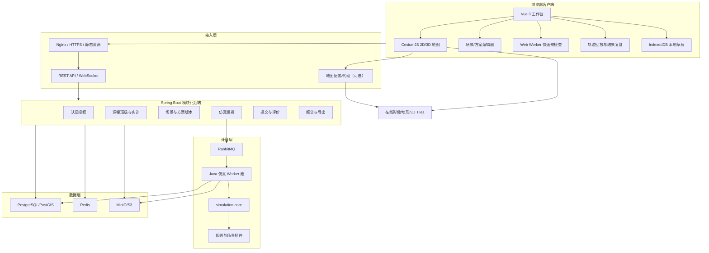
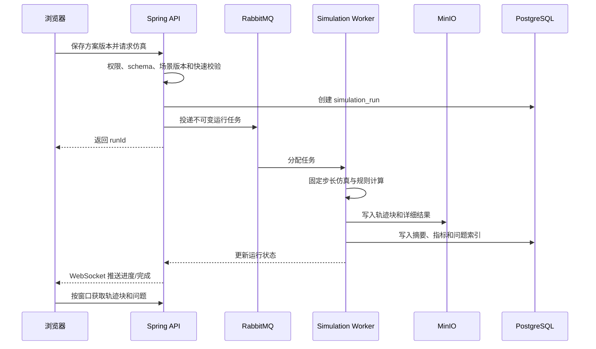
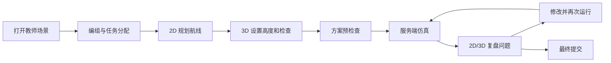
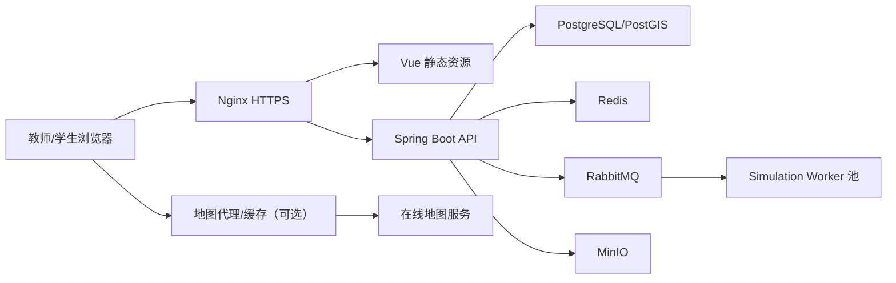

# 无人集群虚拟仿真实训软件 B/S 架构设计方案

## 1. 方案结论

本方案在现有产品原型和业务边界基础上，将技术架构从 C/S 桌面客户端调整为浏览器/服务器架构：教师和学生通过浏览器使用同一套仿真实训工作台，CesiumJS 负责在线地图、二维规划、三维场景与仿真回放，服务端负责场景与方案版本、权威仿真、规则判定、提交、报告和教学管理。

第一版继续保持以下产品边界：

- 纯虚拟仿真实训，不连接真机和飞控。
- 教师自由配置当次课程场景，不建设平台固定任务库。
- 第一版提供城市集群表演和城市物流配送。
- 后续通过场景插件增加应急救援。
- 风、雨、磁场使用简化参数模型。
- 不进行高精度动力学、气象场和传感器物理仿真。
- 学生手动完成编组、任务分配、航迹和飞行参数设计。

推荐技术路线：

> Vue 3 + TypeScript + CesiumJS 浏览器工作台，Java 21 + Spring Boot 模块化后端，独立 Java 仿真 Worker，PostgreSQL/PostGIS + Redis + RabbitMQ + MinIO，Docker Compose 起步。

## 2. 技术栈确认

### 2.1 推荐技术栈

| 层次 | 推荐技术 | 用途与选择理由 |
|---|---|---|
| 前端语言 | TypeScript | 场景、方案、规则和 API 类型约束 |
| 前端框架 | Vue 3 | 复杂表单、属性面板、对象树和工作台开发效率高 |
| 构建工具 | Vite | Cesium 静态资源、Worker 和开发构建支持成熟 |
| 三维地图 | CesiumJS | 同一引擎支持 2D 地图、3D 地球、地形、影像、3D Tiles 和时序对象 |
| 状态管理 | Pinia | UI、编辑器会话、选中对象和工作区状态 |
| 服务端状态 | TanStack Query for Vue | API 缓存、重试、失效和请求状态，不与 Pinia 混用职责 |
| UI 组件 | Element Plus | 教师后台、表单、表格、树和弹窗 |
| 图表 | Apache ECharts | 仿真状态曲线、指标和教学统计 |
| 本地草稿 | IndexedDB + Dexie | 自动保存、断线恢复和待同步草稿 |
| 前端测试 | Vitest + Vue Test Utils + Playwright | 单元、组件和真实浏览器交互测试 |
| 后端语言 | Java 21 LTS | 教学业务、空间规则、异步任务和长期维护 |
| 后端框架 | Spring Boot 4.1 | REST、WebSocket、安全、事务、监控和模块化应用 |
| 数据访问 | jOOQ + Flyway | 显式 SQL、PostGIS 查询和可审计数据库迁移 |
| API | REST/OpenAPI + WebSocket | 业务 CRUD、文件传输和仿真进度/事件推送 |
| 仿真内核 | 独立 Java Library | 与业务 UI 解耦，被仿真 Worker 复用 |
| 仿真调度 | RabbitMQ | 排队、重试、Worker 横向扩展和失败隔离 |
| 数据库 | PostgreSQL + PostGIS | 教学业务、版本元数据和空间几何 |
| 缓存 | Redis | 会话、短期进度、分布式锁和热点配置 |
| 对象存储 | MinIO/S3 | 轨迹块、模型、场景包、报告和导出文件 |
| 反向代理 | Nginx | HTTPS、静态资源、反向代理和缓存策略 |
| 可观测性 | OpenTelemetry + Prometheus + Grafana | 请求、仿真、队列和前端性能监控 |
| 部署 | Docker Compose，后续 Kubernetes | 学校私有化和云端扩展 |

### 2.2 2026-07-24 版本参考

经当前公开软件源确认，设计阶段可参考以下版本：

| 技术 | 当前参考版本 | 项目建议 |
|---|---:|---|
| CesiumJS | 1.143.0 | PoC 阶段固定精确版本 |
| Vue | 3.5.40 | 使用 Vue 3.5.x 稳定线 |
| Vite | 8.1.5 | 与 Node 版本一起锁定 |
| TypeScript | 7.0.2 | 先验证 Cesium、Vue 工具链兼容性再采用 |
| Pinia | 4.0.2 | 使用 4.x 稳定线 |
| Element Plus | 2.14.3 | 按需导入，避免全量包 |
| Spring Boot | 4.1.0 | Java 21 运行，使用 Maven 锁定依赖 |

版本表只作为当前技术确认，不建议在项目中使用宽泛的 `latest`。PoC 通过后将精确版本写入锁文件，并通过依赖升级评审统一更新。

### 2.3 为什么第一版不引入 Rust/C++/WASM

技术栈不受限制不等于应该增加更多语言。第一版目标为常规 50 架、设计容量 100 架，采用简化运动学和空间网格冲突检测，Java Worker 足以作为性能验证起点。

暂不引入 Rust/C++/WASM 的原因：

- 避免前端 TypeScript、业务 Java、仿真 Rust/C++ 三套工具链同时建设。
- 避免浏览器和服务端双实现带来的规则不一致。
- B/S 模式天然可以将完整仿真集中到可横向扩展的服务端 Worker。
- 只有性能测试证明 Java 无法达到目标时，才值得提取热点模块。

后续如果规模提升至数百架并发、多班级同时仿真或复杂连续碰撞检测，可以将 `simulation-core` 中的热点算法替换为 Rust/C++ 原生服务，外部协议和领域模型保持不变。

### 2.4 可替代但不推荐混用的方案

| 方案 | 何时采用 | 本项目判断 |
|---|---|---|
| React + Cesium | 团队 React 能力明显强于 Vue | 可完全替代 Vue，但不要两套框架并存 |
| Node/NestJS 后端 | 团队只有 TypeScript，且仿真另有独立 Worker | 教学业务可行，CPU 仿真仍需隔离 |
| Go 后端 | 团队擅长 Go，需要轻量高并发服务 | 业务报表和复杂事务生态不如当前 Java 方案直接 |
| Python 仿真 | 算法处于快速研究阶段 | 适合验证，不建议直接作为高并发生产内核 |
| 微服务 | 多团队独立交付、容量差异已明确 | 第一版没有必要，先采用模块化单体 + 独立 Worker |

## 3. 原型到 B/S 的映射

现有原型的信息架构继续使用：左侧对象/资源，中间 Cesium 地图，右侧属性/结果，底部仿真时间轴。变化发生在技术实现和浏览器约束，不改变教师、学生的核心操作语言。

| 原型能力 | C/S 实现 | B/S 实现 |
|---|---|---|
| 主工作台 | Qt `QMainWindow/QDockWidget` | Vue 路由页面 + CSS Grid 可调整面板 |
| 对象树 | `QTreeView` | 虚拟化树组件 + Pinia 编辑器状态 |
| 三维地图 | osgEarth/OSG | CesiumJS `Viewer/Scene` |
| 2D/3D | osgEarth 视图模式 | Cesium `morphTo2D/morphTo3D` |
| 属性面板 | Qt 表单控件 | Vue 表单 + schema 校验 |
| 撤销重做 | `QUndoStack` | 前端 Command Stack |
| 本地草稿 | SQLite/文件快照 | IndexedDB + 服务端草稿版本 |
| 本地完整仿真 | C++ 共享核心 | 服务端异步仿真 Worker |
| 快速预检查 | C++ 客户端核心 | Web Worker 中的 TypeScript 静态检查 |
| 仿真状态 | 本地内存和轨迹文件 | WebSocket 进度 + HTTP 轨迹分块 |
| 最终提交 | 服务端 C++ 复算 | 服务端 Java Worker 权威复算 |
| 客户端升级 | 安装包升级 | Web 静态资源发布和缓存版本控制 |

### 3.1 浏览器产品形态

- 面向桌面浏览器设计，推荐当前稳定版 Chrome/Edge。
- 建议最小工作区分辨率为 1366×768，推荐 1920×1080。
- 手机端第一版只提供进度和结果查看，不提供场景与航迹编辑。
- 浏览器必须支持 WebGL2；进入工作台前执行 GPU、WebGL、显存和浏览器版本检测。
- 工作台页面采用固定工具布局，不按普通响应式网站折叠成移动卡片。

## 4. B/S 总体架构



### 4.1 架构原则

1. 浏览器负责编辑、预览和结果表达，服务端负责完整仿真和最终判定。
2. 教师发布的场景、学生方案版本和仿真输入均为不可变快照。
3. 前端静态预检查只用于提前反馈，不能代替服务端权威规则。
4. 业务后端先做模块化单体，仿真 Worker 独立进程和独立扩缩容。
5. 表演、物流、救援通过场景插件扩展，共用地图、仿真、规则和教学底座。
6. 轨迹和报告放对象存储，数据库只保存索引、摘要和关键证据。
7. 2D 和 3D 使用同一个 Cesium `Viewer` 和同一份业务数据。

## 5. 前端架构

### 5.1 前端工程结构

```text
frontend/
  apps/
    web/
      src/
        app/
        routes/
        layouts/
        features/
        pages/
  packages/
    api-client/          # OpenAPI 生成客户端和 DTO
    domain-schema/       # 场景、方案、规则、结果 schema
    cesium-map/          # Cesium 生命周期和图层适配
    scene-editor/        # 教师场景配置
    mission-editor/      # 学生方案设计
    simulation-player/   # 时间轴、轨迹和状态曲线
    command-stack/       # 撤销重做
    ui/                  # 项目通用工作台组件
  public/
    cesium/              # Cesium Workers/Assets/Widgets/ThirdParty
  vite.config.ts
  pnpm-workspace.yaml
```

不建议第一版建设微前端。教师和学生工作台共享大量地图、对象树、属性编辑和结果组件，单一前端应用更容易保证版本和状态一致。

### 5.2 前端状态分层

| 状态类型 | 管理方式 | 示例 |
|---|---|---|
| 服务端状态 | TanStack Query | 课程、实训、场景版本、方案版本、仿真结果 |
| 工作区 UI 状态 | Pinia | 当前角色、模式、面板宽度、选中对象、地图模式 |
| 编辑文档状态 | 专用 Document Store | 场景草稿、学生方案、脏状态和版本 |
| 撤销重做 | Command Stack | 添加航点、移动对象、批量高度和任务分配 |
| 短期地图对象 | Cesium Adapter | Entity/Primitive 映射和图层可见性 |
| 本地恢复状态 | IndexedDB | 未同步草稿、最近打开和轨迹缓存索引 |

不要将 Cesium `Entity`、`Primitive`、`Cartesian3` 等对象直接存入 Pinia。状态层保存稳定业务 ID 和普通序列化数据，地图适配层负责转换。

### 5.3 前端领域命令

编辑器继续采用命令模型：

- `AddWaypointCommand`
- `MoveWaypointCommand`
- `DeleteWaypointCommand`
- `AssignTaskCommand`
- `CreateGroupCommand`
- `BatchSetAltitudeCommand`
- `AddNoFlyZoneCommand`
- `ChangeEnvironmentCommand`

每条命令包含执行、撤销、受影响对象和简短摘要。自动保存持久化的是文档快照，不需要将每个鼠标移动事件永久保存到服务器。

### 5.4 Web Worker 使用边界

Web Worker 承担不会改变最终评分的快速计算：

- 场景 JSON/schema 校验。
- 航线长度和预计时间计算。
- 任务遗漏、重复分配和明显载重超限。
- 简单航线与禁飞区相交检查。
- 大场景序列化和差异摘要。
- 轨迹块解码、抽稀和预处理。

完整多机时序仿真、环境扰动、连续冲突检测和最终规则结果由服务端 Worker 完成。

## 6. Cesium 地图设计

### 6.1 单实例 2D/3D 架构

2D 和 3D 不使用两套地图引擎，也不创建两个 Cesium Viewer。工作台只维护一个 `Viewer`：

- 进入场景默认使用教师或学生上次保存的视图模式。
- 通过自定义分段按钮调用 `scene.morphTo2D()` 或 `scene.morphTo3D()`。
- 切换期间锁定地图编辑，防止拾取坐标和相机状态不稳定。
- `morphComplete` 后恢复编辑并更新按钮状态。
- 业务对象、选中对象、时间轴和仿真状态在切换前后保持不变。

示例：

```ts
type MapMode = "2d" | "3d"

function changeMapMode(viewer: Cesium.Viewer, mode: MapMode) {
  if (viewer.scene.mode === Cesium.SceneMode.MORPHING) return

  mapWorkspace.setMorphing(true)
  if (mode === "2d") {
    viewer.scene.morphTo2D(0.8)
  } else {
    viewer.scene.morphTo3D(0.8)
  }
}

viewer.scene.morphComplete.addEventListener(() => {
  mapWorkspace.setMode(
    viewer.scene.mode === Cesium.SceneMode.SCENE2D ? "2d" : "3d"
  )
  mapWorkspace.setMorphing(false)
  viewer.scene.requestRender()
})
```

### 6.2 Viewer 初始化

```ts
const viewer = new Cesium.Viewer(container, {
  sceneMode: Cesium.SceneMode.SCENE3D,
  sceneModePicker: false,
  baseLayerPicker: false,
  geocoder: false,
  homeButton: false,
  navigationHelpButton: false,
  animation: false,
  timeline: false,
  fullscreenButton: false,
  selectionIndicator: false,
  infoBox: false,
  requestRenderMode: true,
  maximumRenderTimeChange: Number.POSITIVE_INFINITY
})
```

使用自研工作台工具栏和底部仿真时间轴，不启用 Cesium 默认的场景模式、动画和信息框控件，避免与原型交互体系重复。

### 6.3 2D 模式职责

2D 模式主要用于高密度规划和空间关系检查：

- 绘制作业边界、禁飞区、磁场区域和障碍物轮廓。
- 创建起飞点、目标点、配送点和二维航迹。
- 批量检查航迹平面交叉和任务覆盖。
- 通过标签、线型或颜色表达高度层。
- 进行订单分配、编组和航线总览。

2D 模式不会丢弃高度数据。航点高度继续保存在方案中，只是不通过垂直位置直观展示，由标签、属性面板和高度配色表达。

### 6.4 3D 模式职责

3D 模式用于：

- 检查航迹高度、地形、建筑和三维禁飞体关系。
- 编辑航点高度和观察垂直分层。
- 查看 3D Tiles 城市模型或简化建筑体。
- 运行多机仿真和观察三维冲突。
- 从观众视角检查表演阶段目标点和队形。
- 复盘风险发生时的空间位置。

### 6.5 模式切换一致性

切换时保持：

- 当前场景和方案版本。
- 对象树展开状态。
- 选中对象和批量选择集。
- 图层开关。
- 仿真当前时间。
- 当前问题和涉及无人机。
- 编辑工具，无法在目标模式使用的工具除外。

相机策略：

- 3D 转 2D：以当前视口中心和覆盖范围生成北向上的二维视图。
- 2D 转 3D：以当前二维中心和范围恢复预设倾角的三维相机。
- 每个场景分别保存最近的 2D 和 3D 相机状态。
- “回到场景”按钮按当前模式加载对应默认相机。

### 6.6 编辑层与回放层

| 使用场景 | Cesium 表达 |
|---|---|
| 教师/学生编辑对象 | Entity API，便于拾取、标签和属性绑定 |
| 禁飞区和边界 | Polygon/Polyline Entity，发布后可转 Primitive |
| 城市障碍物 | 3D Tiles/GLB 用于显示，简化碰撞体用于规则 |
| 少量无人机回放 | Entity + SampledPositionProperty |
| 50-100 架回放 | 分块状态缓冲 + Billboard/Point/Model 分级显示 |
| 大量静态航迹 | Primitive/GeometryInstance |
| 风险位置 | 独立 Diagnostic DataSource |

设计模式和仿真模式使用不同 `CustomDataSource` 或图层组，禁止把所有对象混入一个不可管理的 Entity 集合。

建议图层：

```text
imagery-layer
terrain-layer
city-tiles-layer
teacher-constraint-layer
teacher-task-layer
student-plan-layer
simulation-drone-layer
simulation-trail-layer
diagnostic-layer
selection-layer
```

### 6.7 仿真回放性能

仿真计算和地图播放分离：

- 服务端生成固定 Tick 的权威轨迹。
- 轨迹按 5-10 秒时间窗口分块。
- 浏览器只预取当前时间前后窗口。
- Web Worker 解码和抽稀轨迹块。
- 播放器用统一仿真时钟对位置进行插值。
- 远距离显示点或图标，近距离和选中无人机显示 GLB 模型。
- 非选中历史航迹按时间窗口截断，不持续累积全部线段。
- 回放开始时关闭 `requestRenderMode` 或主动持续请求渲染，暂停后恢复按需渲染。

不能将每架无人机每个 Tick 作为一条 WebSocket 消息实时推送。WebSocket 只推送任务进度、关键事件和完成通知，轨迹块通过 HTTP 获取。

### 6.8 地图数据与坐标

地图数据适配：

- 影像：Cesium ion、XYZ、TMS、WMTS 或受支持的在线地图服务。
- 地形：Cesium World Terrain 或学校自建地形服务。
- 城市场景：3D Tiles、倾斜摄影或简化建筑模型。
- 业务矢量：WGS84 GeoJSON/自有 JSON。
- 无人机模型：glTF/GLB。

统一坐标：

- 持久化：WGS84 经度、纬度、高度。
- 高度必须记录椭球高、海拔或离地高基准。
- 服务端空间规则：场景原点 ENU/ECEF。
- PostGIS 几何使用明确 SRID。
- 不直接使用经纬度计算欧氏距离、航程和碰撞。

国内地图服务如果使用 GCJ-02 或其他坐标体系，必须在地图适配层处理并在采购/接入阶段验证许可。业务场景、GPS 语义和仿真内核仍以 WGS84 为权威。

### 6.9 地图密钥和代理

浏览器中的令牌无法真正隐藏。应采用：

- 最小权限的公开客户端令牌。
- 域名白名单、来源限制和用量配额。
- 高权限操作通过后端完成。
- 支持通过校园地图网关代理需要保护的地图服务。
- 地图服务配置由后端按学校/环境下发，不写死在前端代码中。
- 监控地图请求量、失败率和配额。

## 7. 后端架构

### 7.1 模块化单体

```text
platform-server/
  identity/          用户、角色、登录、OIDC
  organization/      学校、班级、成员
  teaching/          课程、实训、发布、进度
  scene/             教师场景草稿、检查和发布版本
  solution/          学生草稿、版本和同步
  simulation/        运行创建、任务编排和结果查询
  submission/        最终提交、权威复算和状态机
  reporting/         成果、成绩和文件导出
  asset/             地图配置、模型和文件元数据
  audit/             关键业务操作审计
```

第一版部署为一个 Spring Boot API 应用，模块通过应用接口交互。仿真 Worker 独立部署，不与 API 进程共享线程池和内存预算。

### 7.2 仿真内核模块

```text
simulation-libs/
  mission-domain/
  geo-core/
  trajectory-core/
  environment-model/
  simulation-core/
  rule-engine/
  scenario-sdk/
  plugins/
    common-rules/
    city-show/
    city-logistics/
    emergency-rescue/   # 后续
```

共享内核不依赖 Spring MVC、数据库和 Cesium。Worker 从不可变输入快照构建仿真世界，输出摘要、问题、指标和轨迹块。

### 7.3 仿真运行流程



### 7.4 本地预检查与权威结果

| 能力 | 浏览器 | 服务端 |
|---|---|---|
| 字段完整性 | 是 | 是 |
| 任务遗漏/重复 | 是 | 是 |
| 载重明显超限 | 是 | 是 |
| 航线长度和预计时间 | 是，估算 | 是，权威 |
| 简单禁飞区相交 | 是，提示 | 是，连续检测 |
| 多机三维冲突 | 可选粗略提示 | 是，权威 |
| 风雨磁场影响 | 只展示参数影响摘要 | 是 |
| 航程/能耗 | 估算 | 是 |
| 最终完成率和成绩 | 否 | 是 |

浏览器与服务端应共享 JSON Schema、枚举和规则元数据，但不共享两套完整仿真实现。

### 7.5 最终提交

最终提交必须：

1. 固定教师场景版本和学生方案版本。
2. 创建新的权威仿真，不能直接复用浏览器显示的本地结果。
3. 保存仿真内核、规则、插件、随机种子和时间步版本。
4. 权威仿真成功后才将提交置为完成。
5. Worker 异常不计为学生失败，不产生错误成绩。
6. 教师查看的结果与提交绑定，不随规则后续升级而改变。

## 8. 数据架构

### 8.1 核心关系

```mermaid
erDiagram
    USER ||--o{ CLASS_MEMBER : joins
    CLASS ||--o{ CLASS_MEMBER : contains
    COURSE ||--o{ PRACTICE : contains
    PRACTICE ||--o{ SCENE_DRAFT : edits
    PRACTICE ||--|| SCENE_VERSION : publishes
    SCENE_VERSION ||--o{ SOLUTION : constrains
    USER ||--o{ SOLUTION : owns
    SOLUTION ||--o{ SOLUTION_VERSION : versions
    SOLUTION_VERSION ||--o{ SIMULATION_RUN : runs
    SIMULATION_RUN ||--o{ RULE_FINDING : produces
    SOLUTION_VERSION ||--o| SUBMISSION : submits
    SUBMISSION ||--|| SIMULATION_RUN : authoritative_run
```

### 8.2 存储划分

| 数据 | 存储位置 |
|---|---|
| 用户、课程、班级、实训 | PostgreSQL |
| 发布场景和方案版本元数据 | PostgreSQL |
| 空间边界、禁飞区、任务点 | PostGIS |
| 当前草稿快照 | PostgreSQL JSONB/对象存储，按大小选择 |
| 浏览器本地未同步草稿 | IndexedDB |
| 仿真摘要、指标、问题索引 | PostgreSQL |
| 大体积轨迹和详细结果 | MinIO/S3 |
| GLB、3D Tiles 配置和报告 | MinIO/S3 |
| 运行进度和临时状态 | Redis |
| 仿真任务 | RabbitMQ |

### 8.3 快照规则

- 教师编辑的是 `scene_draft`。
- 发布后形成不可变 `scene_version`。
- 学生工作区是 `solution`。
- 手动运行或提交前形成不可变 `solution_version`。
- `simulation_run` 只能绑定不可变版本。
- 每个仿真记录固定环境参数、规则版本和随机种子。

### 8.4 轨迹格式

```text
simulation-runs/<run-id>/
  manifest.json
  summary.json
  findings.json
  metrics.json
  trajectories/
    chunk-000001.bin
    chunk-000002.bin
  report/
    result.pdf
```

轨迹块采用版本化二进制格式或 Protobuf，并由 HTTP gzip/Brotli 压缩传输。浏览器根据 `manifest.json` 只下载当前回放窗口附近的块。

## 9. API 设计

### 9.1 REST API

| 方法与路径 | 用途 |
|---|---|
| `POST /api/v1/auth/login` | 登录 |
| `GET /api/v1/courses` | 课程列表 |
| `POST /api/v1/practices` | 新建实训 |
| `GET /api/v1/practices/{id}` | 实训详情 |
| `PUT /api/v1/practices/{id}/scene-draft` | 保存教师场景草稿 |
| `POST /api/v1/practices/{id}/scene-draft/validate` | 场景检查 |
| `POST /api/v1/practices/{id}/publish` | 发布场景版本 |
| `GET /api/v1/practices/{id}/solution` | 学生工作区 |
| `PUT /api/v1/solutions/{id}/draft` | 同步学生草稿 |
| `POST /api/v1/solutions/{id}/versions` | 创建方案版本 |
| `POST /api/v1/solution-versions/{id}/simulation-runs` | 创建仿真 |
| `GET /api/v1/simulation-runs/{id}` | 获取运行摘要和状态 |
| `GET /api/v1/simulation-runs/{id}/findings` | 获取问题 |
| `GET /api/v1/simulation-runs/{id}/trajectory-manifest` | 获取轨迹索引 |
| `POST /api/v1/practices/{id}/submissions` | 最终提交 |
| `GET /api/v1/practices/{id}/student-progress` | 教师查看进度 |
| `POST /api/v1/exports` | 创建导出任务 |

### 9.2 WebSocket 事件

- `simulation.queued`
- `simulation.progress`
- `simulation.completed`
- `simulation.failed`
- `solution.sync.conflict`
- `practice.updated`
- `export.completed`

WebSocket 不承载大轨迹和报告文件。

### 9.3 并发控制

- 教师场景草稿和学生方案草稿使用版本号/ETag 乐观锁。
- 同一学生默认只允许一个主编辑会话。
- 第二个浏览器标签页可以只读打开或接管编辑权。
- 自动保存冲突时保留本地副本，不静默覆盖服务器版本。
- 发布和提交使用幂等键，重复点击不会生成多份数据。

## 10. 教师与学生工作流

### 10.1 教师配置


教师主要在 2D 模式完成平面对象配置，在 3D 模式完成高度、建筑和视觉检查。模式切换不改变场景数据。

### 10.2 学生设计与仿真



### 10.3 原型调整点

现有原型工具栏中的单一“3D”按钮改为明确分段控制：

```text
[ 2D 规划 | 3D 场景 ]
```

- 显示当前模式，不使用循环切换按钮。
- 切换期间显示短暂进度状态并禁用编辑工具。
- 2D 模式隐藏不适用的观众视角和垂直拖动工具。
- 3D 模式显示地形、3D Tiles、航点高度和无人机模型。
- 结果列表点击后在当前模式定位；用户可以保持问题选中并切换另一模式观察。

## 11. 安全设计

### 11.1 身份与权限

- 使用 OIDC/OAuth 2.1 或安全服务端会话。
- 接口执行学校/租户、角色和对象三级授权。
- 教师只能发布自己有权限的班级实训。
- 学生只能访问自己所在班级和自己的方案。
- 最终提交、评分、导出和管理员操作记录审计。

### 11.2 Web 安全

- HTTPS、HSTS、CSP、CSRF 防护和严格 CORS。
- Access Token 优先使用安全 Cookie 或内存保存，避免长期放 `localStorage`。
- 用户输入、任务说明和报告内容进行输出编码，防止 XSS。
- 上传文件检查类型、大小、压缩展开大小和路径穿越。
- 对 GLB、3D Tiles、GeoJSON 和压缩包设置解析复杂度限制。
- 下载使用短期签名 URL，避免对象存储桶公开。
- 重要接口执行速率限制和幂等控制。

### 11.3 教学结果可信性

- 浏览器计算结果不作为最终成绩依据。
- 发布场景和提交方案使用不可变快照。
- 服务端记录规则版本和内核版本。
- 权威仿真失败与学生方案失败使用不同状态。
- 教师修改场景后必须发布新版本，不影响已经开始的学生方案。

## 12. 部署架构

### 12.1 校园私有化部署



### 12.2 Docker Compose 组件

- `nginx`
- `platform-server`
- `simulation-worker`，可启动多个副本
- `postgres-postgis`
- `redis`
- `rabbitmq`
- `minio`
- 可选 `map-proxy`
- `prometheus`
- `grafana`

小规模试点可以将全部服务部署在一台服务器，但 Worker 仍使用独立容器并设置 CPU/内存限额。

### 12.3 推荐服务器基线

首个 50 人教学班试点建议：

- 16 核 CPU。
- 64 GB 内存。
- 1 TB NVMe 数据盘。
- 独立备份盘或远端备份存储。
- 千兆校园网。
- Worker 并发数根据单次仿真实测 CPU 和内存调整。

这只是容量估算起点，必须在技术验证阶段使用真实 50/100 架场景压测后确定。

## 13. 性能设计

### 13.1 前端指标

- 首次加载不包含地图数据时，核心应用资源压缩后控制在合理范围，Cesium 独立分包。
- 工作台可交互时间目标小于 5 秒，地图资源另行显示进度。
- 50 架常规回放保持 30 FPS 以上。
- 100 架回放允许模型降级，但交互不能阻塞。
- 2D/3D 模式切换在 2 秒内完成并保持选择状态。
- 编辑操作反馈小于 100 ms。
- 自动保存不阻塞地图和输入。

### 13.2 服务端指标

- 常规 API P95 小于 500 ms。
- 50 架、10 分钟、100 ms Tick 的仿真目标 10 秒内完成。
- 仿真排队、计算和结果上传分别监控。
- 相同输入重复运行结果完全一致，浮点边界规则采用明确 epsilon。
- Worker 失败可以重试且不会重复生成最终提交。

### 13.3 Cesium 优化

- 路由拆分 Cesium 工作台，普通管理页面不加载 Cesium 包。
- 设计态优先使用 Entity，发布态和大量静态对象转 Primitive。
- 使用 `requestRenderMode` 降低静止场景 GPU 消耗。
- 3D Tiles 设置合理屏幕空间误差和最大内存。
- 图层按需加载，退出工作台时销毁事件、DataSource 和 Viewer。
- 监听 WebGL context lost，保存草稿并提供重建地图操作。
- 地图对象使用稳定 ID 增量更新，不因单个属性变化重建全场景。

## 14. 可观测性

### 14.1 关联字段

- `request_id`
- `user_id`
- `practice_id`
- `scene_version_id`
- `solution_version_id`
- `simulation_run_id`
- `browser_session_id`

### 14.2 核心指标

前端：

- 页面加载、Cesium 初始化、在线地图首帧时间。
- 2D/3D 切换耗时和失败率。
- FPS、长任务、内存、WebGL context lost。
- IndexedDB 保存失败和同步冲突。

服务端：

- API 延迟和错误率。
- WebSocket 在线连接数。
- 仿真队列长度、等待时间、运行时间和失败率。
- 每条规则耗时和命中数量。
- 轨迹大小、对象存储耗时和地图代理用量。

## 15. 测试设计

### 15.1 前端测试

| 测试 | 内容 |
|---|---|
| 单元测试 | 坐标转换、命令撤销、schema、任务预检查和状态机 |
| 组件测试 | 对象树、属性面板、任务分配、时间轴和结果列表 |
| Cesium 适配测试 | 图层增删、选择映射、2D/3D 状态和 Viewer 销毁 |
| E2E | 教师发布、学生设计、运行、复盘、修改和提交 |
| 视觉回归 | 1366×768、1440×900、1920×1080 工作台截图 |
| GPU 测试 | Intel 核显、NVIDIA、AMD 和学校目标设备 |

### 15.2 2D/3D 专项验收

1. 在 2D 创建航点并切换 3D，位置和高度数据不变化。
2. 在 3D 修改高度并切换 2D，标签和属性显示正确。
3. 切换前选中的无人机、任务和问题保持选中。
4. 仿真暂停时切换模式，时间和无人机状态保持一致。
5. 问题定位后切换模式，仍然聚焦同一空间范围。
6. 连续切换 100 次无事件泄漏、内存持续增长和 WebGL 异常。
7. 2D/3D 使用同一业务坐标，禁止出现地图偏移。
8. 在线地图或 3D Tiles 失败时，业务对象仍可显示并保存。

### 15.3 仿真黄金数据

继续沿用 C/S 方案中的规则黄金数据：

- 航线空间相交但时间错开不应冲突。
- 同时同点到达必须冲突。
- 高速穿越不能漏检。
- 禁飞区边界包含规则明确。
- 顺风、逆风、侧风结果可验证。
- 物流遗漏、重复、超载、超时分别命中。
- 表演阶段未覆盖、队形误差和到达超时分别命中。
- 相同输入重复运行摘要、问题和轨迹校验值一致。

## 16. 实施计划

### 16.1 周期建议

以 7-9 人团队、约 22 周为基线：

| 阶段 | 周期 | 工作 | 退出条件 |
|---|---:|---|---|
| 0. 技术验证 | 1-3 周 | Cesium 集成、2D/3D、编辑、100 架回放、地图授权 | 技术 PoC 和性能报告通过 |
| 1. 平台基础 | 4-7 周 | Vue 工程、登录、课程班级、数据版本、Spring 模块 | 浏览器可登录并保存场景草稿 |
| 2. 教师场景编辑 | 6-11 周 | 对象树、2D/3D 绘制、资源、环境、场景检查 | 教师可发布一个有效场景 |
| 3. 仿真与规则 | 7-14 周 | Java 内核、Worker、队列、轨迹、通用规则 | 固定输入结果确定并可回放 |
| 4. 学生方案工作台 | 11-16 周 | 编组、任务、航迹、参数、版本和预检查 | 完成设计—运行—修改闭环 |
| 5. 双场景插件 | 15-18 周 | 表演阶段、队形目标、物流订单和场景规则 | 两个验收场景通过 |
| 6. 教学结果与交付 | 18-22 周 | 提交、教师查看、报告、性能、安全和部署 | 完成试点验收 |

### 16.2 团队建议

| 角色 | 人数 |
|---|---:|
| 产品/教学设计 | 1 |
| UI/UX | 1 |
| Vue/Cesium 前端 | 2-3 |
| Java 后端 | 2 |
| 仿真算法/空间计算 | 1-2 |
| 测试 | 1 |

至少一名前端工程师需要真正理解 Cesium Scene、Entity/Primitive、坐标、高度、3D Tiles 和 GPU 性能，不能只具备普通 Vue 页面经验。

### 16.3 第一阶段 PoC

第 1-3 周必须完成：

1. Vite + Vue + CesiumJS 最小工程和生产构建。
2. 在线影像、地形、3D Tiles 和地图令牌方案验证。
3. 自定义 2D/3D 分段切换，保持对象、选择和相机范围。
4. 2D/3D 创建、拖动航点，绘制禁飞区和障碍物。
5. 加载 100 架无人机轨迹并完成回放。
6. 验证 Entity 与 Primitive 两种实现的 FPS 和内存。
7. 服务端运行一个 50 架、10 分钟仿真并流式反馈进度。
8. 轨迹分块、浏览器解码和按窗口加载。
9. Intel 核显和目标机房电脑验证。
10. 输出技术版本锁定和性能预算。

PoC 未达到目标时，先调整 Cesium 表达和轨迹加载策略，不进入完整业务开发。

## 17. 风险与控制

| 风险 | 控制措施 |
|---|---|
| 浏览器加载 Cesium 和城市数据过慢 | 独立分包、地图进度、3D Tiles LOD、校园缓存 |
| 2D/3D 出现对象或选择状态不一致 | 单 Viewer、单业务模型、模式切换状态机和专项测试 |
| 大量 Entity 导致回放掉帧 | 设计/回放分层，Primitive、分块、抽稀和模型降级 |
| 多学生并发仿真排队 | 独立 Worker 池、队列、配额、优先级和容量压测 |
| 浏览器关闭导致草稿丢失 | IndexedDB 本地优先保存、服务端节流同步和恢复提示 |
| 前后端规则不一致 | 浏览器只做预检查，服务端唯一权威仿真与评分 |
| 在线地图服务不稳定或超配额 | 地图适配层、用量监控、校园代理/缓存和备用图层 |
| 国内地图坐标偏移 | WGS84 权威数据、供应商坐标确认和接入验收 |
| 表演场景范围膨胀 | 第一版不做音乐、灯效和任意三维图案编辑 |
| 技术版本更新频繁 | 锁文件、SBOM、升级评审和自动化回归 |

## 18. B/S 与 C/S 方案取舍

| 维度 | B/S + Cesium | C/S + Qt/osgEarth |
|---|---|---|
| 安装升级 | 浏览器即用、统一发布 | 需要客户端安装和升级 |
| 多学校部署 | 更适合 | 维护成本较高 |
| 教师管理和统计 | 更适合 | 可以实现但效率较低 |
| 在线地图和 3D Tiles | Cesium 生态直接 | 可用但集成复杂 |
| 2D/3D 切换 | 引擎原生支持 | 需要更多视图集成工作 |
| 离线和弱网 | 需要校园缓存/私有部署 | 客户端更有优势 |
| 真机和本地硬件 | 较弱 | 更有优势，但本项目不需要 |
| 本地重计算 | 受浏览器限制 | C++ 客户端更强 |
| 第一版交付速度 | 更快 | 工具链和发布更复杂 |

本项目已经明确为纯仿真软件、不连接真机，且教师和学生都需要统一教学数据，因此 B/S + Cesium 比 C/S 更匹配第一版产品目标。

## 19. 最终推荐

最终确认采用：

```text
前端：Vue 3 + TypeScript + Vite + CesiumJS
状态：Pinia + TanStack Query
UI：Element Plus + 自定义仿真工作台组件
图表：ECharts
本地草稿：IndexedDB/Dexie
后端：Java 21 + Spring Boot 4.1
数据访问：jOOQ + Flyway
仿真：Java simulation-core + 独立 Worker
协议：REST/OpenAPI + WebSocket + 分块二进制轨迹
数据库：PostgreSQL + PostGIS
缓存：Redis
队列：RabbitMQ
对象存储：MinIO/S3
接入：Nginx
部署：Docker Compose，后续 Kubernetes
测试：Vitest + Playwright + JUnit 5 + Testcontainers
```

这一组合将浏览器端的 Cesium 2D/3D 规划与服务端确定性仿真分开，避免让浏览器承担权威计算，也避免第一版引入多语言仿真内核。它能够直接复用现有产品原型的信息架构，并以较低部署成本覆盖教师配置、学生设计、仿真复盘和教学管理完整闭环。

## 20. 版本确认来源

- CesiumJS npm：`https://registry.npmjs.org/cesium/latest`
- Vue npm：`https://registry.npmjs.org/vue/latest`
- Vite npm：`https://registry.npmjs.org/vite/latest`
- TypeScript npm：`https://registry.npmjs.org/typescript/latest`
- Pinia npm：`https://registry.npmjs.org/pinia/latest`
- Element Plus npm：`https://registry.npmjs.org/element-plus/latest`
- Spring Initializr：`https://start.spring.io/metadata/client`

