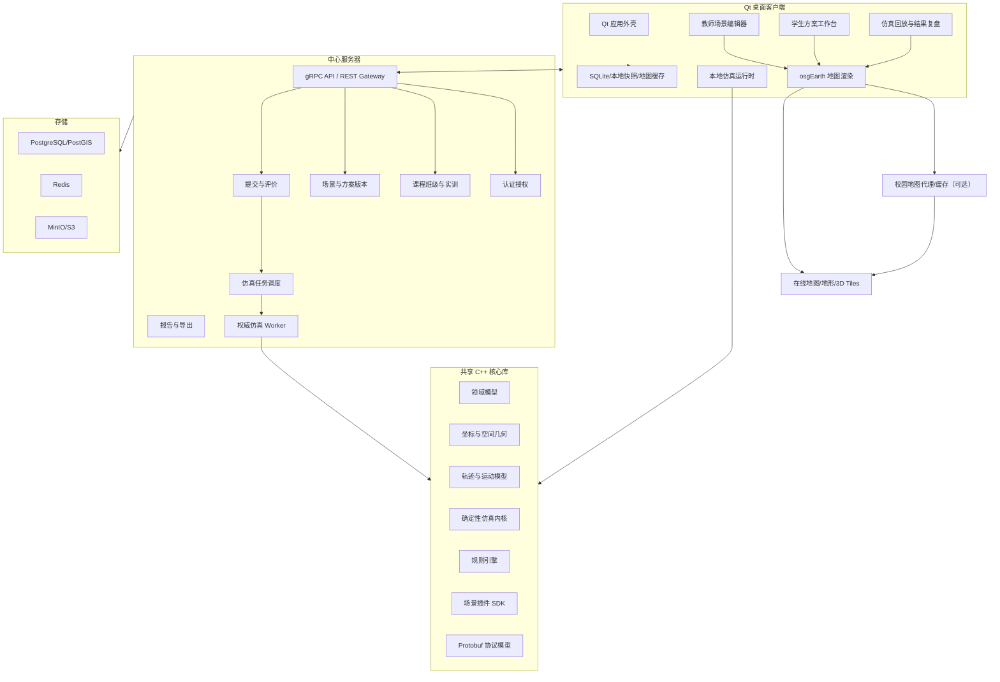
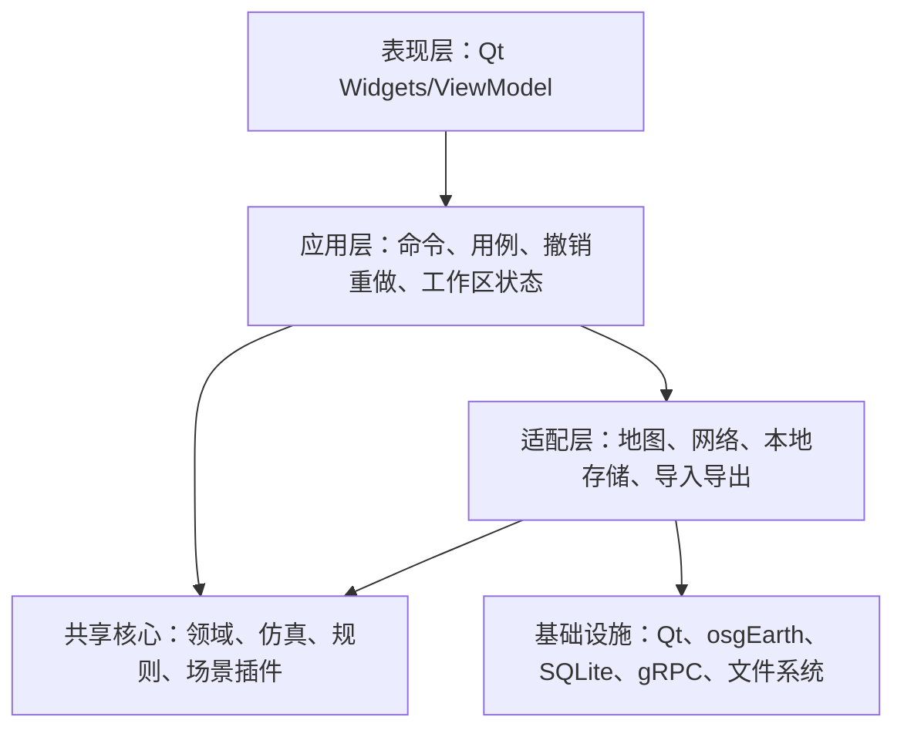
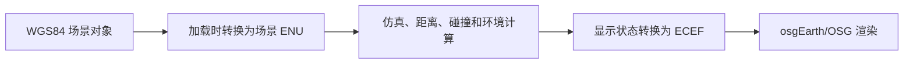
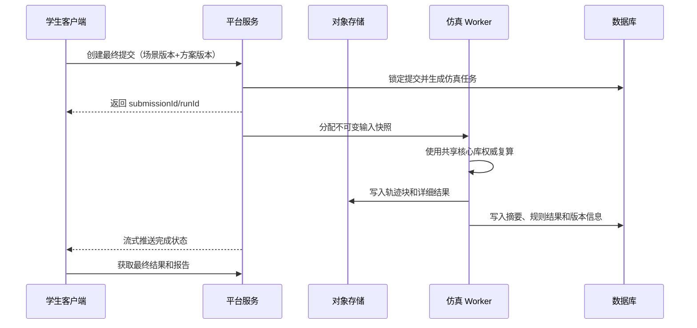
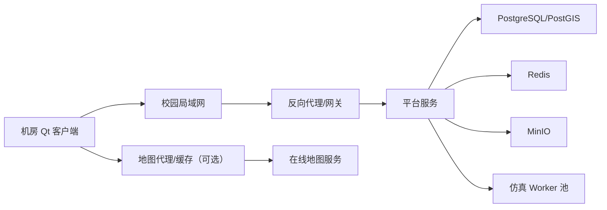

# 无人集群虚拟仿真实训软件 C/S 架构设计

## 1. 架构目标

本架构服务于纯虚拟仿真实训，不承担真机控制和高精度飞行动力学。第一版支持城市集群表演、城市物流配送两个场景，后续通过插件增加应急救援。

架构重点解决：

- 教师可以自由配置场景，不依赖固定任务库。
- 学生可以低延迟设计和重复仿真。
- 客户端和服务器使用同一套仿真与规则逻辑。
- 同一输入产生确定、可复现的结果。
- 场景类型扩展时不复制仿真底座。
- Windows 教学终端能够稳定安装、运行和升级。

## 2. 技术基线

| 领域 | 技术选择 | 说明 |
|---|---|---|
| 语言 | C++17 最低，项目代码可使用 C++20 子集 | 与 Qt、OSG、osgEarth 生态保持兼容 |
| 客户端 UI | Qt 6.8 LTS、Qt Widgets | 适合复杂桌面工作台和长期维护 |
| 三维地图 | OpenSceneGraph 3.6.x、osgEarth 3.8.x | 在线地图、地形、矢量和三维对象 |
| 构建 | CMake Presets + vcpkg manifest | 固定依赖和开发环境 |
| 通信 | gRPC + Protobuf，必要时提供 REST 网关 | 强类型协议、流式进度和跨版本约束 |
| 服务端 | C++ 模块化单体 + 仿真 Worker 进程 | 第一版不拆微服务 |
| 数据库 | PostgreSQL + PostGIS | 教学业务、版本元数据和空间对象 |
| 缓存 | Redis，可在最小部署中关闭 | 会话、在线状态和任务进度 |
| 对象存储 | MinIO/S3 | 场景包、轨迹、报告和日志 |
| 本地存储 | SQLite + 文件快照 | 草稿、缓存、断网运行和恢复 |
| 日志 | spdlog + 结构化 JSON 日志 | 客户端和服务端统一字段 |
| 测试 | GoogleTest/GoogleMock + 集成测试数据集 | 内核、规则和协议回归 |
| 安装升级 | CPack/NSIS 或 Qt Installer Framework | Windows 安装、升级和回滚 |

技术版本在项目启动时通过兼容性 PoC 冻结，不在开发周期中随意升级 OSG、osgEarth、GDAL 和 PROJ。

## 3. 总体架构



### 3.1 关键架构决策

1. 客户端负责交互、地图显示、本地快速仿真和复盘。
2. 服务端负责身份、教学数据、不可变版本、最终提交和权威复算。
3. 仿真、规则、坐标和场景逻辑编译为共享 C++ 库，同时被客户端和 Worker 使用。
4. 业务服务采用模块化单体，仿真 Worker 使用独立进程隔离 CPU、内存和崩溃风险。
5. 场景差异通过插件和数据定义扩展，不为表演、物流分别复制服务器和客户端。
6. 大轨迹不经过数据库逐帧存储，使用分块二进制文件保存到对象存储。

## 4. 代码仓库结构建议

```text
wurenji/
  CMakeLists.txt
  CMakePresets.json
  vcpkg.json
  cmake/
  proto/
    common.proto
    scene.proto
    solution.proto
    simulation.proto
    teaching.proto
  libs/
    mission-domain/
    geo-core/
    trajectory-core/
    simulation-core/
    rule-engine/
    scenario-sdk/
    storage-common/
    telemetry-format/
  plugins/
    common-rules/
    city-show/
    city-logistics/
    emergency-rescue/        # 后续
  apps/
    desktop-client/
      app/
      ui/
      map/
      editor/
      playback/
      sync/
    platform-server/
      api/
      auth/
      teaching/
      scenario/
      submission/
      reporting/
    simulation-worker/
    admin-cli/
  tests/
    unit/
    integration/
    golden/
    performance/
  packaging/
    windows/
    docker/
  docs/
```

依赖方向必须保持单向：应用依赖共享库，场景插件依赖 `scenario-sdk`，共享核心库不能依赖 Qt Widgets、osgEarth 或数据库。

## 5. 客户端架构

### 5.1 客户端分层



UI 不能直接修改 OSG 节点或数据库记录。所有编辑操作转换为应用命令，更新领域模型后再通过地图适配器增量刷新视图。

### 5.2 Qt 模块划分

| 模块 | 责任 |
|---|---|
| `AppShell` | 登录状态、导航、工作区生命周期和全局消息 |
| `TeachingWorkspace` | 课程、班级、实训列表和学生进度 |
| `SceneEditor` | 教师场景对象、资源、环境和规则配置 |
| `MissionEditor` | 学生编组、任务分配、航迹和参数编辑 |
| `MapView` | osgEarth Viewer、地图图层、拾取、相机和覆盖物 |
| `SimulationController` | 本地运行、暂停、停止、进度和结果加载 |
| `PlaybackController` | 仿真时钟、轨迹抽样、事件跳转和状态曲线 |
| `ResultInspector` | 问题列表、空间定位、证据和版本对比 |
| `SyncManager` | 本地保存、服务端同步、冲突和断网恢复 |
| `UpdateManager` | 客户端版本检查、下载安装和回滚 |

### 5.3 Qt 与 osgEarth 集成

定义单一地图组件 `MapViewWidget`：

- 使用 `QOpenGLWidget` 或经过 PoC 验证的原生窗口容器承载 OSG Viewer。
- 初期使用 OSG 单线程渲染模型，仿真和数据计算放到工作线程。
- GUI 线程只处理 Qt 事件和渲染提交，不执行大规模冲突检测。
- 每帧正确设置 Qt 默认 FBO，避免 osgEarth 地形贴合、阴影等效果异常。
- osgEarth、OSG 对象只能在地图模块创建和销毁。
- 地图选择事件转换成领域对象 ID，不向业务层泄露 `osg::Node*`。

地图场景图建议：

```text
MapNode
├── BaseMapLayers
├── Terrain
├── StaticSceneRoot
│   ├── BoundaryLayer
│   ├── NoFlyZoneLayer
│   ├── ObstacleLayer
│   └── TaskPointLayer
├── PlanRoot
│   ├── RouteLayer
│   ├── WaypointLayer
│   └── SelectionLayer
├── SimulationRoot
│   ├── DroneInstancingLayer
│   ├── TrailLayer
│   └── EffectLayer
└── DiagnosticRoot
    ├── RiskMarkerLayer
    └── MeasurementLayer
```

### 5.4 地图与坐标

坐标标准：

- 持久化地理坐标：WGS84，经纬度单位度。
- 高度：米，并显式记录 `ELLIPSOID`、`MSL` 或 `AGL` 基准。
- 地球渲染：ECEF。
- 单个教学场景内的运动、距离和冲突检测：场景原点 ENU。
- 仿真时间：从零开始的整数 Tick，不使用系统时钟推进。

流程：



不要直接对经纬度做欧氏距离计算。在线地图如果采用非 WGS84 坐标系，必须在地图适配层完成明确转换，领域模型仍保存 WGS84。

### 5.5 编辑命令与版本

所有学生和教师编辑通过命令系统完成，例如：

- `AddWaypointCommand`
- `MoveWaypointCommand`
- `SetRouteAltitudeCommand`
- `AssignTaskCommand`
- `CreateGroupCommand`
- `AddNoFlyZoneCommand`
- `ChangeEnvironmentCommand`

命令用于撤销重做，但不会把每个命令作为服务端永久事件保存。持久化采用定期快照和手动方案版本：

- 自动保存快照用于异常恢复。
- 手动版本用于学生比较和最终提交。
- 发布场景快照不可修改。
- 仿真输入只引用不可变版本。

### 5.6 本地存储

```text
client-data/
  workspace.db                # SQLite 索引、同步状态和最近项目
  drafts/
    <solution-id>/current.bin # 原子替换的草稿快照
  runs/
    <run-id>/                 # 本地仿真结果和轨迹块
  maps/                       # 可选地图缓存
  logs/
  recovery/
```

本地草稿写入使用临时文件 + 原子重命名，避免崩溃导致唯一副本损坏。

## 6. 仿真内核架构

### 6.1 核心原则

- 确定性：同一输入、内核版本和种子产生相同结果。
- 固定时间步：第一版建议 `100 ms`，作为配置但不允许学生修改。
- 数据与显示分离：内核不知道 Qt、OSG 和数据库。
- 纯输入输出：仿真运行基于不可变输入快照生成结果。
- 可测试：运动、环境、规则和场景目标均可独立测试。

### 6.2 运行管线

```mermaid
flowchart LR
    Input["SimulationInput"] --> Validate["结构与参数校验"]
    Validate --> Compile["编译任务/轨迹/空间索引"]
    Compile --> Init["初始化世界状态"]
    Init --> Tick["固定 Tick 循环"]
    Tick --> Intent["任务与航迹目标"]
    Intent --> Env["环境修正"]
    Env --> Motion["运动状态推进"]
    Motion --> Spatial["空间索引更新"]
    Spatial --> RuleEval["规则评估"]
    RuleEval --> Events["事件与指标累计"]
    Events --> Tick
    Events --> Output["摘要/问题/轨迹块"]
```



### 6.3 世界状态

建议使用数据导向结构保存高频状态：

```cpp
struct DroneStateBlock {
    std::vector<Vec3d> positions;
    std::vector<Vec3d> velocities;
    std::vector<double> remainingRanges;
    std::vector<double> batteryRatios;
    std::vector<TaskState> taskStates;
    std::vector<DroneStatus> statuses;
};
```

领域对象保留稳定 ID，高频 Tick 使用连续数组和索引访问。不要在每个 Tick 创建大量 QObject、OSG Node 或堆对象。

### 6.4 运动和能耗

第一版模型：

```text
目标速度 = min(学生设置速度, 机型最大速度 × 天气折减)
地面速度 = 空速向量 + 简化风速向量
横向偏移 = 确定性风偏 + 磁场区域偏移
航程消耗 = 实际移动距离 × 风修正 × 雨修正 × 载荷修正
```

所有系数由系统版本配置，不允许教师直接配置难以解释的底层公式。教师只配置风向风速、降雨等级和磁场强度。

### 6.5 冲突检测

不能对全部无人机长期执行简单的 `O(n²)` 两两检测。第一版采用：

1. 以 ENU 空间建立固定或动态三维网格。
2. 每个 Tick 将无人机放入对应网格单元。
3. 只检查当前单元和相邻单元中的候选对象。
4. 分别计算水平距离、垂直距离和连续持续时间。
5. 使用进入/保持/退出状态机合并连续问题，避免每个 Tick 产生一条重复记录。

对于高速或较大时间步，增加连续航段最近距离检测，避免两架无人机在相邻 Tick 之间穿越而漏检。

### 6.6 空间规则

- 禁飞区和边界在加载时转换到 ENU。
- 二维多边形配合最低/最高高度形成三维柱体。
- 障碍物第一版使用 AABB、OBB、圆柱和挤出多边形等简化碰撞体。
- 复杂建筑模型只用于显示，规则检测使用对应的简化碰撞体。
- PostGIS 用于服务端场景合法性检查，不参与每个仿真 Tick。

### 6.7 轨迹输出

仿真内部按固定 Tick 计算，显示轨迹可以抽样：

- 问题前后保留高频关键帧。
- 正常匀速航段按误差阈值抽稀。
- 轨迹按 5-10 秒时间窗口分块。
- 每块包含时间范围、无人机范围、压缩方式和校验值。
- 回放端只加载当前时间附近的轨迹块。

## 7. 规则引擎

### 7.1 规则接口

```cpp
class IRule {
public:
    virtual ~IRule() = default;
    virtual RuleMetadata metadata() const = 0;
    virtual void initialize(const RuleContext& context) = 0;
    virtual void evaluate(const SimulationFrame& frame, RuleSink& sink) = 0;
    virtual void finalize(const SimulationSummary& summary, RuleSink& sink) = 0;
};
```

规则分三类：

- 静态规则：运行前检查资源、任务和空间配置。
- 帧规则：每个 Tick 检查碰撞、越界和性能状态。
- 汇总规则：运行结束检查任务完成、订单遗漏和总时限。

### 7.2 规则结果模型

```text
RuleFinding
  id
  rule_code
  rule_version
  severity
  start_tick
  end_tick
  object_ids[]
  position_enu
  position_wgs84
  measured_value
  threshold_value
  evidence
  explanation_key
  suggestion_key
```

教学说明使用结构化模板和参数生成，不将最终中文提示硬编码在算法分支中。

### 7.3 场景规则插件

```text
scenario-sdk
├── IScenarioPlugin
├── ITaskCompiler
├── ICompletionEvaluator
├── IScenarioEditorExtension
└── IReportSectionProvider

city-show
├── ShowTaskCompiler
├── StageArrivalRule
├── FormationToleranceRule
└── ShowReportSection

city-logistics
├── LogisticsTaskCompiler
├── OrderCoverageRule
├── PayloadLimitRule
├── DeliveryDeadlineRule
└── LogisticsReportSection
```

第一版插件优先采用编译期或随安装包签名发布的动态库，不开放普通用户上传和执行任意 C++ 插件。

## 8. 服务端架构

### 8.1 模块化单体

```text
platform-server
├── identity       用户、登录、角色、令牌
├── organization   学校、班级、成员
├── teaching       课程、实训、发布和进度
├── scene          场景草稿、发布快照、资源和空间对象
├── solution       学生草稿、方案版本和同步
├── simulation     仿真任务、进度、结果索引
├── submission     最终提交、复算和状态机
├── reporting      学生成果、教师列表和文件导出
├── asset          地图配置、模型和文件元数据
└── audit          关键操作审计
```

模块之间通过明确的应用接口通信，不直接跨模块修改数据库表。第一版可以部署成一个 API 进程，但保持代码边界，以便后续独立扩展仿真调度和文件服务。

### 8.2 权威提交流程



客户端本地结果只用于反馈，最终提交状态和成绩依据服务端复算结果。

### 8.3 Worker 隔离

- 每个仿真任务运行在受控 Worker 进程或进程池中。
- 设置最大运行时间、内存和输出大小。
- Worker 崩溃不会导致业务 API 退出。
- 输入快照只读，结果写入临时位置，完成后原子发布。
- 同一个任务使用幂等键，重试不会产生多份最终结果。

## 9. 数据架构

### 9.1 核心实体

```mermaid
erDiagram
    USER ||--o{ CLASS_MEMBER : joins
    CLASS ||--o{ CLASS_MEMBER : contains
    COURSE ||--o{ PRACTICE : contains
    PRACTICE ||--o{ SCENE_DRAFT : edits
    PRACTICE ||--|| SCENE_VERSION : publishes
    SCENE_VERSION ||--o{ SOLUTION : constrains
    USER ||--o{ SOLUTION : owns
    SOLUTION ||--o{ SOLUTION_VERSION : versions
    SOLUTION_VERSION ||--o{ SIMULATION_RUN : runs
    SIMULATION_RUN ||--o{ RULE_FINDING : produces
    SOLUTION_VERSION ||--o| SUBMISSION : submits
    SUBMISSION ||--|| SIMULATION_RUN : authoritative_run
```

### 9.2 表设计建议

| 领域 | 表 |
|---|---|
| 用户教学 | `user_account`, `role`, `class`, `class_member`, `course` |
| 实训 | `practice`, `practice_assignment`, `practice_progress` |
| 场景 | `scene_draft`, `scene_version`, `scene_object`, `aircraft_resource` |
| 方案 | `solution`, `solution_version`, `solution_summary` |
| 仿真 | `simulation_run`, `simulation_summary`, `rule_finding`, `metric_result` |
| 提交评价 | `submission`, `teacher_review`, `export_job` |
| 文件审计 | `asset`, `object_blob`, `audit_log` |

### 9.3 快照策略

- `scene_draft` 可以修改。
- 发布生成不可变 `scene_version` 快照。
- `solution` 表示学生在该实训下的工作区。
- `solution_version` 是不可变方案快照。
- `simulation_run` 必须绑定一个不可变 `scene_version` 和 `solution_version`。
- 规则版本、内核版本、场景插件版本、随机种子和时间步写入运行记录。

场景和方案快照可以采用 Protobuf 二进制作为权威格式，同时生成规范 JSON 用于调试、导出和长期可读性。数据库保存常用检索字段以及关键 PostGIS 几何，不把整个对象图拆成大量高耦合关系表。

### 9.4 轨迹存储

```text
simulation-runs/<run-id>/
  manifest.json
  summary.pb
  findings.pb
  metrics.pb
  trajectories/
    chunk-000001.bin.zst
    chunk-000002.bin.zst
  report/
    student-result.pdf
```

`manifest.json` 包含格式版本、时间范围、无人机数量、块索引、压缩方式和 SHA-256 校验值。

## 10. 通信协议

### 10.1 API 分组

```text
IdentityService
  Login
  RefreshSession
  GetCurrentUser

TeachingService
  ListCourses
  ListPractices
  CreatePractice
  PublishPractice
  ListStudentProgress

SceneService
  GetSceneDraft
  SaveSceneDraft
  ValidateScene
  PublishSceneVersion

SolutionService
  GetSolution
  SyncDraft
  CreateVersion
  CompareVersions

SimulationService
  CreateLocalCompatibleInput
  StartAuthoritativeRun
  WatchRunProgress
  GetRunSummary
  DownloadTrajectoryChunk

SubmissionService
  SubmitSolution
  GetSubmission
  ExportResult
```

### 10.2 协议兼容

客户端启动和提交前执行版本握手：

```text
ClientCapabilities
  client_version
  protocol_version
  simulation_core_version
  installed_scenario_plugins[]
  supported_snapshot_versions[]
```

兼容策略：

- 读取旧数据可以通过迁移器完成。
- 最终提交要求客户端核心版本与实训要求兼容。
- Protobuf 字段只追加、不复用字段编号。
- 场景和方案格式分别版本化。
- 服务端保留当前和上一个受支持的客户端协议窗口。

### 10.3 同步策略

- 编辑始终先写本地草稿。
- 在线时通过节流同步方案快照或增量变更摘要。
- 服务端使用版本号/ETag 进行乐观并发控制。
- 学生方案默认单人编辑，不建设多人实时协同编辑。
- 冲突时保留两个快照，要求用户明确选择，不做字段级自动合并。

## 11. 场景配置模型

### 11.1 场景快照示例

```json
{
  "schemaVersion": 1,
  "sceneType": "CITY_LOGISTICS",
  "origin": {
    "longitude": 113.9485,
    "latitude": 22.5389,
    "height": 0,
    "heightReference": "MSL"
  },
  "aircraftResources": [],
  "takeoffSites": [],
  "taskObjects": [],
  "airspace": {
    "boundary": {},
    "noFlyZones": [],
    "obstacles": []
  },
  "environment": {
    "wind": { "enabled": true, "directionDegrees": 135, "speedMps": 6 },
    "rainLevel": "LIGHT",
    "magneticZones": []
  },
  "rules": {
    "horizontalSeparationMeters": 5,
    "verticalSeparationMeters": 3,
    "maximumDurationSeconds": 720,
    "returnRangeReserveRatio": 0.1
  }
}
```

### 11.2 方案快照示例

```json
{
  "schemaVersion": 1,
  "sceneVersionId": "scene-version-id",
  "groups": [],
  "aircraftPlans": [
    {
      "aircraftId": "U-003",
      "groupId": "GROUP-A",
      "assignedTaskIds": ["ORDER-008"],
      "takeoffTimeSeconds": 6,
      "route": {
        "waypoints": [
          { "positionEnu": [0, 0, 0], "speedMps": 3, "waitSeconds": 0 },
          { "positionEnu": [240, 120, 80], "speedMps": 10, "waitSeconds": 0 }
        ]
      }
    }
  ]
}
```

## 12. 线程与任务模型

### 12.1 客户端线程

| 执行域 | 责任 |
|---|---|
| Qt GUI/渲染线程 | UI 事件、地图渲染、轻量状态应用 |
| 仿真线程 | 本地仿真 Tick，不直接操作 UI/OSG |
| 工作线程池 | 场景校验、空间索引编译、轨迹压缩、导入导出 |
| 网络线程 | gRPC 完成队列、下载和同步 |
| 本地存储线程 | SQLite 和快照写入 |

跨线程传递不可变快照、稳定 ID 或批量状态缓冲，不传递裸 QObject/OSG 指针。

### 12.2 渲染数据交换

仿真线程将状态写入双缓冲或环形缓冲：

```text
Simulation Thread: write BackBuffer -> atomic publish index
Render Thread: read FrontBuffer -> update instanced transforms
```

渲染线程根据显示时间插值，不要求每个仿真 Tick 都对应一次绘制。

## 13. 性能设计

### 13.1 性能预算

50 架、30 FPS 推荐预算：

| 模块 | 每帧/每 Tick 预算 |
|---|---:|
| osgEarth/OSG 地图渲染 | 20 ms/帧以内 |
| 无人机与航迹更新 | 3 ms/帧以内 |
| UI 和状态曲线 | 3 ms/帧以内 |
| 仿真状态推进 | 2 ms/Tick 以内 |
| 冲突和空间规则 | 5 ms/Tick 以内 |

预算仅用于技术验证目标，最终以目标硬件测量为准。

### 13.2 优化策略

- 无人机使用实例化渲染或共享模型节点。
- 远距离使用点/图标，近距离使用简化 GLB 模型。
- 航迹按选中状态、时间窗口和视距控制显示。
- 空间查询使用网格/R-tree，禁止全量逐对象扫描。
- UI 列表使用模型视图和虚拟化，不为每个对象创建复杂 QWidget。
- 仿真轨迹分块、抽稀和压缩。
- 地图资源、模型和图标异步加载。

## 14. 安全设计

- 密码不保存在客户端，使用短期访问令牌和安全刷新机制。
- 服务端执行角色和对象级授权，客户端隐藏按钮不构成授权。
- 场景发布、学生提交、教师评价和导出写入审计日志。
- 客户端输入、Protobuf、压缩包和模型文件均设置大小和复杂度上限。
- 压缩包解压防止路径穿越和压缩炸弹。
- 地图服务凭据由服务器提供受限配置或校园代理，不嵌入高权限密钥。
- 插件由项目签名并随版本安装，不接受用户上传的本地动态库。
- Worker 使用非特权账户和独立工作目录运行。

## 15. 部署架构

### 15.1 校园标准部署



第一版服务端使用 Docker Compose 交付：

- `gateway`
- `platform-server`
- `simulation-worker`
- `postgres-postgis`
- `redis`
- `minio`
- 可选 `map-proxy`

### 15.2 最小部署

小规模试点可以将 API 和 Worker 部署在一台服务器，将 PostgreSQL、MinIO 和 Redis 同机容器化运行。即使物理上同机，也保持 Worker 独立进程。

### 15.3 客户端升级

- 客户端启动时检查受支持版本。
- 下载签名的增量包或完整安装包。
- 安装前保存草稿并退出业务进程。
- 新版本启动失败时允许回滚上一版本。
- 服务端分阶段允许旧客户端只读访问，禁止不兼容版本提交。

## 16. 可观测性

统一关联 ID：

- `request_id`
- `user_id`
- `practice_id`
- `scene_version_id`
- `solution_version_id`
- `simulation_run_id`

核心指标：

- 客户端崩溃率、地图加载时间、FPS、内存和本地仿真耗时。
- API 延迟、错误率、在线客户端数量和同步冲突数。
- Worker 排队时间、仿真耗时、内存峰值、失败和重试次数。
- 轨迹输出大小、对象存储耗时和报告生成耗时。
- 规则执行次数、平均耗时和异常数。

## 17. 测试架构

### 17.1 测试层次

| 层次 | 内容 |
|---|---|
| 单元测试 | 坐标、轨迹、能耗、环境、规则和场景完成条件 |
| 黄金数据测试 | 固定输入对应固定摘要、问题和关键轨迹校验值 |
| 属性测试 | 随机场景下距离、能耗和时间等基本不变量 |
| 集成测试 | 客户端输入导出后由 Worker 复算得到相同结果 |
| UI 测试 | 关键 Qt 工作流、撤销重做、恢复和离线状态 |
| 性能测试 | 10/50/100/200 架分级测试和长时间回放 |
| 安装测试 | 干净 Windows 虚拟机安装、升级、卸载和回滚 |

### 17.2 必须建立的黄金数据

1. 两机同点同时到达，必然冲突。
2. 航线空间相交但时间错开，不应冲突。
3. 水平距离不足、垂直距离足够，不应按三维规则冲突。
4. 单个 Tick 之间高速穿越，连续检测必须命中。
5. 航迹擦过禁飞区边界的包含规则明确。
6. 风向顺风、逆风和侧风产生可验证差异。
7. 物流订单重复、遗漏、超载和超时分别命中。
8. 表演阶段目标点未覆盖和到达超时分别命中。
9. 航程刚好等于阈值时的边界行为明确。
10. 相同输入重复运行，轨迹和结果校验值一致。

## 18. 架构风险与决策门

### 决策门 A：Qt/osgEarth PoC

必须在业务开发前验证：

- Qt 内嵌 osgEarth 稳定渲染。
- 在线影像、地形和必要的三维数据加载。
- 地图拾取、绘制和拖动。
- 100 架无人机点模型和航迹回放。
- NVIDIA、AMD、Intel 至少各一种显卡。

未通过时，应调整地图窗口集成方式或 osgEarth 版本，而不是继续叠加业务代码。

### 决策门 B：共享核心一致性

同一输入在客户端和 Linux/Windows Worker 上的结果可能受浮点、编译器和数学库影响。必须确认需要的是：

- 业务结果确定，即规则、任务和指标完全一致；或
- 轨迹逐字节确定。

第一版建议以“业务结果和关键轨迹采样在明确容差内一致”为目标，不承诺不同 CPU/编译器下每个浮点字节一致。规则临界值需要定义稳定的 epsilon 和取整策略。

### 决策门 C：表演场景范围

表演场景如果加入任意三维图案编辑、自动点位匹配、灯效和音乐同步，会形成新的专业子系统。第一版架构预留目标点和阶段模型，但不实现专业舞步编辑器。

## 19. 第一版推荐部署与开发组合

```text
客户端：Windows 10/11 x64
编译器：MSVC 2022
UI：Qt 6.8 LTS Widgets
地图：OpenSceneGraph 3.6.x + osgEarth 3.8.x
构建：CMake Presets + vcpkg manifest
协议：gRPC + Protobuf
服务端：Linux x64 C++ 模块化单体
Worker：Linux x64 C++ 独立进程池
数据库：PostgreSQL + PostGIS
对象存储：MinIO
缓存：Redis（可选）
部署：Docker Compose
```

## 20. 结论

本项目适合采用 C++、Qt 和 osgEarth 的重客户端 C/S 架构，但必须避免把业务逻辑写入 Qt 界面或 OSG 场景树。正确的中心是一个与 UI、地图和数据库无关的共享 C++ 仿真核心：客户端使用它提供低延迟试错，服务器使用它进行最终权威复算；城市表演、城市物流和后续应急救援通过场景插件接入同一个时空仿真与规则底座。

