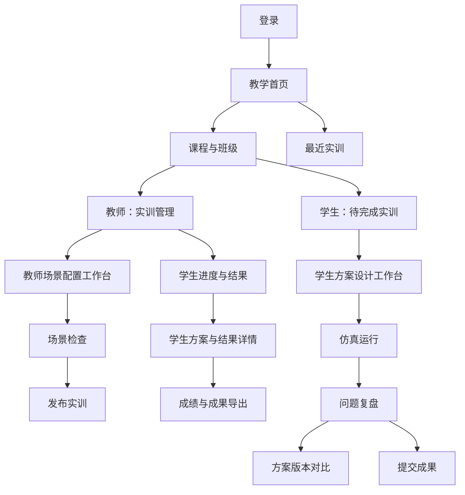

# 无人集群虚拟仿真实训软件原型设计

## 1. 原型目标

本原型面向 Windows 桌面客户端，采用专业三维工作台而不是传统网页后台布局。原型需要验证三件事：

1. 教师能否在不理解底层仿真参数的情况下完成场景配置和发布。
2. 学生能否高效完成编组、任务分配、航迹设计、仿真和修改。
3. 仿真问题能否通过“对象 + 地图位置 + 时间 + 原因”被学生准确理解。

## 2. 信息架构



## 3. 桌面应用整体框架

应用采用统一主窗口，避免频繁打开多个顶层窗口。

```text
+----------------------------------------------------------------------------------+
| 云阵仿真实训 | 课程/实训标题              | 连接状态 | 帮助 | 消息 | 用户          |
+----------------+-----------------------------------------------------------------+
| 首页           |                                                                 |
| 课程与班级     |                         当前业务页面                            |
| 实训管理       |                                                                 |
| 成果与成绩     |                                                                 |
| 资源配置       |                                                                 |
|                |                                                                 |
| 系统设置       |                                                                 |
+----------------+-----------------------------------------------------------------+
| 状态栏：服务器连接 | 地图状态 | 自动保存状态 | 客户端版本 | 内存/帧率             |
+----------------------------------------------------------------------------------+
```

设计约束：

- 导航栏宽度固定，可折叠为图标栏。
- 三维工作台进入后隐藏普通侧栏，将空间留给地图、对象树、属性和时间轴。
- 教师和学生看到相同的场景对象语言，但拥有不同的编辑权限。
- 所有危险操作需要明确目标和影响范围。
- 自动保存、服务器连接、地图加载和仿真状态始终可见。

## 4. 教学首页

### 4.1 教师首页

```text
+----------------------------------------------------------------------------------+
| 教学概览                                         [新建实训]                      |
+----------------------------------------------------------------------------------+
| 当前课程：无人集群虚拟仿真实训 2026 秋季     班级：低空 2401 [切换]             |
+----------------------------------------------------------------------------------+
| 进行中的实训                                                                  > |
| 城市物流配送实验    已发布    42/48 已开始    31 已提交    截止 10月18日          |
| 城市集群表演实验    草稿      场景检查通过    尚未发布                           |
+----------------------------------------------------------------------------------+
| 学生进度                              | 最近需要关注                             |
| 未开始 6  设计中 11  已提交 31        | 8 名学生存在未完成任务                   |
| [进度分布图]                          | 3 名学生最终方案仍有严重风险             |
+----------------------------------------------------------------------------------+
```

关键交互：

- “新建实训”直接进入场景类型选择，不先要求选择固定任务。
- 草稿显示场景完整性和最近编辑时间。
- 点击学生统计进入当前实训的学生进度列表。

### 4.2 学生首页

```text
+----------------------------------------------------------------------------------+
| 我的实训                                                                         |
+----------------------------------------------------------------------------------+
| 待完成                                                                           |
| 城市物流配送实验  截止 10月18日  当前 V3  最近结果 2 个问题      [继续设计]       |
+----------------------------------------------------------------------------------+
| 已完成                                                                           |
| 城市集群表演实验  已提交 V5  完成率 100%  风险 0                 [查看成果]       |
+----------------------------------------------------------------------------------+
```

## 5. 教师场景配置工作台

### 5.1 主界面

```text
+----------------------------------------------------------------------------------+
| < 返回 | 城市物流配送实验 · 草稿 | 撤销 | 重做 | 保存 | 场景检查 | 发布实训      |
+----------------------+-------------------------------------------+---------------+
| 场景配置             |                                           | 对象属性      |
| [基本] [资源] [环境] |                                           |               |
|                      |                                           | 配送点 D-03   |
| 场景对象             |             osgEarth 三维地图             | 名称          |
| v 作业区域           |                                           | 服务时限      |
| v 起降设施           |                                           | 订单载荷      |
|   起飞区 A           |                                           | 优先级        |
| v 配送任务           |                                           |               |
|   配送点 D-01        |                                           | [删除对象]    |
|   配送点 D-02        |                                           |               |
|   配送点 D-03        |                                           |               |
| v 约束区域           |                                           |               |
|   禁飞区 N-01        |                                           |               |
| v 障碍物             |                                           |               |
+----------------------+-------------------------------------------+---------------+
| 工具：选择 | 起飞点 | 目标/配送点 | 障碍物 | 禁飞区 | 边界 | 测距 | 2D/3D       |
+----------------------------------------------------------------------------------+
| 场景状态：12 架无人机 | 8 个订单 | 1 个禁飞区 | 场景检查：2 个问题             |
+----------------------------------------------------------------------------------+
```

### 5.2 场景创建流程

采用五步引导，但允许随时回到工作台修改：

1. 基本信息：名称、班级、场景类型、课程说明和时间范围。
2. 无人机资源：选择机型、数量、性能和初始状态。
3. 地图对象：绘制作业边界、起降点、目标点、配送点、障碍物和禁飞区。
4. 环境与规则：风雨磁场、安全距离、最大任务时间和完成条件。
5. 检查与发布：处理场景错误，设置尝试次数和反馈策略。

这不是一次性向导。完成第二步后进入工作台，步骤栏作为完整性导航存在。

### 5.3 场景类型选择

```text
+------------------------------------------------------------------+
| 新建实训                                                         |
|                                                                  |
| 选择场景类型                                                     |
|                                                                  |
| [城市集群表演]                 [城市物流配送]                    |
| 多编组、多阶段目标点与转场      订单分配、配送时限与返航          |
|                                                                  |
| 从空白场景开始                                                   |
| 也可载入“我的历史场景”作为起点，载入后形成独立副本               |
|                                                    [下一步]      |
+------------------------------------------------------------------+
```

这里不出现平台固定任务库。教师可以复制自己以前的场景，仅作为工作效率功能。

### 5.4 无人机资源配置

```text
+----------------------------------------------------------------------------------+
| 无人机资源                                                [添加资源组]            |
+----------------------------------------------------------------------------------+
| 资源组     数量  最大速度  巡航速度  最大航程  载重  初始电量  状态               |
| 轻型物流机  8    15 m/s    10 m/s    18 km     5 kg  100%      可用               |
| 教学通用机  4    12 m/s     8 m/s    12 km     2 kg  100%      可用               |
+----------------------------------------------------------------------------------+
| 选中资源组                                                                       |
| 名称 [轻型物流机]    数量 [8]     起飞点 [起飞区 A]                               |
| 最大速度 [15] m/s   巡航速度 [10] m/s   最大航程 [18] km                          |
| 最大载重 [5] kg     初始电量 [100] %      起飞间隔 [2] s                          |
+----------------------------------------------------------------------------------+
```

教师配置的是教学参数，不显示升阻系数、转动惯量等物理参数。

### 5.5 环境与规则面板

```text
+----------------------------------+
| 环境条件                         |
| 风        [开启]                 |
| 方向      [东南 135°]            |
| 风速      [---●------] 6 m/s     |
| 降雨      [无|弱|中|强]          |
| 磁场干扰  [绘制区域] 1 个        |
+----------------------------------+
| 安全与任务规则                   |
| 水平安全距离 [5] m               |
| 垂直安全距离 [3] m               |
| 最大任务时间 [12:00]             |
| 返航航程余量 [10] %              |
| 冲突容忍时间 [0.2] s             |
+----------------------------------+
```

调整环境参数时地图展示风向箭头或干扰区，但不播放夸张装饰动画。

### 5.6 场景检查

```text
+----------------------------------------------------------------------------------+
| 场景检查                                                          8/10 通过     |
+----------------------------------------------------------------------------------+
| 错误  配送点 D-04 位于禁飞区 N-01 内                    [定位] [修改配送点]       |
| 错误  订单 O-12 载荷 7 kg，超过所有无人机最大载重       [查看订单]               |
| 警告  最大任务时间可能不足，理论最短时间约 11:32         [仍然保留]               |
| 通过  起飞点与障碍物空间关系合法                                                  |
| 通过  无人机资源完整                                                              |
+----------------------------------------------------------------------------------+
| 发布前必须解决所有错误。警告可以保留，但教师需要填写保留原因。        [返回修改]  |
+----------------------------------------------------------------------------------+
```

## 6. 学生方案设计工作台

### 6.1 主界面

```text
+----------------------------------------------------------------------------------+
| < 实训列表 | 城市物流配送实验 | V3 已保存 | 方案检查 | 运行仿真 | 提交成果       |
+----------------------+-------------------------------------------+---------------+
| 资源与任务           |                                           | 属性/问题     |
| [无人机] [订单]      |                                           | [参数][结果]  |
|                      |                                           |               |
| v 编组 A             |                                           | 无人机 U-03   |
|   U-01 已分配        |             osgEarth 三维地图             | 编组 A        |
|   U-02 已分配        |                                           | 高度 80 m     |
|   U-03 已分配        |                                           | 速度 10 m/s   |
| v 未编组             |                                           | 起飞 00:06    |
|   U-09               |                                           | 航程 6.2 km   |
|                      |                                           | 预计余量 24%  |
| 任务覆盖 7/8         |                                           |               |
+----------------------+-------------------------------------------+---------------+
| 选择 | 航点 | 航线 | 批量高度 | 复制航线 | 测距 | 视图 | 图层                 |
+----------------------------------------------------------------------------------+
| |<  ◀  [播放]  ▶  >| | 00:38 / 08:20 |----!---------!------| 1x | 状态曲线       |
+----------------------------------------------------------------------------------+
```

### 6.2 设计模式

设计模式允许：

- 从对象树拖动无人机到编组。
- 从任务列表拖动目标或订单到无人机/编组。
- 在地图上创建航点和航线。
- 选中多个无人机批量设置高度、速度和起飞间隔。
- 复制一条航线并按编号、方向或高度产生偏移。
- 查看计划值，不运行仿真也能看到静态完整性提示。

教师冻结对象使用锁标识，学生可以查看但不能选择编辑工具修改。

### 6.3 表演场景任务面板

```text
+----------------------------------+
| 表演阶段                         |
| 阶段 1  集合点        30/30 已分配|
| 00:45 到达 · 容差 2 m            |
|                                  |
| 阶段 2  圆形队形      30/30 已分配|
| 02:10 到达 · 保持 20 s           |
|                                  |
| 阶段 3  分层矩阵      28/30 已分配|
| 03:40 到达 · 还缺 2 个目标点     |
+----------------------------------+
```

选择某个阶段后，地图突出显示该阶段目标点以及上一阶段至当前阶段的转场航迹。

### 6.4 物流场景任务面板

```text
+------------------------------------------------+
| 配送订单             [未分配] [已分配] [全部] |
| O-008  D-03  4.5 kg  截止 06:00   未分配      |
| O-003  D-01  1.2 kg  截止 04:30   U-02        |
| O-012  D-05  2.0 kg  截止 08:00   U-06        |
|                                                |
| 完成覆盖 7/8  预计准时 6/8  预计超载 1        |
+------------------------------------------------+
```

拖动订单到无人机后，属性面板即时显示累计载重、预计航程和时限风险。这里属于设计时预估，最终结果仍以仿真为准。

### 6.5 批量参数设置

```text
+--------------------------------------------------+
| 批量设置                                  6 架   |
|                                                  |
| 高度       [80] m       应用到 [全部航点 v]      |
| 巡航速度   [10] m/s                              |
| 起飞方式   [依次起飞]   间隔 [2] s               |
| 航线偏移   [按编号]     水平间距 [6] m           |
|                                                  |
| 预计影响：6 条航线、34 个航点                    |
|                               [取消] [应用修改]  |
+--------------------------------------------------+
```

## 7. 仿真运行与复盘

### 7.1 运行前检查

点击“运行仿真”后先执行快速检查：

```text
+------------------------------------------------------------------+
| 运行前检查                                                       |
|                                                                  |
| 通过  30 架无人机均已分配任务                                   |
| 通过  所有航线包含起飞和结束节点                                |
| 警告  U-12 预计返航余量仅 8%，低于教师建议值 10%                |
|                                                                  |
| 此次运行将保存为方案 V4 的仿真记录。                            |
|                                            [返回修改] [继续运行] |
+------------------------------------------------------------------+
```

缺少任务、航线断裂等结构性错误禁止运行；低余量等风险允许继续运行。

### 7.2 仿真模式

- 禁用改变仿真输入的编辑操作。
- 地图显示无人机当前位置、已飞航迹、计划航迹和状态颜色。
- 底部时间轴显示事件和问题标记。
- 右侧显示选中无人机的速度、高度、航程、电量和任务状态曲线。
- 支持暂停、单步、0.5/1/2/4 倍速。
- 本地快速仿真可以后台计算完成后高速回放，不要求计算速度等于播放速度。

状态颜色：

| 状态 | 表达 |
|---|---|
| 正常执行 | 绿色或所属编组颜色 |
| 等待/排队 | 中性灰 |
| 预警 | 琥珀色 |
| 严重冲突 | 红色 |
| 任务完成 | 低饱和绿色 |
| 失效/无法继续 | 红色轮廓加斜纹状态标记 |

### 7.3 结果总览

```text
+----------------------------------------------------------------------------------+
| 仿真结果 · V4                                       [与 V3 对比] [导出]          |
+----------------------------------------------------------------------------------+
| 任务完成率 87.5% | 准时率 75% | 冲突 1 | 禁飞区 1 | 航程超限 0 | 用时 08:34     |
+----------------------+-------------------------------------------+---------------+
| 问题列表             |                                           | 问题详情      |
| 严重 00:42 禁飞区    |                                           | 规则          |
| 严重 01:16 间距不足  |             仿真复盘地图                  | 涉及对象      |
| 警告 06:20 订单超时  |                                           | 时间范围      |
|                      |                                           | 实际值/阈值   |
|                      |                                           | 原因          |
|                      |                                           | 修改建议      |
+----------------------+-------------------------------------------+---------------+
| |<  ◀  [播放]  ▶  >| | 01:16 / 08:34 |----------!------!-----| 1x             |
+----------------------------------------------------------------------------------+
```

点击问题后的联动顺序：

1. 时间轴跳转到问题开始前 2 秒。
2. 地图镜头定位到问题空间范围。
3. 高亮涉及的无人机、航迹或区域。
4. 右侧显示实测值、规则阈值和修改建议。
5. 点击“返回设计并定位”回到产生问题的航段或参数。

### 7.4 版本对比

```text
+----------------------------------------------------------------------------------+
| 方案版本对比                         V3  对比  V4                                 |
+----------------------------------------------------------------------------------+
| 指标              V3             V4             变化                             |
| 任务完成率        75%            100%           +25%                            |
| 严重问题          3              0              -3                              |
| 总航程            78.2 km        82.5 km        +4.3 km                         |
| 总任务时间        09:10          08:42          -00:28                          |
+----------------------------------------------------------------------------------+
| 修改摘要                                                                         |
| U-03 起飞时间 00:04 -> 00:08                                                     |
| 编组 B 航线高度 70 m -> 90 m                                                     |
| O-008 从 U-06 调整到 U-09                                                        |
+----------------------------------------------------------------------------------+
```

## 8. 教师进度与评价

```text
+----------------------------------------------------------------------------------+
| 城市物流配送实验 · 学生进度                              [导出列表]              |
+----------------------------------------------------------------------------------+
| 学生      状态    当前版本  运行次数  完成率  严重问题  最后活动                 |
| 张同学    已提交  V5        6         100%    0         今天 14:32               |
| 李同学    设计中  V3        3          88%    2         今天 14:20               |
| 王同学    未开始  -         0           -     -         -                        |
+----------------------------------------------------------------------------------+
```

教师查看学生详情时可以查看最终结果、方案版本演变和每次运行，但默认不播放学生的每个编辑动作，避免产生过度复杂的过程审计。

## 9. 对话框与状态设计

### 9.1 自动保存

- 本地草稿每 10 秒或重要编辑后保存。
- 服务器在线时按节流策略同步当前方案草稿。
- 状态依次为“本地保存中”“已保存到本机”“正在同步”“已同步”。
- 冲突时不静默覆盖，保留本地和服务端两个副本供用户选择。

### 9.2 异常状态

| 状态 | 界面响应 |
|---|---|
| 地图服务不可用 | 保留本地场景对象，提示切换缓存地图，不阻止打开方案 |
| 服务器断开 | 允许继续本地设计和仿真，禁止发布/最终提交 |
| 仿真内核异常 | 保存输入快照和错误日志，不生成失败评分 |
| 客户端崩溃恢复 | 下次启动提示恢复最近自动保存草稿 |
| 版本不兼容 | 允许只读查看，升级客户端后才可编辑和提交 |

## 10. Qt 控件映射

| 原型区域 | 推荐 Qt 实现 |
|---|---|
| 主窗口 | `QMainWindow` |
| 左右面板 | `QDockWidget` |
| 对象树 | `QTreeView + QAbstractItemModel` |
| 列表和订单 | `QTableView + QSortFilterProxyModel` |
| 三维地图 | 自定义 `MapViewWidget`，内部封装 osgEarth/OSG |
| 属性编辑器 | `QStackedWidget + QFormLayout` 或属性模型 |
| 时间轴 | 自定义绘制 `SimulationTimelineWidget` |
| 状态曲线 | Qt Charts 或自定义 OpenGL/绘制组件 |
| 撤销重做 | `QUndoStack + QUndoView` |
| 后台任务 | `QThreadPool + QRunnable` |
| 本地草稿 | SQLite + 原子文件快照 |

## 11. 原型验证任务

原型评审不以“页面是否漂亮”为主要标准，使用以下任务验证：

1. 教师从空白场景创建 20 架无人机的物流实训并发布。
2. 教师发现一个配送点位于禁飞区并完成修正。
3. 学生将 8 个订单分配给不同无人机并完成航迹规划。
4. 学生批量设置 6 架无人机的高度和起飞间隔。
5. 学生运行仿真并定位到两机间距不足的时间和空间位置。
6. 学生修改起飞时间，再次运行并比较两个版本。
7. 学生提交方案，教师查看最终结果并导出。

上述任务完成后，再进入详细视觉设计和 Qt 组件开发。

