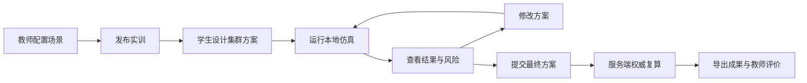

# 无人集群虚拟仿真实训软件实施方案

## 1. 项目定义

### 1.1 建设目标

建设一套面向无人集群教学的纯虚拟仿真实训软件。教师根据教案自主配置实验条件，学生在教师发布的城市集群表演或城市物流配送场景中完成无人机编组、任务分配、航迹规划和飞行参数设计，系统执行多机协同仿真、基础规则检查、结果解释和成果导出。

第一版提供两个基础场景：

1. 城市集群表演场景。
2. 城市物流配送场景。

后续以插件方式增加应急救援场景。

### 1.2 产品边界

本项目：

- 是教学用途的无人集群方案设计与规则仿真软件。
- 是教师自主配置实验条件、学生自主设计方案的软件。
- 是可以重复运行、定位问题、修改方案和比较结果的软件。
- 使用简化的运动、能耗和环境影响模型。

本项目第一版不包含：

- 固定任务库和预置课程任务体系。
- 真机控制、飞控接入、数传链路和硬件在环。
- 高精度六自由度动力学和空气动力学。
- 复杂气象场、流场和高精度传感器仿真。
- 专业舞步、音乐、灯效和复杂图案设计。
- 自动生成全局最优航线或物流最优调度方案。
- 千机级实时表演仿真。

### 1.3 核心教学流程

## 2. 第一版范围

### 2.1 用户角色

| 角色 | 第一版能力 |
|---|---|
| 教师 | 新建实训、配置场景、发布场景、查看学生进度、查看结果、导出成绩 |
| 学生 | 接收场景、设计方案、本地仿真、查看风险、修改方案、提交成果 |
| 管理员 | 用户、班级、课程、地图服务和系统参数管理 |

### 2.2 教师场景配置

教师从一个空白城市场景或个人历史场景开始配置，不依赖平台固定任务库。

| 配置域 | 配置内容 |
|---|---|
| 基本信息 | 实训名称、场景类型、班级、开始结束时间、说明 |
| 无人机资源 | 数量、机型、最大速度、巡航速度、最大航程、载重、初始电量 |
| 起降设施 | 起飞点、降落点、起飞容量、起飞间隔 |
| 任务对象 | 表演目标点、表演阶段、配送点、订单、时限、载荷 |
| 空间约束 | 作业边界、禁飞区、限高区、障碍物、安全距离 |
| 环境约束 | 风向、风速、降雨等级、磁场干扰区和强度 |
| 仿真规则 | 最大任务时间、碰撞阈值、航程余量、任务完成条件 |
| 发布设置 | 尝试次数、是否显示修改提示、是否允许提交后重开 |

发布前系统执行场景可用性检查：

- 起飞点、目标点和配送点不得位于障碍物或禁飞区内。
- 无人机数量、性能和任务对象必须完整。
- 最大任务时间不能小于明显的理论下限。
- 至少存在一组能够完成任务的资源配置。
- 安全距离、起飞点间距和起飞容量不得明显矛盾。
- 环境强度不能导致所有无人机必然无法起飞，除非教师明确设置为故障教学场景。

### 2.3 学生方案设计

学生只能修改方案对象，不能修改教师冻结的场景约束。

- 创建和管理无人机编组。
- 将无人机或编组分配给表演目标、表演阶段或配送订单。
- 绘制、编辑、复制和删除三维航点与航迹。
- 设置航点高度、航段速度、等待时间和到达时间。
- 设置无人机或编组的起飞顺序与起飞延迟。
- 查看计划航程、预计时间、预计能耗和任务覆盖情况。
- 自动保存草稿，手动创建方案版本。
- 对两个方案版本进行指标和风险对比。

### 2.4 城市集群表演场景

第一版将“表演”限定为面向教学的多编组、多阶段空间任务，不建设专业舞步制作系统。

教师配置：

- 一个或多个起降区。
- 表演阶段和每个阶段的目标点集合。
- 每个阶段的开始时间、持续时间和到达容差。
- 城市障碍物、禁飞区、安全边界和最低安全距离。
- 可选的预定义基础队形：直线、矩形、圆形和分层矩阵。

学生设计：

- 无人机编组和目标点映射。
- 各阶段之间的转场航迹。
- 起飞时间、飞行高度、速度和等待时间。
- 返航和降落顺序。

系统检查：

- 是否完成所有表演阶段。
- 是否在允许时间内到达目标点。
- 阶段内队形误差是否超过容差。
- 多机是否发生碰撞或安全间距不足。
- 是否进入禁飞区、障碍物或越过边界。
- 是否超时、超速或航程超限。

### 2.5 城市物流配送场景

教师配置：

- 配送中心、配送点和可选返航点。
- 订单载荷、优先级、服务时限和目标点。
- 无人机数量、载重、航程和速度。
- 城市障碍物、禁飞区、安全距离和环境条件。

学生设计：

- 无人机编组或独立无人机。
- 订单与无人机分配。
- 订单执行顺序。
- 配送航迹、返航航迹、速度、高度和起飞时间。

系统检查：

- 订单是否遗漏、重复或送达错误地点。
- 载重是否超限。
- 配送是否超时。
- 无人机是否能够完成任务并安全返航。
- 航程、能耗、禁飞区、障碍物和冲突规则是否通过。

## 3. 仿真模型范围

### 3.1 运动模型

第一版采用任务级运动学模型：

- 位置由三维航迹、目标速度和固定仿真步长计算。
- 直线航段为基础，支持可选的圆弧或平滑转弯插值。
- 起飞和降落使用简化垂直阶段。
- 速度变化受最大速度、加速度上限和环境系数约束。
- 不计算桨叶、气动力、姿态控制器和飞控闭环。

### 3.2 环境模型

| 条件 | 教师参数 | 第一版影响 |
|---|---|---|
| 风 | 方向、速度 | 起飞条件、地速、横向偏移、单位距离能耗 |
| 雨 | 无、弱、中、强 | 起飞许可、最大速度折减、能耗系数 |
| 磁场 | 区域、干扰强度 | 航迹偏移或定位误差 |

环境扰动必须使用固定随机种子或完全确定的函数。同一场景快照、方案版本、仿真内核版本和随机种子必须产生相同结果。

### 3.3 仿真规则

| 规则 | 判定要点 | 输出证据 |
|---|---|---|
| 任务完成 | 所有目标或订单完成 | 未完成对象、完成率 |
| 三维冲突 | 水平、垂直距离和持续时间 | 两机编号、时间段、最小距离、位置 |
| 禁飞区 | 轨迹点或连续航段进入禁飞体 | 时间段、进入点、离开点 |
| 障碍物 | 无人机安全包络与障碍物相交 | 对象、位置、穿越深度 |
| 边界 | 超出教师配置的作业范围 | 时间、位置、超出距离 |
| 超时 | 总任务或单个任务超过时限 | 计划/实际完成时间 |
| 航程能耗 | 距离和环境修正后超过能力 | 已用航程、剩余航程、电量 |
| 性能限制 | 速度、高度、载重超过机型参数 | 实际值、允许值 |

每个问题统一输出：规则编码、严重级别、开始/结束时间、涉及对象、空间位置、实测值、阈值、原因说明和修改建议。

## 4. 非功能指标

### 4.1 性能基线

第一版验收基线：

- 标准教学终端：Windows 10/11、8 核 CPU、16 GB 内存、独立显卡。
- 常规实训：50 架无人机、10 分钟仿真、100 ms 固定时间步。
- 设计容量：100 架无人机可运行和回放，允许降低轨迹刷新频率。
- 50 架回放在推荐设备上保持 30 FPS 以上。
- 50 架、10 分钟任务的离线快速仿真在 10 秒内完成。
- 场景保存和快速校验在 1 秒内给出响应。
- 仿真结果必须可重复，关键指标误差为零。

最终指标需在技术验证阶段用真实目标设备校准。

### 4.2 可用性

- 方案编辑支持撤销、重做、复制、批量修改和自动保存。
- 无效输入在编辑位置就地提示。
- 仿真过程中可以暂停、倍速、逐步和跳转风险时间点。
- 点击结果问题后同时定位地图位置、无人机和时间轴。
- 客户端异常退出后可以恢复最近一次自动保存草稿。

### 4.3 安全与一致性

- 教师场景发布后形成不可变场景快照。
- 学生每次运行绑定明确的场景版本和方案版本。
- 最终提交由服务端使用同版本仿真内核复算。
- 客户端和服务器通过协议版本协商，版本不兼容时禁止提交。
- 用户、班级、场景、方案、提交和导出均执行对象级授权。

## 5. 实施策略

### 5.1 总体路线

采用“技术验证先行、共享仿真内核优先、双场景纵向打通、最后完善教学管理”的路线。

不要先完成全部页面再开发仿真，也不要先开发两个独立场景。第一条可运行链路应为：教师创建最小场景，学生规划两架无人机，客户端运行仿真，规则引擎输出冲突，修改后通过，提交到服务器复算。

### 5.2 阶段计划

以下计划以 8 人左右团队、约 24 周为基线，可根据人员并行度调整。

| 阶段 | 周期 | 核心工作 | 退出条件 |
|---|---:|---|---|
| 0. 需求冻结与技术验证 | 1-3 周 | 场景边界、Qt/osgEarth 集成、坐标和性能 PoC | 100 架基础回放、地图加载、冲突原型通过 |
| 1. 基础框架 | 4-7 周 | C/S 通信、登录、课程班级、场景和方案版本、自动更新框架 | 客户端可连接服务器并保存场景快照 |
| 2. 场景编辑器 | 6-11 周 | 地图拾取、航点、区域、障碍物、无人机和环境配置 | 教师可完成并发布一个有效场景 |
| 3. 仿真与规则内核 | 6-13 周 | 固定步长、轨迹、能耗、环境、碰撞和空间规则 | 同一输入结果确定，规则证据完整 |
| 4. 学生方案工作台 | 10-15 周 | 编组、任务分配、航迹参数、预估、版本和本地运行 | 学生完成设计—运行—修改闭环 |
| 5. 双场景插件 | 14-18 周 | 表演阶段、队形目标、物流订单和配送规则 | 两个端到端业务用例全部通过 |
| 6. 结果与教学管理 | 17-20 周 | 复盘、版本对比、提交复算、教师查看和导出 | 形成完整教学闭环 |
| 7. 测试与交付 | 21-24 周 | 性能、稳定性、安装升级、用户测试和文档 | 达到验收指标并完成试点部署 |

### 5.3 工作流并行安排

```mermaid
gantt
    title 第一版实施基线（24周）
    dateFormat  X
    axisFormat  第%s周
    section 产品与设计
    需求冻结与原型       :a1, 1, 3
    迭代验收与内容设计   :a2, 4, 20
    用户试用与修正       :a3, 20, 4
    section 客户端
    Qt/osgEarth框架       :b1, 1, 6
    教师场景编辑器       :b2, 6, 6
    学生方案工作台       :b3, 10, 7
    结果复盘与优化       :b4, 17, 5
    section 仿真算法
    仿真内核与坐标       :c1, 2, 6
    规则与环境模型       :c2, 6, 8
    双场景插件           :c3, 13, 6
    性能与确定性         :c4, 19, 4
    section 服务端
    业务与数据框架       :d1, 3, 6
    场景方案与提交       :d2, 8, 7
    权威复算与报告       :d3, 14, 7
    section 测试交付
    自动化与持续测试     :e1, 4, 17
    验收与部署           :e2, 21, 4
```

## 6. 团队配置

建议团队：

| 角色 | 人数 | 主要职责 |
|---|---:|---|
| 产品/教学设计 | 1 | 教学流程、规则口径、验收场景 |
| UI/UX | 1 | 教师和学生工作台原型、交互规范 |
| C++/Qt 客户端 | 2 | 桌面框架、编辑器、回放和发布 |
| C++/仿真算法 | 2 | 仿真内核、规则、环境和性能 |
| C++/服务端 | 1-2 | API、数据、提交复算和部署 |
| 测试 | 1 | 功能、确定性、性能和安装测试 |

必须安排一名能够同时理解 C++、OpenGL/OSG 和 Qt 事件模型的技术负责人。Qt/osgEarth 集成不能仅依靠普通 Qt 页面开发经验。

## 7. 测试与验收

### 7.1 核心验收用例

#### 城市集群表演

教师配置 30 架无人机、两个起降区、三个表演阶段、两栋建筑、一个禁飞区、5 米安全距离和中等侧风。学生第一次方案产生间距不足和禁飞区问题，修改高度和起飞时间后完成全部阶段并安全返航。系统保存两个版本、两次结果和修改证据。

#### 城市物流配送

教师配置 20 架无人机、15 个配送订单、三个配送点、不同载荷及时限、一个禁飞区和弱雨。学生第一次方案包含载重超限、订单超时和返航航程不足，重新分配订单并调整路线后通过。最终提交由服务器复算并生成报告。

### 7.2 验收维度

- 功能：两个场景的教师配置、学生设计、仿真、复盘、修改、提交和导出完整。
- 正确性：规则命中的时间、对象、位置和阈值与标准数据一致。
- 确定性：相同输入重复运行 100 次，摘要和规则结果完全一致。
- 性能：达到 50/100 架性能基线。
- 稳定性：连续运行 8 小时无崩溃，异常退出可恢复草稿。
- 部署：服务器和客户端可在目标校园网络完成安装、升级和回滚。
- 易用性：教师在培训后 30 分钟内完成一个场景配置，学生在 15 分钟内完成基本方案操作。

## 8. 项目风险与控制

| 风险 | 控制措施 |
|---|---|
| 表演场景膨胀为专业舞步软件 | 第一版只支持目标点、基础队形和阶段转场，不做音乐灯效 |
| 两个场景各自形成一套系统 | 共享领域模型、仿真内核和通用规则，差异只放场景插件 |
| Qt/osgEarth 渲染集成不稳定 | 第 1-3 周完成独立 PoC 和显卡测试矩阵 |
| 自由配置产生不可完成场景 | 发布前执行完整性、空间合法性和理论可行性检查 |
| 本地与服务端结果不一致 | 同一共享核心库、固定种子、版本握手和回归数据集 |
| 大机群冲突检测过慢 | 空间网格粗筛、连续航段检测、数据导向布局和性能预算 |
| 环境模型难以解释 | 参数少而直观，所有影响提供计算证据和教学解释 |
| C++ 依赖和部署复杂 | vcpkg manifest、固定工具链、CI 构建和自动安装包测试 |

## 9. 第一阶段立即执行事项

1. 冻结表演场景第一版语义，确认不包含音乐、灯效和任意图案编辑。
2. 确定标准教学电脑配置、操作系统和目标无人机数量。
3. 确定首版在线地图来源、授权、坐标系和校园网络条件。
4. 建立 Qt 6.8、OpenSceneGraph、osgEarth 3.8 的最小工程。
5. 完成 Qt 内嵌 osgEarth、地图拾取、航线绘制和 100 架点模型回放 PoC。
6. 定义场景、方案、仿真输入、仿真结果和规则结果的 Protobuf/JSON Schema。
7. 建立 10 组可人工验证的规则黄金数据。
8. 用本方案中的两个核心验收用例驱动后续迭代。

